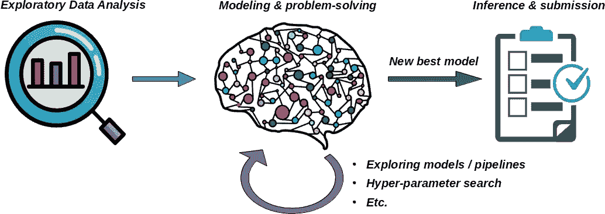
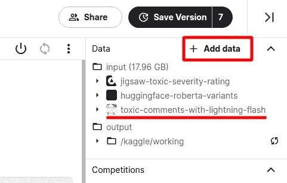
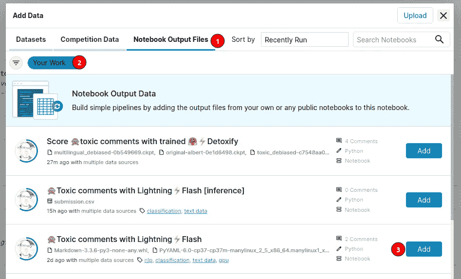

# 通过链接内核笔记本，轻松实现 Kaggle 离线提交

> 原文：<https://towardsdatascience.com/easy-kaggle-offline-submission-with-chaining-kernels-30bba5ea5c4d?source=collection_archive---------22----------------------->


插图照片由 [Pexels](https://www.pexels.com/photo/man-in-front-of-monitor-2239655/?utm_content=attributionCopyText&utm_medium=referral&utm_source=pexels) 的 [Lucas Fonseca](https://www.pexels.com/@lucasfonseca?utm_content=attributionCopyText&utm_medium=referral&utm_source=pexels) 拍摄

## 使用 Kaggle 内核作为数据存储的中间步骤，为限制互联网访问的竞赛提供一个简单的指南。

你是新来卡格尔的吗？你是否发现这是一个对数据科学家或机器学习工程师来说非常迷人的世界，但随后你又很难提交。那么下面这个指南就适合你！我将向你展示如何让你的经历更流畅，可复制，并扩展你的职业生活经历。

[](https://devblog.pytorchlightning.ai/best-practices-to-rank-on-kaggle-competition-with-pytorch-lightning-and-grid-ai-spot-instances-54aa5248aa8e) [## 使用 PyTorch Lightning 和 Grid.ai Spot 实例对 Kaggle 竞争进行排名的最佳实践

### 通过交互式会话、超参数解决图像分类挑战的完整数据科学周期…

devblog.pytorchlightning.ai](https://devblog.pytorchlightning.ai/best-practices-to-rank-on-kaggle-competition-with-pytorch-lightning-and-grid-ai-spot-instances-54aa5248aa8e) 

# 快速卡格尔游戏攻略

[Kaggle](https://www.kaggle.com/) 是一个广为人知的数据科学平台，它将机器学习(ML)爱好者与公司和组织联系起来，这些公司和组织提出了一些具有挑战性的主题，这些主题需要解决，并带有一些成功解决方案的财务动机。作为一名 ML 工程师，你可以从已经准备好的(大部分是高质量的)数据集中获益。此外，Kaggle 还提供讨论和分享&，将他们的工作呈现为 [Jupyter 笔记本](https://jupyter.org/)(称为内核)和定制数据集。

最后，如果你参加了一个比赛，想要在排行榜上排名，你需要提交你的解决方案。有两种类型的比赛，他们要求用户(a)以给定的提交格式上传生成的预测，或者(b)准备一个以提交格式生成预测的内核。第一种情况相对简单且容易做到，所以我们将只关注内核提交。

这些竞赛只包括一个最小的测试数据集，用于用户验证他的预测管道。由于数据泄露和其他安全原因，运行中的内核不允许使用互联网(因为用户可以将所有测试数据上传到他们的存储器，然后覆盖数据集)。另一方面，如果您的内核需要安装额外的依赖项或下载最新的训练模型，这使得提交不容易。


插图由[扬·克鲁科夫](https://www.pexels.com/@yankrukov?utm_content=attributionCopyText&utm_medium=referral&utm_source=pexels)从[佩克斯](https://www.pexels.com/photo/photo-of-woman-leaning-on-wooden-table-while-looking-upset-4458411/?utm_content=attributionCopyText&utm_medium=referral&utm_source=pexels)拍摄

# 数据集的肮脏方式

直观的第一手解决方案是使用所需的额外包和训练有素的模型来创建存储。为此，您可以使用/创建一个 Kaggle 数据集，并将所有数据上传到那里。我怀疑，即使你能看到它是为了不同的目的捆绑一个工具。

我们在之前的文章中已经描述了这个过程。简而言之，创建这样一个数据集的过程是:( 1)本地下载所有的依赖项,( 2)重命名所有以`.tar.gz`结尾的源包，因为 Kaggle 执行所有归档文件到文件夹的递归提取，以及(3)上传包到新的数据集。然后在推理内核上，(4)重新命名源包，(5)安装所有带有来自 Kaggle 数据集的 pip 的包。

[](/submitting-model-predictions-to-kaggle-competition-ccb64b17132e) [## 向 Kaggle 竞赛提交模型预测

### 用 PyTorch 闪电和网格点实例在 Kaggle 上排名的最佳实践(第 5/5 部分)

towardsdatascience.com](/submitting-model-predictions-to-kaggle-competition-ccb64b17132e) 

你感觉需要多少步骤。即使你完成了这一切，你也可能面临一些兼容性问题，因为为你的本地环境下载的包可能与你后来的 Kaggle 内核环境不兼容。而且还有几个角力案例。

# 链接内核以构建一个在另一个之上

让我们想一想，一个好的数据科学家工作流程应该是怎样的。三个主要步骤是(1)探索性数据分析，(2)建模和解决问题，以及(3)推理(和预测提交)。在这个工作流程的开始，我们有一个输入数据集，最后，我们希望成为竞争提交。



Kaggle 上的 Datascinetist 工作流程示意图。

我们可以在一个笔记本中包含所有三个步骤(这会使它很重，通常用户不需要运行所有步骤),或者用一个内核覆盖每个步骤。连续笔记本中分离的研究阶段允许我们更快地迭代，并且部分地保存中间结果。例如，您将只进行一次 EDA，然后您将迭代训练模型(扩展管道或执行超参数搜索)，当您获得新的最佳模型并运行您的推理进行提交时。

好消息是 Kaggle 内核保留了一些(有限的)运行输出。在我们提出的解决方案中，我们将依赖这一特性。简而言之，我们可以保存我们的模型，并下载训练内核(它有一个互联网连接)中所有需要的包，然后将它们加载到下面的推理内核中，它是从互联网上截取的。


插图由[安德里亚·皮亚卡迪奥](https://www.pexels.com/@olly?utm_content=attributionCopyText&utm_medium=referral&utm_source=pexels)从[派克斯](https://www.pexels.com/photo/man-in-white-dress-shirt-sitting-on-black-rolling-chair-while-facing-black-computer-set-and-smiling-840996/?utm_content=attributionCopyText&utm_medium=referral&utm_source=pexels)拍摄

让我们在两个 Kaggle 内核上演示一下毒性评级。为了简单起见，我们将琐碎的 EDA 和模型训练合并在一个笔记本中。所以第一个是[🙊有毒评论与 Lightning⚡Flash](https://www.kaggle.com/jirkaborovec/toxic-comments-with-lightning-flash) 和第二个是[🙊有毒的评论同 Lightning⚡Flash【推论】](https://www.kaggle.com/jirkaborovec/toxic-comments-with-lightning-flash-inference)。

## 下载所需的包

包下载与使用 PyPI 注册表安装非常相似。此外，我们用`dest`参数为保存的 python 轮子指定一个文件夹。

```
*pip download lightning-flash[text] \
    --dest frozen_packages \
    --prefer-binary*
```

高级用户可能需要安装他们的软件包或在他们的标准软件包的分支中做一些修补程序。这样的包没有在 PyPI 上注册，但是它是`setuptools`完整的。对于这种情况，您仍然可以使用`pip`,并告诉它从给定的源创建一个轮子包。

```
pip wheel 'https://github.com/PyTorchLightning/lightning-flash/archive/refs/heads/fix/serialize_tokenizer.zip' \
    --wheel-dir frozen_packages
```

如果您仍然需要安装额外的软件包，您可以将它们添加到 URL `#egg=lightning-flash[text]`的末尾。此外，您还可以从基础环境中的现有包(如 PyTorch)中删除下载的轮子。

```
rm frozen_packages/torch-*
```

## 链接内核作为数据源

第二部分是添加前一个内核作为下一个内核的数据源。我们打开推理内核右上角的配置，并选择“添加数据”选项。



添加了以前的内核作为数据源的截图。

然后我们需要找到我们的内核。我们可以按名称搜索或浏览我们过去的工作，如下图所示:



浏览过去内核的截图。

我们快完成了！我们通过从“本地”路径安装所需的包，用连接过去的内核输出来初始化环境。我们使用下面的命令禁用索引，因为我们已经离线了，并且将路径设置为包含所有包的文件夹。

```
pip install lightning-flash[text] \
    --find-links /kaggle/input/toxic-comments-with-lightning-flash/frozen_packages \
    --no-index
```

## 使用附加数据和检查点

我们仍然可能需要一些额外的在线资源。如果数据是公开的，我们可以下载它们，例如，发布的检查点:

```
mkdir checkpoints
wget [https://github.com/unitaryai/detoxify/releases/download/v0.1-alpha/toxic_original-c1212f89.ckpt](https://github.com/unitaryai/detoxify/releases/download/v0.1-alpha/toxic_original-c1212f89.ckpt) --directory-prefix=checkpoints
```

由于需要大量的模型训练和有限的免费 Kaggle 计算资源，您可能仍然需要为您提交的模型创建一个特定的数据集。

[](/hyperparameter-optimization-with-grid-ai-and-no-code-change-b89218d4ff49) [## 使用 Grid.ai 进行超参数优化，无需更改代码

### 用 PyTorch 闪电和网格点实例在 Kaggle 上排名的最佳实践(第 4/5 部分)

towardsdatascience.com](/hyperparameter-optimization-with-grid-ai-and-no-code-change-b89218d4ff49) 

# 摘要

我简要介绍了 Kaggle 平台，以及它如何将好奇的研究人员和数据科学(DS)爱好者与呼叫实际问题联系起来。我分享了如何应用最佳的 DS 实践——将 EDA、模型训练和模型推理阶段拆分到特定的笔记本中。此外，我已经展示了这个分区对于 Kaggle 离线提交非常有用。

**敬请关注，关注我了解更多！**

# 关于作者

[**吉尔卡·博罗维奇**](https://medium.com/@jborovec) 拥有 CTU 的计算机视觉博士学位。他已经在几家 IT 创业公司和公司从事机器学习和数据科学工作几年了。他喜欢探索有趣的世界问题，用最先进的技术解决这些问题，并开发开源项目。