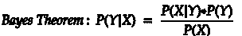
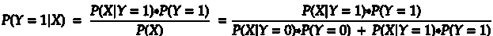
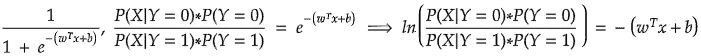
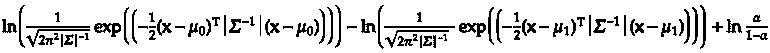
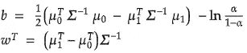
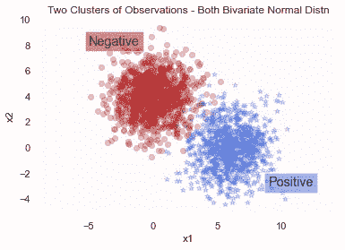
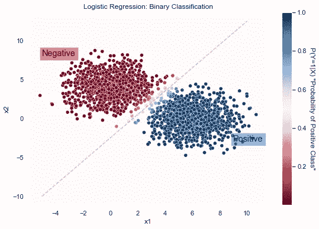

# 具有解析解的简单逻辑回归

> 原文：<https://towardsdatascience.com/easy-logistic-regression-with-an-analytical-solution-eb4589c2cd2d?source=collection_archive---------25----------------------->

## Python 中从头开始的二进制分类

关于分类的 logistic 回归，不乏文章、视频、教程。这是机器学习中的一个经典主题，通常是进入更复杂算法之前的垫脚石。本文旨在从另一个角度向您展示逻辑回归，我们可以求解权重的公式化解决方案，并将其传递给返回预测概率的模型。我在文章中提供了代码和解决方案的链接。

逻辑回归旨在解决的问题是找到属于某一类的一组特征的观察值的概率。通过*训练*关于我们看到的观察*实际上*属于某些类(这将是标签，或目标变量)的例子，我们的模型将对新观察的类有一个好的想法。确切地说*如何*训练模型并不总是被讨论，但是我想讨论一个简单的规则可以决定这些概率的例子。

你敢提出贝叶斯定理吗

没有你我们做不到:

记住，一个分类问题可以认为是一个条件概率:给定一组特征，某个类标签的概率，*。*

作为本文的开始，您只需要知道随机变量的条件概率，在本例中，Y，取给定 X 的某个值，采用以下形式:

分母是“全概率法则”的结果，这是概率论中的一个有用工具

**乙状结肠功能**

您应该已经知道，返回 x 值向量落入某一类的预测概率的函数称为 sigmoid 函数。该函数的便利之处在于，对于所有的实数值，它的范围都在 0 和 1 之间，所以无论你输入什么(无误差)，你都会得到一个预测的概率。

这里有趣的是，在将上面的贝叶斯定理方程除以 P(X|Y=1)*P(Y=1)之后，我们得到了一个类似于 sigmoid 函数的形式，并且我们可以求解出在下面的指数中应该是什么:

更有趣的是，权重和偏差如何等于 Y 为 0 和 1 的概率的组合。所以，就好像如果我们知道如何用我们的数据集来表示这些概率，我们就可以找到权重的解决方案！

**等协方差**

像许多机器学习问题的基本解决方案一样，对数据进行假设。例如，观察值的独立性和数据的近似正态分布是线性回归中使用的假设。

> 根据我的经验，现实世界的数据很少满足所有的基本假设，以便使用教科书或开箱即用的解决方案。以至于我经常需要回去查阅基本假设作为提醒。

也就是说，本文中关于解决方案的一个基本假设是，两个二元正态分布具有相同的协方差矩阵。他们的传播是相同的数量，在相同的方向。如果它们不相等，我们提出的解决方案会有一些后果。

逻辑上无法解释的跳跃

有一些代数和矩阵操作来得到这一点，但我[在这里包括一个完整的推导链接，任何人都可以看到它](https://github.com/caseywhorton/binary-classification)。

现在看起来很乱，但是会好起来的。请注意自然对数中的第一项，这是二元正态分布的概率密度函数。我在这里发现有趣的是(x1，x2)集合所属的 a 类，直观上是给定(x1，x2)集合的两个概率密度函数的差。这完全说得通，对吧？

我们仍然在从这些二元正态分布中寻找一些东西，可以告诉我们，对于给定的一对(x1，x2)，区分这两个类别的**权重**应该是多少。所以，我们需要乘以 x 向量的东西。所有步骤见链接，但最后有一个分析解决方案说:从数据和两个类别的分布来看，这种偏差和这些权重在分离类别方面是最好的。

最棒的是，你可以看到一个例子，对于简单的分类问题，经验数据可以用来解决一个问题，而不需要复杂的算法。更好的是，使用 Python 我们可以可视化二进制分类问题的解决方案来说明这个概念。

**用 Python 阐明观点**

如果我们很好地将我们的数据可视化，我们可以看到这两个类别之间存在某种界限。它没有被很好地定义，但是边界可以用 x1 和 x2 来定义，这是我们正在使用的特征。这意味着，基于 R2 中的 ***任意*** x1 和 x2 的值，我们可以找到该组合应该在哪个类中。

两个变量都是正常的，所以想象一个“峰值”在每个聚类的中心向你走来(在 z 轴上)

通常，我们会使用类似 sci-kit learn 的东西来实例化一个逻辑回归对象，使其适合数据，并使用适合的模型对新的观察结果进行预测。我的意思是，通常数据具有不等的协方差，所以为什么不从处理它的算法中受益呢？在这里，为了说明的目的，我们定义一个简单得多的问题。

下面您可以看到，我们可以使用解析解和我们所知道的每个聚类分布来找到权重。

现在我们有了权重，我们将制作一个通常在拟合方法中使用的*设计矩阵*，通过将特征和权重的点积传递给 sigmoid 函数来对每个观察值进行预测，并在一个表中返回所有内容(一个 pandas DataFrame)。

在返回设计矩阵中每个(x1，x2)组合的预测概率后，绘制它们向我们显示，对于更接近两类之间边界的组合，概率更接近 0.5。具有接近 0 的预测概率将意味着(x1，x2)肯定在“负”的聚类中，类似地，对于接近 1 的概率和“正”的聚类也是如此。

好吧，我希望你读这个的时候有一些乐趣。如果你有兴趣看完整的代码，可以在这里找到。在那里，你可以看到绘制区别线的公式，以及推导细节的链接。