# 使用 PyCaret + MLflow 轻松实现 MLOps

> 原文：<https://towardsdatascience.com/easy-mlops-with-pycaret-mlflow-7fbcbf1e38c6?source=collection_archive---------5----------------------->

## 一个初学者友好的，一步一步的教程，使用 PyCaret 在你的机器学习实验中集成 MLOps


阿迪·戈尔茨坦在 [Unsplash](https://unsplash.com?utm_source=medium&utm_medium=referral) 上的照片

# PyCaret

PyCaret 是一个开源的低代码机器学习库和端到端的模型管理工具，内置于 Python 中，用于自动化机器学习工作流。它以其易用性、简单性以及快速高效地构建和部署端到端 ML 原型的能力而闻名。

PyCaret 是一个替代的低代码库，可以用几行代码代替数百行代码。这使得实验周期成倍地快速和有效。


py caret——Python 中的开源、低代码机器学习库

要了解更多关于 PyCaret 的信息，你可以查看他们的 [GitHub](https://www.github.com/pycaret/pycaret) 。

# MLflow

MLflow 是一个管理 ML 生命周期的开源平台，包括实验、可复制性、部署和中央模型注册。MLflow 目前提供四个组件:

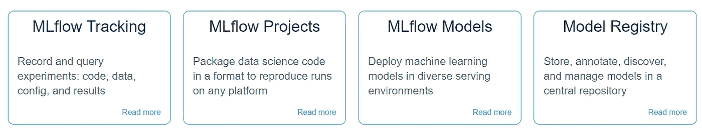

MLflow 是一个管理 ML 生命周期的开源平台

要了解更多关于 MLflow 的信息，可以查看 [GitHub](https://github.com/mlflow/mlflow) 。

# 正在安装 PyCaret

安装 PyCaret 非常容易，只需要几分钟。我们强烈建议使用虚拟环境来避免与其他库的潜在冲突。

PyCaret 的默认安装是 pycaret 的精简版本，只安装这里列出的硬依赖项。

```
**# install slim version (default)** pip install pycaret**# install the full version**
pip install pycaret[full]
```

当您安装 pycaret 的完整版本时，这里列出的所有可选依赖项[也会被安装。MLflow 是 PyCaret 依赖项的一部分，因此不需要单独安装。](https://github.com/pycaret/pycaret/blob/master/requirements-optional.txt)

# 👉我们开始吧

在我谈论 MLOps 之前，让我们从较高的层面来谈一谈机器学习生命周期:

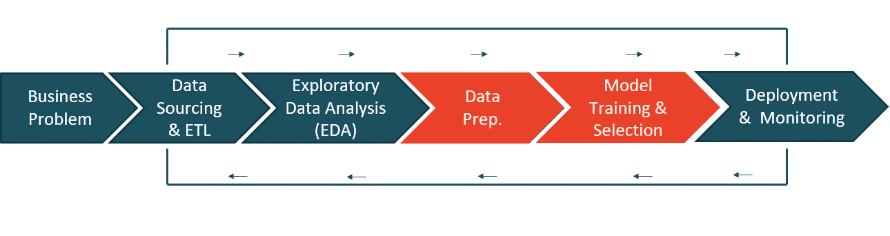

机器学习生命周期-按作者分类的图片(从左至右阅读)

*   **业务问题—** 这是机器学习工作流程的第一步。这可能需要几天到几周的时间来完成，这取决于用例以及问题的复杂性。正是在这个阶段，数据科学家与主题专家(SME)会面，以了解问题，采访关键利益相关者，收集信息，并设定项目的总体预期。
*   **数据来源& ETL —** 一旦理解了问题，接下来就要使用访谈中获得的信息从企业数据库中获取数据。
*   **探索性数据分析(EDA)——**建模还没开始。EDA 是分析原始数据的地方。您的目标是探索数据并评估数据质量、缺失值、特征分布、相关性等。
*   **数据准备—** 现在该准备数据模型培训了。这包括将数据分成训练集和测试集、输入缺失值、一键编码、目标编码、特征工程、特征选择等。
*   **模特培训&选拔—** 这是每个人都为之兴奋的一步。这包括训练一系列模型、调整超参数、模型集合、评估性能指标、模型分析(如 AUC、混淆矩阵、残差等),以及最终选择一个最佳模型部署到生产中以供业务使用。
*   **部署&监控—** 这是最后一步，主要是关于 MLOps。这包括打包您的最终模型、创建 docker 映像、编写评分脚本，然后让它们一起工作，最后将其发布为 API，可用于获得对通过管道传输的新数据的预测。

旧的方法非常麻烦、冗长，并且需要大量的技术知识，我可能无法在一个教程中涵盖它。然而，在本教程中，我将使用 PyCaret 来演示对于一个数据科学家来说，非常高效地完成所有这些工作是多么容易。在我们进入实际部分之前，让我们再多谈一点关于 MLOps 的内容。

# 👉**什么是 MLOps？**

MLOps 是一门工程学科，旨在结合机器学习开发，即实验(模型训练、超参数调整、模型集成、模型选择等)。)，通常由 ML 工程和运营部门的数据科学家执行，以便标准化和简化生产中机器学习模型的持续交付。

如果你是一个绝对的初学者，你可能不知道我在说什么。别担心。让我给你一个简单的、非技术性的定义:

> *mlop 是一系列技术工程和运营任务，允许您的机器学习模型被组织中的其他用户和应用程序使用。基本上，这是一种方式，通过这种方式，你的工作，即*机器学习模型*被在线发布，因此其他人可以使用它们并满足一些商业目标。*

这是一个非常低调的定义。实际上，它涉及的工作和利益比这多一点，但如果你是新手，这是一个好的开始。

现在让我们按照上图所示的工作流程做一个实际的演示，确保你已经安装了 pycaret。

# 👉商业问题

在本教程中，我将使用达顿商学院发表在[哈佛商业](https://hbsp.harvard.edu/product/UV0869-PDF-ENG)上的一个非常受欢迎的案例研究。这个案子是关于两个未来将要结婚的人的故事。名叫*格雷格*的家伙想买一枚戒指向名叫*莎拉*的女孩求婚。问题是找到莎拉会喜欢的戒指，但在他的密友建议后，格雷格决定买一颗钻石，这样莎拉就可以决定她的选择。然后，格雷格收集了 6000 颗钻石的价格和切割、颜色、形状等属性数据。

# 👉数据

在本教程中，我将使用一个数据集，该数据集来自达顿商学院的一个非常受欢迎的案例研究，发表在[哈佛商业](https://hbsp.harvard.edu/product/UV0869-PDF-ENG)上。本教程的目标是根据钻石的重量、切割、颜色等属性来预测钻石的价格。您可以从 [PyCaret 的存储库](https://github.com/pycaret/pycaret/tree/master/datasets)下载数据集。

```
**# load the dataset from pycaret** from pycaret.datasets import get_data
data = get_data('diamond')
```

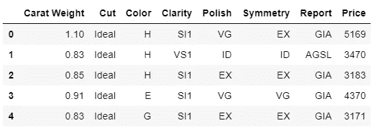

数据中的样本行

# 👉探索性数据分析

让我们做一些快速可视化来评估独立特征(重量、切割、颜色、净度等)之间的关系。)与目标变量即`Price`

```
**# plot scatter carat_weight and Price**
import plotly.express as px
fig = px.scatter(x=data['Carat Weight'], y=data['Price'], 
                 facet_col = data['Cut'], opacity = 0.25, template = 'plotly_dark', trendline='ols',
                 trendline_color_override = 'red', title = 'SARAH GETS A DIAMOND - A CASE STUDY')
fig.show()
```


莎拉得到了一份钻石案例研究

让我们检查目标变量的分布。

```
**# plot histogram**
fig = px.histogram(data, x=["Price"], template = 'plotly_dark', title = 'Histogram of Price')
fig.show()
```

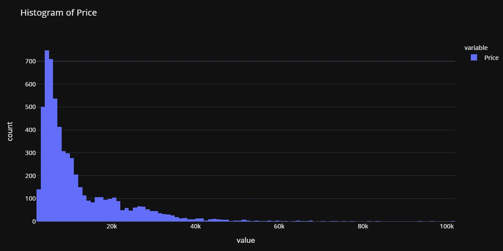

请注意，`Price`的分布是右偏的，我们可以快速查看对数变换是否可以使`Price`接近正态，从而给假设正态的算法一个机会。

```
import numpy as np**# create a copy of data**
data_copy = data.copy()**# create a new feature Log_Price**
data_copy['Log_Price'] = np.log(data['Price'])**# plot histogram**
fig = px.histogram(data_copy, x=["Log_Price"], title = 'Histgram of Log Price', template = 'plotly_dark')
fig.show()
```


这证实了我们的假设。这种转换将帮助我们摆脱偏态，使目标变量接近正态。基于此，我们将在训练我们的模型之前转换`Price`变量。

# 👉数据准备

对于 PyCaret 中的所有模块来说，`setup`是任何使用 PyCaret 的机器学习实验中的第一步，也是唯一一步。该功能负责训练模型之前所需的所有数据准备。除了执行一些基本的默认处理任务，PyCaret 还提供了一系列预处理功能。要了解 PyCaret 中所有预处理功能的更多信息，您可以查看这个[链接](https://pycaret.org/preprocessing/)。

```
**# initialize setup**
from pycaret.regression import *
s = setup(data, target = 'Price', transform_target = True, log_experiment = True, experiment_name = 'diamond')
```

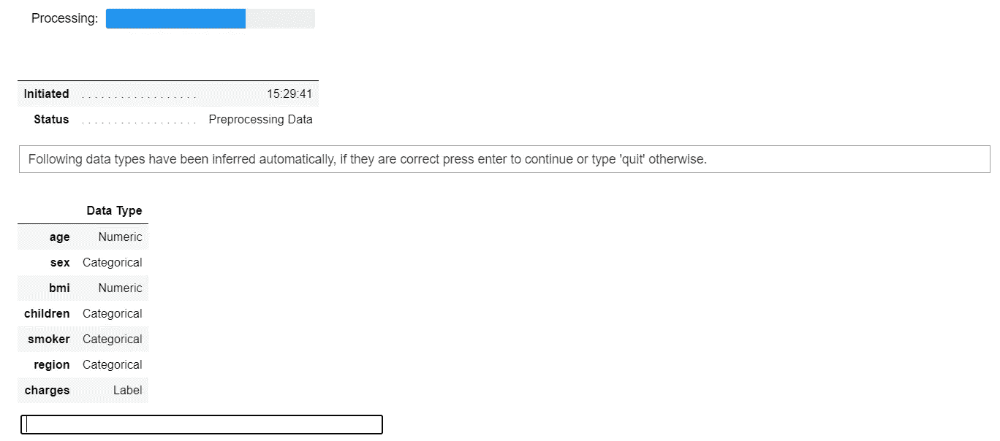

pycaret.regression 模块中的设置函数

当您在 PyCaret 中初始化`setup`函数时，它会分析数据集并推断所有输入要素的数据类型。如果所有数据类型都推断正确，您可以按 enter 键继续。

请注意:

*   我已经通过了`log_experiment = True`和`experiment_name = 'diamond'`，这将告诉 PyCaret 在建模阶段自动记录所有的度量、超参数和模型工件。由于与 [MLflow](https://www.mlflow.org) 的集成，这是可能的。
*   还有，我在`setup`里面用过`transform_target = True`。PyCaret 将使用 box-cox 变换在后台转换`Price`变量。它以类似于日志转换*(技术上不同)*的方式影响数据的分布。如果你想了解更多关于 box-cox 变换的知识，你可以参考这个[链接](https://onlinestatbook.com/2/transformations/box-cox.html)。

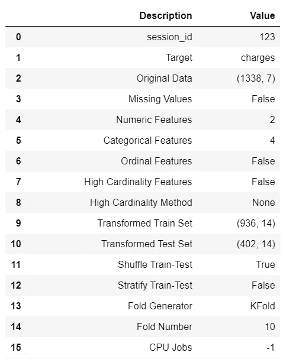

设置的输出—为显示而截断

# 👉模型训练和选择

现在数据已经准备好进行建模，让我们使用`compare_models`函数开始训练过程。它将训练模型库中所有可用的算法，并使用 k-fold 交叉验证评估多个性能指标。

```
**# compare all models**
best = compare_models()
```

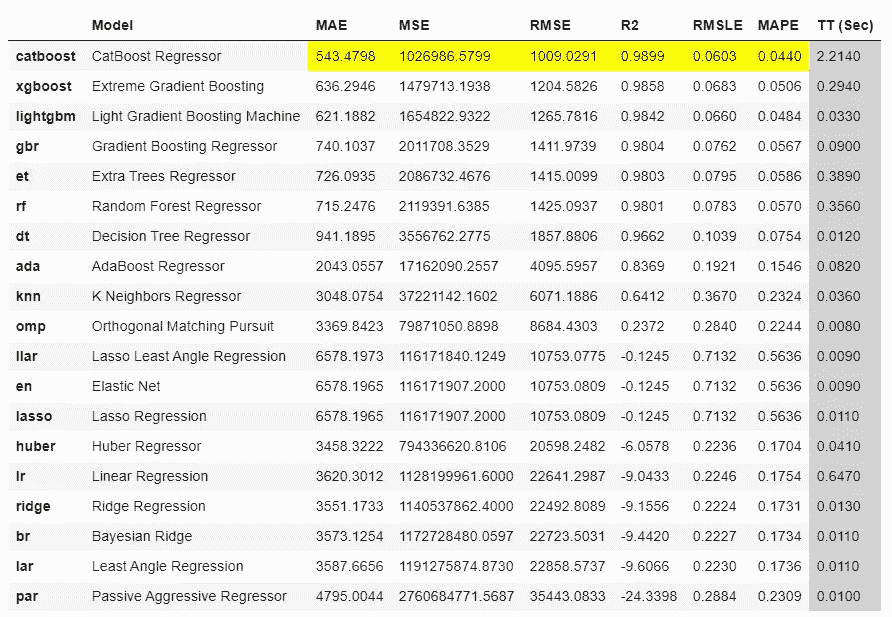

compare_models 的输出

```
**# check the residuals of trained model**
plot_model(best, plot = 'residuals_interactive')
```

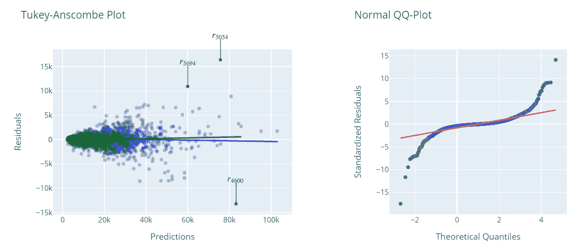

最佳模型的残差和 QQ 图

```
**# check feature importance**
plot_model(best, plot = 'feature')
```


## 完成并保存管道

现在让我们最终确定最佳模型，即在包括测试集在内的整个数据集上训练最佳模型，然后将管道保存为 pickle 文件。

```
**# finalize the model**
final_best = finalize_model(best)**# save model to disk** save_model(final_best, 'diamond-pipeline')
```

`save_model`函数将把整个管道(包括模型)保存为本地磁盘上的 pickle 文件。默认情况下，它会将文件保存在笔记本或脚本所在的文件夹中，但是如果您愿意，也可以传递完整的路径:

```
save_model(final_best, 'c:/users/moez/models/diamond-pipeline'
```

# 👉部署

记得我们在设置函数中通过了`log_experiment = True`和`experiment_name = 'diamond'`。让我们看看 PyCaret 在 MLflow 的帮助下在幕后实现了什么。让我们启动 MLflow 服务器来看看这个神奇的过程:

```
**# within notebook (notice ! sign infront)** !mlflow ui**# on command line in the same folder** mlflow ui
```

现在打开浏览器，输入“localhost:5000”。它将打开这样一个用户界面:

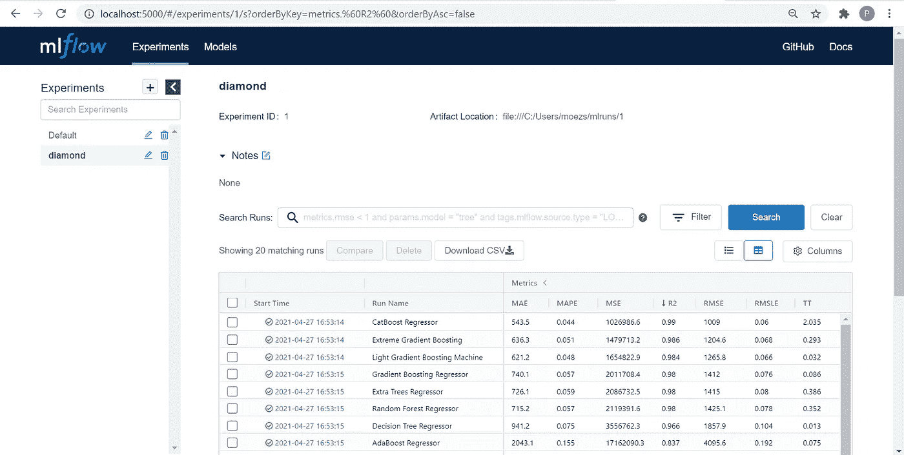

https://本地主机:5000

上表中的每个条目代表一个训练运行，该运行产生一个训练管道和一堆元数据，例如运行的日期时间、性能度量、模型超参数、标签等。让我们点击其中一个模型:


第一部分— CatBoost 回归器

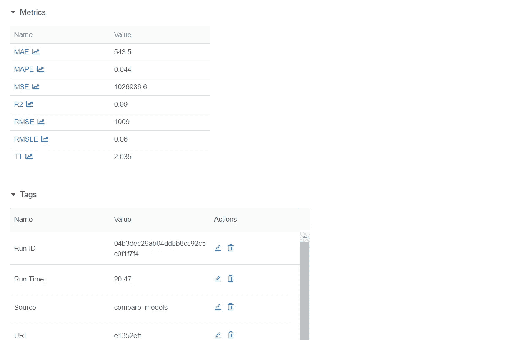

第二部分— CatBoost 回归器(续)

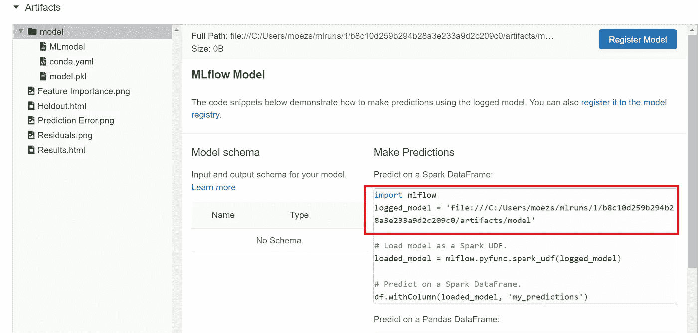

第二部分— CatBoost 回归器(续)

注意，您有一个`logged_model`的地址路径。这是带有 Catboost 回归器的训练管道。您可以使用`load_model`函数读取这个管道。

```
**# load model**
from pycaret.regression import load_model
pipeline = load_model('C:/Users/moezs/mlruns/1/b8c10d259b294b28a3e233a9d2c209c0/artifacts/model/model')**# print pipeline** print(pipeline)
```

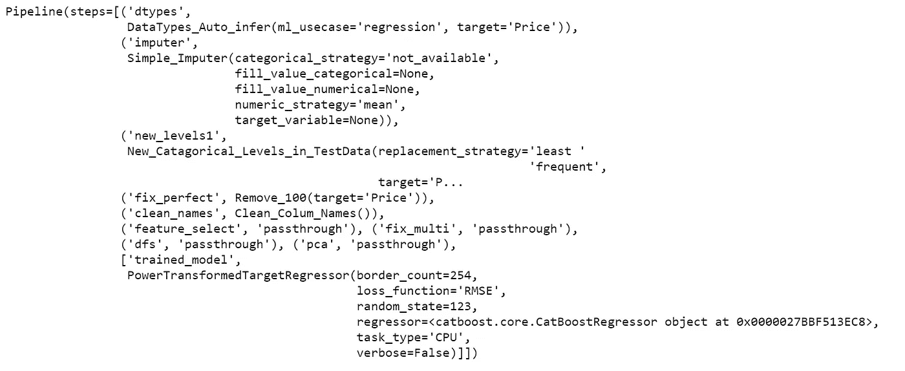

打印输出(管道)

现在让我们使用这个管道来生成对新数据的预测

```
**# create a copy of data and drop Price** data2 = data.copy()
data2.drop('Price', axis=1, inplace=True)**# generate predictions** from pycaret.regression import predict_model
predictions = predict_model(pipeline, data=data2)
predictions.head()
```

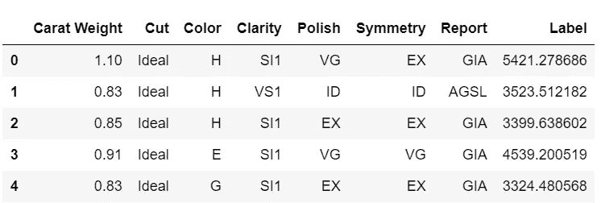

从管道生成的预测

呜哇！我们现在从训练有素的管道中得到推论。恭喜，如果这是你的第一次。请注意，所有转换，如目标转换、一键编码、缺失值插补等。自动在幕后发生。你得到一个实际规模的预测数据框架，这就是你所关心的。

# 即将推出！

我今天展示的是在 MLflow 的帮助下，您可以在生产中使用 PyCaret 提供的经过培训的管道的许多方法之一。在下一篇教程中，我计划展示如何使用 MLflow 原生服务功能来注册您的模型，对它们进行版本化并作为 API 使用。

使用 Python 中的这个轻量级工作流自动化库，您可以实现的目标是无限的。如果你觉得这很有用，请不要忘记给我们 GitHub 库上的⭐️。

想了解更多关于 PyCaret 的信息，请在 [LinkedIn](https://www.linkedin.com/company/pycaret/) 和 [Youtube](https://www.youtube.com/channel/UCxA1YTYJ9BEeo50lxyI_B3g) 上关注我们。

加入我们的休闲频道。此处邀请链接[。](https://join.slack.com/t/pycaret/shared_invite/zt-p7aaexnl-EqdTfZ9U~mF0CwNcltffHg)

# 您可能还对以下内容感兴趣:

[使用 PyCaret 2.0](/build-your-own-automl-in-power-bi-using-pycaret-8291b64181d)
[在 Power BI 中构建您自己的 AutoML 使用 Docker](/deploy-machine-learning-pipeline-on-cloud-using-docker-container-bec64458dc01)
[在 Azure 上部署机器学习管道在 Google Kubernetes 引擎上部署机器学习管道](/deploy-machine-learning-model-on-google-kubernetes-engine-94daac85108b)
[在 AWS Fargate 上部署机器学习管道](/deploy-machine-learning-pipeline-on-aws-fargate-eb6e1c50507)
[构建和部署您的第一个机器学习 web 应用](/build-and-deploy-your-first-machine-learning-web-app-e020db344a99)
[使用 AWS Fargate 无服务器](/deploy-pycaret-and-streamlit-app-using-aws-fargate-serverless-infrastructure-8b7d7c0584c2)
[构建和部署机器](/build-and-deploy-machine-learning-web-app-using-pycaret-and-streamlit-28883a569104)

# 重要链接

[文档](https://pycaret.readthedocs.io/en/latest/installation.html)
[博客](https://medium.com/@moez_62905)
[GitHub](http://www.github.com/pycaret/pycaret)
[stack overflow](https://stackoverflow.com/questions/tagged/pycaret)
[安装 PyCaret](https://pycaret.readthedocs.io/en/latest/installation.html) [笔记本教程](https://pycaret.readthedocs.io/en/latest/tutorials.html) [投稿于 PyCaret](https://pycaret.readthedocs.io/en/latest/contribute.html)

# 想了解某个特定模块？

单击下面的链接查看文档和工作示例。

[分类](https://pycaret.readthedocs.io/en/latest/api/classification.html) 回归 聚类
[异常检测](https://pycaret.readthedocs.io/en/latest/api/anomaly.html)
[自然语言处理](https://pycaret.readthedocs.io/en/latest/api/nlp.html) [关联规则挖掘](https://pycaret.readthedocs.io/en/latest/api/arules.html)