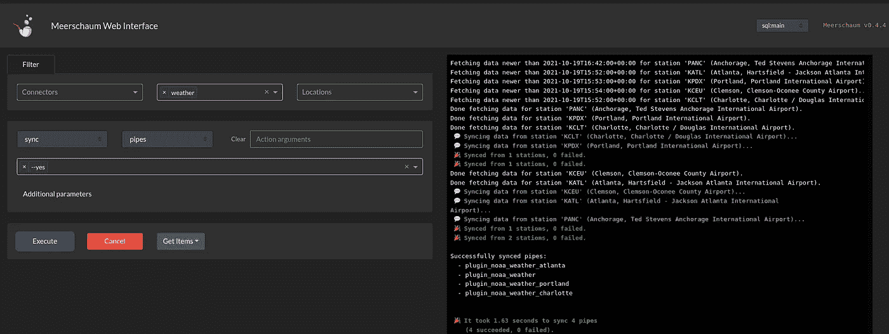
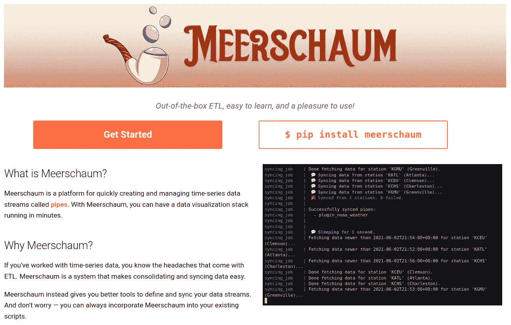
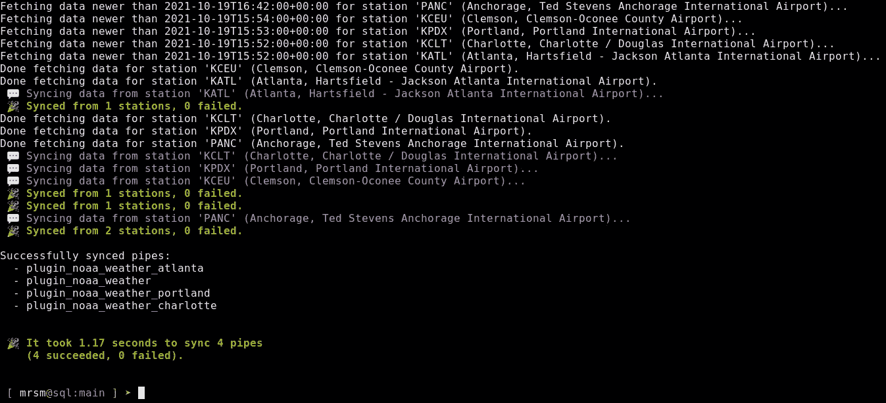
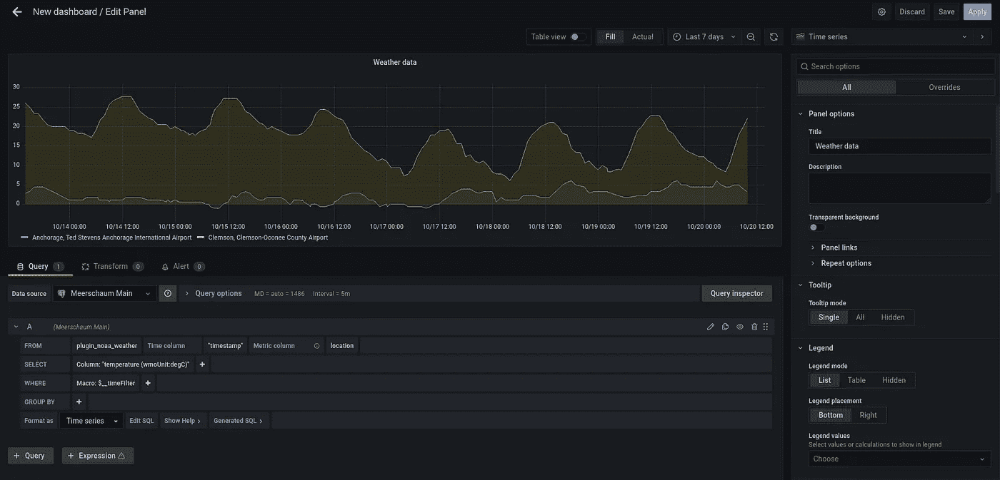
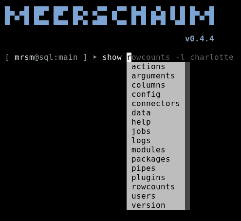
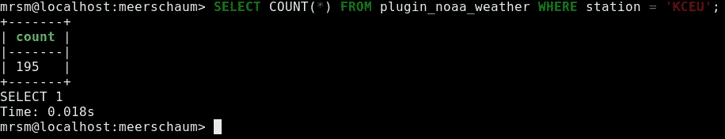
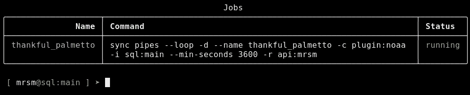
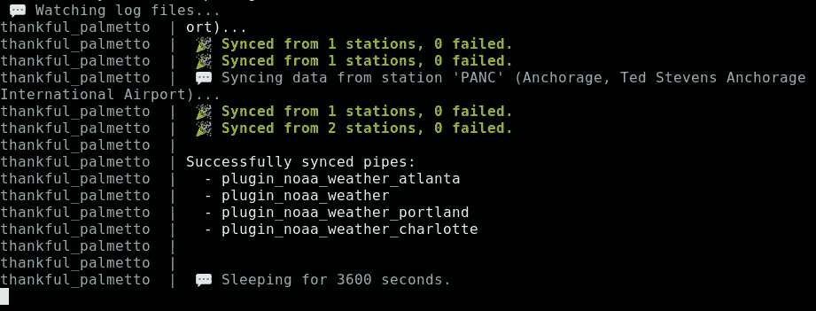
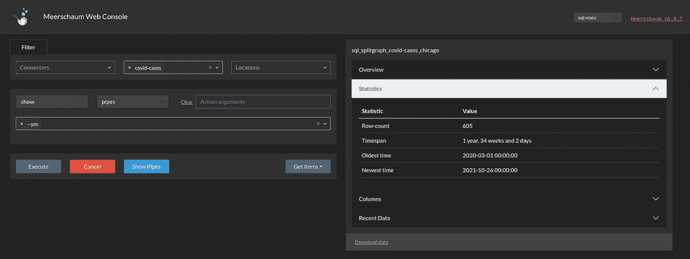

# 海泡石时序 ETL

> 原文：<https://towardsdatascience.com/easy-time-series-etl-for-data-scientists-with-meerschaum-5aade339b398?source=collection_archive---------18----------------------->

## [业内笔记](https://towardsdatascience.com/tagged/notes-from-industry)

## 数据工程不需要这么复杂



通过 noaa 插件同步海泡石中的天气数据。(图片由作者提供)

> 我是 Bennett Meares，[海泡石](https://meerschaum.io)的作者。我构建并开源了海泡石以使数据工程更容易理解，今年我完成了关于在现实世界中使用海泡石的同步策略的硕士论文。
> 
> 如果海泡石对你的项目有帮助，或者如果你有问题，请在[项目讨论版](https://github.com/bmeares/Meerschaum/discussions)上告诉我！

似乎每天都有新的 ETL / ELT 框架向世界承诺。事实是，数据工程兔子洞跑*深*。对于数据科学家和 BI 分析师来说，花在粗制滥造的脚本或学习庞大框架上的时间比花在实际分析上的时间要少。通常，真正需要做的只是更新表格、获取`pandas`数据帧和构建仪表板。

# 其他 ETL 系统

有一些 ETL 管理系统，例如 [AWS Glue](https://aws.amazon.com/glue/) 、 [Apache Airflow](https://airflow.apache.org/) 和 [dbt](https://www.getdbt.com/) ，每个系统都有自己对 ETL 过程的观点。例如，Airflow 让数据工程师将他们的脚本安排为[有向无环图](https://airflow.apache.org/docs/apache-airflow/stable/concepts/dags.html)(Dag)，其行为有点像具有更多上下文的`crontab`。Dbt 倾向于 ETL 的转换方面，并为管理许多 SQL 模型提供 Jinja 风格的模板。AWS Glue 充当亚马逊各种数据存储选项(RDS、红移、S3 等)之间更全面的数据集成服务。).

这些工具对于大规模工作负载来说很有前途，但是在许多项目中，它们可能有点大材小用。在许多情况下，这些行业工具所涉及的设置和模板会导致笨拙的用户体验。您需要使您的 ETL 工作符合您选择的框架，并且需要大量的背景知识来有效地使用这些工具。

这就是[海泡石](https://meerschaum.io)的用武之地――它是一个轻量级的时间序列 ETL 管理系统，构建时考虑到了生活质量。

> 你仍然可以在更大的框架中使用海泡石作为组件。海泡石给你工具来建造你喜欢的建筑。

# 介绍海泡石

对于数据科学家来说，海泡石是一个轻量级的通用 ETL 框架。对于大多数项目来说，它在一个[预配置堆栈](https://meerschaum.io/reference/stack/)(包括一个时间序列数据库和 Grafana)中带有合理的默认值，这样你就可以快速开始同步和分析数据。



海泡石项目的主页。(图片由作者提供)

## 我如何开始使用海泡石？

[入门](https://meerschaum.io/get-started/)指南更全面地介绍了基础知识，但是 TL；DR 从 [PyPI](https://pypi.org/project/meerschaum/) 安装并运行`mrsm`命令(或者`python -m meerschaum`如果`mrsm`不在你的`PATH`中)。

```
pip install --user meerschaum
mrsm stack up -d db grafana
mrsm
```

这将使你进入`mrsm`外壳，在那里你可以开始构建你的管道。`help`命令可以洞察可用的操作(例如`help show pipes`)，自动完成建议将在运行命令时指导您。

## 等等，什么是管道？

海泡石的核心概念是[管道](https://meerschaum.io/reference/pipes/)，它基本上是数据库上的一个表，带有一些关于如何更新它的元数据。例如，因为海泡石关注时间序列，所以所有管道都需要主`datetime`列的名称。

通过管道，您可以接入数据流进行分析:

```
>>> from meerschaum import Pipe
>>> pipe = Pipe('plugin:noaa', 'weather')
>>> df = pipe.get_data(
...   begin  = '2021-10-01',
...   end    = '2021-11-01',
...   params = {'station': ['KATL', 'KCEU']},
... )
>>> 
```

## 没有时序数据流可以用海泡石吗？

当然，您不需要符合包含的时间序列模型。例如，您可以使用[连接器](https://meerschaum.io/reference/connectors/)作为创建和组织数据库连接的便捷方式:

## 数据如何同步到管道中？

ETL 过程发生在`sync`命令中。对于`sql`管道，[同步包括执行一个生成的 SQL 查询](https://meerschaum.io/reference/pipes/syncing/)来获取、过滤和插入最新的数据(我在我的[硕士论文](https://meerschaum.io/files/pdf/thesis.pdf)中探索了各种策略)。



使用“同步管道”命令同步管道。(图片由作者提供)

对于`plugin`管道，`begin`和`end`日期时间界限被传递给`fetch()`函数，结果数据帧被过滤和插入。这里有更多关于写一个获取插件的信息，但是下面是一个基本的例子:

## 闲聊够了，让我们让一些数据流动起来！

在我们深入细节之前，让我们同步一些数据。[入门指南](https://meerschaum.io/get-started/)对事情的解释比我在这里所能解决的更透彻，但是如果你想了解这个过程是如何工作的，运行下面的命令让数据流动起来(如果你在交互式 shell 中，你可以省略`mrsm`):

```
### Start the database.mrsm stack up -d db grafana ### Install the NOAA plugin.mrsm install plugin noaa ### Register the pipe (or run `bootstrap` for a wizard).
### The -c stands for 'connector' and -m for 'metric'.mrsm register pipe -c plugin:noaa -m weather ### The 'noaa' plugin will ask you for a station. Enter 'KCLT'.
### It also handles the datetime column name.mrsm sync pipes ### Demonstrate that we've successfully synced our data.mrsm show data
```

访问 [http://localhost:3000](http://localhost:3000) 在 Grafana 中查看您的数据(默认用户名和密码为`admin`和`admin`)。



Grafana 预先配置在海泡石堆栈中。(图片由作者提供)

`mrsm` shell 附带有用的命令，比如`show`动作(例如`show pipes`、`show rowcounts`、`show columns`等)。).



海泡石外壳在键入命令时提供建议。(图片由作者提供)

对于数据科学家来说，另一个有用的动作是`sql`命令。Meerschaum `sql`连接器与来自 [dbcli](https://www.dbcli.com/) 项目的工具集成在一起，所以你可以直接进入你的数据库，而不需要启动整个 IDE。



海泡石与 dbcli 集成在一起，可以让你直接进入你的数据库。(图片由作者提供)

# 建筑管道

如果您想从关系数据库中提取数据，用`bootstrap connector`添加连接，然后用`bootstrap pipe`构建管道。`bootstrap`命令启动一个向导来引导你添加连接器和管道。

当使用`sql`连接器引导管道时，向导将提示您输入 SQL 定义，就好像管道是一个视图一样(您可以稍后使用`edit pipe definition`编辑定义)。当获取新数据时，该定义稍后用于更大的查询中，以绑定到日期时间轴上。

## 同步管道

如上所述，`sync pipes`命令获取、过滤和插入新数据到管道中。各种标志会影响行为或同步过程，例如:

1.  `--loop`标志持续同步管道，在两圈之间休眠 1 秒。
2.  `--min-seconds`标志改变两圈之间的秒数。
3.  `-d`或`--daemon`标志将命令作为后台作业运行，并可应用于任何海泡石命令。
4.  标准的`-c`、`-m`和`-l`管道过滤器标志指定哪些管道可以被同步。每个标志接受多个值。

例如，以下命令将持续同步带有连接器键`plugin:noaa`的管道，并在批处理之间等待一个小时，所有这些都在后台作业中完成。

```
sync pipes -c plugin:noaa --loop --min-seconds 3600 -d
```



使用-d 标志生成一个后台作业。(图片由作者提供)



可以使用“显示日志”查看作业的输出。(图片由作者提供)

# 在你的项目中使用海泡石

以下是海泡石可以帮助你完成项目的例子。你可以遵循框架的模型，但是海泡石给了你所需的灵活性，让你可以按照自己喜欢的方式来构建你的架构。

## 插件

你可以通过[插件](https://meerschaum.io/reference/plugins/types-of-plugins/)将你的脚本包含在你的海泡石实例中，这些插件是简单的 Python 脚本。插件可以获取数据，定义定制的`sync`行为，扩展内置的 [FastAPI 应用](https://fastapi.tiangolo.com/)，以及添加或覆盖动作和标志。

为了分享你的插件，你可以上传到默认的[公共海泡石库](https://api.mrsm.io/dash/plugins)或者你自己的私有海泡石 API 实例`-r`。

```
register plugin myplugin -r api:myinstance
```

> [在我今年早些时候写的一篇文章中](https://bmeares.medium.com/how-i-automatically-extract-my-m1-finance-transactions-b43cef857bc7)，我展示了一个我写的从 Apex 清算 API 获取财务数据的海泡石插件。

## Web API

你可以连接到你的海泡石实例，通过运行 Web API 来保护防火墙后面的数据库。

```
start api -d
```

在另一台机器上，将您的 API 添加为连接器，并使用它来访问您的实例(在 shell 中使用`instance`命令或在命令上使用`-i`标志)。web 仪表板可用于通过浏览器控制海泡石。



web dashboard 可用于随时随地控制海泡石。(图片由作者提供)

该 API 允许你与团队协作，托管私有插件并允许独立的 Meerschaum 用户登录。注意，到目前为止，用户共享数据库，所以用户系统是为每个特定实例的较小团队设计的。也就是说，插件归用户所有，管道由团队共享。

> 一个完整的建筑可能包括许多海泡石实例。

## Shell 命令

你可以在 shell 脚本中使用海泡石，或者在 crontab 中使用`mrsm`或`python -m meerschaum`。请注意，您需要通过`-y`或`-f`，这样您的脚本就不会被交互式问题卡住。

```
### Sync pipes once per hour.
0 * * * * python -m meerschaum sync pipes### Start jobs on reboot
@reboot python -m meerschaum start jobs -y
```

## 后台作业

对于持续的操作(比如运行 API)，[海泡石后台作业](https://meerschaum.io/reference/background-jobs/)是一种管理流程的简单方法。添加`-d`标志来告诉 Meerschaum 运行您指定为后台作业的命令。除非您指定了`--name`标志，否则作业会被随机命名。

```
mrsm start api -d --name api_job
```

您可以使用`start`、`stop`和`delete`命令管理您的作业。命令`show logs`将显示正在运行的后台作业的输出(如`docker-compose`)。

## Python 包

Python 包可以很容易地导入到您现有的脚本中。完整的软件包文档更详细，尽管下面是几个有用的例子。

一个`Pipe`对象可以让你直接访问你的数据流。`sync()`方法允许我们向管道中添加新数据(过滤掉重复的数据)，而`get_data()`方法允许我们根据特定的参数轻松地检索历史数据。这里是关于`Pipe`对象所能做的事情的文档。

新管道很容易注册和同步。

`get_pipes()`函数允许您检索一个实例上所有注册的管道。

管道的键结构允许更容易的分组和管理。

# 结论

这篇文章展示了几种可以开始同步时间序列数据的方法，尽管海泡石还可以提供更多。记住，海泡石的主要焦点是[生活质量，这样你就可以回到数据分析](https://meerschaum.io/reference/data-analysis-tools/)。对于没有时间研究数据工程的数据科学家来说:海泡石可能适合你！

那么，你还在等什么？试试看！尝试使用内置的 SQLite 实例`sql:local`并同步一些数据。

> 我创建海泡石是为了让每个人都能接触到数据工程，所以如果你需要帮助、有想法或者想展示你的成果，我可以在 GitHub 上的[项目讨论页面找到你！](https://github.com/bmeares/Meerschaum/discussions)