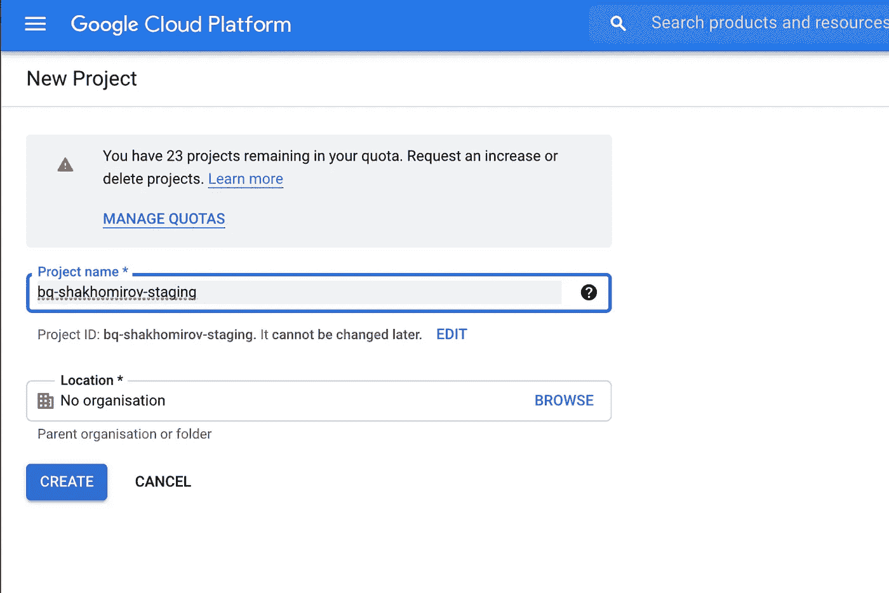
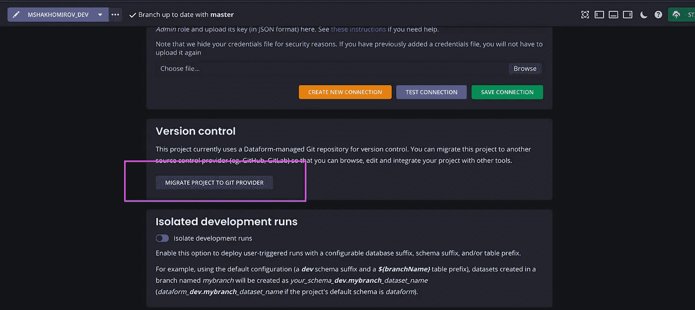

# 为您的数据创建实时和暂存环境的简单方法

> 原文：<https://towardsdatascience.com/easy-way-to-create-live-and-staging-environments-for-your-data-e4f03eb73365?source=collection_archive---------15----------------------->

## 从使用数据表单的 SQL 转换的数据图开始

数据形式依赖图。作者图片

L 假设您正在使用 BigQuery、Snowflake、Redshit 等构建您的**数据仓库**解决方案。您的任务是创建一些报告，并且您需要为您每天进行的 SQL 转换创建**生产**和**测试**环境。

您可能希望将数据转换作为代码运行，将更改推送到 git 存储库。您还在寻找一种简单易用的方法来记录一切，运行 SQL 单元测试，并在数据仓库出现问题时接收通知警报。

一个理想的方法是创建两个独立的数据项目**,这两个数据项目不重叠，如果需要的话可以很容易地删除。举个例子，**

> 我想创建一个隔离的 **staging** 数据项目，然后删除与之相关的所有资源。

这是一个琐碎的任务，可以通过 **AWS Cloudformation** 或 **Terraform** (与**谷歌云平台**更相关)轻松完成，数据工程师经常被分派这项任务。

在这个教程中，我将使用 BigQuery。这是我个人最喜欢的数据仓库解决方案，而且是免费的(如果你处理少量数据，比如在`staging`上)。你也可以用类似雪花的东西。30 天免费。设置将非常相似。

> 环境的一个常见用例是为您的 SQL 运行分阶段发布流程。

在**试运行**环境中测试代码后，代码被提升到稳定的**生产**环境中。

## 概述

**步骤 1。**创建`production` **BigQuery 项目**，随便你怎么称呼，比如`bq-shakhomirov`

**步骤二。将 BigQuery 项目连接到 Dataform 项目。**

**步骤三。**建立 **staging** 环境，即在 BigQuery `bq-shakhomirov-staging`中创建另一个项目

**第四步。**创建一个空的(完全空的) **Github** 仓库，并在那里迁移**数据表单**项目。

完成后，您将能够在自己的分支中开发 SQL 管道，创建拉请求并合并到`staging`分支中。该分支将用于数据表单中的**暂存**环境，其中所有 SQL 转换都在您的**暂存 BigQuery 项目**中运行。实时数据将保持不变。当你对你的脚本感到满意后，你可以将它合并到主分支，并在 Datform 的**生产**环境中使用，即`bq-shakhomirov` BigQuery 项目。

## **第一步。**为生产创建 **BigQuery 项目**

将暂存数据和生产数据分开的一种简单明了的方法是为每个环境使用不同的数据库。我们将使用`bq-shakhomirov`(替换为您的项目名称)进行生产，使用`bq-shakhomirov-staging`进行测试。

> 1.转到 [**BigQuery 页面**](https://console.cloud.google.com/projectselector2/home/dashboard) 并创建您的第一个项目:

作者图片

> 2.**生成数据仓库凭证**

为了让 Dataform 连接到您的 BigQuery 仓库，您需要使用应用程序默认凭证或服务帐户和 JSON 密钥。

您需要从您的 Google Cloud 控制台创建一个**服务帐户**，并为其分配访问 BigQuery 的权限。

转到[服务账户页面](https://console.cloud.google.com/iam-admin/serviceaccounts)

-确保选择了您创建的新项目，然后单击“打开”。

-单击“创建服务帐户”并为其命名。授予新帐户 **BigQuery Admin** 角色。

正在创建服务帐户。作者图片

正在授予 BigQuery 管理员角色。作者图片

完成后，您需要为您的新服务帐户创建一个密钥(JSON 格式):

*   在“服务帐户”页面上，找到要为其创建密钥的服务帐户行，然后单击“**操作**”按钮。
*   然后点击`**管理密钥**`。
*   点击`**创建**`并选择 JSON 键类型。

创建新的 JSON 键。作者图片

现在您已经创建了一个新的 BigQuery 项目并生成了您的仓库凭证，您已经准备好创建您的**数据表单**项目了！

## **步骤二。将您的项目连接到数据表单**

去[https://app.dataform.co/](https://app.dataform.co/)创建你的数据表单项目。例如，您可以选择使用您的** **Github** **帐户注册，然后创建您的第一个项目。

*   为您的项目命名，例如“bq-shakhomirov”。
*   您将需要您的 **BigQuery 项目 ID** 来连接到 Dataform。您可以在您的 [BigQuery 控制台](https://console.cloud.google.com/)中找到它，只需点击您的项目。
*   您将看到如下所示的页面。点击“浏览”并上传您的 JSON 密钥。然后点击“测试连接”,如果一切正常，你就可以开始了。然后点击“保存连接”。

连接到数据表单。作者图片

## **第三步。**设置暂存环境

对于暂存环境，我们将在 **BigQuery** (数据库)中创建一个单独的项目。因此我们可以安全地删除所有暂存资源，以备不时之需。Google 推荐的最佳实践是创建一个单独的项目来分离生产和暂存环境。

> 1.您可能想要为暂存创建一个新的 **BigQuery 项目。**

只需重复从**步骤 1** 开始的步骤，并将“-staging”后缀添加到您的项目名称中:

创建用于暂存的项目。作者图片

> 2.授予您的服务帐户对临时项目的访问权限。

还记得我们在步骤 2 中创建了一个服务帐户吗？我们向 dataform 提供了这些凭据。现在，我们希望该服务帐户能够访问我们的临时项目。

转到谷歌控制台中的 [IAM](https://console.cloud.google.com/iam-admin/iam) ，添加来自**步骤 1** 的我们的**服务帐户电子邮件**作为具有 **BigQuery Admin** 权限的新成员:

现在转到您的数据表单项目的环境，选择 **staging** 并单击 **Run schedule** :

测试试运行计划。图片作者。

这次运行将在您的 staging **BigQuery** 项目中创建新表。它可以是计划每天运行的任何 SQL 转换。在我的例子中，它是一个支付历史表和一个视图:

连接到数据表单的暂存环境

注意，我们选择了一个名为“ **staging** ”的分支。如果你还没有，你可以在**数据表单**控制台中创建它。

在数据表单中创建新分支。作者图片

## 4.将您的数据表单项目迁移到 Github。

您可能希望至少有两个分支:一个用于`production`(主节点)，一个用于`staging`。我称之为**分期**。您的数据团队成员可以在其个人分支，即`**mshakhomirov-dev**` 中开发任何变更，然后创建拉请求以合并到`staging`分支中，该分支将在您的 **BigQuery** 暂存项目中运行。

> **1。首先，您需要创建一个完全空的新 Github 存储库。**

该存储库可以是私有的或公共的，或者是组织的一部分。存储库必须是全新的，即没有任何提交。

请确保您已经从 git 提供程序提供了有效的访问令牌。确保您提供了一个凭据，该凭据具有推送至您计划使用的存储库的必要权限。

> **2。然后转到 Dataform 并连接到 GitHub**

*   你可以点击**导航菜单- >项目设置中的**将项目迁移到 GitHub** 按钮。**

将项目迁移到 GitHub

如果需要的话，创建一个 **GitHub** 个人访问令牌，但总的来说这个过程相当顺利。

在这里阅读更多:[https://help . github . com/en/github/authenticating-to-github/creating-a-personal-access-token-for-the-command-line # creating-a-token](https://help.github.com/en/github/authenticating-to-github/creating-a-personal-access-token-for-the-command-line#creating-a-token)

*   输入要用来存储项目的 Git 存储库的全名。
*   确保它是空的并且不包含任何文件。甚至没有。gitignore 和 README.md

连接后，您将看到如下屏幕:

连接到 github repo 的数据表单

> **3。然后你会想要配置你的数据表单的配置**

确保你的数据表单的`environments.json`文件有`gitRef`到你的分支。例如:

现在，无论您将什么合并到存储库中的`**staging**`中，它都将使用自己的时间表在 dataform 的`**staging** environment`中运行。

> 默认情况下， **Dataform** 从项目的主 Git 分支运行所有项目代码。配置环境允许您控制这种行为，使您能够运行多个不同版本的项目代码。

这是一种清晰而简单的方法来分离暂存数据和生产数据。

因此，默认情况下，我将使用我的暂存 BigQuery 项目:

dataform.json .图片作者

当来自暂存分支的拉请求被批准，我们可以将其合并到`master`时，我希望**数据表单**使用我的 live **BigQuery** 项目。在这种情况下，我的`environments.json`将让**默认数据库**覆盖:

作者图片

`./environments.json:`

## **结论**

我**想在 BigQuery 中可视化我的 SQL 转换管道**。我一直在寻找一个专门用于此的图形工具，甚至考虑为此从头开始构建一些东西，但后来我意识到 Dataform 已经有了。

> 一个 SQL 转换图抵得上一千个字。

我的数据仓库也很大。我已经在使用 git 管理我的 SQL 脚本了。然而，对于一个成长中的数据团队来说，无论他们做什么样的数据转换，投资于**自动化文档**可能是值得的。Dataform 让我可以轻松地使用。sqlx 和。js 模板。本质上，它是相同的 SQL，但是您将使用 **ref()** 函数来引用您使用的表。我使用了大量的**数据健康检查**，在我的 SQL 脚本中明确地定义了它们。同样，dataform 让我通过创建数据检查视图来做到这一点。就个人而言，我更喜欢看到 SQL 脚本中的数据检查 SQL，而不是被迫在另一个选项卡中打开视图 SQL，但这是一件小事。老实说，当数据校验存储在一个专用数据集中时，对团队的其他成员来说效果更好。更容易找到他们。

Dataform 可以很好地描述数据堆栈的数据转换层。您可以声明您的源表，并提供一个描述，说明实际上是什么在向它们提供数据，即 API、DB extracts 或 Kinesis 流。

## 推荐阅读:

[1][https://mshakhomirov . medium . com/building-a-data-warehouse-in-the-cloud-using-big query-part-1-155917215678](https://mshakhomirov.medium.com/building-a-data-warehouse-in-the-cloud-using-bigquery-part-1-155917215678)

[2][https://help . github . com/en/github/authenticating-to-github/creating-a-personal-access-token-for-the-command-line # creating-a-token](https://docs.dataform.co/dataform-web/scheduling/environments)

[https://docs.dataform.co/getting-started-tutorial/set-up](https://docs.dataform.co/getting-started-tutorial/set-up)

[4][https://docs . data form . co/best-practices/start-your-data form-project](https://docs.dataform.co/best-practices/start-your-dataform-project)