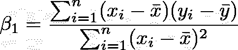
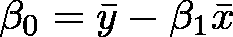
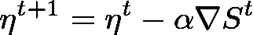

# Python 3.8 中从零开始的计量经济学和统计学

> 原文：<https://towardsdatascience.com/econometrics-and-statistics-from-scratch-in-python-3-8-linear-regression-mean-squared-error-9b81b8b84754?source=collection_archive---------22----------------------->

使用 Wooldridge 数据库了解全球变暖的来源，无需统计库，或者如何在 Python 3.8 中执行线性回归和矩阵计算，作者:Louis Brulé Naudet。

**建议**

与 Python 3.8 的兼容性测试，在 MacOS 11.3 和 Linux Ubuntu Server 20.04 LTS 环境下执行。

使用的库:Numpy，Pandas，Bokeh，SciPy。

为了使程序在最少人工干预的情况下可执行，并优化其在服务器上的部署，已经实现了升级、数据下载和异常处理的自治，特别是在 server_SMTP 类中。

源代码将首先观察其执行所必需的库的存在，然后在不存在的情况下下载它们，以便自动更新执行环境的软件配置。在同一模式下，将从 louisbrulenaudet.com 网站下载一份数据库副本，以通过 SSL 证书验证的变化，避免与不同机器上的访问路径书写相关的冲突。

## 变量的描述性分析

为了简化源代码的阅读，我们创建了一个子指令块集中的功能，允许对分散和位置进行各种计算。

第一种可能的解释是，平均值几乎系统地高于每个序列的中值，就像世界二氧化碳排放总量的情况一样，或者解释变量:平均温度(分布大多不对称向右)。第二个观察结果是，水泥生产和燃烧产生二氧化碳排放水平大大低于天然气，石油或煤炭生产产生二氧化碳排放水平。具体来说，后两个因素的二氧化碳排放量是我们数据库中已知的最大值。实际上，为了增强用户体验，通过在 HTML/JavaScript 中提供交互式图形，所有的表示都可以在线访问。因此，通过点击此处(垂直滚动页面)，可以突出显示解释变量和被解释变量随时间的变化。图示证实了我们的直觉，我们观察到所有解释变量和被解释变量随时间的总体增长，除了燃烧产生的 CO2 排放和水泥生产产生的 CO2 排放。观察到一次能源消耗呈准线性增长，而二氧化碳总排放量则稍不规则。所解释的变量显示了一个不可否认的长期增长，但在中期(五年尺度)更值得怀疑。

为了限制库的使用，所有的统计分析都是从专有指令块发展而来的。根据定义，统计序列的经验方差是有偏差的，因为:

但是，如果 n>1，根据线性期望值，通过将样本上测量的方差乘以以下各项获得的估计方差:

是 sigma 平方的收敛无偏估计量。因此，源代码中应用的公式分别是:

除了燃烧和水泥生产产生的二氧化碳排放量之外，所有解释变量都观察到相对较大的标准偏差值，相当于每个样本值之间的数量分散，从而证实了不存在随时间的恒定性和变化趋势(通过图形分析获得的增长)。

## 相关性和简单线性回归

对于我们工作的其余部分，我们试图反驳解释变量和被解释变量之间的独立性假设，以实现仿射调整，最接近平面中的每个点云。

第一个观察结果是，皮尔逊相关(一个无量纲量)，一种量化两个变量与其各自期望值的联合偏差的协方差的标准化形式，对于上述所有解释变量都相对较高，相反，对于燃烧产生的 CO2 排放量则较低。然而，由于没有一个变量的相关系数低于 0.1，我们可以估计它们或多或少都是被解释变量的依赖源。二氧化碳总排放量和一次能源消耗是与温度最相关的两个解释变量。我们分析中测试的回归基于普通最小二乘法，即最小化回归云的每个点与其投影点之间的残差平方和。因此，简单回归模型试图通过定义β系数向量的最佳无偏估计量来建立两个变量之间的线性关系。

系数β1 解释为一个额外单位的解释变量对被解释变量的边际效应。对于单变量线性回归，R 平方定义为 SES 回归解释的方差与总 SST 方差之比，并测量数据与拟合回归线的接近程度。因此，接近 1 的决定系数将表明该模型解释了平均值周围响应数据的所有可变性，相反，降低的系数将使回归不解释变量之间的依赖性。在我们的研究中，我们观察到最重要的拟合系数是温度对天然气生产 CO2 排放量的回归。这个结果再次证实了我们的假设。我们可以尝试解释的一个异常现象是，石油生产中二氧化碳排放的相关系数较低。从图形上看，我们观察到分布接近指数函数，这可以解释与线性回归定义的不匹配。对于这个推理，所有的回归都可以通过点击这里得到。另一个观察结果涉及与燃烧产生的 CO2 排放相关的β1 系数。诚然，这一个相对于其他的非常高，然而，非常低的决定系数向我们表明回归缺乏显著性。这种批评在数学上反映为相对较大的标准误差值和 p 值。量化统计显著性，其值接近 0.05 表明，如果验证了零假设，可能会得到相同的结果。与该变量不同，所有其他回归在 p 值方面具有统计学意义。关于 t-统计量，我们发现我们的直觉，即丢弃石油生产的 CO2 排放异常，最显著的回归来自天然气生产、一次能源消耗和 CO2 排放总量。

简单线性回归的主要缺点是存在遗漏变量偏差。因此，除了同时性之外，当一个被省略的变量影响被解释变量和一个(或多个)解释变量时，解释变量和误差项之间的相关性也可能发生。这将允许我们解释我们的异常现象。限制这种偏差的一种方法是在多元线性回归中引入几个解释变量。为此，我们首先对数据进行归一化，以避免对梯度下降算法的性能产生任何负面影响。由于平均温度值可能为负值，我们不采用对数变换，而是采用标准变换，即:

然后，这种缩放允许我们补偿每种类型的发射之间的水平的巨大差异。

## 相关性和多元线性回归

梯度下降算法旨在实现可微优化。因此，它旨在最小化定义在欧几里得空间上的可微实函数。该算法是迭代的，并且通过连续的改进进行，直到收敛。然后，我们试图最小化梯度，导数的多维推广。学习系数将被定义为一个参数，该参数允许调整校正，并且通过扩展，允许调整收敛速度。在我们的模型框架中，我们发现:

为了优化回归的训练系数α和β系数的确定，将通过对每个值进行迭代来生成可能值的列表，以便只保留多元回归的最高确定系数。

根据经验，我们发现 R 平方为 0.900927，这证实了我们关于省略变量偏差的建议。事实上，我们从未通过简单的线性回归获得如此高的统计结果。

## 中期和长期预测

根据这一观察，我们可以对中期和长期的平均气温值进行预测，方法是在所有条件不变的情况下，对每个变量进行变分，上升和下降都一样。因此，我们将能够确定实施哪些措施来降低全球气温。在我们的分析中，我们决定根据数据库中每个变量的最新已知值，分别执行 5%、10%、25%、50%、100%和 200%的向上和向下变动。

我们观察到，在短期和中期内，影响是不明确的，然而，在长期内，我们发现石油、天然气和水泥生产的 CO2 排放显著增加，显著影响平均温度。在我们讨论的开始没有提到水泥，但是这个发现与简单线性回归相关的β1 的相对水平及其决定系数产生了特别好的共鸣。从长远来看，如果二氧化碳排放量的增幅非常大，它甚至会成为第二大二氧化碳排放源。这种影响可以用两个因素来解释:水泥厂的熟料生产需要石灰石(自然界中最稳定的钙形式)的脱碳，以及在有二氧化硅的情况下煅烧。

因此，减少全球 CO2 排放的假设之一(其似乎与平均温度的增加高度相关)是促进使用替代的非碳酸燃料来代替化石燃料。天然气必须经过去除腐蚀性元素(如硫)的处理，这些过程都是导致 CO2 排放到大气中的因素。另一种选择是使用木质颗粒作为家庭取暖或热泵。然而，似乎很难找到一种在居住舒适性和减少气体排放之间实现完美平衡的解决方案。事实上，用完全可再生的电力资源，比如风能，只靠电力来取暖似乎是乌托邦。然而，不可否认的是，原子裂变发电似乎是二氧化碳污染最小的解决方案之一。它甚至是光伏发电的更好替代品，光伏发电每千瓦时产生 100 至 200 克二氧化碳，比核电高出三倍。最后，根据西欧国家正在实施的公共指令，减少石油生产引起的排放似乎是降低全球温度的主要改进方向。这就提出了与天然气相同的问题，即如何找到一种像石油一样通用、高效的可用系统，同时减少温室气体的产生？

美国国家海洋和大气管理局在 [Unsplash](https://unsplash.com?utm_source=medium&utm_medium=referral) 拍摄的照片

电力的提议作为一个奇迹般的解决方案回来了，除了它的储存，需要使用锂电池，这是一种碱金属，很难以更低的成本回收。在运输部门，氢似乎也是一个令人感兴趣的发展前景，从有机材料生产的生物燃料也是如此。然而，我们的多元回归对一次能源消费的影响以及对煤炭生产的影响仍然模糊不清，尽管其决定系数表明了对全球温度的依赖。让我们以所有其他同等变量系统的倒数来结束我们的分析，这些变量对每个变量都有负作用。从乌托邦的角度来看，我们提出的措施会让我们降低全球气温。

> 注意:由于原始数据库的规模小，省略变量的可能偏差是我们分析中产生异常的原因。温室气体的其他来源肯定存在，地球变暖与人类活动无关的可能性也不容忽视。

Louis bruénaudet，巴黎大学法学和经济学/管理学双学位。

<https://louisbrulenaudet.com> 