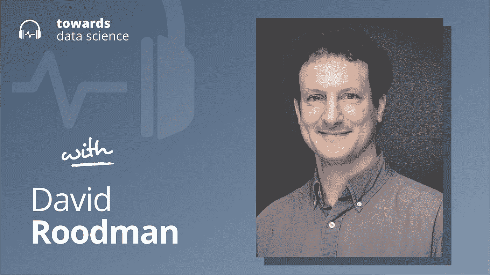

# 经济史和通往奇点之路

> 原文：<https://towardsdatascience.com/economic-history-and-the-road-to-the-singularity-288fe053d965?source=collection_archive---------22----------------------->

## [播客](https://towardsdatascience.com/tagged/tds-podcast)

## 大卫·罗德曼讲述当人工智能将我们推离地图边缘时会发生什么

要选择章节，请访问 Youtube 视频[这里](https://youtu.be/WjqHZEnXl9o)。

*编者按:这一集是我们关于数据科学和机器学习新兴问题的播客系列的一部分，由 Jeremie Harris 主持。除了主持播客，Jeremie 还帮助运营一家名为*[*sharpes minds*](http://sharpestminds.com)*的数据科学导师初创公司。可以听下面的播客:*

[苹果](https://podcasts.apple.com/ca/podcast/towards-data-science/id1470952338?mt=2) | [谷歌](https://www.google.com/podcasts?feed=aHR0cHM6Ly9hbmNob3IuZm0vcy8zNmI0ODQ0L3BvZGNhc3QvcnNz) | [SPOTIFY](https://open.spotify.com/show/63diy2DtpHzQfeNVxAPZgU) | [其他](https://anchor.fm/towardsdatascience)

经济学中有一个小谜团，它可能表明，对人类来说，事情将变得非常非常怪异。

这个谜是这样的:许多经济模型预测，在某个时候，人类的经济产出将变得无限。

现在，无限在现实世界中是不会发生的。但当它们被其他合理的理论预测时，它们往往会指出这些理论的假设在某个根本的方面崩溃了。通常，这是因为像相变这样的事情:当气体冷凝或液体蒸发时，它们的一些热力学参数趋于无穷大——不是因为任何“无穷大”的事情真的在发生，而是因为当这些气体变成液体时，定义气体的方程不再适用，反之亦然。

那么，我们应该如何看待那些告诉我们人类经济产出总有一天会达到无穷大的经济模型呢？将它们解释为预测人类经济的一个阶段转变是否合理——如果合理，这个转变会是什么样的？这些都是很难回答的问题，但是我的嘉宾大卫·罗德曼——开放慈善机构的高级顾问——思考了很多。

大卫将他的调查集中在他认为可能导致潜在经济阶段转变的罪魁祸首上:变革性人工智能技术的崛起。他的工作探索了一种强有力的方式来思考如何，甚至何时，变革性的人工智能可能会从根本上改变经济的运作方式。

以下是我在对话中最喜欢的一些观点:

*   当你绘制过去 10，000 年全世界的经济产出时，你得到的曲线不仅仅是指数型的——它甚至更快。在整个人类历史上，*不是以每年 3%左右的“稳定”速度增长，而是增长速度本身一直在加速。因此，许多简单推断我们当前增长轨迹的经济模型往往会在有限的时间内趋于无穷大。理解为什么会发生这种情况的一个方法是把新的发明想象成时间压缩机:当我们发明电话时，曾经需要几周时间的任务可以在几分钟内完成。同样，轮子的发明、火的发现和计算机的发展都大大缩短了完成一系列任务所需的时间，使得进一步的创新发生得更快。经济模型认为人类的生产产出将趋于无穷大，通常只是假设这种动态将继续下去——尽管出于显而易见的原因，它不能继续下去，但很明显，人工智能可能代表着创新的最后阶段，在这个阶段，新想法是根据计算机时钟时间而不是人类时间构思的。*
*   大卫对经济史进行了大量不同的模拟，以了解他们预测奇点——一个无限经济产出的点——的一致性。他发现奇点的出现是相当稳健的:在他的(公认简单的)模型中，当人类达到大约一万年前的经济产出水平时，奇点最终会在大约 95%的时间里出现。正如大卫指出的，重要的是不要把这些模拟看得太重，但分析是有启发性的，并为关于人类和我们在深层时间中的位置的有趣和有启发性的对话创造了空间。
*   除了通过人工智能预测经济转型的工作之外，大卫还做了大量复制经济学研究的工作——经常有惊人的结果。特别是，他估计大约 50%的时候，他的复制研究与他们试图重现的原作的结论相矛盾。不幸的是，[这与其他人在心理学和经济学中做复制研究时的发现](https://www.sciencemag.org/news/2016/03/about-40-economics-experiments-fail-replication-survey)一致，表明了学术过程的严重失败。但大卫指出，这不应该令人惊讶:很少有资源花在复制分析和确保发表的学术工作的稳健性上。考虑到价值数十亿美元的决策通常是在结论的基础上做出的，而这些结论的验证却没有得到价值几千美元的关注，这就更加令人不安了。

你可以[在推特上关注大卫](https://twitter.com/davidroodman)，或者[在推特上关注我](https://twitter.com/jeremiecharris)

## 播客中引用的链接:

*   [大卫的个人网站](https://davidroodman.com/about/)。
*   我强烈建议去看看开放式慈善机构。他们的使命是找出极具影响力且被低估的慈善事业。在新冠肺炎之前，他们已经投资了数百万美元用于疫情防备，支持刑事司法改革工作，并在人工智能安全和人工智能政策研究方面投入了大量资金。

## 章节:

*   0:00 介绍
*   大卫的背景
*   3:26 什么值得资助？
*   6:51 理解抽象风险
*   11:21 人工智能安全
*   14:20 经济模式
*   22:29 新的发现
*   28:44 文化与安全
*   39:51 结合随机微积分
*   45:26 人性的故事
*   49:00“尽职调查”概述
*   55:00 上行分析
*   57:24 培养自信
*   1:07:33 总结

## 请查看下面的文字记录:

杰瑞米·哈里斯(00:00:00):
大家好，我是杰瑞米。欢迎回到迈向数据科学播客。今天我们要讨论两个有趣的问题，这两个问题看起来毫无关系，但实际上是有关系的。第一个问题非常简单:如果你有 100 美元，你想用它在这个世界上创造尽可能多的快乐、繁荣和幸福，你会把它花在什么地方？第二个问题与我们作为一个物种的长期未来有关:我们是否正处于人工智能驱动的经济革命的边缘？如果是这样的话，到目前为止，我们可以从人类经济活动的历史中学到什么来帮助我们在这种转变发生时进行导航呢？

Jeremie Harris (00:00:36):
所以今天我将和我的嘉宾 David Roodman 一起探讨这些问题，他是开放慈善事业的高级顾问。由于他在开放慈善事业中的角色，大卫花时间探索既重大又实用的问题。这些问题包括:严厉的犯罪立法弊大于利吗？或者我们能通过使用像小额信贷这样的策略有意义地减少贫困吗？正如我们将看到的，他也做了很多有趣的思考，预测先进的人工智能系统何时可能在推理能力上超越人类。这次谈话非常有趣，它联系了许多不同的想法，这是我以前从未想到的。我希望它对你也一样。我希望你真的喜欢它。事不宜迟，我会让开，让它开始。

大卫，非常感谢你和我一起参加播客。

大卫·罗德曼(00:01:18):
很高兴来到这里。

Jeremie Harris (00:01:19):
你能来我真的很兴奋。我是通过，而不是通过你写的关于小额信贷的书发现你的，这本书真的很棒，而是通过你写的一篇关于长期主义和从人工智能的角度看长期主义的文章。我真的很想深入其中。我想我也想深入一些你们已经做过的探索，重新检查一些早期的结果，这些结果是人们在慈善领域收集的，关于哪些倡议值得投资，哪些不值得投资。所以我们有很多要谈的。但在我们开始之前，我想先了解一下情况，谈谈你的背景。那么是什么把你带到了利他主义的领域，并开启了慈善事业，也就是你现在工作的地方？

大卫·罗德曼(00:02:02):
哦，好吧，我已经长大了，可能要花一个小时才能告诉你所有这些，但我会尽量避免。我是一个离异家庭的孩子，在某种程度上，我认为我的生活一直在试图融合我父母在我一生中给予我或灌输给我的个性方面。所以在我 12 岁的时候，我爸爸给我介绍了电脑。我在穿孔卡和 IBM 主机上学会了我的第一次编程。这是我生活的一部分，我一直对编码和数学感兴趣。但我母亲也是 20 世纪 70 年代女权运动的一员。她给了我们，我妹妹和我一种强烈的公民责任感。我一直在试图找出如何将我对公共政策和公共福利的兴趣与我用数学编码和思考事情的倾向结合起来。

大卫·罗德曼(00:03:01):
所以现在回想起来，一切似乎都很明显，但我不知道它会如何发展，但我花了很多时间在我居住的 DC 华盛顿州的智囊团工作。这些通常是由慈善基金会资助的，为了分析复杂的问题，它与实际的决策相关。所以这些年来，通过那种工作，我了解了很多不同的主题。

杰瑞米·哈里斯(00:03:26):
有意思。我发现开放慈善事业特别吸引人的一点是，它有点集中或嵌入在有效利他主义的矩阵中，有点像有效利他主义社区。一条主线是批判性地看待我们投资解决的各种问题，并问这真的是我们资金的最佳去处吗？这导致了一些非常有趣的反直觉的决定，关于什么能得到资助？你介意提供一点概述吗，有哪些你认为值得投资但人们可能没有意识到的更令人惊讶的事情？

大卫·罗德曼(00:04:02):
我在旧金山一家名为 Open Philanthropy 的公司工作。它本质上是一个基金会，尽管它实际上并不持有大量资产，无论它是提出建议还是提出理由。我们现在影响的大部分资金来自达斯汀·莫斯科维茨和他的妻子卡里·图纳。达斯汀是脸书的创始人之一，我在那里呆了四五年。你完全正确。它在很大程度上受到被称为有效利他主义的哲学或思维方式的影响，这就像我刚才以不同的方式描述我自己一样，它是关于试图将让世界变得更美好的承诺与对实际可行和最重要的事情的坚定思考联系起来。

David Roodman (00:04:50):
在我不太想邀功的过程中，我非常钦佩，但并没有密切参与，我们已经分离出三四个主要原因领域和一些次要原因，随着时间的推移，我们会不断增加。有趣的是，他们中的一些人在四五年前第一次被选中时，看起来比现在更古怪、更疯狂。所以我们在为疫情做准备，这需要很多解释，对吗？显然，我们的赠款并没有阻止疫情，但希望我们在应对和准备未来的反应方面有所作为。我们也成为美国刑事司法改革的重要资助者，通过努力减少监狱中的人数，因为美国的人均监禁率目前是世界上最高的，可能除了朝鲜，这不是一个令人愉快的比较。

大卫·罗德曼(00:05:48):
所以我们一直在努力工作，自从我们开始工作以来，在过去的几年里已经取得了很大的进展。另一个对我们来说是农场动物福利，这听起来有点滑稽。但是现在有数十亿的农场动物一直在受苦。如果你甚至说一只鸡的生命只相当于人的生命的 1%,你算一下，与人类的痛苦相比，这是很大的痛苦。如果通过运动让企业做出承诺，改变他们的养殖方式，只用几百万美元就能给几十亿动物带来巨大的变化，这是非常划算的。这些是我们正在努力的一些领域。另一个，当然我们会谈到的，也是看起来没有五年前那么疯狂的事情，是人工智能安全，试图尽我们所能使人工智能对社会安全，所以它是利大于弊的来源。

Jeremie Harris (00:06:51):
实际上，我发现这里真正有趣的是，所有这些举措之间似乎有一种微妙的主题相互作用，这种方式可能并不明显，尤其是我个人经常感觉到的，当我与人们谈论人工智能安全时，很像 2020 年 1 月的一个人在谈论冠状病毒时的感觉，如果你有这个指数级过程， 或者，正如你指出的超级指数过程，它正在展开，有可能让我们所有人感到惊讶，你可以看到数学的方向，如果你只是随着时间的推移迭代前进。 然而，我们的日常生活似乎真的没有反映出潜在的现实。这是你擅长表达或争论的东西吗？你如何让人们理解更抽象的风险，并让他们认真对待它们？

大卫·罗德曼(00:07:43):
这是一个很好的问题。这真的是一种交流。不知道是不是特别擅长。我是那种喜欢沉浸在一系列想法中，然后尽我所能解释这些想法的人，有点像老师。但是如果你不是一个有上进心的学生，你可能还是不会买它。所以我不确定我有多少智慧可以说，除了你需要做一些事情，比如让你的论点非常具体，利用隐喻，联系人们的生活经历。我们现在可以更有说服力地谈论为下一个疫情做准备了，这是一个简单的例子。

杰里米·哈里斯(00:08:19):
是的。

大卫·罗德曼(00:08:19):
我应该说，我刚刚列出了一些原因领域，它们看起来确实有点像一个袋子，人工智能安全，农场动物福利。但是它们来自于一个过程，我想你已经举例说明了其中的一些优点。也就是说，我们能够达成优先事项，尽管存在一定程度的想象力缺失，这使得我们很难理解为什么这些是重要的。我们系统地做了大量的工作，问了很多人他们认为什么是重要的，然后进行思考。然后我们有一些过滤器，寻找有潜在巨大影响的重要事物，可以影响数百万或数十亿的动物，寻找被忽视的事物。这也是为什么它有点杂乱无章的部分原因，因为我们在寻找大多数其他基金会没有注意到的东西。所以这并不意味着我们认为这些是唯一重要的事情，只是我们认为我们可以做得最好的地方。

Jeremie Harris (00:09:13):
从人类相关能力的角度来看，这一直是我认为最困难的问题之一，也是采取这种理性立场最困难的方面之一。不幸的是，你必须告诉人们，大都会艺术基金或任何对我们社区教育的投资或类似的事情都是很好的，但这一美元，边际美元，可以更好地用于除虫运动或专注于人工智能安全或其他任何事情。这似乎有风险，对吗？因为如果你不小心的话，我想你可能会让人们对你敬而远之。

大卫·罗德曼(00:09:52):
没错。在某种程度上，我们愿意接受这一点。例如，我们愿意说，我们真的认为有些慈善机构比其他慈善机构做得更好，或者有更好的证据证明他们在做好事。这是一个值得挑起的重要话题。与此同时，我认为重要的是要认识到，我们所有人都在不同的事情上分散我们的钱，从相当自私的，当我们为自己买一杯咖啡时，到非常无私的和给予的，例如，给你孩子的学校捐款，是介于两者之间的，对吗？我们对告诉人们如何分配并不感兴趣。我们只想说，“好吧，对于你想以最无私的方式花费的那部分支出，这是我们的建议或者这是我们正在考虑做的事情。”

Jeremie Harris (00:10:42):
有意思。这很有道理。有趣的是，当你谈到自私和利他之间的光谱时，我开始看到我的许多日常选择，我可能认为利他主义反映在其中。这就像你可能在指导一个人，但你真的会因为看到他们脸上的笑容而得到回报。你才是享受这种好处的人。这不像你花时间投资抽象的东西。现在谈到抽象，所以我想我们谈到的一项技能是讨论这些抽象风险的必要性，这些风险值得投资，但可能不会反映在我们的日常生活中，其中一个真正重要的领域是人工智能安全。

Jeremie Harris (00:11:21):
我真的很喜欢，我读了你的文章，我想从头到尾说一遍，但这是一篇很好的博文，讲述了我们从人类经济史的角度看待的东西，以及它与人工智能的关系。我不想太具体地说从哪里开始这个对话，我的意思是，我很想听听你说出那个论点的基线水平是什么样子，也许我们可以戳戳它，探索它。

大卫·罗德曼(00:11:45):
正如我所说的，我们提供资助是为了让更多的人思考和研究如何让人工智能变得安全。现在，因为我们是一个相当反思的组织，一个重视内部辩论的组织，即使已经做出了决定，管理基金会的人，特别是我的老板霍尔登·卡诺夫斯基，也邀请其他人来挑战这种想法，或者至少让我们对它的思考更加敏锐。因此，很难确定的一个关键问题是，人工智能有多大可能达到等于或超过人类智能的程度，以及这种情况何时会发生？因为如果我们以某种方式得出结论，认为这不会发生，或者 300 年内不会发生，那么这将会质疑我们拨款的价值。因此，本着这种精神，我被要求从一个特定的角度来看待人工智能突破的时机和可能性这一问题。

大卫·鲁德曼(00:12:47):
有不同的角度。人们可以看看我们认为大脑中进行了多少计算，然后问，什么时候让计算机做这么多计算变得负担得起，等等。我被鼓励去观察一个特殊的角度，那就是观察超过 12000 年甚至 200 万年的经济产出的历史，或者人类系统的规模。所以我想我们可以通过两种主要方式来看待人类系统的规模。一个是人口数量，另一个是他们的经济产出，我们现在称之为世界生产总值。当你放眼长远，不是一个世纪而是几千年，一个非常奇怪的事实出现了，那就是人类系统越大，它的增长速度就越快。

大卫·罗德曼(00:13:34):
我甚至不是指指数增长，这是病毒有时会有的情况。我并不是说它每年增长 3%,所以它变得越来越大。我的意思是，它过去每年增长 0.1%，然后每年增长 1%，也许有一天会增长 10%，或者 100%。所以问题是，如果我们看数量，如果我们量化过去，这能告诉我们，给我们任何关于未来可能会是什么样子的洞察力吗？因为这似乎让我们对另一场像工业革命一样的经济爆炸更有信心，这似乎是唯一可能发生的方式，至少是最有可能发生的方式是某种大型人工智能突破。

Jeremie Harris (00:14:20):
一个非常有趣的数学特征，我的意思是，我甚至可以称之为你所展示的令人担忧的数学特征，当你说出来的时候，你很容易忘记，但是随着人类的进步，时间实际上开始有效地压缩。我想你在文章中提到过，你会达到无限和有限的时间。说我们会在某个时候达到一个任意的经济产出水平是一回事。如果你预测未来，我们将在某个时候达到，全球 GDP，或者 GWP，无论有多少万亿，但是说，不，我们将在有限的时间内达到，下周星期二我们将达到这一点是一个更戏剧性的说法。对你来说，那件事意味着什么？在你的世界模型中，有没有一些东西，你认为，那意味着，我不知道那实际上意味着什么。你对此有什么想法吗？

大卫·罗德曼(00:15:25):
是的，我认为你说得很好。我在博客文章开头提到的一点是一个奇怪的事实，如果你绘制世界生产总值的历史数据系列，那么回到公元前 10，000 年，我们非常粗略地估计它是 16 亿美元，而今天，我不知道它是 70 还是 80 万亿，在那段时间里大幅增长。无论如何，如果你用某种方式绘制数据点，使它们看起来有点，哦，我想我应该这样做。我不知道。【相声 00:15:55】。它们看起来有点像一条直线，这意味着两条轴都是对数的，然后向前延伸，它预测你会达到无限的产出，在我的最佳模型拟合中，你会在 2047 年达到无限的产出。

大卫·罗德曼(00:16:10):
我没把这当回事，对吧？我不认为到 2047 年我们会有无限的产出。但我确实觉得那里有值得学习的东西。仅仅说，哦，那是愚蠢的，然后转到下一篇博文，这不是最优的。

大卫·罗德曼(00:16:29):
但我觉得我们必须问一个问题，为什么这个简单的模型最能描述历史预测和可能的未来，我们应该如何看待这个模型？

Jeremie Harris (00:16:39):
我认为这个模型在描述过去两个世纪的经济产出方面非常有用，或者说非常有用，尽管随着时间的推移，道路上出现了一些颠簸，但这些颠簸似乎逐渐消失，只是为了再次适应这个模型。好吧，现在突然到了 2047 年，离现在只有 27 年了。这开始让这件事的含义变得更加尖锐。是否有其他经济模式在过去以这种方式崩溃，我们可以在回顾和研究中思考？

大卫·罗德曼(00:17:18):
当你说崩溃的时候，你的意思是最终是错的还是预测到了这些奇怪的未来？

Jeremie Harris (00:17:23):
是的，我想我在想无限可能会出现在其他领域，因为我认为你的分析是无限会发生，所以那里会发生一些奇怪的事情。我很好奇其他经济模型是否可能预测到过去的无限，以及在那些政权中会发生什么样的事情？

大卫·罗德曼(00:17:39):
这是个好问题。我刚才所做的基本观察对我来说并不陌生。我想很可能，我在《邮报》上谈到过，它第一次出现是在 1960 年，当时只是从零年开始统计人口。同样的观点是，他们的作者预测到 2026 年，11 月 13 日，地球上将会有无限多的人。所以这种推断是新的，在经济建模领域，我应该说是宏观经济建模领域，有点特别，在宏观经济建模领域，你试图理解整个经济的动态，而不是单个工厂。这是一门从 20 世纪 50 年代开始真正兴起的学科。他们经常纠结于这个问题，你可以写下来的非常自然的模型，它似乎适合现在，往往会爆炸。因此，为了避免一些奇怪的暗示，他们有时比其他人更扭曲地工作，也许是因为害怕不被重视或不被发表。

大卫·罗德曼(00:18:56):
我应该说，在过去的两个世纪里，我们一直在谈论的简单模型是否还有效尚不清楚，工业革命前后有一次大的增长起飞。但自那以后，工业国家的增长更接近指数模型，每年的增长率相当稳定，可能是每年 3%，而不是增加。因此，这可能意味着我一直在谈论的增长加速的模式已经过时，成为过去，或者它可能只是我们在长期趋势中的一个随机波动，很难知道。

Jeremie Harris (00:19:44):
你认为这种造型有一种可以理解的原因吗？当我们谈论时间压缩时，我总是把它概念化，当我听到这样的论点时，就好像有一天洞穴里的原始人想到了火的概念。火让我们可以在两周内完成一个月的任务。因此有效地压缩了时间。我们继续向前看，托马斯·爱迪生发明了灯泡，突然之间，我们完成了一年、六个月等等的任务。所以实际上，有一种压缩，但我觉得这种模式，如果有什么不同的话，这种模式应该使过去的 200 年更加符合这种趋势。与过去相比，我们似乎更善于提出新想法并加以传播。所以我想我在看这个逻辑结合点，我不清楚，我的哪些假设在这方面失败了。你对此有什么想法吗？

大卫·罗德曼(00:20:44):
不，说得好。因此，我们一直在谈论的超级指数增长、加速增长模型的有趣之处，不仅仅在于它是一个符合历史的简单数学模式，而是在于有一个你刚刚描述的直观理论，可以帮助我们理解为什么增长会随着时间的推移而加速。这就是技术。只需要一个人发明火，然后这个想法就可以传播开来。而且只需要一个人发明半导体，这个想法就可以传播开来。因此，人越多，他们从事研究的资源就越多，那么社会产生新思想的速度就应该越快，这就意味着更高的生产力，也就意味着产生新思想的能力更强。因此，在历史的进程中，似乎出现了一些重要的动态，即他们的创新步伐加快，从而允许更多的加速。

大卫·罗德曼(00:21:47):
因此，相应的问题是，是的，我们今天比以往任何时候都更有创新能力。一个相反的观点，有很多关于这个观点，证据和理论的严肃的论点，就是也许我们已经没有什么可以发现的了，尽管看起来事情变化的如此之快。在过去的 50 年里，工业化国家的人们的生活在很多方面都没有改变。747 已经服役 50 年了，除了在一些能效方面，我们并没有对它们进行太多的改进。因此，如果你看看创新的速度，例如在物理学中，似乎我们今天没有和 100 年前一样的突破。

大卫·罗德曼(00:22:29):
所以，也许，嗯，那些关于量子力学的基本发现真的会再次转化为有用的技术，所以当我们开始做出基础科学发现时，那可能最终意味着我们会停止做出重要的技术发现。所以这是一个值得思考的非常重要的问题，我没有简单的答案。我当然不否认这样一种观点，即我们已经没有东西可以发明了。最大的问题，最大的例外似乎是人工智能。如果你能让机器来做，基本上如果我们能为大脑做我们已经为身体其他部分做的事情。我们已经有了能够移动的机器，对吗？这是人类事务变化的主要来源。如果我们能对大脑做同样的事情，这似乎会有根本性的影响。

Jeremie Harris (00:23:24):
在我像彼得·蒂尔(Peter Teal)一样深入讨论大停滞和原子与比特的概念的背景下，这非常引人注目。这似乎是人们经常画的二分法。他们会说，自 50 年代以来，我们在比特世界取得了巨大的进步，计算机、模拟、虚拟现实和 iPhones，但在原子世界，医疗似乎更慢，教育更昂贵。当你观察像住房和药品这样的产品与像电子产品这样的产品的通货膨胀率的比较时，你几乎可以看到这些东西被绘制出来，这些产品正在疯狂地紧缩。

Jeremie Harris (00:24:05):
我想你的分析让我想知道的一件事是，从长远来看，这两个世界之间实际上有什么有意义的区别。看起来似乎我们需要在比特的世界中取得一定的进步，因为我们已经尽我们所能与身体接触，用我们有限的认知独自工作。在某种意义上，我们需要将一些计算外包给比特，这是限速步骤。一旦我们打开障碍，也许事情将会彻底改变。这是对论文的公正概括吗？

大卫·罗德曼(00:24:40):
我的论文？

杰瑞米·哈里斯(00:24:42):
是的。增长理论，我想这个想法[听不清 00:24:44]。

大卫·鲁德曼(00:24:44):
是的。我认为这是对增长观点的公正概括。对此我有几点看法？一是，我认为经济和我们生活的某些主要领域可能不会受到双边投资条约中如此多创新的影响。让我们四处移动的机器只能变得如此高效。我们不能有 100 倍的改进。这就是一个例子。我个人对这个问题不太感兴趣，因为我很想知道中国的经济增长率是否会从现在的 3%提高到 40%。对此我不太关心。那么，模型和数学是否在向我们发出信号，预示着某种彻底变革的可能性，只是某种彻底的经济变革。这种变革也许不会改变我们生活中的各个经济领域，但在经济上仍然可能和工业革命一样重要，非常重要，至少在这个层面上是这样。

Jeremie Harris (00:25:48):
说到彻底改变，我的意思是，这听起来让人兴奋，但同时也是一种不祥之兆，而且你还提到了人工智能的安全性。所以我想把这两者绑在一起。那么，首先，对于可能出现的问题，你有什么想法？其次，对于我们目前可以采取哪些措施来缓解这些问题，你有什么想法？

大卫·鲁德曼(00:26:08):
在这个领域，我觉得自己读的东西比大多数人都多，但我并不觉得自己是个专家，对这个领域既没怎么写过，也没怎么说过。所以我觉得自己主要是在引用别人的想法。今天有一些关于人工智能的道德和社会影响的讨论，关注的焦点是我们是否可能在我们的系统中训练偏见之类的东西。我认为我们在 Open 慈善会上也看到了这一点，但我们更关心的是可能发生的事情，以及能够改变大部分经济运行方式的更激进的事情。人们担心会出现更为负面的情况，因为如果你的代理能够像人类一样在物理世界或虚拟世界中高效运行，那么所谓的代理，就是软件和硬件的结合。但它们靠的是硅，而不是蛋白质，而蛋白质正是我们大脑运转的基础。但如果它们能跑得和我们一样快，就没有理由认为它们的速度不可能是我们的 10 倍、一周、一年或 100 倍，它们的繁殖速度也不可能比人类快得多。

大卫·罗德曼(00:27:27):
然后就是巨大的意外后果，对吗？也许这些后果是人工智能想要的，但不是我们想要的。大多数人工智能代理被定义为优化某些目标。所以我认为是埃利泽·尤德考斯基首先传播了被回形针的想法，回形针的想法，我们可以创造一个代理人，它被指示制造尽可能多的回形针，然后它继续把整个地球变成回形针，因为没有人能阻止它。因此，重点不是人工智能会恶意地看待我们，而是它不会关心我们，并且按照人类的标准，它会非常有能力实现编程要实现的任何目标。这就是我们最担心的事情。

大卫·罗德曼(00:28:22):
大概有一系列的可能性，即使极端是不现实的，也很难判断，它可能是不太极端的事情的替代品，我们可以做一些准备，例如，在人工智能研究中创造一种安全的文化，就像我们在药物研究和许多其他领域所做的那样。

Jeremie Harris (00:28:44):
我发现对安全文化的强调非常有趣。这绝对是让我产生共鸣的事情，因为，嗯，不仅仅是因为，让这些长期未来的人工智能系统安全似乎存在一些技术问题，我们今天可能甚至没有意识到。我们实际解决技术问题的能力是有限的，也许在游戏的那个阶段会有所关联。当然，我们今天也可以解决一些技术问题，但看起来这几乎是今天的一种技术挑战，也是一种植入正确价值观的文化，这样当我们到达这种机器即将出现的阶段时，我们至少有了某种一致性，人们意识到了安全，他们意识到了这其中涉及的回形针类型的风险。Open Phil 在是否关注文化和安全上是否有侧重点的划分？两个都有人看还是？

大卫·罗德曼(00:29:43):
哦，我不太了解我们的计划或我们的拨款。我不确定这种区分是否站得住脚，因为在一天结束的时候，我们给予资助，试图支持人们思考某些事情，而不是思考其他事情，写某些事情和谈论某些事情，而不是在他们有限的时间内思考其他事情。在某种程度上，这就是文化的改变。

杰里米·哈里斯(00:30:10):
是的。确实如此。我想今天你会有一群人在研究技术问题，这种技术研究小组最终会变得…这是有意义的。现在就回形针而言，当我与人们谈论这个话题时，我总是觉得有趣的一件事是，回形针似乎是一个非常极端的例子。你会告诉他们，你制造了一个人工智能，你告诉它优化回形针，它意识到地上有铁，你的血液里有铁，到处都有铁，我会把它取出来，重新组织世界，制造一堆这样的东西。这看起来几乎是异想天开，但我想我一直面临的挑战之一是传达这样一个事实，即这实际上适用于更平凡的事情，我想正如你所说，Yudkowsky 非常关注这个问题。

Jeremie Harris (00:30:55):
我想我看到他写的一个例子是，当我们可以让一个任意智能的人工智能将一个草莓放在桌子上时，我们就会知道我们有一个安全的人工智能系统。事情就是这么简单，你怎么定义草莓，你怎么找到桌子？如果你有一个瓶子里的精灵，它是任意强大的，意义上的微小差异可以转化为行动上的巨大差异。我猜，你本身不是人工智能安全研究人员，但对于我们是否能够在未来 20 年，也就是 2047 年之前，有意义地推动这一类风险，你的乐观程度如何？

大卫·罗德曼(00:31:41):
是的，我不知道。开放式慈善机构的理念是，如果我们有很小的机会做出重大改变，那么我们应该尝试一下，除非这种机会太小，以至于在某种程度上看起来毫无意义。这就是我们的哲学。我忘了内部的计算是什么，但我认为这就像我们认为我们有不到 10%的机会做出改变，但如果有 1%或 5%的机会塑造下一场经济革命，那就是慈善资金的伟大用途。所以大部分时间我都在回避你的问题。没有人真正知道。

大卫·罗德曼(00:32:35):
我对在对立例子上所做的工作持乐观态度，因为我认为这有助于我们理解，也有助于尝试进入这些深度学习系统的黑匣子，并找出它们所采用的算法。因为在某种程度上，例子就像是煤矿里的金丝雀，它们展示了看似很小的输入变化是如何导致非常大的输出变化的。突然一张在我们看来像苹果的图片被归类为熊猫，对吗？事实上，我们现在已经在这个基础上，或者说正在努力，我认为这是一个好迹象，我们正在深入了解这些系统实际上是如何思考的。然后，如果你能揭开正在发生的事情的神秘面纱，也许他们会让事情变得更容易管理。

杰里米·哈里斯(00:33:25):
有道理。这当然是一整套策略，非常清晰，我认为克里斯[听不清 00:33:30]以前在开放人工智能，现在我认为他在做自己的事情。但这绝对是一个我也很兴奋的研究项目。现在回到时间线的概念，你是否感到惊讶，首先要记住所有常规的注意事项。2047 是建模的结果，谁知道呢？但就数量级而言，2047 年并不是一辈子的事情。我是说，它就在地平线上。这让你感到惊讶吗？如果是的话，这对你的想法有什么影响？就像我想说的生活优先事项，我的意思是，这个数字意味着很多事情，但我只是想知道你对此的想法？

大卫·罗德曼(00:34:13):
这并没有影响我对生活优先事项的思考。我不期待一个奇点，不管它是什么，26 年。好吧，我要说两件事。第一，我认为它确实帮助我认识到人类系统是不稳定的，我们是人，也许现在很多人在听这个或看这个，你和我我们在生活中经历了相对的稳定。经济和社会方面的情况与几十年前，甚至可以说是 100 年前非常相似。我运行了这个模型的不同版本。在某些情况下，有爆炸式起飞，换句话说，在其他一些情况下，有起飞，然后坠毁。很难让这个系统在我给它制定的规则下保持稳定。所以我认为这是一种重要的见解，我不确定它实际上会导致什么。

大卫·罗德曼(00:35:09):
我会更笼统地说，这是我自己更大努力的一部分，只是为了理解事情。我想你至少和我一样了解人工智能的现状，它是如何工作的，它将走向何方。我想通过这个过程来理解什么是深度学习，例如，了解最近的进展。但是我的感觉是，我现在看到了人类水平的人工智能，无论你如何精确地定义它，比我几年前做的更合理，我的想法已经转向合理。当我成年时，计算机能成为国际象棋大师是很可笑的，对吗？现在反过来会很可笑。所以我不得不调整自己的前科。所以我不认为它像我曾经做的那样疯狂。

Jeremie Harris (00:35:58):
你提到了模型中的崩溃，这也是我没有高兴地注意到的事情。那里发生了什么？我的意思是，当曲线上升，上升，上升，然后突然下降时，你能想到任何解释来解释可能导致这些事件的机制吗？

大卫·罗德曼(00:36:21):
这种观点也可以在 20 世纪 70 年代的著作《增长的极限》中找到。在出现崩溃的变体中，我引入了另一个生产要素，以及劳动力、资本和技术。我增加了自然资源，并加入了这样的假设:经济活动越多，我们消耗的资源就越多。因此，如果经济资源朝着无限的方向爆炸，那么在一微秒内，对不起，[听不清 00:36:54]，作为几微秒内经济产出的爆炸，你已经耗尽了所有的自然资源。在模型的假设下，经济将会消亡。没有任何资源根本无法生存。所以它崩溃了。所以这足以表明，至少你可以有一个简单的模型，在整个历史中产生加速增长，但并不能预测未来的正无穷大。

Jeremie Harris (00:37:21):
这让我突然想起了 Nassim Taleb 的《火鸡随时间的快乐》……我想是的。

大卫·罗德曼(00:37:31):
但我要说的是，作为简单数学结构中的预测，有一个假设是，随着世界的变化，人们不会改变他们的行为。相对于经济活动，你只是以同样的速度使用资源。他们不会适应环境，我认为这很不现实。当然，这并不意味着我们不能超调和崩溃，只是真的有可能。

Jeremie Harris (00:37:59):
有意思。所以在你看来，你的直觉显然没有人知道，每个人都在大象的不同部位，但你认为人类的未来是无限的还是崩溃到零，基本上，它是这两者之一，或多或少没有真正的中间地带，这是你的观点吗？

大卫·罗德曼(00:38:23):
不，我知道那篇博文中提到的就是这个意思，因为我一直在研究的那些特别简单的模型就指向这个方向。我的意思是，我会说我会把更多的期望放在中间。我认为我们作为人类会造成很多伤害。我认为我们正在大量调整我们的行为，也许不是为了及时避免实质性的伤害，而是为了及时阻止最坏的结果。

杰里米·哈里斯(00:38:52):
有意思。好吧。我发现我自己，当我看那些曲线的时候，即使我假设曲线本身是一条善的曲线，那也是它自己的问题，对吗？因为我们看着这些数字，我们看着世界生产总值，或 GDP，或其他任何指标，就好像我有一种不安，即使我看到这个数字变得无穷大，这与我认为我自己对恒常性和一致性的原始需求有关，事情不会改变太多。这听起来真的很奇怪，但我发现自己在某种程度上几乎支持崩溃为零的结果，只是因为至少它是有限的，至少我可以想象一个人类不存在的宇宙，而在这个宇宙中，一切都像 AGI 一样疯狂或以任何形式出现。我不知道。我的意思是，在情感层面上，似乎有这种共鸣。

大卫·罗德曼(00:39:51):
不，我同意。我明白你的意思。也许我应该解释一下，我工作中的一件事是，我在这些数学模型中加入了一种叫做随机微积分的东西，这种东西对我来说是新的，常用于股票市场建模。这是一种将随机性引入微积分的方法。因此，不是像你在微积分课上学到的那样有美丽的曲线，而是有整体模式的随机摆动。对我来说，这似乎是一个非常好的模型，一个模拟人类经济史的好方法，因为已经有了一个整体模式，但是有很多起伏，黑死病，实际上还有其他流行病，世界大战等等。

大卫·罗德曼(00:40:38):
这是一件非常复杂的事情，要建立一个随机微积分模型，让它有我想要的整体加速，我必须保持其他一切都非常简单。也许正在观看的人有这样的经历，你正在构建一个复杂的东西，这只是一个成就，让新的想法发挥作用，你不想引入任何其他复杂的东西，直到你让那块工作，对吗？我当时就在那里。在这种程度上，这也是原因之一。博客文章和分析的其他一些方式非常简单，它只预测无限起飞或坠落到零，因为这是我在引入随机微积分的同时可以达到的复杂程度。

杰里米·哈里斯(00:41:18):
是的。我仍然感兴趣的是，它的输出如此一致。我记得当你介绍[听不清 00:41:25]微积分和随机微积分时，你展示了所有这些曲线。它们都有惊人一致的形状，我认为有一个标准，你也看到了，那就是当你达到一定的经济活动水平时，这条曲线一直到无穷大的概率开始快速上升。似乎有一个经济活动的基线水平，我们早就越过了，你就像，现在你真的进入了奇点领域或什么的。你能对这个截止日期说一点吗？你可能已经了解到了什么？

David Roodman (00:42:00):
我开发的模型有一个 it 贬值的概念，这是经济学中的标准概念。这是一种观念，即事物会磨损，人会死亡。所以你要数，两个动力学意图。一件事是当材料以指数速度磨损时，即指数衰减。另一个原因是，随着经济的增长，系统的创新能力增强，从而加速增长。这意味着有一个粗略的界限，如果人类从这个界限以下开始，那么它很可能会灭绝，就像大多数物种一样，对吗？它们永远不会成为人类历史。如果在一个随机模型中，它就在它的上方，它要么可以逃离这个阈值并起飞，要么可以在它周围摇摆很长时间，或者也许你最终会低于它并崩溃，所有的可能性都是可能的。所以这多少透露出了一个事实，那就是，几千年来，在起飞发生之前，人类系统的规模并没有增加多少。

Jeremie Harris (00:43:05):
如果真的发生了，我想，根据你的模型，你有没有一种感觉，大概是哪一年我们跨过了这个门槛，现在几乎不可避免的是，我们将在 2020 年拥有计算机和其他东西？

David Roodman (00:43:21):
我想，在我在博文中关注的图表中，我从公元前 10，000 年，也就是 12，000 年前开始模拟世界历史。据我回忆，大概是 95 at 100 paths 开始于我们在公元前 10，000 年的地方，当时经济规模非常小，它们最终起飞了。

杰瑞米·哈里斯(00:43:42):
哇。

大卫·罗德曼(00:43:43):
即使是当时的模型，最适合的模型。我的意思是，这是一种事后的事情。我们拟合数据的模型，然后模型说你应该得到的数据。它说有 90，根据模型，有 95%的可能性最终起飞。现在，在一些运行中，起飞可能发生在 5000 年后。所以我们只是碰巧在 5000 年后发明了轮子，一切都从那里开始。

Jeremie Harris (00:44:07):
但这似乎暗示着我们的神经硬件在那个阶段就已经存在了。再次，假设模型是正确的，我应该加强你的措辞，这都是建模和低维的东西。但有趣的是，它让你稍微思考一下，我们都是各就各位的成分，以至于当我们偏离进化到黑猩猩的那条线时，甚至可能就在那一刻，事情就发生了。我们总会以 iPhone 告终，这只是时间问题。从这个角度来看，它对我们作为计算的物理意义的描述很有意思。

大卫·罗德曼(00:44:46):
如果你去研究语言的发展，我认为你可以更有说服力地证明这一点，我的意思是，我不是这方面的专家，但据我所知，这似乎可以追溯到 4 万或 5 万年前，这是非常近的事情。我们是大约 500 万年前从黑猩猩中分离出来的。我现在不记得了。因此，原始人，公认的人类物种已经在这个星球上存在了几百万年，仅仅在三四万年前，这种叫做语言的东西才发展起来。从那一点来看，这似乎是不可避免的。

杰瑞米·哈里斯(00:45:26):
我想也有一个缩小的问题，也就是说，我们可以讨论一下，在人类出现的那部分世界中，有多少世界会出现某种奇点，某种长远的发展？但是如果你进一步缩小，我的意思是，我可以想象你会问，这条曲线真的是人类的故事还是猿类的故事？是哺乳动物的故事吗？是生活本身的故事吗？或者更根本的是，它是否告诉了我们一个关于宇宙本身的优化过程的故事，这个过程是由原子、分子、质子和其他物质混合而成的，然后，我的意思是，这显然是完全无法回答的，对我来说是细胞问题，但是宇宙的一部分是什么呢？你会自然地得到一个奇点吗？这是什么奇怪的特征吗？

杰里米·哈里斯(00:46:20):
我的意思是，从阴谋论的角度来说，我在这里听起来可能有点阴谋论，但这是这个宇宙的一个特征，而不是一个缺陷吗？它的设计是为了达到那个目的还是别的什么？只是，这似乎引发了很多有趣的猜测。这也是一个如此简单的模型，这也是我觉得它如此令人兴奋的地方。

大卫·罗德曼(00:46:40):
不，邀请太多。是真的。我倾向于认为，我认为说得好。我倾向于认为生活就是如此。在地球历史上，它开始得如此之快。有一种学术观点认为，实际上智慧生命另一方面并不清楚，也许我们在宇宙中真的是唯一的。这方面的数据点是，地球预计将在大约 8 亿年后变得不适合居住。所以智慧生命在地球上出现了，不管它在哪里，就像它的可居住寿命的 80%。就像我们一直在谈论历史的偶然事件和轮子的发明一样，很容易想象，例如，如果 6500 万年前没有米撞击地球，智慧生命就永远不会在地球上进化。

杰里米·哈里斯(00:47:38):
没错。

大卫·罗德曼(00:47:39):
这是一个不大可能发生的事件，如果一个人勇敢的话，当然可以概括整个宇宙。

Jeremie Harris (00:47:47):
有很多事情似乎必须要发生。这真的很有趣，而且以它自己的方式令人感到谦卑，部分是因为它似乎总是揭示出我们对所有这些前科的完全无知。有这么多，分子是 1，我们不知道分母是什么，类型问题在这里不断出现。现在换个话题，也许是一些更日常的务实的事情，因为我知道还有其他你一直在做的事情，Open Phil 也在做。你在这一领域的一些真正令人兴奋的工作是看一些这样的研究，就像我们在谈话开始时谈到的。从一个怀疑的镜头，我想先从小额信贷说起。

大卫·罗德曼(00:48:25):
哦，好的。

Jeremie Harris (00:48:25):
因为我的嫂子，一个随机的故事，但她来自孟加拉国。她的父亲与穆罕默德·尤努斯一起工作，他是社会信用的发明者，或者说是一个大玩家。所以我结束了对这个的研究，我想，“哦，这太迷人了。”但是后来我读了你的作品，我发现从所有这些不同的角度来看是如此有趣。所以你介意从解释什么是小额信贷开始，然后你的一些分析显示了什么，你正在考虑的一些因素是什么？

大卫·罗德曼(00:49:00):
好的。所以我写了一本名为《尽职调查》的书，我对此颇感自豪。我想人们可能会喜欢它，这是一个对小额信贷的深入调查，小额信贷向穷人提供金融服务，主要是在贫穷国家，并提出这样一个问题，它是否无愧于其作为战胜贫穷的伟大方式的声誉？现代形式的小额信贷，嗯，有小额信贷，这是一种小额信贷，但它实际上主要是从信贷开始的，这是有原因的，商业原因。现代小额信贷出现在 20 世纪 70 年代，通过几个不同的线索，但其中一个非常重要的线索是在孟加拉国，你刚才提到的那个人穆罕默德·尤努斯的工作，他后来因为这项工作获得了诺贝尔奖。他建立了一家名为格拉米银行的银行，规模逐渐扩大，每年向数百万人提供一到两次定期贷款，其中大多数是孟加拉国的贫困妇女。

大卫·罗德曼(00:50:10):
这引起了人们极大的兴奋，因为除了增长速度之外，还有妇女获得贷款、购买奶牛、出售牛奶、从虐待她们的丈夫那里获得经济独立的故事，诸如此类。所以它吸引了很多慈善团体的兴趣。尽管穆罕默德·尤努斯本人希望得到的支持很少。他想成为一家独立的企业。他想要自己的独立，但这变成了一场全球性的运动，并产生了很多兴奋。我认为在某种程度上，这是现在人们对所谓的，有时被称为社会商业的更普遍的兴趣的原因。不同的是社会投资的概念，你可以支持发展中国家的企业像企业一样运作，但帮助需要帮助的人。

大卫·罗德曼(00:50:56):
所以确实出现了一些神话，一些人过度宣传它，超越了证据所显示的效果。所以有这样一种想法，用一句老话来说，小额信贷是对抗贫困的灵丹妙药。

Jeremie Harris (00:51:11):
为了确保我在这里检查我的思维模式，我记得，至少当我听到它向我推销时，我们的想法是这样的，我们倾向于瞄准这些更贫困的社区，特别是妇女，因为他们倾向于更多地考虑社区利益，而不是男性，他们可能平均起来更倾向于冒险，他们的行为不太像社区导向的目标。这公平吗[听不清 00:51:38]？

大卫·罗德曼(00:51:38):
这是一种理论。是的。这是一个关于它的故事，它是否真的是另一个问题，对不对？

杰里米·哈里斯(00:51:42):
是的。

大卫·罗德曼(00:51:42):
是的，你完全正确地反映了围绕它的各种想法。

杰里米·哈里斯(00:51:46):
好的。

大卫·罗德曼(00:51:47):
是的，在孟加拉国和其他许多地方，小额信贷主要是在团体中进行的。所以五个女人会组成一个小组，她们会在同一时间借到相同数量的钱。然后他们每周开一次会，在会上他们必须定期付款，这样做有很多商业原因。这被描述为培养女性之间的团结或利用相互支持，但这也是提高效率的一种方式，因为你只需与你的银行官员开一次会，而不是五次，而且还有公开羞辱的作用。如果你没有带着你的贷款出现，那么其他女人，你不会从会议中被释放。所以你变得尴尬，你增加了还款率。所以现实和表象往往是不同的东西。

大卫·罗德曼(00:52:38):
在同一时间，所以我已经暗示过有一些神话和它的好处被夸大了。我认为这是真的。同时，我认为重要的是要明白，如果你是一个贫穷国家的穷人，这不仅仅意味着你的收入低。这并不像你有一千美元的年薪可以计划。意味着你的收入不稳定，不可预测，对吗？这也意味着你对紧急情况的保险更少，比如你的丈夫摔断了腿，赚不到钱。因此，穷人找到了各种各样的技巧和技术以及非正式的理财方式，在这些非常困难的水域中航行。他们可以互相借贷。他们可能会把自己的存款交给他们信任的人，这样他们就不受他们的控制，钱不在家里，所以丈夫不能花。他们可能会去街角的放债人那里。他们会做各种事情来管理。

大卫·罗德曼(00:53:38):
如果一家不会在一夜之间消失的大型机构走进来，尊敬地对待他们，为他们提供比他们从街角放债人那里得到的更优质的服务，也许这实际上是一件好事。这可能不会改变他们的生活，但我不认为这是一个油嘴滑舌的只是驳回它作为无用的。人们必须谦卑地对待穷人自己为管理他们艰难的生活而做出的决定。因此，这本书得出了一个相当平衡的观点，我认为试图改善穷人可以获得的金融服务并使之制度化的项目是一件好事。任何提供金融服务的尝试都有风险，尤其是在信贷方面。如果你过分热情地分散信贷，你很容易陷入困境。这已经发生在小额信贷领域，就像几年前发生在美国的抵押贷款一样。

大卫·罗德曼(00:54:36):
因此，这场运动越是远离信贷和过度热情的信贷发放，转向小额储蓄和小额保险，我们的境况就越好。我认为，作为慈善家，这可能是一个最好少投入资金的领域，因为当许多急切的投资者想要投入资金时，这将推动系统走向信贷，而这实际上是最危险的地方。

Jeremie Harris (00:55:00):
好的，这真的很有趣，因为即使是我们当前的市场状况也有很多相似之处。当信贷真的很便宜时，人们开始把钱投向风险越来越高的东西，因为这些是唯一能产生任何回报的东西。在某些情况下，你会使整个金融机构向一个方向倾斜，与它应该在的方向正交。你对有利方面的分析是什么？我很好奇，有哪些正面的限制，或者有哪些方面像叙事开始有点崩溃？

大卫·罗德曼(00:55:31):
我的项目的一部分是研究现有的关于小额信贷影响的经济学研究。这让我们回到了数据科学。当我开始这个项目时，还没有关于小额信贷影响的随机研究，这是一种黄金标准。这是我们用来决定一种药物是否安全有效的标准。我们随机地给一些人而不是其他人。小额信贷或其他大多数试图帮助发展中国家穷人的措施都没有做到这一点。但也有一些非研究，你只是去看看有小额信贷的人和没有小额信贷的人，用聪明的方法，试着寻找工具，如果人们知道这些工具是什么，试着在数据中找到自然的实验，并认为你已经在获得小额信贷的人和没有获得小额信贷的人之间做了比较，这实际上给出了对影响的洞察。

David Roodman (00:56:21):
在随机研究出现之前，领先的研究是你之前提到的 Muhammad Yunus 在《科学美国人》中引用的研究，该研究表明小额信贷确实减少了孟加拉国的贫困，特别是当它提供给妇女时。但是数学真的很复杂。我最后花了很多时间写我自己的代码来实现基于数学的方法，最大似然法，然后和乔纳森·莫多克一起工作，重新运行最初的研究，最终发现各种各样的问题，并得出结论，这是最初的发现，不准确，可能更好的影响估计是零。

杰瑞米·哈里斯(00:57:03):
哇。

大卫·罗德曼(00:57:04):【00】随机研究也指出了同样的问题，也就是说，如果看整体贫困水平，它似乎并没有真的发生变化，但有一些证据表明，人们能够管理好自己的经济生活，不那么经常挨饿。例如，他们可以通过使用[听不见的 00:57:21]来稳定局势。

耶雷米·哈里斯(00:57:21):
难以衡量的事物。没错。

大卫·鲁德曼(00:57:23):
没错。

Jeremie Harris (00:57:24):
有意思。我的意思是，这类问题有一个迷人的地方。这是一个你已经探索了这么多不同的方式。你有一大堆不同的项目，你要深入挖掘其中一些比较成熟的，可以称之为共识的想法，然后看看它们是否经得起推敲。在很多情况下，你提到了复杂性。这似乎是问题的一个重要组成部分，因为当你遇到一个非常复杂的问题时，如果有人在听，而且他正在为数据科学做实际的模型构建，人们就会知道，通过优化超参数，你能移动多少针，你能过度拟合多少线。实际情况似乎是，人们最终会对着不同的模型大喊大叫，而不是真的去看数据或模型之间的不确定性。在这种情况下，你如何培养信心？此外，实际上，如果你不能培养信心，在这种不确定性的环境下，你怎么打电话呢？

大卫·鲁德曼(00:58:25):
对。我认为经济学在这方面有很多困难，在某些方面可能比其他领域取得了更多进展，尽管还有很多工作要做。一种解释是，这些未必能真正转化为最基本的数据科学原理。随机化、随机化实验的吸引力之一，不仅在于它们明显引人注目，还在于它们在数学上很简单。你可以控制治疗组，观察治疗组、会议组和对照组的均值，然后做一些基本统计。当然，就像所有事情一样，你可以开始让它变得复杂，而它们确实变得复杂。我不知道这是否能转化为一般的数据科学。

David Roodman (00:59:05):
我们已经采取的另一个重要步骤(也是逐步发展的)是提高研究的透明度。所以我说，当我以这种方式运行结果时，我得到了这个。人们越来越期望我把代码和数据放到网上。

耶雷米·哈里斯(00:59:18):
没错。

大卫·罗德曼(00:59:19):
这让人们可以挑战我。这也可能会改变我的行为，并阻止我过多地调整超参数，因为我知道有人会发现这是关键，或者他们得到的结果可能会让我发表。所以我认为我们需要在其他社会科学中看到更多这样的例子。这是一场真正的心理学危机，可以说是由研究缺乏透明度造成的。机器学习可能会越来越有用武之地。我不确定。

Jeremie Harris (00:59:49):
这一切似乎总是可能适得其反，因为这些超参数、开放的自由度几乎使一切都有可能在某种程度上变得政治化，人们有他们预先存在的观念，他们会说:“好吧，我的意思是，我可以根据数据论证任何事情，所以我会这样做。”

大卫·罗德曼(01:00:08):
对。另一个创新，对不起，我认为，我的意思是，我说经济学已经取得了进步，可能医学领先于经济学。另一个创新是预先注册，在第三方网站上发布你的分析计划，对吗？这给了它可信度，他们将保留完整的历史，有点像 GitHub，完整的分析计划的历史。你可以改变计划。你可以做你没有计划的分析，但是每个人都很清楚什么是预先准备的，什么是临时做的。

Jeremie Harris (01:00:45):
在确认事情和进行我们几乎知道答案的研究(因为我们可以确定它们)之间，似乎有一种微妙的舞蹈，然后在进行研究时，我们似乎学到了比我们应该学到的更多，而不是比我们应该学到的更多，但是我们正在探索一个太未探索的空间，在那里我们学到的任何东西都可能太适合，没有足够的东西可以咀嚼。我只是想起了光谱的另一端，我之前在播客中提到过一次，但当我在物理学院学习时，我们会进行实验，我们会从知道实验结果开始。

Jeremie Harris (01:01:24):
我的意思是，这是默认的，对吗？在物理实验室里，你应该预期违反薛定谔方程或者广义相对论的次数，我的意思是，基本上是零。一个有趣的结果是，你实际上有旋钮，你可以在你的实验装置上移动，你自然会说，“看，我得到一个不符合牛顿和爱因斯坦的结果的先验概率是多少，等等。应该是零。”所以你发现自己在做的事情是，“哦，伙计，我不是在确认我的前科。好吧。我需要调整这些旋钮。”

Jeremie Harris (01:01:57):
你基本上是过度适应了，直到你确认了你一直认为你知道的一切，并且以一种奇怪的方式在一个可能不稳定的信念基础上建立了更多的信任。如果人们敢于接受某种带外实验，我想知道在这个空间中是否也有某种类似的自我延续的动力，我想，问这个问题的一种方式是，你多久会发现自己挑战一项工作，不仅仅是一篇单独的论文，而是一大堆似乎遵循一致叙事的研究，甚至从似乎错误的数据中获得一致的结果。

大卫·罗德曼(01:02:37):
这在经济学中可能是不同的，因为我们没有任何人相信的法律。这是供求规律，而且到目前为止已经有了。我的意思是，我应该解释一下，我职业生涯中的很多事情都是在这方面，而不是计划好的，这是我偶然发现的，是我在小额信贷研究中描述的那种模式，在那里我遇到了一篇文献，它谈到了我决定调查的一个问题，比如让更多的人进监狱会减少犯罪吗，对吗？还是给穷人小额信贷让他们过得更好？我觉得，如果我要成为这些问题的专家，那么我需要真正理解这些研究。当其中存在争议或复杂性时，我经常感到有必要亲自重新进行研究，获取数据或重建数据，运行方法等等。

大卫·罗德曼(01:03:33):
我没有高等学位。人们以为我是经济学家，但我不是。所以我是这个领域的局外人，也许这是我走这条路的部分原因。我只是世界上最讨厌的研究消费者。所以我的模式经常是看着一项研究说，“这看起来很好，但也许我应该这样检查或运行它。”在这项研究中，有一半的时间我最终不相信最初的说法。我不认为这是因为他们只是试图符合一些众所周知的经济负荷往往是，如果你得到一个非零的结果，那就更容易发表，如果你是一个大三学生，你正在寻找终身职位，你会特别被吸引去寻找那些非零的结果。方法论的成熟会有回报，但往往会适得其反，我发现有很多力量在起作用。

Jeremie Harris (01:04:27):
你怎么看，因为这似乎暗示了一些非常令人不安的事情，关于我们认为什么是专业知识，我们认为什么和我们认为谁是专家。我想这才是重点。世界就是这么复杂，对吧？我的意思是，我们需要将这些难以置信的复杂问题的降维工作外包给专业人士。但是，如果我们确定专家的过程是同行评议，这似乎非常有效。我并不指望你有什么解决办法，因为这可能是人类对世界的理解中最大的未决问题。但是从一个有意义的角度来看，你怎么看这件事？你认为我们自然会进化出更好的系统，还是你认为，我不知道，你认为呢？

大卫·罗德曼(01:05:13):
不，是真的。我们有社会各方面的专家，工程学、犯罪学等等。所有的，几乎所有的这些专家都在人类社区中工作，我们知道这创造了各种各样奇怪的激励，因为你担心冒犯你的同行，获得终身职位，出版，以及许多其他事情。而且有一种倾向是遵从传统智慧。但说出别人没说过的话也会有回报。所以我认为这些知识群体会随着时间的推移进行自我修正，但速度还不够快。我的意思是，我刚刚描述了经济学中正在发生的一些变化，我认为这些变化正在慢慢蔓延到其他领域。但是也有一些现实的问题。我想知道学术出版能做的事情是否是有限的。

大卫·罗德曼(01:06:00):
更具体地说，我很震惊，所以我带着这个问题，我刚才向你们描述的分析风格，我把它带到了监禁和犯罪的问题上，作为对拨款进行批判性思考的一部分，我们正在围绕刑事司法改革开展开放的慈善事业。最后，我被震撼了，我能够重新运行大约八个核心研究，其中四个我想我只是拆开了。

Jeremie Harris (01:06:27):
哇。

大卫·罗德曼(01:06:27):
我只是认为他们错了。其中一个是正确的，它是如此的明显正确，它不是一个随机的实验，但是它是如此的接近，以至于你只要看看图表就知道它是正确的，讨论结束。所以我意识到这些研究，至少它们的目标是影响数百万人的生活，数十亿美元的支出的决策。他们接受了同行评审，你可能会认为价值 1000 美元，看看经济学家投入评审的时间价值。从社会的角度来看，这不可能是最佳的，我们花费 1000 美元来审查具有数十亿美元影响的研究。我不认为学术出版商能解决这个问题。我甚至不确定学术界能直接解决多少问题，如果这意味着进行更彻底的审查的话。不确定他们有没有钱或者动机。因此，这可能需要政府和慈善家对与政策相关的研究进行更系统的深入审查。

Jeremie Harris (01:07:33):
这真的很有趣。我认为你的一句话突出了整件事。我的意思是，我们如何花 1000 美元来审查一个 20 亿美元的想法或什么的？哇哦。嗯，你这么想…我真的很感激。我知道我们实际上有点超时了，所以我将放弃这里的统治，但非常感谢你在这方面的时间，大卫。这是非常有趣的对话。我会为任何感兴趣的人做标记，这本书是尽职调查。所以，如果你想了解一下，我们会在播客中加入一个链接，抱歉，会在播客的博文中加入。大卫，非常感谢。你有没有一个网站，人们可以去，跟踪你的工作？

大卫·罗德曼(01:08:10):【davidroodman.com，我确实有一个网站。我没有那么积极地维护它，但如果你想知道我是谁，这是一个基础。

杰里米·哈里斯(01:08:17):
太好了。好吧。我们也会链接到那里，这样人们就可以看到了。谢了。我真的很感谢这次聊天。这很有趣。

大卫·罗德曼(01:08:22):
这真是我的荣幸。