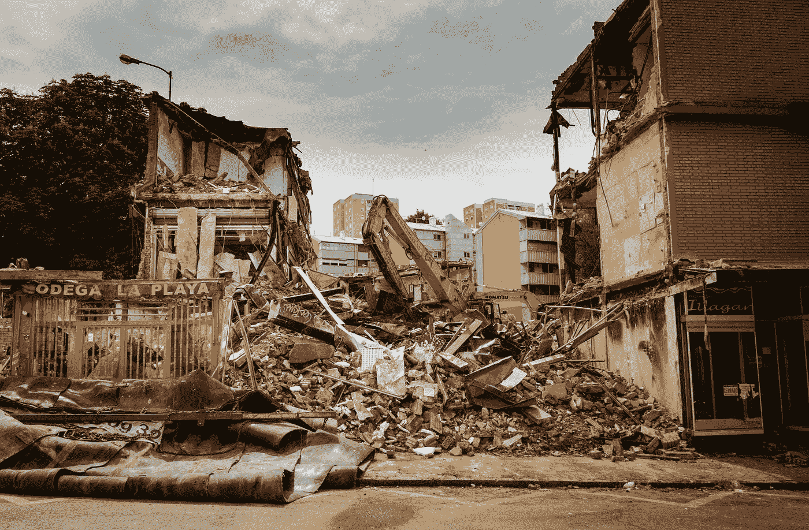
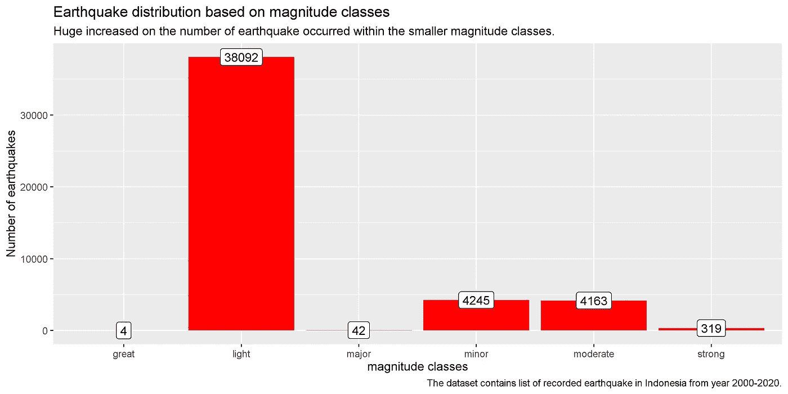
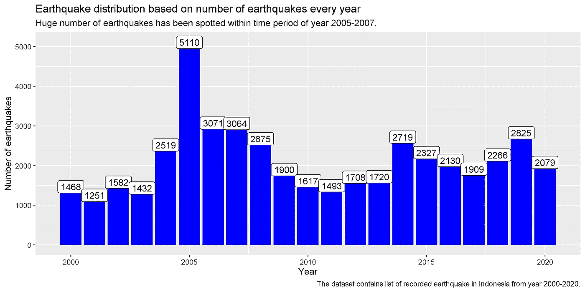
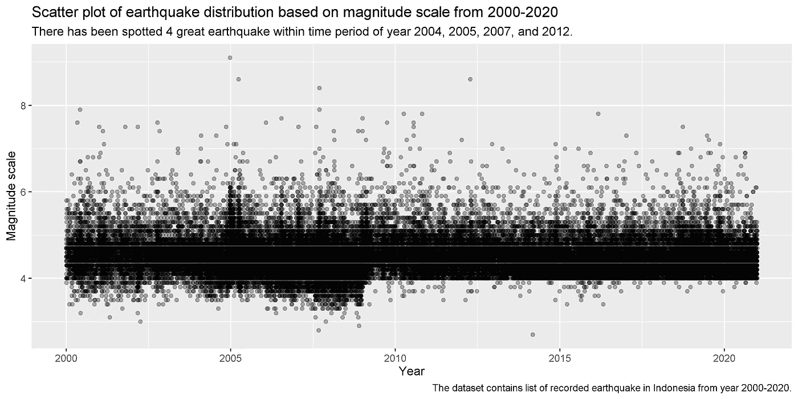
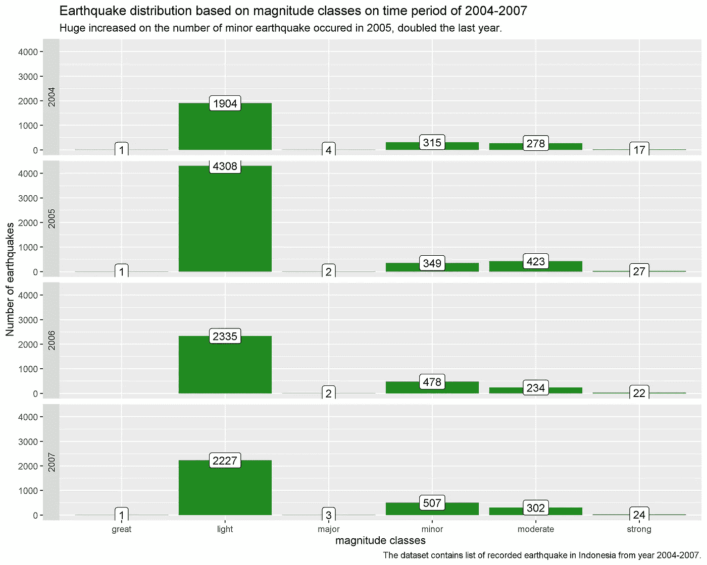
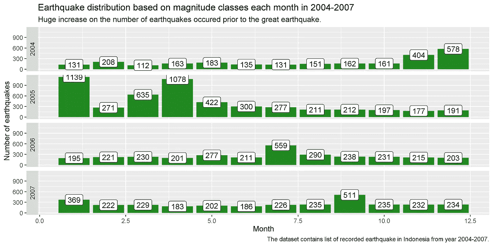
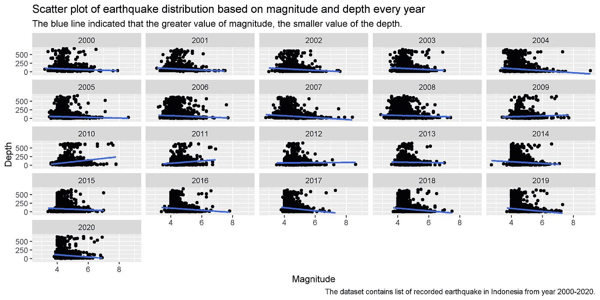

# 过去 20 年印度尼西亚地震发生的 EDA 和可视化

> 原文：<https://towardsdatascience.com/eda-and-visualization-of-earthquake-occurrence-in-indonesia-over-the-last-20-years-using-r-4c76e94e94c2?source=collection_archive---------17----------------------->

## 使用印度尼西亚地区过去 20 年的地震活动数据，了解每年发生地震的频率以及最大的地震。



何塞·安东尼奥·加列戈·巴斯克斯在 [Unsplash](https://unsplash.com?utm_source=medium&utm_medium=referral) 上拍摄的照片

**简介**

印度尼西亚是一个自然灾害频发的国家，如火山爆发、森林火灾、洪水，尤其是地震。每天，我都会收到来自我手机的气象、气候和地球物理机构应用程序的地震通知。不止一个，有时一天会出现两到三个通知，通知我印度尼西亚的一个地区发生了地震。这启发了我去创建一个 EDA(探索性数据分析),来分析在过去的 20 年里印度尼西亚地区发生了多少次地震。

地震被认为是最具破坏性的自然灾害之一，能够在没有任何警告的情况下在瞬间摧毁附近的城镇。构造地震是由地壳运动引起的自然现象之一。构造地震是最常见的地震类型[1]。地震能量可以作为地震震级来记录和测量。震级可以用地震仪记录，输出的地震能量用里氏震级表示[2]。

印度尼西亚群岛位于太平洋、欧亚和印度-澳大利亚板块碰撞的构造带上。因为印尼处于复杂构造带的中心，几乎每天都会发生三次以上的地震[3]。根据美国地质调查局(USGS)网站的数据，90 %的地震，包括最大的地震，都发生在火环地区[4]。令人惊讶的是，印尼位于火环和复杂构造带之上。

EDA 和数据可视化可以用来可视化地震发生的次数。在本文中，我将使用 R 编程语言来执行 EDA 和可视化数据，以获得特定的信息。数据集是从美国地质调查局网站收集的，该网站收集了世界各地发生的地震数据。我们将使用 2000 年到 2020 年的地震数据。

**EDA 和可视化**

在开始编码部分之前，我们必须导入一个我们稍后将使用的特定库。

```
#Importing specific library
library(dplyr)
library(tidyr)
library(lubridate)
library(ggplot2)
library(plotly)#Load the dataset
df_eq1 <- read.csv(“~/Rstudio/Projects/EDA Earthquake/Dataset/Raw/EQ 2000–2004.csv”)
df_eq2 <- read.csv(“~/Rstudio/Projects/EDA Earthquake/Dataset/Raw/EQ 2005–2010.csv”)
df_eq3 <- read.csv(“~/Rstudio/Projects/EDA Earthquake/Dataset/Raw/EQ 2011–2015.csv”)
df_eq4 <- read.csv(“~/Rstudio/Projects/EDA Earthquake/Dataset/Raw/EQ 2016–2020.csv”)#Combine the dataset
df_eq <- rbind(df_eq4,df_eq3,df_eq2,df_eq1)
df_eq
```

数据集中的大部分数据来自东盟国家记录的地震。我们必须指定印度尼西亚领土的坐标，以便数据只能填充发生在印度尼西亚地区的地震。

```
#Specified earthquake’s coordinate happened in Indonesia territory
eq_INA = df_eq %>% 
filter(longitude>=93 & longitude<=141.25,latitude>=-15 & latitude<=9)
eq_INA
```

在我们指定数据之后，我们必须根据震级对地震数据进行分类。

根据里氏震级，地震分为八类[6]。

1.  震级小于 2:微地震
2.  2 至 3.9 级:轻微地震
3.  4 至 4.9 级:轻微地震
4.  5 至 5.9 级:中等地震
5.  6 至 6.9 级:强烈地震
6.  7 至 7.9 级:大地震
7.  8 至 9.9 级:大地震
8.  震级超过 10 级:史诗级地震

这一分析只包括震级大于里氏 2 级的地震。

```
#Classifying earthquake based on magnitude richter scaleeq_INA = eq_INA %>% 
mutate(mag_class = factor(ifelse(mag>=2 & mag<=4,”minor”,ifelse(mag>=4 & mag<=5,”light”,ifelse(mag>=5 & mag<=6,”moderate”,ifelse(mag>=6 & mag<=7,”strong”,ifelse(mag>=7 & mag<=8,”major”,”great”)))))))
```

现在我们有了合适的数据框架，我们开始根据震级和年份来计算地震的数量。

```
eq_INA %>% 
 group_by(mag_class) %>% 
 summarise(number_of_earthquakes = n()) %>%
 ggplot(aes(x = mag_class, y = number_of_earthquakes)) +
 geom_bar(stat = ‘identity’, fill = “red”) + geom_label(aes(label = number_of_earthquakes)) + labs(title = ‘Earthquake distribution based on magnitude classes’,
 subtitle = ‘Huge increased on the number of earthquake occurred within the smaller magnitude classes.’,
 caption = “The dataset contains list of recorded earthquake in Indonesia from year 2000–2020.”,
 x = ‘magnitude classes’,
 y = ‘Number of earthquakes’)
```



**图一。基于震级等级的地震分布。**

根据图 1 的条形图。从 2000 年到 2020 年，印度尼西亚境内发生了超过 4245 次小地震、38092 次小地震和 4163 次中等地震。最关注的是，强震 319 次，大震 42 次，大震 4 次。几乎可以肯定的是，强地震以上的震级将对附近的城镇造成重大破坏。为了获得更多关于地震发生时间的具体数据，我们需要收集更多关于每年发生的地震的信息。

```
eq_INA %>% 
 group_by(year) %>% 
 summarise(number_of_earthquakes = n()) %>%
 ggplot(aes(x = year, y = number_of_earthquakes)) +
 geom_bar(stat = ‘identity’, fill =”blue”) + geom_label(aes(label = number_of_earthquakes)) + 
 labs(title = ‘Earthquake distribution based on number of earthquakes every year’,
 subtitle = ‘Huge number of earthquakes has been spotted within time period of year 2005–2007.’,
 caption = “The dataset contains list of recorded earthquake in Indonesia from year 2000–2020.”,
 x = ‘Year’,
 y = ‘Number of earthquakes’)
```



**图 2 按年份顺序的地震分布。**

图 2 的条形图。以上清楚地表明，印度尼西亚每年发生 1000 多次地震。2005 年地震次数也显著增加，仅这一年就发生了 5110 多次地震。2005 年的地震是 2004 年记录的地震数量的两倍。

这很有意思。

为什么会出现这种现象的一个假设是，在大地震的余震之前，小地震的数量增加了。我们将使用散点图根据震级和时间段收集更多关于地震分布的信息。

```
eq_INA %>%
 ggplot(aes(x = date, y = mag)) +
 geom_point() + labs(title = ‘Scatter plot of earthquake distribution based on magnitude scale from 2000–2020’,
 subtitle = ‘There has been spotted 4 great earthquake within time period of year 2004, 2005, 2007, and 2012.’,
 caption = “The dataset contains list of recorded earthquake in Indonesia from year 2000–2020.”,
 x = ‘Year’,
 y = ‘Magnitude scale’)
```



**图 3 2000-2020 年基于震级的地震分布散点图。**

图 3 中的散点图。上面显示了 2004 年至 2007 年间发生的三次大地震。我们将主要关注这一现象。

据媒体消息，2004 年 12 月发生了里氏 9.1 级的苏门答腊-安达曼地震。这次地震发生在一个构造俯冲带上，作为巽他板块的一部分，印度板块俯冲到缅甸微板块之下[7]。

继 2004 年 12 月的大地震之后，下一次大地震发生在 4 个月后的 2005 年 3 月。这次地震发生在 2004 年 12 月 8.6 级大地震之前。

第三次大地震发生在 2007 年 9 月，同一天发生了一次 8.4 级的大地震和一次 7.9 级的大地震[9]。

我们认为这次大地震是地震数量大幅增加的主要原因。此外，我们将把调查的重点放在 2004 年至 2007 年，这几年主要发生了大地震。

```
eq_INA %>% 
 filter(year==2004 | year==2005 | year==2006 | year==2007) %>%
 group_by(mag_class, year) %>% 
 summarise(number_of_earthquakes = n()) %>%
 ggplot(aes(x = mag_class, y = number_of_earthquakes)) +
 geom_bar(stat = ‘identity’, fill =”forest green”) + geom_label(aes(label = number_of_earthquakes)) + facet_wrap(~year, ncol=1, strip.position = “left”) + 
 labs(title = ‘Earthquake distribution based on magnitude class in time period of 2004–2007’,
 subtitle = ‘Huge increased on the number of minor earthquake occured in 2005, doubled the last year.’,
 caption = “The dataset contains list of recorded earthquake in Indonesia from year 2004–2007.”,
 x = ‘magnitude classes’,
 y = ‘Number of earthquakes’)
```



**图 4。2004-2007 年期间基于震级等级的地震分布。**

从图 4 的条形图中可以看出。上图中，2004 年 12 月地震前的大地震和 2005 年 3 月的第二次大地震导致 2005 年轻震显著增加。为了获得更多关于地震月份分布的信息，我们需要查看从 2004 年到 2007 年每个月发生的地震数量。

```
eq_INA %>% 
 filter(year==2004 | year==2005 | year==2006 | year==2007) %>%
 group_by(month, year) %>% 
 summarise(number_of_earthquakes = n()) %>%
 ggplot(aes(x = month, y = number_of_earthquakes)) +
 geom_bar(stat = ‘identity’, fill =”forest green”) + geom_label(aes(label = number_of_earthquakes)) + facet_wrap(~year, ncol=1, strip.position = “left”) + 
 labs(title = ‘Earthquake distribution based on magnitude class each month in 2004–2007’,
 subtitle = ‘Huge increase on the number of earthquake occured prior to the great earthquake.’,
 caption = “The dataset contains list of recorded earthquake in Indonesia from year 2004–2007.”,
 x = ‘Month’,
 y = ‘Number of earthquakes’)
```



**图五。2004-2007 年基于震级等级的每月地震分布。**

通过查看图 5 中的柱状图，我们可以了解到从 2004 年到 2007 年每个月地震数量的增加和减少。2004 年 12 月至 2005 年 4 月期间，发生了大量地震。这些地震发生在 2004 年 9.1 级大地震之前，那次地震导致了接下来一个月的小地震。

在 2005 年 3 月第二次大地震之前，地震次数也有所增加。我们先前关于大地震导致小地震数量增加的假设似乎是正确的。根据 2004 年 12 月至 2005 年 4 月的地震数据，一个月前发生的大地震导致了接下来一个月地震次数的显著增加。

同样的现象也发生在 2007 年 9 月第三次大地震的时候。然而，在这段时间内，地震的数量并没有像上次大地震那样迅速增加。

相对于之前每年每个月的地震次数，我们还会探究地震的震级和深度之间的数据。下面的散点图将显示发生地震的震级和深度之间的关系。

```
#Relationship between mag and depth
 eq_INA %>%
 ggplot(aes(x = mag, y = depth)) +
 geom_point() +
 geom_smooth(method = ‘lm’, se = FALSE) +
 facet_wrap(~year) + labs(title = ‘Scatter plot of earthquake distribution based on magnitude and depth every year’,
 subtitle = ‘The blue line indicated that the greater value of magnitude, the smaller value of the depth.’,
 caption = “The dataset contains list of recorded earthquake in Indonesia from year 2000–2020.”,
 x = ‘Magnitude’,
 y = ‘Depth’)
```



**图六。基于每年震级和深度的地震分布散点图。**

mag 和深度之间的关系是相反的，如上面图 6 的大部分散点图所示。意思是震级越大，深度越小。这次大地震很可能发生在浅层。这是正确的，因为之前的大地震发生在地球表面以下不到 50 公里的深度。

**结论**

1.从 2000 年到 2020 年，印度尼西亚境内发生了 4245 次小地震、38092 次小地震和 4163 次中等地震。尽管如此，最显著的地震还是大地震，大地震发生了 52 次，大地震发生了 4 次。

2.每年，印度尼西亚都会发生 1000 多次不同震级的地震，从小地震到大地震不等。

3.2005 年发生的大量地震是由前一年 2004 年 12 月和 2005 年 3 月大地震的余震造成的。由于两次大地震，2005 年的地震数量比前一年增加了一倍，尤其是较小的地震。

4.里氏震级较大的地震发生在较浅的深度。

**来源**

你可以从[这里](https://github.com/nugrahazikry/EDA-Indonesia-Earthquake)获得源代码和地震数据。

**参考**

[1]阿达古诺多等人。，[1966-2015](https://www.sciencedirect.com/science/article/pii/S2352340918300520)(2017)年亚非地区 0 < M < 8 地震数据集评估，数据简介

[2] S. A. Greenhalgh 和 R. T. Parham，[南澳大利亚里氏震级](https://www.tandfonline.com/doi/abs/10.1080/08120098608729388) (2007 年)，《澳大利亚地球科学杂志》

[3] K .普里巴迪等人。，[《从过去的地震灾害中吸取教训:加强印度尼西亚基础设施抗灾能力的知识管理系统需求》](https://www.sciencedirect.com/science/article/abs/pii/S221242092100385X) (2021)，《国际减少灾害风险杂志》

[4] R. Senduk，Indwiarti 和 F. Nhita，[使用 K-Medoids 算法对印度尼西亚地震易发区进行聚类](https://socj.telkomuniversity.ac.id/ojs/index.php/indojc/article/view/359) (2019)，印度尼西亚计算杂志

[https://earthquake.usgs.gov/earthquakes/search/](https://earthquake.usgs.gov/earthquakes/search/)

[6][https://www . GNS . CRI . NZ/Home/Learning/Science-Topics/地震/监测-地震/其他-地震-问题/里氏震级是多少](https://www.gns.cri.nz/Home/Learning/Science-Topics/Earthquakes/Monitoring-Earthquakes/Other-earthquake-questions/What-is-the-Richter-Magnitude-Scale)

[7][https://www . USGS . gov/centers/PC MSC/science/tsunami-generation-2004-m91-苏门答腊-安达曼-地震？Qt-科学中心对象= 0 # Qt-科学中心对象](https://www.usgs.gov/centers/pcmsc/science/tsunami-generation-2004-m91-sumatra-andaman-earthquake?qt-science_center_objects=0#qt-science_center_objects)

[8][https://ReliefWeb . int/report/Indonesia/Indonesia-3 月 28 日-地震-情况-报告-9](https://reliefweb.int/report/indonesia/indonesia-28-march-earthquake-situation-report-9)

[9][https://ReliefWeb . int/map/Indonesia/m85-和-79-南苏门答腊-地震-2007 年 9 月 12 日和-m70-13-200 年 9 月](https://reliefweb.int/map/indonesia/m85-and-79-southern-sumatra-earthquakes-12-september-2007-and-m70-13-september-2007)