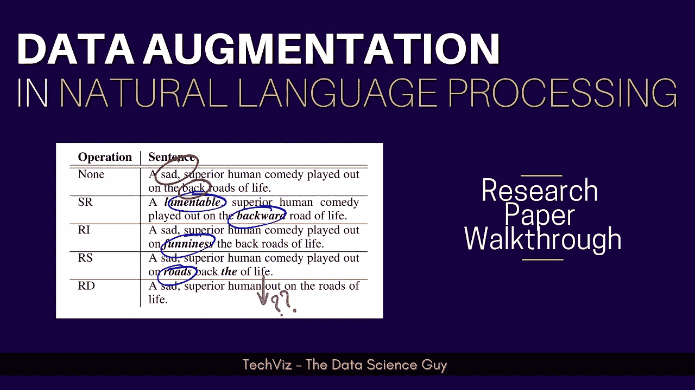
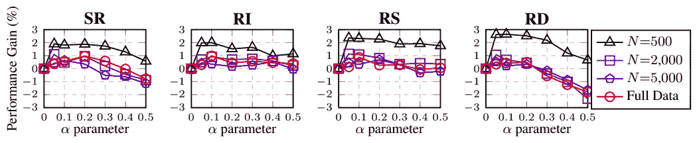
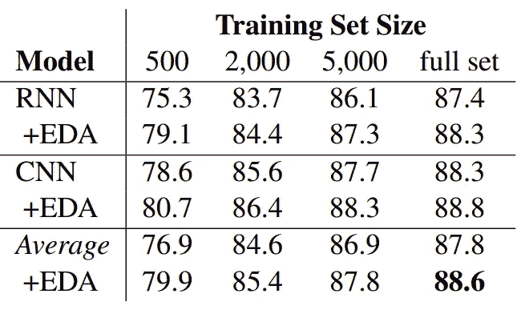
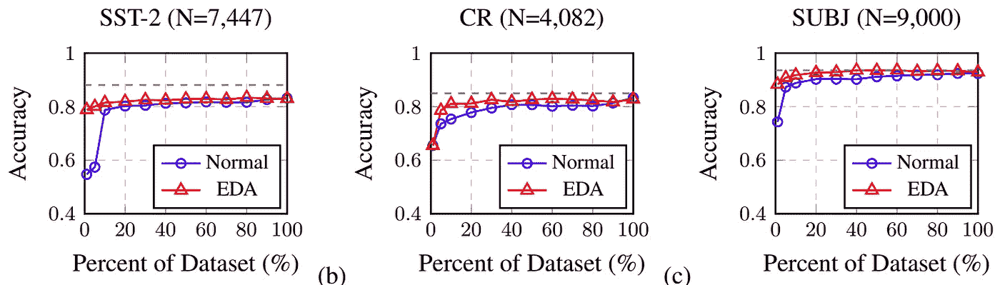
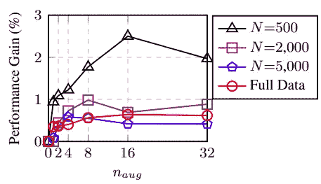
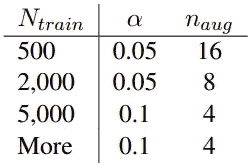

# EDA:提高文本分类性能的简单数据扩充技术

> 原文：<https://towardsdatascience.com/eda-easy-data-augmentation-techniques-for-boosting-performance-on-text-classification-tasks-3e61a56d1332?source=collection_archive---------33----------------------->

## 研究论文解释

作者图片

**机器学习中的数据扩充**是一种流行的技术，即使在数据可用性较低的情况下，也能使**稳健并推广 ML 模型**。通过添加对现有数据稍加修改的副本或从现有数据中新创建的合成数据，它有助于增加原始数据的数量。当在低质量和大小的数据上训练机器学习模型时，添加各种数据大大有助于**减少过度拟合**。

人们已经看到它在计算机视觉应用中工作得非常好，如图像分类、对象检测等——在这些应用中，我们现在已经有了一套变换函数，如旋转、剪切、裁剪等，这些函数很容易获得、研究过并已知可以工作(当然，很少需要注意)。来自 Protago Labs Research、Dartmouth College 和 Georgetown University 的这篇论文介绍了自然语言处理中的**数据扩充转换功能，特别关注文本分类任务**。

有了这个背景和介绍，让我们直接开始研究提出的方法。

## 提议的转换功能

1.  *同义词替换(SR)* —从句子中随机选择 n 个不是停用词的单词。用随机选择的同义词替换这些单词。
2.  *随机插入(RI)* —在句子中找到一个非停用词的随机词的随机同义词。将同义词插入句子中任意位置。这样做 n 次。
3.  *随机互换(RS)* —随机选择句子中的两个单词，互换它们的位置。这样做 n 次。
4.  *随机删除(RD)* —以概率 p 随机删除句子中的每个单词。

作者选择噪音感应比作为句子长度的函数。假设是短文档不太容易受到处理噪声的影响，并且转换可能会导致类的可变性。其中 as，长句可以吸收更多的噪音，同时保持原来的类标签。他们在一个句子中调整的字数定义为**n =αL；**其中，L 为单词级别的句子长度，α为参数，表示句子中需要改变的单词的百分比。他们摆弄α值{0.05，0.1，0.2，0.3，0.4，0.5}。下图显示了同样的情况—

不同规模数据集的α-变化。图片来自[来源](https://arxiv.org/pdf/1901.11196.pdf)

从图中可以清楚地看出，平均而言，随着要处理的单词百分比的增加，性能增益通常会下降一定的量，而与要增加的数据量无关。

## 实验和结果

他们选择了五个基准文本分类任务来评估所提出的系统—

*   *SST-2* : **斯坦福情感** Treebank v2 **(SST2)** 斯坦福**数据集**拥有 Moview 评论和相关情感。[参考文件](https://www.kaggle.com/atulanandjha/stanford-sentiment-treebank-v2-sst2)
*   *CR* :关于**客户评论**和相关标签的数据集。[参考文件](https://dl.acm.org/doi/10.1145/1014052.1014073)
*   *subject*:**主观性/客观性**带有相关情感的数据集。[参考论文](https://dl.acm.org/doi/10.3115/1218955.1218990)
*   *TREC* : **问题类型分类**定义了粗粒度和细粒度类别的数据集。[参考文献](https://trec.nist.gov/data/qa.html)
*   *PC* : **Pro-Con** 是来自网络上用户生成内容的**情感分析**目标数据集。[参考文件](https://dl.acm.org/doi/10.5555/1599081.1599112)

作者对随机采样的不同大小的训练数据集进行实验，使用 **{500、2，000、5，000，所有可用数据}样本**，因为他们假设他们的方法对较小的数据集更有帮助。

他们选择 [**RNNs**](https://en.wikipedia.org/wiki/Recurrent_neural_network) 和 [**CNNs**](https://en.wikipedia.org/wiki/Convolutional_neural_network) 作为他们选择有无 EDA 的分类模型。

使用和不使用 EDA 的模型在五个文本分类任务中的平均性能(%)—[图片来源](https://arxiv.org/pdf/1901.11196.pdf)

从上面的结果表中我们可以看出，与处理完整数据集(~0.8%)相比，小数据集(~3.0%)的增益相对较高。这是可能的，因为更少的数据意味着有限的模式和信息，这就是为什么增强在这种情况下会有更好的帮助，而不是当您使用大规模数据集进行训练时，其中已经有足够的模式和信息供模型学习。因此，在那个级别执行增强实际上不会提高性能数字。

选择用于增强的数据集的百分比及其对准确性的影响。图片来自[来源](https://arxiv.org/pdf/1901.11196.pdf)

我们上面讨论的类似模式也可以在单独的数据集上看到。参考上图。

## 放大多少？

下一个重要的问题是，每个句子要生成多少个句子(naug)。如下图所示，作者对不同的增大尺寸值进行了试验。

不同数据大小的 naug 变量。图片来自[来源](https://arxiv.org/pdf/1901.11196.pdf)

在较小的训练数据的情况下，更多的增加可能会导致过度拟合，从而大大提高性能。其中，对于较大的训练规模，具有较高的 naug 值似乎不像预期的那样工作，这仅仅是因为模型已经可以访问大量数据以进行适当的概括。经过大量实验后，他们推荐以下参数—

EDA 的推荐参数。图片来自[来源](https://arxiv.org/pdf/1901.11196.pdf)

我有一个同样的多语种字幕视频漫游，如果你喜欢看视频而不是文字(就像我:D 一样)，一定要看看

如果你仍然对某件事感到困惑，一定要看报纸。另外，向作者问好，感谢他们的贡献。

> ***论文标题:*** *EDA:提升文本分类任务性能的简易数据增强技术*
> 
> ***论文链接:***[【https://arxiv.org/abs/1901.11196】T21](https://arxiv.org/abs/1901.11196)
> 
> **代码链接** : [*http://github。com/jasonwei 20/EDA _ NLP*](http://github. com/jasonwei20/eda_nlp)
> 
> ***作者:*** [*魏*](https://arxiv.org/search/cs?searchtype=author&query=Wei%2C+J)*[*【邹凯】*](https://arxiv.org/search/cs?searchtype=author&query=Zou%2C+K)*

*希望这本书值得你花时间去读！与你的朋友分享给对这些内容感兴趣的人。*

**谢谢。**