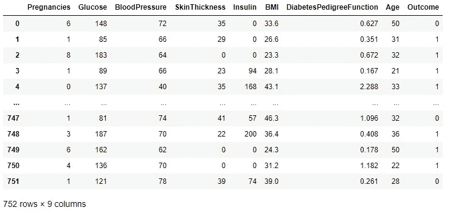
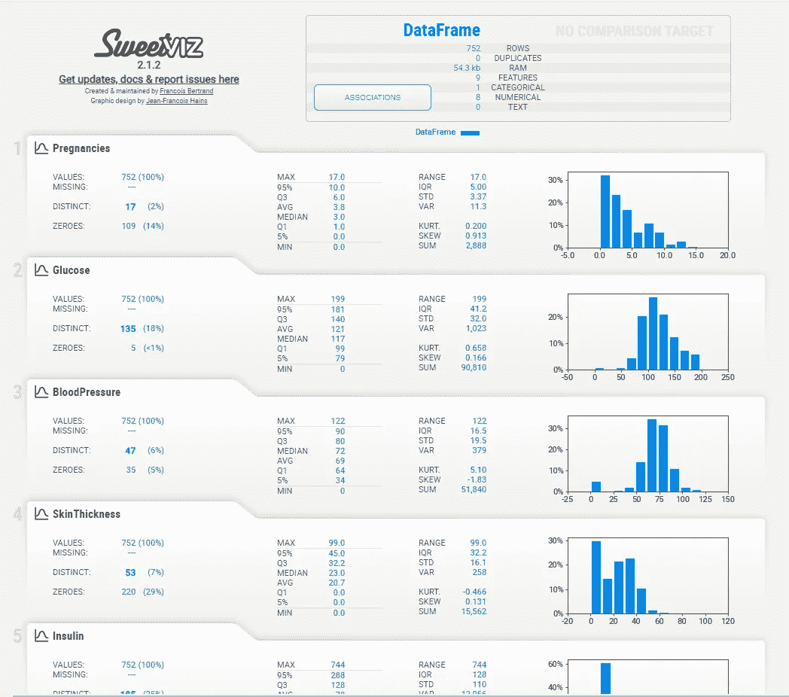

# 一行代码中的 EDA

> 原文：<https://towardsdatascience.com/eda-in-a-single-line-of-code-311fce26c057?source=collection_archive---------33----------------------->

## 使用 Sweetviz 轻松探索数据集

在开始或为机器学习模型准备数据集之前探索数据集非常重要，因为我们应该知道数据在说明什么，以及所有功能和目标列都有什么。通常，我们首先找出不同列之间的关系，创建不同类型的可视化，在数据中寻找模式，等等。

根据一项研究，探索性数据分析消耗大约 40%的项目总时间，如果我说它可以减少到 10%呢？这意味着现在您可以更加专注于构建一个强大且高度准确的机器/深度学习模型，而不必在 EDA 中浪费太多时间。

Sweetviz 是一个开源 python 库，只需一行代码即可创建 EDA 报告。是的，你没看错，只用一行代码，你就可以分析数据，可视化数据集中不同列的模式和关联。它是免费提供的，非常容易使用。在本文中，我将向您展示如何使用 Sweetviz 利用数据创造奇迹。

让我们开始吧…

# 安装所需的库

像任何其他 python 库一样，我们将使用 pip 安装 sweetviz。下面给出的命令将安装它。

```
pip install sweetviz
```

# 导入所需的库

我们将使用 pandas 加载数据集，使用 sweetviz 创建 EDA 报告。下面的命令将导入这些库。

```
import pandas as  pd
import sweetviz as sv
```

# 加载数据集

对于本文，我使用著名的糖尿病数据集，您可以使用 Kaggle 下载该数据集。

```
df = pd.read_csv('Diabetes.csv')
df
```



数据集(来源:[作者](https://www.linkedin.com/in/himanshusharmads/)

# 创建 EDA 报告

这是最后一步，我们将用一行代码创建 EDA 报告。该报告将包含关联、特征分析、不同列中的数据分布等。让魔法开始吧…

```
#Creating the dataset
advert_report = sv.analyze(df)#display the report
advert_report.show_html('Diabetes_report.html')
```



报告(来源:[作者](https://www.linkedin.com/in/himanshusharmads/)

在这里，您可以看到报告的主页，其中提供了数据集的基本信息，包括要素的数量及其数据类型。在下面的视频中，您可以直观地看到该报告中的不同部分，并在您的分析中使用它们。

[来源:作者](https://www.linkedin.com/in/himanshusharmads/)

Sweetviz 最棒的地方在于它创建了 HTML 格式的报告，您可以与您的团队分享这些报告。它有助于您的演示，并具有理解数据集基础的所有必要信息。

继续尝试不同的数据集，并让我知道您在回复部分的评论。

这篇文章是与 Piyush Ingale 合作的

# 在你走之前

***感谢*** *的阅读！如果你想与我取得联系，请随时通过 hmix13@gmail.com 联系我或我的* [***LinkedIn 个人资料***](http://www.linkedin.com/in/himanshusharmads) *。可以查看我的*[***Github***](https://github.com/hmix13)**简介针对不同的数据科学项目和包教程。还有，随意探索* [***我的简介***](https://medium.com/@hmix13) *，阅读我写过的与数据科学相关的不同文章。**