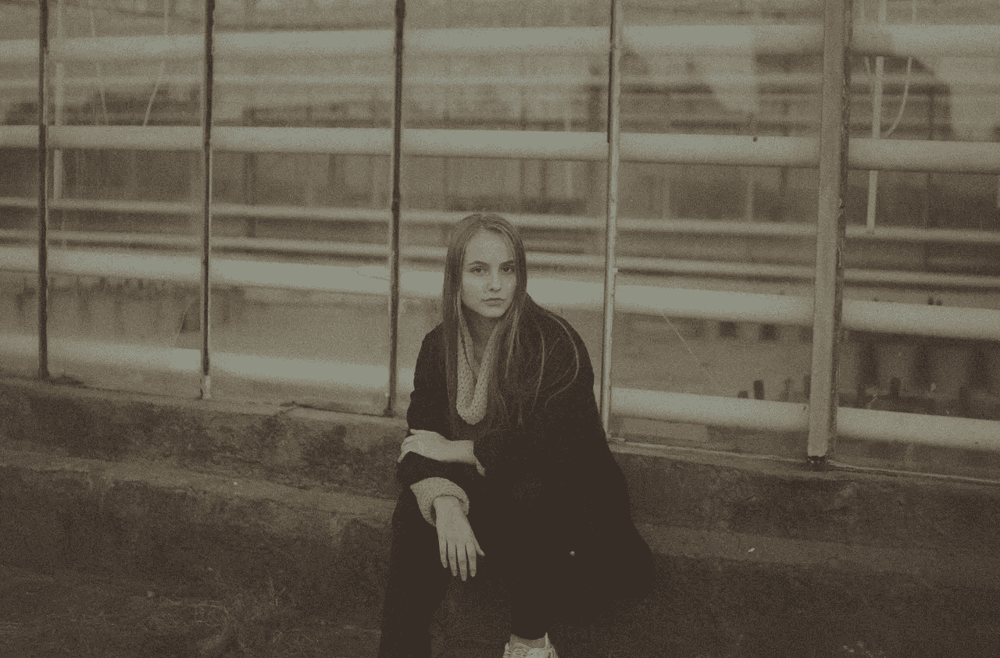
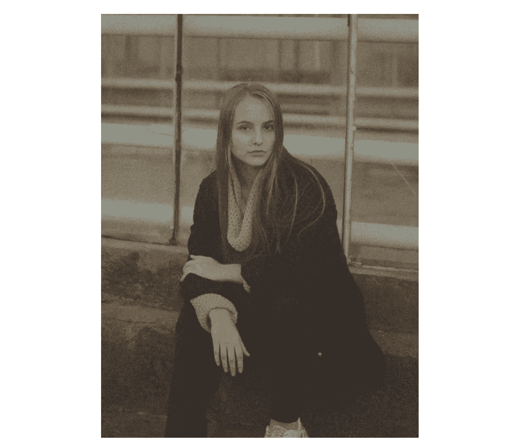
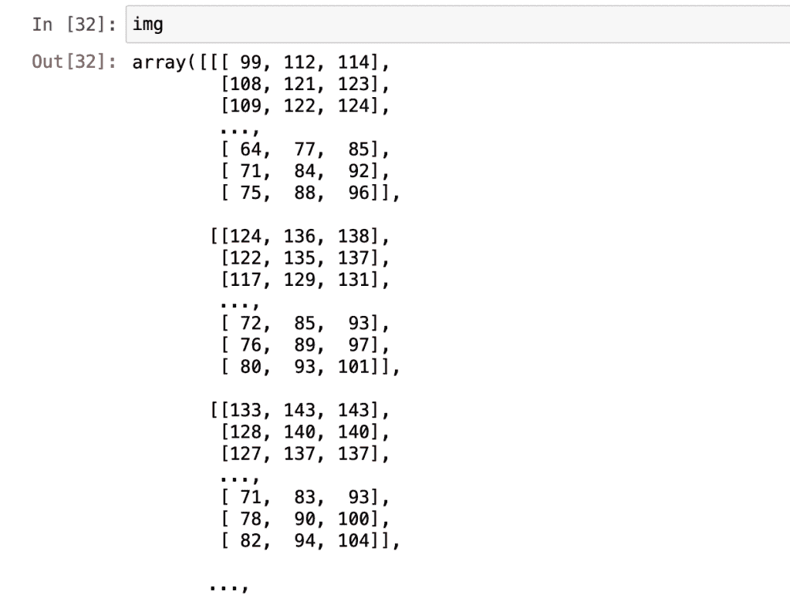
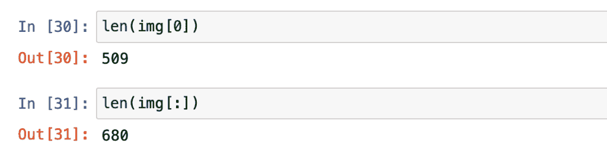
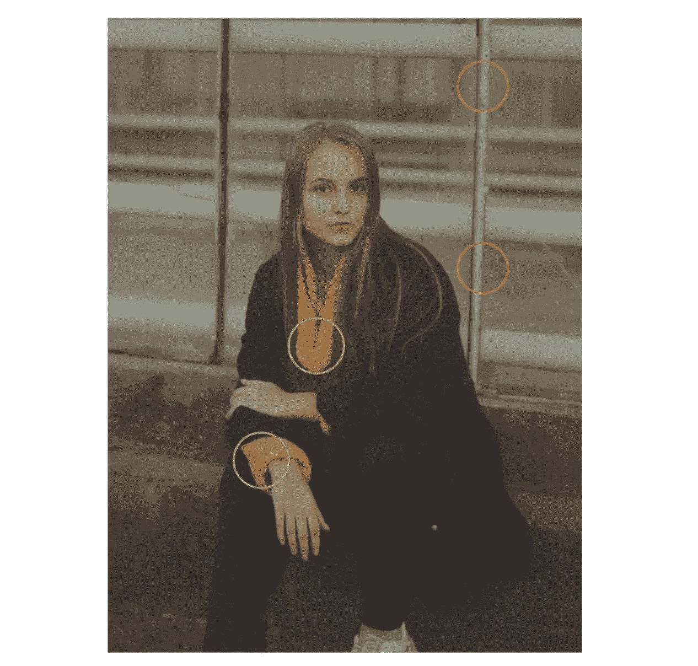
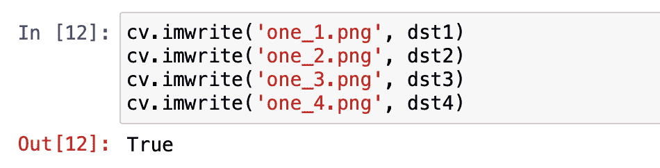
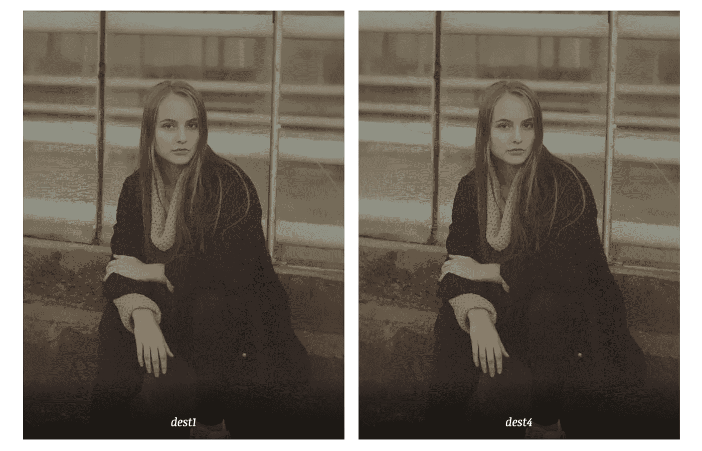
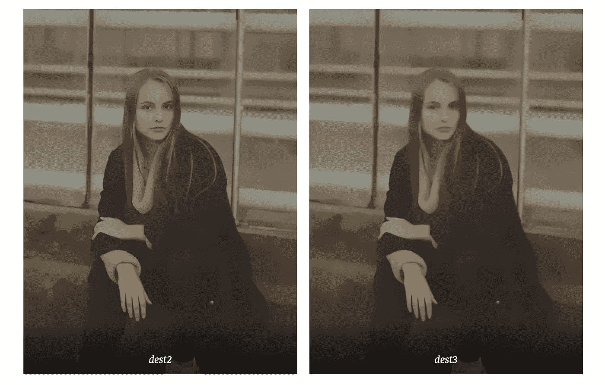
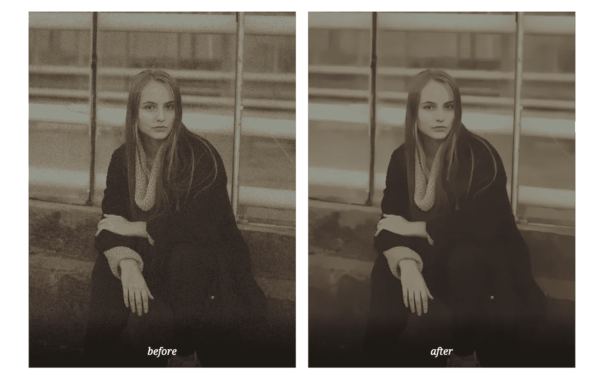

# 用机器学习——计算摄影——编辑你的老照片

> 原文：<https://towardsdatascience.com/edit-your-old-photos-with-machine-learning-computational-photography-7ef27f40cfdf?source=collection_archive---------34----------------------->

## 使用最智能的 OpenCV 图像降噪算法之一为您的照片降噪



照片由 [Pexels](https://www.pexels.com/photo/emotionless-woman-sitting-on-street-stone-stairs-5293996/?utm_content=attributionCopyText&utm_medium=referral&utm_source=pexels) 的 [MBARDO](https://www.pexels.com/@mbardo?utm_content=attributionCopyText&utm_medium=referral&utm_source=pexels) 拍摄

本文将向您展示如何使用训练有素的机器学习模型来降低照片中的噪声。照片去噪也称为图像降噪。在这个项目中，我们将使用一个智能降噪算法对一个嘈杂的图像。降噪可以用来让我们的老照片看起来更好。

在嘈杂的图像中，我们可以看到像素和不想要的细节。减少噪声会使图像更加平滑。我们都知道几年前手机拍不出好照片。许多手机品牌开始在其软件中使用这种降噪技术，为用户提供更好的效果。这项技术被称为计算摄影。你可能在苹果去年 10 月的活动中听说过这个术语。我们的手机可以做到这一点；所以为什么不建造我们自己的呢？

在这个项目中，我们将看到如何将编程和机器学习用于摄影和艺术。作为一名艺术爱好者，我迫不及待地与您分享这个项目。我们开始工作吧！

## **目录表:**

*   ***简介***
*   ***步骤 1 —库***
*   ***步骤 2 —读取图像***
*   ***第三步——非局部均值去噪算法***
*   ***最后一步——降噪功能在起作用***

# 介绍

我们将在这个项目中使用三个包。软件包如下:OpenCV、NumPy 和 Matplotlib。OpenCV 是一个非常著名的计算机视觉软件包。我们需要 Numpy 作为 OpenCV 的先决条件。当读取图像时，我们将这些像素转换成数组；这是在幕后发生的。NumPy 在处理多维数组时非常有用。

以下是 OpenCV 包的简短定义:

> *OpenCV(开源计算机视觉库)是一个开源的计算机视觉和机器学习软件库。OpenCV 旨在为计算机视觉应用提供一个公共基础设施，并加速机器感知在商业产品中的应用。*
> 
> *参考:*https://opencv.org

我们将在这个项目中使用的每个包的官方文档页面。当您想解决程序中的一个错误或向程序中添加更多功能时，它可能是一个有用的参考:

*   [OpenCV](https://docs.opencv.org/master/)
*   [Numpy](https://numpy.org/doc/)

# 步骤 1 —库

正如在介绍中提到的，我们将在这个项目中需要三个包。为了能够在我们的程序中使用它们，首先我们必须安装它们。我们将使用 PIP，它是一个 python 包管理器工具。它使库安装更快更有效。我们可以在一行中安装多个软件包，让我们这样做:

```
pip install numpy opencv
```

让我们继续创建一个新的木星笔记本。请随意使用您喜欢的代码编写环境。为了这个项目，我将使用 Jupyter 笔记本。这是我在笔记本中的第一个块，我们在这里导入刚刚安装的库。

```
import numpy as np 
import cv2 as cv
```

# 步骤 2 —读取图像

在这一步中，我们将找到一个图像来测试我们的程序。它可以是有噪声的图像，也可以不是。无论你想和谁一起去。用普通照片测试的时候还是会看出区别的。

我们的程序不够智能，无法检测图像是否有噪声，但可以编写一个程序来解决这个问题。选择图像后，将其复制到您正在使用的文件夹中。这样会让阅读过程更容易。

下面是我选择的图片(改名为“profile_image.jpg”):



照片由[姆巴多](https://www.pexels.com/@mbardo?utm_content=attributionCopyText&utm_medium=referral&utm_source=pexels)从[派克斯](https://www.pexels.com/photo/emotionless-woman-sitting-on-street-stone-stairs-5293996/?utm_content=attributionCopyText&utm_medium=referral&utm_source=pexels)拍摄

这是读取图像的一行。我们使用 OpenCV 的 *imread* 方法:

```
img = cv.imread('profile_image.jpg')
```

每个像素都有价值。OpenCV 的 *imread* 方法将读取图像并将其转换为二维数组。让我向你展示一幅图像阅读后的样子:



作者图片

**额外提示**:我们可以通过计算数组大小来找到图像的大小。下面，我们可以看到我导入的图像是 509 到 680 像素。以下是如何通过查找数组大小来计算图像大小:



# 步骤 3 —非局部均值去噪算法

接下来是项目的信息部分。首先，我将分享我们将使用哪种降噪算法。然后，我会分享它有多少个参数，每个参数代表什么。

## **关于算法**



照片由 [Pexels](https://www.pexels.com/photo/emotionless-woman-sitting-on-street-stone-stairs-5293996/?utm_content=attributionCopyText&utm_medium=referral&utm_source=pexels) 的 [MBARDO](https://www.pexels.com/@mbardo?utm_content=attributionCopyText&utm_medium=referral&utm_source=pexels) 拍摄(作者编辑)

图像中黄色圆圈区域看起来相似。橙色圆圈区域看起来很相似。该算法选取一个像素，在其周围取一个小窗口，然后在图像中搜索相似的窗口，对所有窗口进行平均，并用计算的结果替换该像素。这就是为什么它被称为非本地的，因为它不只是检查它的周围。它寻找整个图像。

该算法的函数版本如下:

*   fastNlMeansDenoising(用于灰度图像)。
*   fastNlMeansDenoisingColored(用于彩色图像)。

## **参数**

fastNlMeansDenoisingColored(*src，dst，h，hcolor，templateWindowSize，searchWindowSize* )

*   ***src*** :我们要做降噪处理的输入图像。
*   ***dst*** :我们要导出结果的目的地。
*   ***h*** :亮度分量。(较大的 h 值会移除更多噪点，但也会移除图像细节)。
*   ***hcolor*** :颜色分量。(10 是彩色图像文档的推荐值)。
*   ***template windowsize***:函数将要平滑的区域的像素大小。它应该是一个奇数。(7 是文档中的推荐值，适用于大多数情况)。
*   ***search window size***:函数将查找并引用的区域的像素大小。线性影响性能:更大的 searchWindowsSize 意味着更长的去噪时间。此外，它应该是一个奇数整数。(21 是文档中的推荐值，适用于大多数情况)。

现在，让我们看看我们刚刚在实际行动中学到了什么。

# 最后一步——降噪功能发挥作用

完美！这个项目有趣的部分来了。我们将看到降噪后的图像是什么样子。我们将使用三个不同的值来运行函数，这样就可以看到每个值是如何影响最终结果的。

## **运行功能**

```
dst1 = cv.fastNlMeansDenoisingColored(img,None,3,3,7,21) dst2 = cv.fastNlMeansDenoisingColored(img,None,5,5,7,21) dst3 = cv.fastNlMeansDenoisingColored(img,None,10,10,7,21) dst4 = cv.fastNlMeansDenoisingColored(img,None,3,3,5,13)
```

## **使用 *imwrite* 功能**将结果保存为图像

```
cv.imwrite('one_1.png', dst1) 
cv.imwrite('one_2.png', dst2) 
cv.imwrite('one_3.png', dst3) 
cv.imwrite('one_4.png', dst4)
```



## **结果**

dest1 与 dest4 比较(了解不同的窗口像素大小):



dest1 和 dest4 比较

dest2 与 dest3 比较(了解不同的亮度和颜色分量值):



dest2 和 dest3 比较

# 结论

我个人最喜欢的是 dest2。现在，让我们做一个照片的前后对比，看看有什么不同。你决定我们的降噪模型的表现。



之前和之后

恭喜你。我们已经建立了一个程序，使用非局部均值去噪算法来降低图像的噪声。这是最大的图像降噪方法之一。还有其他去噪算法，但都不如非局部均值去噪算法强大。其中一些也被称为模糊技术。

正如你从结果中看到的，当我们增加更多的平滑度时，我们可以使用这种技术使我们的照片看起来像油画。所以，这完全取决于你的想象力。

从事像这样的动手编程项目是提高编码技能的最好方式。我希望你今天喜欢并学到了一些新东西。如果您有任何问题或意见，请随时[联系我](https://sonsuzdesign.blog)。

> 我们来连线。查看我的[博客](https://medium.com/@lifexplorer)和 [youtube](https://www.youtube.com/behicguven) 来获得灵感。谢谢你，

## 有趣的 OpenCV 项目:

[](/building-a-face-recognizer-in-python-7fd6630c6340) [## 用 Python 构建人脸识别器

### 使用 OpenCv 库进行实时人脸识别的分步指南

towardsdatascience.com](/building-a-face-recognizer-in-python-7fd6630c6340) [](/building-a-color-recognizer-in-python-4783dfc72456) [## 用 Python 构建颜色识别器

### 使用 OpenCV 的简单实用的机器学习应用程序

towardsdatascience.com](/building-a-color-recognizer-in-python-4783dfc72456)