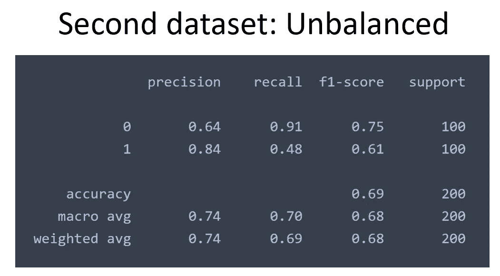

# 不平衡和混合数据集对 ML 模型的影响

> 原文：<https://towardsdatascience.com/effect-of-unbalanced-and-mixed-dataset-on-ml-model-3f0b9190baa7?source=collection_archive---------23----------------------->

## 基于精确度、召回率和 F1 分数评估 ML 模型

图片来自 [unsplash](https://unsplash.com/photos/SgelGkaMdM0)

> **简介**

机器学习需要创建强大的训练数据集，因为训练是后续模型评估的种子。如果训练数据被破坏，模型将表现不佳，因为其准确性将下降。图像分类是机器学习的一个蓬勃发展的领域，其中平衡和正确的训练数据集极其重要。人工智能经理和数据科学家需要确保在管道中加载平衡和干净的数据。

> **分类指标**

评估一个模型有几个指标。对于图像分类，我们可以采用测试目录来应用训练好的模型的预测行为。Scikit-Learn 提供了一些简单的包来评估模型在准确性、精确度、召回率和 F1 分数方面的性能。分类报告是所有这些指标的组合。我将简要介绍一下这些指标。

> **精度**

当我们试图猜测两件事之间的某件事时，我们有 50%的可能出错。这就是我们正确识别某物的精确度。机器也是如此。机器被训练来创建模型，并且基于训练数据，它可能正确地识别所有的测试数据，或者一些可能出错。比方说，我们希望模型能够识别猫和狗之间的图像。我们已经用猫和狗的图像训练了模型。该模型可以正确地识别所有图像，或者一些图像可能被错误地标记。相关术语如下

*   真阳性(TP):被识别为猫的猫
*   假阳性(FP):被识别为猫的狗
*   真阴性(TN):被识别为狗的狗
*   假阴性(FN):被识别为狗的猫

很明显，当一个模型不能正确地标记某些东西时，它会增加假阳性或假阴性的数量。我们希望模型具有最高数量的真阳性和真阴性。根据这些结果来更好地评估一个模型，精确度和召回率是很方便的。简而言之，*精度*衡量一个模型正确检测元素的精度。当一个猫狗检测模型的精度较高时，表明它能够正确识别出大多数的猫是猫，极少数的狗是猫。该模型也可能错误地将一些猫识别为狗图像，但是该信息不在*精度*值中。为此我们需要*召回*。

> 精度= TP/(TP+FP)

来自[维基百科](https://en.wikipedia.org/wiki/Precision_and_recall)的精确度和召回率

> **召回**

召回是模型评估的另一个度量。它衡量模型检测所有事件的能力。

> 召回= TP/(TP+FN)

当上述模型的召回值高时，表明它能够正确地将大多数猫的图像识别为猫，而将极少数猫识别为狗。

在这个模型中我们有两个类，即猫和狗。对于一个类，如果召回率高而准确率低，就意味着模型偏向于那个特定的类。例如，如果猫的召回率高但精确度低，则该模型能够正确地将大多数猫图像识别为猫，但是它也错误地将许多狗图像识别为猫。另一方面，如果猫的召回率低但精确度高，则表明该模型能够正确地将大多数猫的图像识别为猫，但同时，它也将许多猫的图像错误地识别为狗。

作者图片

> **X 射线图像数据集**

我写了一篇关于正常型和肺炎型 X 线影像分类的博客。在这里，我演示了识别模型的训练和评估步骤。

</x-ray-image-classification-and-model-evaluation-7810044c0ff5>  

在本文中，我将使用相同的数据集，但做了一些修改以反映现实世界中的问题。我已经为训练、验证和测试创建了三个独立的数据集。

*   第一数据集:在训练中，它是具有 500 个正常图像和 500 个肺炎图像的平衡数据集
*   第二数据集:它是在训练中具有 500 个正常图像和 250 个肺炎图像的不平衡数据集
*   第三个数据集:它是一个混合但平衡的数据集。250 个正常图像被有意标记为肺炎，250 个肺炎图像被有意标记为正常。

这个 [Github 页面](https://mdsohelmahmood.github.io/2021/06/21/X-ray-image-classification.html)提供了训练和评估模型的代码块。当使用第一个数据集时，我们在 50 个历元后得到以下损失和准确度。

平衡数据集的损失

平衡数据集的准确性

显然，我们用训练数据过度拟合了模型。我们可以用其他技术来改进模型，以减少过度拟合，但这里我们关注的是平衡和不平衡数据报告之间的比较。

图像识别

第二个和第三个数据集的损失和精度如下所示

不平衡数据集的损失

不平衡数据集的准确性

混合数据集的损失

混合数据集的准确性

混合数据集非常脏，最终精度非常低。一旦代码被执行，地面真相连同被识别为正常的概率以及被识别为肺炎的概率被显示在每个图像的顶部。我们需要将预测转换为二进制，以获得分类报告。

通常，当没有提到平均值时，分数作为加权平均值给出，以得到单个指标。当平均值为零时，给出两个班级的分数。对前面提到的所有三个数据集执行相同的代码块。数据集的分类报告摘要如下

作者图片

作者图片

作者图片

> **讨论**

在第一个数据集上，类 0 的精度较高，而召回率较低，表明存在大量的假阴性。总体准确率为 58%。在第二个数据集中，训练数据中有更多的 0 样本，使得类 0 的召回值非常高，但精度下降。本质上，它指的是模型变得偏向那个阶级的事实。第三个数据集只是一个混合数据，以一个非常弱的模型结束。因此，为了更好的模型性能，我们需要更高的精度和召回率。有些人更喜欢通过 F1 分数来评估模型，F1 分数结合了这两个指标。

F1 分数定义

对于平衡和不平衡数据集，混淆矩阵在非对角线位置显示一些高值，但是对于混合数据集，它相当混乱。

混淆矩阵

> **结论**

在本文中，我描述了图像分类的模型评估指标及其在 python 中的实现。三种不同的数据集用于反映现实世界的问题，如不平衡数据集和脏数据集。数据科学家和人工智能经理需要确保训练数据对于每个分类都应该足够干净和平衡。在所有冗长的模型训练之后，混合数据可能以弱模型结束。

[平衡数据 Github 页面](https://mdsohelmahmood.github.io/2021/06/21/X-ray_image_classification-balanced_data.html)

[不平衡数据 Github 页面](https://mdsohelmahmood.github.io/2021/06/21/X-ray_image_classification-unbalanced_data.html)

[混合数据的 Github 页面](https://mdsohelmahmood.github.io/2021/06/21/X-ray_image_classification-balanced_dirty_data.html)