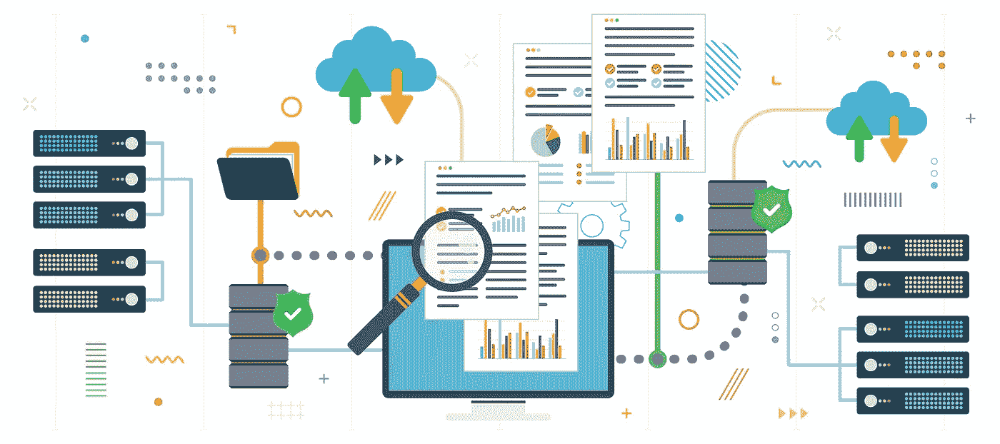
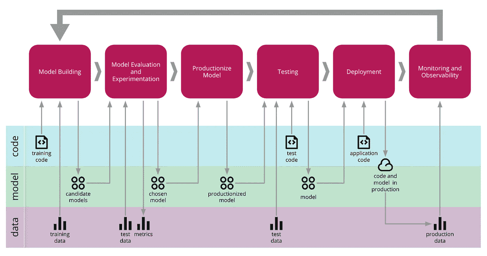
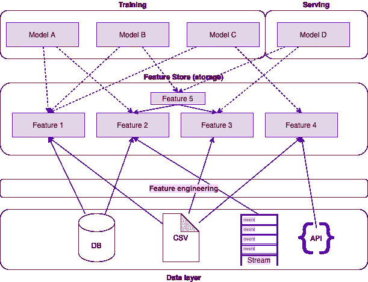
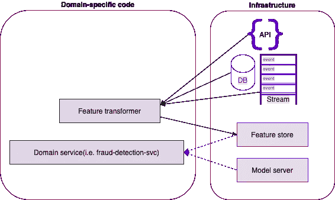
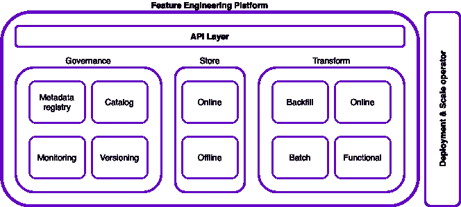
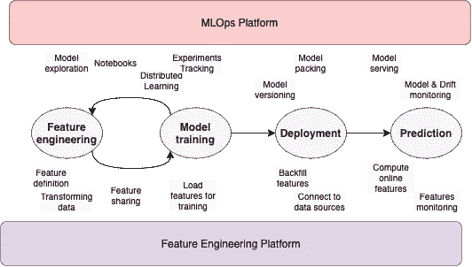

# 有效的人工智能基础设施或为什么功能商店是不够的

> 原文：<https://towardsdatascience.com/effective-ai-infrastructure-or-why-feature-store-is-not-enough-43bc2d803401?source=collection_archive---------20----------------------->

## 现代人工智能基础设施可以加速人工智能的生命周期，并在数据科学家和工程师之间创造一种和平的互动。但是，它们是什么呢？它们与 MLOps 有何不同？

*图片经由 iStock.com/*cifo tart*授权给阿尔莫格巴库*。

在过去的几年里，[人工智能产业爆发](https://mattturck.com/data2020/)并有了巨大的进步。这种增长导致了许多旨在标准化模型开发的新项目。尽管如此，*模型开发仅仅是工作的一半*，并且[大多数项目无法部署到生产](https://www.forbes.com/sites/enriquedans/2019/07/21/stop-experimenting-with-machine-learning-and-start-actually-usingit/)。

将模型**部署为产品**(也称为 ML 驱动的产品)的功能单元仍然是一门艺术，需要它的实践者在*瀑布*方法中仔细地将所有的部分一个接一个地制作在一起。如下所述，现代人工智能基础设施有可能改变这一点。

构建 ML 驱动的产品是一个瀑布式的过程，有多个相互依赖的步骤。作者插图

*尽管 Scrum 和敏捷方法在技术行业变得流行，但是这些方法在开发 ML 驱动的产品时不能应用，因为步骤之间脆弱的依赖关系:*

1.  ***数据发现** —数据团队从内部和外部资源收集信息。*
2.  ***数据准备** —数据团队转换原始数据并整理与问题相关的相关数据点(也称为“数据特征”)。*
3.  ***模型训练** —数据科学家正在用数据做实验来解决一个目标。*
4.  ***模型验证**—数据科学家正在跟踪模型实验，寻找性能最佳的模型。*
5.  ****生产* *代码***—工程师正在编写一个微服务，利用模型来服务于生产使用中的预测。*
6.  ****部署&测试* —** 生产代码应针对规模进行设计，并使用组织的 CI/CD 系统进行部署和测试。*
7.  ***持续监控和学习***

*虽然 ML 驱动的产品开发周期(又名 ML 工作流)是一个非常复杂的过程，但我们可以将其拆分为三大阶段:(1) **准备、** (2) **、** (3) ***产品化*** 。*

*ML 生命周期中最具挑战性的部分，也是最主要的障碍，无疑是 ***产品化阶段*。***

**

*来源:https://martinfowler.com/articles/cd4ml.html*

*为模型提供具有*预测时间准确性*的特性(又名*按需特性*)可以生成最准确和最新的预测，这对于 ML 驱动的产品是强制性的。
然而，由于 DS 和 SW 工程师之间臭名昭著的摩擦，这仍然非常具有挑战性。*

*软件工程师需要与训练该模型的数据科学家密切合作，以使其为生产做好准备。有时，他们甚至对同行的代码进行逆向工程，或者完全从头开始重写。*

*为了构建这样的解决方案，通常的做法包括编写新的微服务应用程序，该应用程序:*

1.  *将模型包装在推理代码中。*
2.  *在线转换来自*生产数据源*的数据，正如我们在准备过程中所做的那样，转换为“**按需功能”***
3.  *向模型提供*按需*功能。*
4.  *为预测服务*

# *当前架构*

*当前的架构被构建为负责翻译特定于域的请求(即，交易)、转换数据、预测、监控和模型管理的单片特定于域的服务(即，“欺诈检测服务”)。
这些类型的架构需要 ds 和 SW 工程师的密切合作来构建这样的服务。*

**

*红色-工程责任；黄色- DS 责任；渐变-两侧。作者插图*

**由于[部署模型](https://papers.nips.cc/paper/2015/file/86df7dcfd896fcaf2674f757a2463eba-Paper.pdf)的复杂工作流程，公司开始寻找新的方法来标准化 ML 驱动产品的开发和部署，并减少生产项目所需的长时间。**

**2017 年，优步发表了[一篇关于 michaelangello——优步的 ML 平台的文章](https://eng.uber.com/michelangelo-machine-learning-platform/)。文章描述了优步为加快 ML 驱动产品的开发所采取的措施，以及一个独特的数据管理层——“***特征库*** ”**

****

**要素存储充当数据要素的共享存储以及模型和数据之间的通信层。作者插图**

****特性存储*是一个独特的存储层，允许“数据特性”的可重用性它利用“冷”存储来提供培训功能，利用“热”缓存来传达这些功能以用于生产。***

***尽管共享*缓存层*的想法在软件开发中并不是一个新方法，但是分离瀑布式工作流的概念是革命性的。它允许分离过程和处理**与模型开发分开的数据处理**，并简化了特征工程过程。***

***特征工程被认为是工作流程中最反复、最耗时、最耗费资源的阶段。事实上，[数据团队大约 80%的时间都在做这件事](https://www.forbes.com/sites/gilpress/2016/03/23/data-preparation-most-time-consuming-least-enjoyable-data-science-task-survey-says/)。因此，it 的简化看起来像是人工智能基础设施发展的必要步骤。***

***最近，[其他](https://engineering.linkedin.com/blog/2019/01/scaling-machine-learning-productivity-at-linkedin) [公司](https://www.slideshare.net/Alluxio/pinterest-big-data-machine-learning-platform-at-pinterest) [采用](https://databricks.com/session/zipline-airbnbs-machine-learning-data-management-platform)新范式，开始将 ML 操作系统从其特色操作系统中分离出来，打破单一流程。***

***这种新兴的架构使组织能够分离特性和模型关注点，标准化模型和数据之间的契约，并减少 DS 和 SW 工程的摩擦。像“微服务”革命一样，工作流程中单元的标准化允许我们推广新的部件并加快我们的开发。***

# ***一个新的地平线正在闪耀。***

***与当前的架构相比，现代人工智能基础设施将把模型部署的操作工作与功能部署分开，并部分分离 DS 和 SW 工程师之间的界限。***

******

***特性平台使团队能够专注于特定领域的问题，而不是运营开销。作者插图***

***此外，新的架构迅速采用了 ML 行业中的特征存储概念和关注点分离。尽管如此，功能商店是不够的，只能解决一部分问题；因此，现代基础设施必须提供全面的解决方案:***

## ***数据科学平台(又名 MLOps 平台)***

***数据科学平台是负责开发、跟踪实验、管理、部署、监控和管理模型的综合解决方案。他们负责该流程的运营方面，并减轻日常运营的复杂性。***

***MLOps 平台提供了一个通用推理服务器，该服务器可以在给定一组输入要素的情况下为解决方案提供一个推理层。这些服务器可能还实现了一个“转换器层”,可以连接到功能平台。市面上的一些产品已经提供了这样一层: [KFServing](https://www.kubeflow.org/docs/components/kfserving/) 、 [TensorFlow serving](https://github.com/tensorflow/serving) 、 [Seldon](https://www.seldon.io/tech/products/core/) 、SageMaker、GCP 等等。***

***许多人已经写了 MLOps 系统的重要性以及它们减少对 Ops 的依赖的能力。**尽管如此，由于它们的作用不同，不要将它们与基础设施解决方案相混淆，这一点很重要。** 一个极好的类比是卡夫卡和詹金斯——卡夫卡是基础设施系统，而詹金斯是 DevOps 系统。***

## ***功能(工程)平台***

***特色平台是 ML 生态系统中缺失的组成部分。特征平台负责转换、服务和监控模型的特征。***

***由于其作为生产系统功能部分的角色，现代功能平台必须确保遵守生产 SLA，并提供稳定、可扩展、低延迟和故障转移弹性。***

***需要强调的是，训练和推理都需要特性，特性应该在*和*两个阶段进行设计。这个两条腿的过程在训练和推理之间产生了一个*偏斜*——提供一个机制来确保它们之间的一致性是平台的责任。***

***与 MLOps 平台不同，功能平台不负责运营生态系统，而是负责*访问*生产数据流。***

***功能平台负责以下目标:***

1.  ***访问和存储特征值和特征集***
2.  ***管理和监控功能元数据***
3.  ***启用和管理 sugared 工程流程***
4.  ***充当运营职能并确保高水平的 SLA***

***现代功能平台不会只提供*商店，而是在移动和转换数据的*工程工作*和实际的*转换(业务)逻辑*之间提供一个标准化的通信层。****

******

***功能平台作为一个综合框架，处理功能生命周期的多个部分，而不仅仅是操作组件。插图*作者****

**特性平台应该包括以下功能来实现其目标:**治理**层、**特性存储**、**转换**框架和**操作**层。**

## **管理**

**功能平台应该为功能提供统一的治理，包括:**

*   ****元数据和特征注册**——即特征名称、其逻辑的文本解释、所有权等。**
*   ****功能目录** —允许跨组织的功能协作和可重用性。**
*   ****监控** —支持跟踪特性性能并发现数据漂移。**
*   ****版本控制** —跟踪数据转换的不同实现。**

## **功能存储(存储)**

**特征存储负责为服务和训练提供特征。它还应该作为关于功能培训和服务的单点事实，并确保在线/离线价值之间的一致性。**

**该组件还负责启用“时间旅行”功能，这对于跟踪时间序列要素的不同值以及同步数据集中其他要素的值至关重要。**

**可以实现不同的架构来达到这个目标；然而，典型的体系结构结合了“在线/离线”存储(因此—功能存储)，通过延迟要求的过滤器来分割负载。**

## **转换框架**

**转换框架应该布置工具来与特征存储进行通信，以将原始数据处理、丰富和计算成特征值，并将其保存到特征存储中。**

**转换框架应该通过减少处理“高级用例”所需的工程代码量，使开发人员能够进行更好的交流，这些“高级用例”包括:回填、按需转换、批量(离线)转换、功能性(即地理距离、派生功能)转换等。**

## **操作层**

**最后，由于功能平台是生产解决方案的关键部分，平台**必须**符合产品的 SLA——提供低延迟服务、可伸缩性、高可用性等。**

**大规模部署可能还会处理将特性部署到不同云环境的挑战。**

## **整体情况**

**部署一个 ML 驱动的产品，作为产品的一个功能部分，可以准确地服务于*在线*模型预测，这是一个非常复杂的任务，但它不应该是这样的。现代人工智能基础设施可以有效地减少摩擦，并在数据科学家和工程师之间建立和平的互动。**

**与传统的软件流程一样，我们预计工作流会有所中断，从而在开发和部署新服务时减少运营和工程开销。**

**由于数据驱动产品的复杂性，ML 领域将不得不将其单片系统分成多个系统。每个人负责不同的任务，类似于传统的软件领域。**

****

**从数据特征系统中分离 ML 系统。作者插图**

***特征平台将从生产数据源收集原始数据，并管理转换后的特征，模型平台可以使用这些特征进行训练和服务。相比之下，MLOps 平台将帮助数据科学家开发和部署 ML 模型。***

## ***最后的想法***

***就目前市场上的解决方案而言，仍然很难区分架构的不同部分。因此，**区分 MLOps 和 AI 基础设施**至关重要，因为每个系统的角色非常不同。***

***尽管一些新兴架构已经取得了长足的发展，但是当前的解决方案仍然关注于操作和服务特性**，而不是关注于创建它们的挑战**。***

***现代特征平台将不得不专注于特征创建而不是缓存存储，并且可能是简化新的 ML 驱动的产品和服务的开发和部署的关键。***

***你怎么想呢?请告诉我您采用基础设施的用例以及您面临的挑战(或者您是否需要帮助来设置这样的系统)。非常欢迎你通过[电子邮件](mailto:almog.baku@gmail.com)或 [LinkedIn](https://www.linkedin.com/in/almogbaku/) 给我写信。***