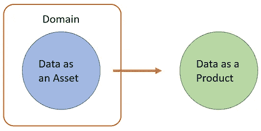
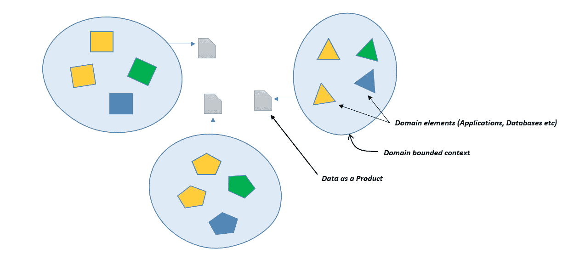

# 利用领域驱动和产品思维方法进行有效的数据管理

> 原文：<https://towardsdatascience.com/effective-data-management-with-domain-driven-and-product-thinking-approach-fc4ace13bddd?source=collection_archive---------18----------------------->

## “分而治之”和“产品思维”的思想可以带来有效的数据管理。数据中的产品思维，即“数据作为产品”是一种思维模式，也不一定需要全面的数据网格

图片来自 [Pixabay 许可](https://pixabay.com/service/license/)下的 [Pixabay](https://pixabay.com/illustrations/brain-brainstorming-bulb-business-4260689/)

# 数据作为资产

数据作为资产的思想已经存在了一段时间。这种想法旨在促进有效的数据管理、利用和可能的数据货币化。它为数据治理提供了基线。数据管理和治理中的一些关键活动是确保数据得到及时维护、正确记录、质量提高和归(企业)所有。

# 成功的数据管理面临的挑战

但是有多少这样的数据管理程序真正获得了成功呢？不多。

一家公司是基于直接面向客户的价值主张而被认可的。它的成功取决于产品销售和客户参与度。因此，利润思维和专注于在更丰富的产品方面创造差异化始终是首要任务。虽然数据是大多数产品的核心，但通常是应用程序功能和用户体验的外层掩盖了核心。

在组织范围内实施数据管理很少会成功。价值流线索需要关注价值主张。产品负责人需要专注于改善客户体验的方法。虽然数据管理的目标是使这些事情变得更容易，但它最终成为一种开销，降低了它们的速度，并产生了不必要的依赖性。

# 如何解决这个问题？

解决这个问题需要我们后退一步(或者几步)，把信息系统作为一个整体来看待。这就是“领域”概念和“作为产品的数据”思想可以发挥作用的地方。关于这些术语的参考，请参见此处的、此处的和此处的。

# 作为“领域产品”的数据

传统数据管理和治理的所有方面都是特定于领域的。每个域完全负责为其数据建立数据目录、所有权、管理权、质量检查和主数据管理。

数据作为产品(或领域产品)是[数据网](https://martinfowler.com/articles/data-monolith-to-mesh.html#DataAndProductThinkingConvergence)的基本原则之一。基于这一原理，数据网格也带来了“数据产品”的概念。数据网格环境中的“[数据产品](https://martinfowler.com/articles/data-mesh-principles.html#DataAsAProduct)”是一个架构量子，非常类似于应用架构中的微服务，即仍然完全完整并提供特定价值的最小可能单元。但是**数据产品可以简单到仅仅是“数据”**。数据网格数据产品的其他元素，如代码、API 等。是推动者并提供杠杆作用。

每个域都应该将它所公开的数据视为一种产品。这种数据的“产品思维”使得它像产品一样。**因此，数据仍然是一种资产，但它是在一个领域内。外面，是产品。**

作为“领域”产品的数据

对于每个领域，产品所有者和产品团队都会形成一种商人心态。这意味着…

*   就像商人维护产品清单一样，域维护可搜索的数据目录。
*   就像商家确保文档和库存数量信息、客户评论等。对于产品是更新的和可见的，领域确保文档(定义、模式、API 端点等。)，以及数据的其他元数据对于消费者来说是容易获得的。
*   就像商家为产品提供售后支持一样，域提供对事件日志、API 调用历史、API 日志等的访问。以便下游应用程序可以调试和处理错误。
*   就像商家推出新产品，特别是软件更新，例如，提供向后兼容性和回滚的可能性，API 接口和事件模式应该迎合 API 版本和模式演变。
*   就像有一个产品所有者一样，它应该提供一个数据所有者。
*   就像有一个产品路线图一样，它也应该有一个指示数据、集成、存储和架构变化的数据路线图。

版权所有 Prajwalan Karanjit

这个想法是，就像供应商对产品负责一样，领域也应该有同样的感觉。

> 经典的产品思维不仅仅是识别最终用户需求，它还理解业务驱动因素、竞争、颠覆者和硬成本。通过将数据视为一种产品，我们将所有这些品质带入数据管理。

# 那么，什么是域呢？

域是某种有界的上下文。由一个或几个应用程序和数据库组成的特定业务功能可以是一个域。同样，属于不同业务能力的相关应用程序的集合也可以被认为是一个域。

分离有界上下文的方法不止一种。这里的主要思想是分而治之。

它是关于建立一条阻力最小的道路。数据治理的[非侵入式模型](https://www.slideshare.net/Dataversity/successful-data-governance-models-and-frameworks)也适用于整体数据管理。使用领域驱动的方法会更有效。

> 通过将数据管理责任委派给各个领域，我们已经让他们负起责任，并使他们能够实施适当的**适合环境的方法**来进行数据管理。适合上下文的方法很重要，因为在一个重要的方面，一些业务领域在另一个方面可能不那么重要。

不要创建专门的角色，如数据管理员，而是将现有的人员识别为这样的角色。在某些情况下，这已经是他们工作的一部分。因此，我们的工作是通过用数据职责来丰富工作描述，使之更加正式和明确。人是领域的一部分，通过这样做，我们让领域对它们如何定义、产生和使用数据负责。

一个简单的分而治之的例子是一个国家。一个国家有几个州或区。当然，有些治理方面适用于各州，但每个州/区也有自己的治理模式。

# 对比、挑战和缺点

这与用一个数据管理模型来管理所有数据形成了对比。甚至数据湖也可能是特定于域的，其中每个域可能有不同的数据湖技术和不同的部署模型(内部部署、云)。这给了域更多的自主权，当需要协同时，域之间的数据交换可以通过 API 或事件来实现。

这样做的缺点是数据、应用程序和基础架构的重复，这可能会导致成本增加。然而，考虑到整体效益，这种成本和开销应被视为一种投资。当需要跨领域的洞察力时，可能还会有一些技术挑战。

> 这里的回报是高度可管理的领域，它们可以扩展、进化和成长，甚至可以安全地被划分出来或被淘汰。

# 结论

有效的数据管理不仅仅是数据。这不是一个孤立的活动，我们应该把问题空间和解决方案空间作为一个整体来考虑。每个领域都对它完全负责，组织也应该同样授权它们。每个领域都应该将它的领域数据作为业务资产来维护和治理，但是要有产品思维。