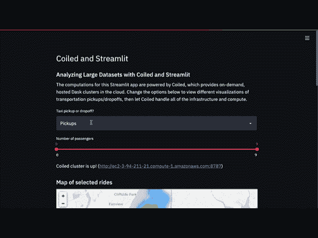
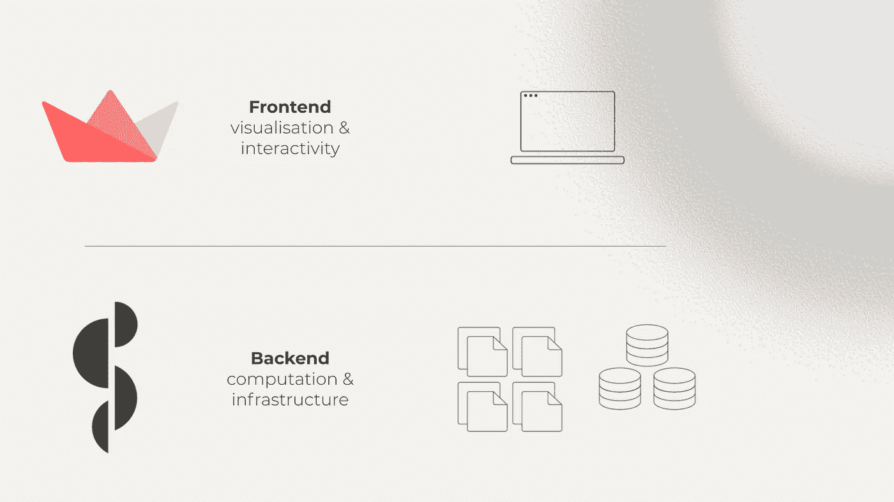
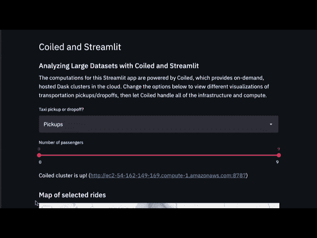
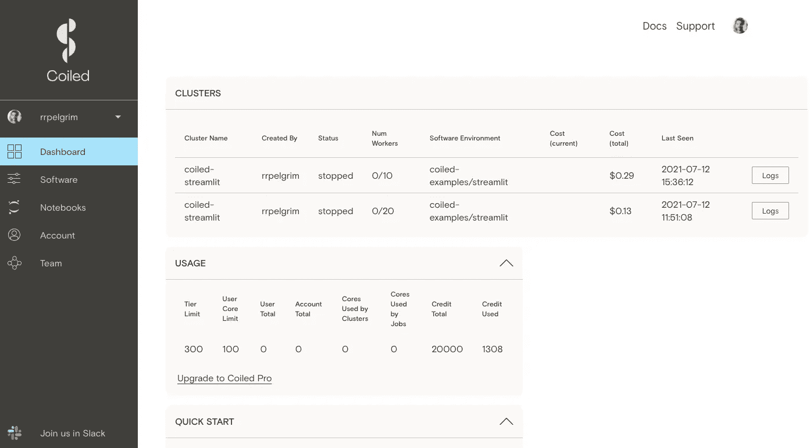

# 为大于内存的数据集提供有效的数据故事

> 原文：<https://towardsdatascience.com/effective-data-storytelling-for-larger-than-memory-datasets-646535c5f87a?source=collection_archive---------38----------------------->


图片来自[unsplash.com](https://unsplash.com/)

## 使用 Streamlit、Dask 和 Coiled 创建直观的交互式 web 应用程序来可视化大数据

# **TL；博士**

*将 Streamlit 与 Dask 和 Coiled 集成在一起，可以让您创建直观、交互式的 web 应用程序，毫不费力地处理大量数据。这篇博客文章引导你编写一个集成的 Streamlit-on-Coiled 脚本，在交互式热图可视化中呈现 10gb 以上的数据。然后我们将脚本扩展为包含:*

1.  *一个较重的分组通过计算，*
2.  *交互式小部件，用于放大或缩小盘绕的集群，以及*
3.  *按需关闭集群的选项。*



# 面向大数据的简化 it

[Streamlit](https://www.linkedin.com/company/streamlit/) 使数据科学家能够构建轻量级、直观的 web 应用，而无需编写任何前端代码。您甚至不必离开 Python 的友好范围；就是那么好；)

也就是说，当数据集或计算的规模超过几秒钟内完成的规模时，使用 Streamlit 这样的前端解决方案可能会变得很麻烦。很可能您使用 Streamlit 的初衷是因为您想要创建一个更流畅、更直观的用户体验。我猜让你的用户坐几分钟(或者几小时！)虽然计算运行不符合您对“平滑”的定义…

当然，您可以选择购买和管理昂贵的机器集群(本地或云)。但是，除非你的 Streamlit 应用程序像网飞一样受欢迎，否则你的集群很可能会长期闲置。这意味着浪费时间和金钱。也不好！

在这里，将繁重的计算任务委托给 Dask 集群很值得考虑。 [Coiled](http://coiled.io) 允许您在云中按需启动 Dask 集群，而无需担心任何开发工作，如设置节点、安全性、扩展甚至关闭集群。Streamlit 在单个 web 应用程序中加入各种力量，处理应用程序的前端布局和交互性，而 Coiled 整理后端基础架构以进行高要求的计算。



这篇博文将向您展示如何构建一个 Streamlit-on-Coiled 应用程序。我们将从一个基本脚本开始，该脚本将来自纽约市出租车数据集的 10gb 以上的数据加载到一个交互式用户界面中。从那里，我们将真正通过运行更重的工作负载来充分利用 Dask 和 Coiled。最后，我们将调整我们的 Streamlit 界面，允许用户使用简单的滑块来放大和缩小集群，并包括一个关闭集群的按钮，让用户可以更好地控制他们的计算能力，而无需编写任何代码。

你可以从这个 GitHub repo 下载基本的和最终的、扩展的 Python 脚本。要继续编码，你需要一个 Coiled Free Tier 账户，你可以通过 [cloud.coiled.io](https://cloud.coiled.io/) 使用你的 GitHub 凭证来设置这个账户。对 Dask 和 Streamlit 有一些基本的了解是有帮助的，但不是必须的。

*免责声明:我在 Coiled 工作，是一名数据科学传道者实习生。* [*Coiled*](http://coiled.io) *由*[*Dask*](https://dask.org/)*的最初作者 Matthew Rocklin 创立，是一个面向分布式计算的开源 Python 库。*

# **可视化大于内存的数据集**

下面的示例脚本使用 Coiled 和 Streamlit 从纽约市出租车数据集中读取超过 1.46 亿条记录(10+ GB ),并可视化出租车上下车的位置。让我们来分析一下脚本中发生了什么:

首先，我们导入运行脚本所需的 Python 库，在本例中是 Coiled、Dask、Streamlit 和 Folium。

```
import coiled
import dask
import dask.dataframe as dd
import folium
import streamlit as st
from dask.distributed import Client
from folium.plugins import HeatMap
from streamlit_folium import folium_static
```

在下一节中，我们将使用 Streamlit 创建前端用户界面。我们从一些描述性的标题和文本开始，然后包括两个下拉框，允许用户选择他们想要可视化的数据类型。

```
# Text in Streamlitst.header("Coiled and Streamlit")st.subheader("Analyzing Large Datasets with Coiled and Streamlit")st.write(
"""
The computations for this Streamlit app are powered by Coiled, which provides on-demand, hosted Dask clusters in the cloud. Change the options below to view different visualizations of transportation pickups/dropoffs, then let Coiled handle all of the infrastructure and compute.
"""
)# Interactive widgets in Streamlittaxi_mode = st.selectbox("Taxi pickup or dropoff?", ("Pickups", "Dropoffs"))num_passengers = st.slider("Number of passengers", 0, 9, (0, 9))
```

在那里，我们编写了一个函数，它将旋转一个盘绕的簇。在这里，我们指定工作人员的数量、集群的名称，以便我们可以在以后重用它(如果有多人查看您的 Streamlit 应用程序，这一点至关重要)，以及要分发给我们的调度程序和工作人员的软件环境。关于如何设置软件环境的更多信息，请参见中的本页。

您可以在[Coiled Cloud 页面](http://cloud.coiled.io)上查看任何活动的和已关闭的集群，以及您的软件环境和集群配置(前提是您已登录您的帐户)。

```
# Start and connect to Coiled cluster
cluster_state = st.empty()@st.cache(allow_output_mutation=True)def get_client():
    cluster_state.write("Starting or connecting to Coiled cluster...")
    cluster = coiled.Cluster(
        n_workers=10,
        name="coiled-streamlit",
        software="coiled-examples/streamlit"
)
    client = Client(cluster)
    return clientclient = get_client()if client.status == "closed":# In a long-running Streamlit app, the cluster could have shut down from idleness. If so, clear the Streamlit cache to restart it.st.caching.clear_cache()
client = get_client()
cluster_state.write(f"Coiled cluster is up! ({client.dashboard_link})")
```

接下来，我们从公共的亚马逊 S3 存储桶加载数据作为 Dask 数据帧，指定我们想要包含的列和每个分区的块大小。注意这里对 **df.persist()** 的调用。这将数据帧保存在集群上，因此无需在每次应用刷新时重新加载。调用后，只要集群在运行，就可以立即访问数据集。

```
# Load data (runs on Coiled)@st.cache(hash_funcs={dd.DataFrame: dask.base.tokenize})
def load_data():
    df = dd.read_csv(
        "s3://nyc-tlc/trip data/yellow_tripdata_2015-*.csv",
        usecols=[
            "passenger_count",  
            "pickup_longitude",
            "pickup_latitude",
            "dropoff_longitude", 
            "dropoff_latitude",
            "tip_amount",
            "payment_type",
        ],
        storage_options={"anon": True},
        blocksize="16 MiB",
) df = df.dropna()
    df.persist()
    return dfdf = load_data()
```

最后，我们使用上面的 Streamlit 小部件的输入来创建一个名为 **map_data** 的数据子集，并将其传递给叶地图，指定我们希望它显示为热图渲染。

```
# Filter data based on inputs (runs on Coiled)with st.spinner("Calculating map data..."):
    map_data = df[
        (df["passenger_count"] >= num_passengers[0])
        & (df["passenger_count"] <= num_passengers[1])
    ] if taxi_mode == "Pickups":
        map_data = map_data.iloc[:, [2, 1]] elif taxi_mode == "Dropoffs":
        map_data = map_data.iloc[:, [4, 3]] map_data.columns = ["lat", "lon"]
    map_data = map_data.loc[~(map_data == 0).all(axis=1)]
    map_data = map_data.head(500)# Display map in Streamlitst.subheader("Map of selected rides")m = folium.Map([40.76, -73.95], tiles="cartodbpositron", zoom_start=12)HeatMap(map_data).add_to(folium.FeatureGroup(name="Heat Map").add_to(m))folium_static(m)
```

就是这样！让我们看看这是什么样子。

*请注意，这是一个独立的 Python 脚本，您可以使用****streamlit run<path/to/file>****从您的终端运行，而不是从 Jupyter 笔记本上运行。*

所以，继续在你的终端上运行它…几秒钟后，你的浏览器就会呈现给你一个交互式界面，如下图所示。



很神奇吧？尤其是当您考虑到每次刷新地图时，应用程序都会在一瞬间处理超过 1.46 亿行(超过 10GB)的数据！

# **填充 Dask 仪表板**

现在让我们来看看 Coiled 如何处理更重的工作负载。如果您碰巧点击了 Dask 仪表板的 URL，您会看到生成地图的计算只需几个任务就完成了。虽然 Dask 毫不犹豫地处理了这个问题，但它实际上是为*分布式*计算而设计的——当有大量任务需要它运行时，它真的会露出牙齿。所以让我们给它一个闪耀的机会，好吗？

我们将在脚本中创建一个新的部分，允许用户通过计算建立一个组。我们将为用户提供一个选项，让用户选择要分组的列，以及要计算的汇总统计类型。并且包括触发计算的按钮。

```
# Performing a groupbyst.subheader(
    'Time for some heavier lifting!'
)st.write(
'''
Let's move on to doing some heavier lifting to really see Dask in action. We'll try grouping a column and calculating a summary statistic for the tip amount.\n Select a column to group by below and a summary statistic to calculate:
'''
)# Interactive widgets in Streamlitgroupby_column = st.selectbox(
    "Which column do you want to group by?",
    ('passenger_count', 'payment_type')
)aggregator = st.selectbox(
    "Which summary statistic do you want to calculate?",
    ("Mean", "Sum", "Median")
)st.subheader(
    f"The {aggregator} tip_amount by {groupby_column} is:"
)if st.button('Start Computation!'):
    with st.spinner("Performing your groupby aggregation..."):
        if aggregator == "Sum":
            st.write(
                df.groupby(groupby_column).tip_amount.sum().compute()
)
        elif aggregator == "Mean":
            st.write(
                df.groupby(groupby_column).tip_amount.mean().compute()
)
        elif aggregator == "Median":
            st.write(
                df.groupby(groupby_column).tip_amount.median().compute()
)
```

保存 Python 脚本并在您的终端中重新运行**streamlit run<path/to/file>**将加载 Streamlit 应用程序的更新版本，如下图所示。


显示分组依据计算的 Dask 仪表板


扩展 Streamlit 接口

现在，我们可以使用新的下拉选项通过计算来自定义我们的 groupby。单击 new 按钮会在我们的 Coiled 集群上触发一些繁重的计算，在 45 秒内计算超过 1.46 亿行的汇总统计数据。

# **缩放和关闭你的盘绕式集群**

但是…如果我们挑剔的话，使用整个集群来生成地图有点大材小用了；它只包含少量的任务。另一方面，在一次重要的董事会会议之前，你可能正在向工作过度的首席执行官演示这款应用程序，而你最不想做的事情就是让他们在 groupby 计算运行的 45 秒内盯着一个转动的轮子。

如果有一种方法可以根据我们的计算需求来扩大或缩小我们的集群就好了…

带着对**盘绕的呼唤。我们可以指定我们的集群拥有的工人数量。请注意，我们必须指定集群的名称，以便在该调用中进行伸缩。让我们继续在脚本中添加一个新部分，将该调用附加到一个交互式 Streamlit 滑块。这意味着我们的用户现在可以根据需要调整他们的计算能力…就在我们的 web 应用程序中，无需编写任何代码。**

```
# Option to scale cluster up/downst.subheader(
    "Scaling your cluster up or down"
)st.write(
'''
By default, your Coiled Cluster spins up with 10 workers. You can scale this number up or down using the slider and button below.
'''
)num_workers = st.slider(
    "Number of workers",
    5,
    20,
    (10)
)if st.button("Scale your cluster!"):
    coiled.Cluster(name='coiled-streamlit').scale(num_workers)
```

请注意，虽然缩减是即时的，但扩展集群需要一到两分钟。好消息是，当集群扩展时，您可以继续运行您的计算。您可以使用 Coiled Cloud web 界面来查看您的集群当前有多少工作线程。



coiled Cloud UI Dashboard—Cloud . coiled . io

最后，让我们构建一个按钮，允许用户关闭集群以避免不必要的成本。请注意，这里有一个权衡:如果您正在快速迭代 Streamlit 应用程序，我们建议保持集群运行，这样您就不必在每次重新运行脚本时都等待它开始运行。在这种情况下，命名集群很重要，这样您就可以在后续运行中引用它。但是，如果在可预见的将来您已经完成了所有工作，那么关闭集群是一个很好的做法。

```
# Option to shutdown clusterst.subheader(
    "Cluster Hygiene"
)st.write(
'''
To avoid incurring unnecessary costs, click the button below to shut down your cluster. Note that this means that a new cluster will have to be spun up the next time you run the app.
'''
)if st.button('Shutdown Cluster'):
    with st.spinner("Shutting down your cluster..."):
        client.shutdown()
```

我们在这里偷偷插入一个提示:默认情况下，盘绕的集群在 20 分钟不活动后关闭。您可以通过使用 **idle_timeout** 关键字参数来设置您自己的首选超时窗口。

```
cluster = coiled.Cluster**(** scheduler_options=**{**"idle_timeout"**:** "2 hours"**}
)**
```

# **让我们回顾一下**

我们从运行来自 Coiled 文档的 Streamlit-on-Coiled 示例脚本开始。我们看到了如何快速、轻松地创建一个直观、交互式的 web 应用程序，可以处理 1.46 亿行数据。接下来，我们将这一点做了进一步，让我们的 web 应用程序的用户能够在我们的盘绕式集群上计算更繁重的计算。然后，我们通过构建一个选项来根据需要扩大(或缩小)集群，从而增强了我们的计算能力。最后，我们讨论了何时以及如何关闭集群以避免不必要的成本。

我希望这篇博文能帮助您创建有效的数据故事应用程序，以传达您的数据科学工作流的影响。如果您对未来的材料有任何问题或建议，请随时联系这里或[Coiled Community Slack channel](https://join.slack.com/t/coiled-users/shared_invite/zt-hx1fnr7k-In~Q8ui3XkQfvQon0yN5WQ)，我很乐意听到您的意见！