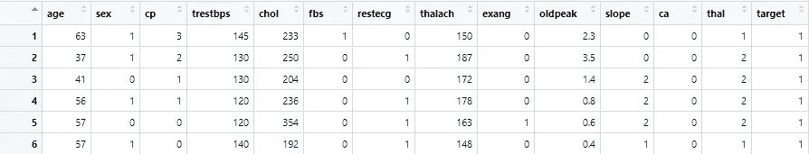
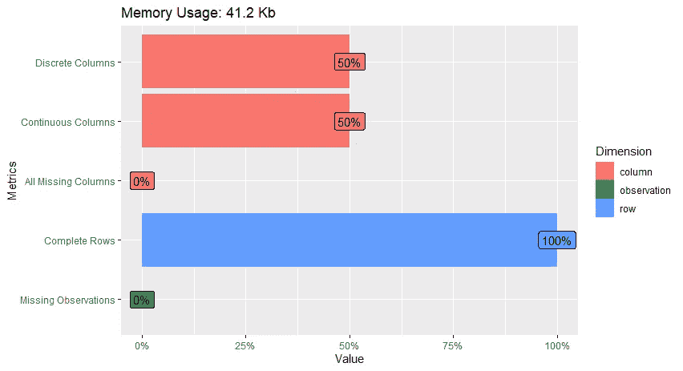
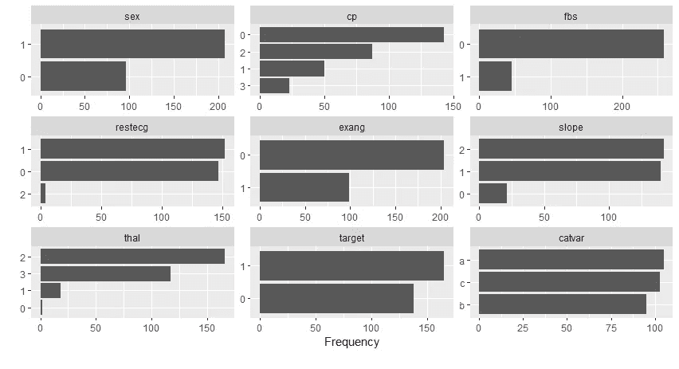
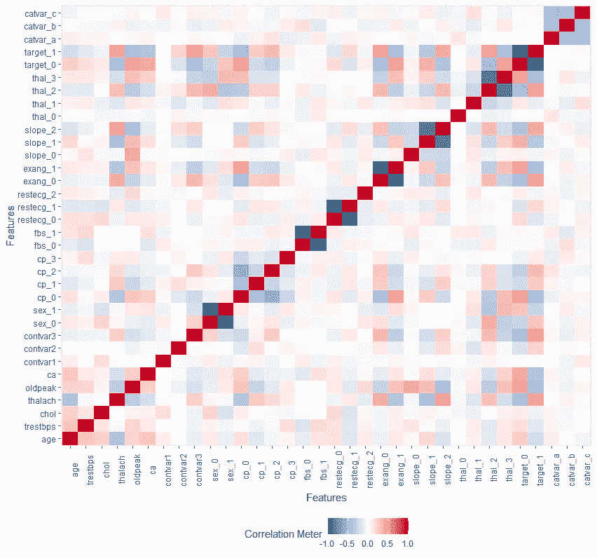
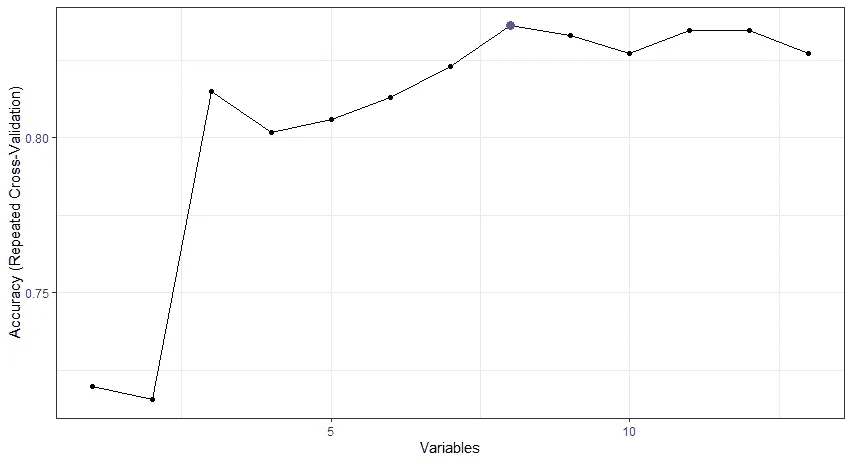
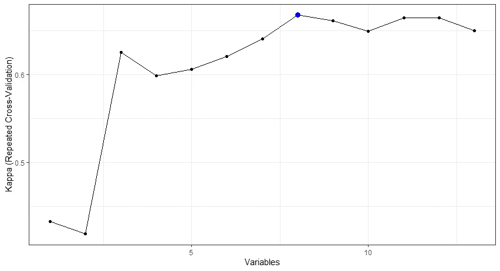
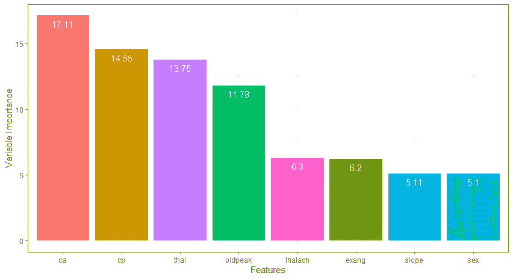
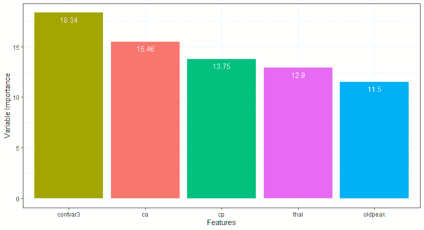

# 有效的特征选择:使用 R 的递归特征消除

> 原文：<https://towardsdatascience.com/effective-feature-selection-recursive-feature-elimination-using-r-148ff998e4f7?source=collection_archive---------3----------------------->


安东尼·马蒂诺在 [Unsplash](https://unsplash.com?utm_source=medium&utm_medium=referral) 上的照片

D 在机器学习中开发一个准确而简单(且可解释)的模型可能是一项非常具有挑战性的任务。根据建模方法(例如，神经网络与逻辑回归)，模型中有太多的特征(即，预测值)可能会增加模型的复杂性或导致其他问题，如多重共线性和过度拟合。此外，对于高度复杂的模型，获取(或维护)用于未来预测的大量特征可能会更加困难。因此，选择*最佳*特性非常重要。

> 有时候，少即是多。——威廉·莎士比亚

*递归特征消除*，简称 RFE，是一种广泛使用的算法，用于选择与预测模型中预测目标变量最相关的特征，无论是回归还是分类。RFE 应用逆向选择过程来寻找特征的最佳组合。首先，它基于所有特征构建模型，并计算模型中每个特征的重要性。然后，它基于模型评估度量(例如，RMSE、准确度和 Kappa)对特征进行排序，并迭代地移除重要性最低的特征。可以基于模型(例如，随机森林重要性标准)或使用模型独立的度量(例如，ROC 曲线 analysis)⁴.)来计算特征重要性这个过程一直持续到*更小的*特征子集被保留在模型中(从技术上讲，RFE 仍然可以在最终模型中保留所有(或大部分)特征)。

RFE 可以用几种编程语言来实现，比如 R、Python 和 MATLAB。多亏了著名的**脱字符**包，从头开始在 R 中实现 RFE 方法非常简单。在本文中，我将演示如何在 r 中使用 RFE 进行特性选择。

*   了解 RFE 在构建预测模型时如何选择重要特征，以及
*   知道如何使用 **caret** 包在 r 中实现基于 RFE 的特性选择

# 例如:心脏病数据集


杰西·奥里科在 [Unsplash](https://unsplash.com?utm_source=medium&utm_medium=referral) 上拍摄的照片

在这个例子中，我们将使用来自 [UCI 机器学习库](https://archive.ics.uci.edu/ml/index.php)的最受欢迎的数据集之一——[克里夫兰心脏病](https://archive.ics.uci.edu/ml/datasets/heart+disease)数据集。研究人员使用克利夫兰数据库预测了 303 名患者样本中的心脏病。尽管最初的 Cleveland 数据库包含 76 个变量(参见完整的变量列表[这里](https://archive.ics.uci.edu/ml/datasets/heart+disease)，研究人员在建立预测模型时经常选择 14 个变量的子集(13 个特征和一个目标变量)(例如，参见 Shubhankar Rawat 的[帖子](/heart-disease-prediction-73468d630cfc)关于[走向数据科学](https://towardsdatascience.com/))。因此，我们将使用相同的功能子集:

1.  **年龄**:个人的年龄。
2.  **性别**:个体性别:1 =男性；0 =女性。
3.  **cp** :个人经历的胸痛类型:1 =典型心绞痛；2 =不典型心绞痛；3 =非心绞痛性疼痛；4 =渐近。
4.  **trestbps** :个人入院时的静息血压值，单位为 mmHg。
5.  **胆固醇**:血清胆固醇，单位为毫克/分升
6.  **fbs** :个人空腹血糖水平。如果空腹血糖> 120mg/dl 那么 1；否则 0。
7.  **静息心电图**:静息心电图结果:0 =正常；1 =有 ST-T 波异常；2 =左心室肥大。
8.  **thalach** :个人达到的最大心率。
9.  **exang** :运动诱发心绞痛:1 =是；0 =否。
10.  **oldpeak** :运动相对于休息诱发的 ST 段压低。
11.  **斜率**:运动 ST 段峰值的斜率:1 =上坡；2 =平；3 =下坡。
12.  **ca** :透视着色的主要血管数(0-3)。
13.  **地中海贫血**:地中海贫血:3 =正常；6 =修复缺陷；7 =可逆缺陷。
14.  **目标**:心脏病诊断:0 =无心脏病；1 =存在心脏病。

## 数据准备

在开始分析之前，我们将首先激活本例中需要的 R 包:

*   [**dplyr**](https://dplyr.tidyverse.org/) (用于数据扯皮)，
*   [**仿**](https://debruine.github.io/faux/) (用于模拟新变量——详见下文)，
*   [**DataExplorer**](https://boxuancui.github.io/DataExplorer/) (用于探索性数据分析)，以及
*   [**脱字符号**](https://topepo.github.io/caret/) 和 [**随机森林**](https://cran.r-project.org/web/packages/randomForest/index.html) (用于实现特征选择的 RFE)。

接下来，我们将把克利夫兰心脏病数据集导入到 R 中，并预览前六行。您可以在[我的 Github 库](https://github.com/okanbulut/tds/tree/main/feature_selection_rfe)中找到克利夫兰心脏病数据集的副本以及本文中使用的 R 代码。



克利夫兰心脏病数据集的前六行

为了让示例更有趣，我们将向数据集添加四个伪变量:

*   **分类变量**:随机分类变量，级别为 A、b 和 c，与目标变量( *r* = 0)无关
*   **变量 1** :一个随机的连续变量，平均值为 10，标准差为 2，与目标变量无关( *r* = 0)
*   **变量 2** :均值为 10、标准差为 2 的连续变量，与目标变量的相关性较低( *r* = 0.2)
*   **连续变量 3** :均值为 10、标准差为 2 的连续变量，与目标变量的相关性适中( *r* = 0.5)

我们将在特征选择过程中使用这些变量，看看 RFE 是否会选择它们中的任何一个作为包含在模型中的特征。包括伪变量的新数据集在[这里](https://raw.githubusercontent.com/okanbulut/tds/main/feature_selection_rfe/heart_final.csv)可用。

最后，我们将把分类特征和目标变量重新编码为一个因子，并对数据集中的数字特征进行居中(和缩放)处理。

## 探索性数据分析

使用 **DataExplorer** 包，我们将检查数据集中的变量。首先，我们将检查变量的类型。接下来，我们将为分类变量创建条形图。最后，我们将创建一个关联图，显示数据集中所有变量之间的相关性。

我们探索性分析的第一幅图证实了数据中的变量类型。数据中没有缺失值。一半的变量是数字的，而另一半是分类的。



数据集中的变量类型

条形图显示了数据集中的分类变量。这些图形对于检测变量的意外值特别有用。在我们的数据集中，所有分类变量的级别看起来都是正确的(基于上面的数据集描述)。对于两个变量( **restecg** 和 **thal** )，一些电平似乎具有非常低的频率。现在，我们将保留这些变量的原始级别，并在以后必要时折叠它们。



分类变量的条形图

相关矩阵图显示目标变量的两个级别(参见标记为 **target_0** 和 **target_1** 的行或列)似乎与数据集中的几个特征(例如 **chol** 、 **oldpeak** 和 **thalach** )具有中等相关性。根据这些特征之间的相互关系，它们很可能被选为 RFE 分析中的最佳特征。



所有变量的相关矩阵图

## 特征选择

使用数据集中的特征(即原始数据集中的 13 个特征和我们已经创建的 4 个伪特征)，我们的目标是建立预测心脏病诊断的模型(0 =没有心脏病；1 =存在心脏病)。在第一部分中，我们将实施 RFE 来识别原始数据集中的哪些特征(即 13 个特征)可用于预测目标变量。在第二部分中，我们将把这四个伪特征添加到 RFE 模型中，并重复同样的分析。

为了实现 RFE，我们将使用**插入符号**包中的`rfe`函数。该函数需要四个参数:

*   `x`:特征的矩阵或数据帧
*   `y`:要预测的目标变量
*   `sizes`:特征选择过程中应保留的特征数量
*   `rfeControl`:特征选择算法的控制选项列表

所以，在使用`rfe`功能之前，我们首先需要选择`rfeControl`的控制选项。 **caret** 包包含了许多 RFE 算法，比如随机森林、朴素贝叶斯、袋装树和线性回归。在这个例子中，我们将使用“随机森林”(名为`rfFuncs`)，因为它有一个很好的计算特性重要性的内置机制。此外，我们将使用 5 次重复的 10 重交叉验证来提高 RFE 特征选择的性能。

接下来，我们将数据集随机分为训练(80%)和测试(20%)数据集，然后将特征和目标变量保存为单独的数据集(例如，特征的 x_train 和目标变量的 y_train)。

最后，我们将把所有东西放在一起，用 RFE 实现特性选择。在`rfe`函数中，我们使用`sizes = c(1:13)`，以便该函数尝试所有可能的解决方案(即，只有 1 个特征、2 个特征、……13 个特征)来找到最佳特征。或者，我们可以键入类似于`sizes = c(1:5, 10, 13)`的内容，来尝试具有多达 5 个特性、10 个特性和 13 个特性的解决方案。

下图显示了从`rfe`功能返回的输出。输出表明，RFE 为该模型推荐了 8 个特性(参见“Selected”列下的小星号)。当模型中保留 8 个特征时，准确率和 Kappa 都达到最大水平。

```
Recursive feature selectionOuter resampling method: Cross-Validated (10 fold, repeated 5 times)Resampling performance over subset size:Variables Accuracy Kappa AccuracySD KappaSD Selected
         1    0.720 0.433     0.0833   0.169         
         2    0.715 0.418     0.0840   0.171         
         3    0.815 0.625     0.0851   0.171         
         4    0.802 0.599     0.0652   0.132         
         5    0.806 0.606     0.0764   0.154         
         6    0.813 0.621     0.0748   0.151         
         7    0.823 0.641     0.0677   0.137         
         **8    0.836 0.668     0.0672   0.135        ***
         9    0.833 0.662     0.0779   0.156         
        10    0.827 0.650     0.0670   0.136         
        11    0.835 0.665     0.0659   0.133         
        12    0.835 0.665     0.0661   0.133         
        13    0.827 0.650     0.0714   0.144The top 5 variables (out of 8):
   ca, cp, thal, oldpeak, thalach
```

我们还可以在下图中直观地看到相同的结果(蓝点代表最佳解决方案，即 8 个特征)。



基于特征数量的模型精度



基于特征数量的模型的 Kappa

现在，我们知道 RFE 选择了 8 个特征，但是这些特征是什么呢？`predictors(result_rfe1)`给出了所选功能的列表。

```
[1] "ca"      "cp"      "thal"    "oldpeak" "thalach" "exang"   "slope"   "sex"
```

接下来，我们将直观地检查所选特征的变量重要性，并查看哪些特征对于预测目标变量更重要。

下面的柱状图表明 **ca** (荧光透视着色的主要血管数量)是最重要的特征，其次是 **cp** (个体经历的胸痛类型)和 **thal** (地中海贫血状态)。



显示所选功能的可变重要性的条形图

我们还可以使用测试数据集来检查模型性能。准确性和 Kappa 值似乎与从训练数据集获得的相似。

```
Accuracy    Kappa 
  0.8333   0.6564
```

如果我们在分析中也包括这四个伪特征呢？结果会改变还是保持不变？从逻辑上讲，我们希望 RFE 消除随机变量( **catvar** 和 **contvar1** )以及低相关性变量( **contvar2** )，但保留与模型中的目标变量( **contvar3** )适度相关的变量。但是，从前面的分析中选择的特征还会被保留吗？让我们找出答案。

新分析返回的输出(有 17 个特性)显示 RFE 选择了一个有 5 个特性的解决方案(也就是说，一个更节省的解决方案！).准确性和 Kappa 值也有所提高——模型的改进并不令人惊讶，因为我们包括的一个伪特征( **contvar3** )与目标变量有适度的相关性。因此，我们希望这个特性能够对模型性能产生积极的影响。

```
Recursive feature selectionOuter resampling method: Cross-Validated (10 fold, repeated 5 times)Resampling performance over subset size:Variables Accuracy Kappa AccuracySD KappaSD Selected
         1    0.618 0.228     0.0845   0.171         
         2    0.750 0.491     0.0829   0.168         
         3    0.804 0.602     0.0638   0.129         
         4    0.844 0.684     0.0800   0.161         
        ** 5    0.869 0.735     0.0738   0.149        ***
         6    0.854 0.705     0.0782   0.158         
         7    0.852 0.700     0.0790   0.160         
         8    0.856 0.708     0.0736   0.149         
         9    0.857 0.711     0.0709   0.144         
        10    0.859 0.715     0.0770   0.157         
        11    0.858 0.713     0.0709   0.145         
        12    0.858 0.712     0.0700   0.142         
        13    0.863 0.723     0.0761   0.155         
        14    0.860 0.716     0.0753   0.153         
        15    0.866 0.728     0.0683   0.140         
        16    0.861 0.717     0.0752   0.154         
        17    0.862 0.719     0.0680   0.13
```

下面的条形图证实了我们的假设: **contvar3** 确实是被选中的特征之一。事实上，这似乎是模型中最重要的特征。正如我们所预料的，其他伪特征( **catvar** 、 **contvar1** 和 **contvar2** )不在所选特征之列，因为它们与目标变量没有足够的关联。在添加了一个与目标变量适度相关的特征后，RFE 消除了一些不太重要的特征(例如 **exang** 、 **slope** 和 **sex** )，产生了一个更简化的解决方案，只有 5 个特征。总之，这个简单的实验证明了 RFE 在发现重要特征和消除不太相关的特征方面的敏感性。



显示所选功能的可变重要性的条形图

# 结论

总的来说，RFE 是在机器学习中为回归和分类任务找到最优特征集的有效方法。 **caret** 包提供了一个易于使用的函数来实现 r 中的 RFE。虽然我已经演示了如何使用带有默认选项的`rfe`函数，但是也可以使用用户定义的函数来定制控制选项(参见 **caret** 手册的[助手函数](https://topepo.github.io/caret/recursive-feature-elimination.html#rfehelpers)一节中的精彩示例)。我希望本文中描述的 R 代码和过程对您未来的项目有所帮助。

RFE 有很多种用法。在我网站上最近的一篇[博文](https://okan.cloud/posts/2021-01-04-how-to-shorten-a-measurement-instrument-automatically-part-i/)中，我展示了如何使用 RFE 来缩短考试时间，方法是在预测学生考试分数时选择最重要的问题(即特征)。

# 参考

[1]库恩，m .，&约翰逊，K. (2019)。*特征工程和选择:预测模型的实用方法*。CRC 出版社。

[2] Guyon，I .，Weston，j .，Barnhill，s .，& Vapnik，V. (2002 年)。基于支持向量机的癌症分类基因选择。*机器学习，46* (1)，389–422。

[3]库恩，M. (2020)。*插入符号:分类和回归训练*。可从[https://CRAN.R-project.org/package=caret](https://CRAN.R-project.org/package=caret)获得。

[4]库恩，M. (2019)。*脱字包*。可从 https://topepo.github.io/caret/index.html[获得](https://topepo.github.io/caret/index.html)