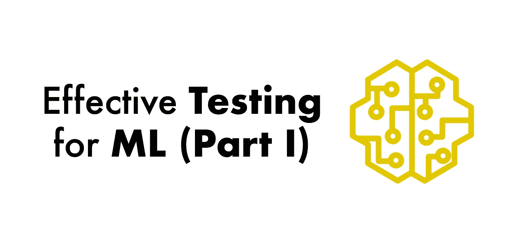
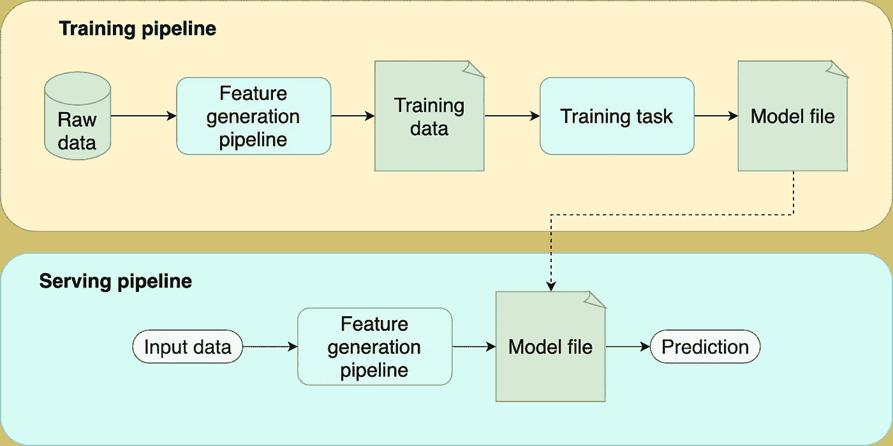
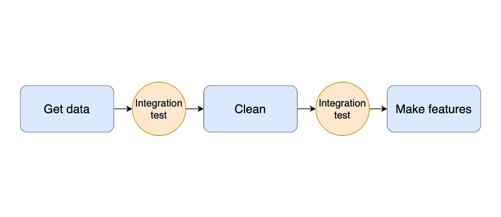

# 机器学习的有效测试(上)

> 原文：<https://towardsdatascience.com/effective-testing-for-machine-learning-part-i-e6b5aeb51421?source=collection_archive---------10----------------------->

## 测试 ML 系列

## 用于开发健壮的 ML 项目的渐进的、逐步的框架

图片作者。

> 更新:[第二部](https://ploomber.io/blog/ml-testing-ii/)现已出！

这篇博文系列描述了我在过去几年中开发的一个策略，用来有效地测试机器学习项目。考虑到 ML 项目的不确定性，随着项目的成熟，这是一个你可以采用的增量策略；它包括测试示例，为这些测试在实践中的表现提供了清晰的思路，一个用 [Ploomber](https://github.com/ploomber/ploomber) 实现的完整项目在 GitHub 上可用[。到本文结束时，您将能够开发更健壮的 ML 管道。](https://github.com/edublancas/ml-testing)

# 测试 ML 项目时的挑战

测试机器学习项目具有挑战性。训练一个模型是一个长期运行的任务，可能需要几个小时来运行，并且有一个不确定的输出，这与我们测试软件需要的相反:快速和确定的过程。一年前，我发表了一篇关于测试数据密集型项目以使持续集成可行的文章。后来，我把这篇博文变成了一篇演讲，并在 PyData 2020 上发表。但是这些以前的工作只涵盖了测试数据管道的一般方面，而忽略了测试 ML 模型。

澄清一下*测试和监控是两回事*很重要。测试是一个离线的过程，它允许我们评估我们的代码是否做了它应该做的事情(例如，产生一个高质量的模型)。相比之下，监控包括检查*部署的*型号，以确保其正常工作。因此，*测试发生在部署之前；监控发生在部署之后。*

我在整篇文章中使用了术语*管道*和*任务*。任务是一个工作单元(通常是一个函数或一个脚本)；例如，一个任务可以是下载原始数据的脚本，另一个任务可以清理这些数据。另一方面，管道只是一系列按照预先定义的顺序执行的任务。构建由小任务组成的管道的动机是使我们的代码更易于维护和测试；这符合我们的[开源框架](https://github.com/ploomber/ploomber)的目标，即帮助数据科学家使用 Jupyter 构建更易维护的项目。在接下来的部分中，您将看到一些示例 Python 代码；我们用 [pytest](https://pytest.org/) ，pandas，还有 [Ploomber](https://github.com/ploomber/ploomber) 。

**如果你想知道第二部何时上映，请订阅我们的** [**简讯**](https://www.getrevue.co/profile/ploomber) **，关注我们的** [**推特**](https://twitter.com/ploomber) **或**[**LinkedIn**](https://linkedin.com/company/ploomber/)**。**

# **机器学习流水线的组成部分**

在我们描述测试策略之前，让我们分析一下典型的 ML 管道是什么样子的。通过分别分析每个部分，我们可以清楚地陈述它在项目中的作用，并相应地设计测试策略。标准 ML 管道包含以下组件:

1.  **特征生成流水线。**处理*原始数据*并将每个数据点映射到特征向量的一系列计算。请注意，我们在培训和服务时间使用这个组件。
2.  **训练任务。**获取训练集并生成模型文件。
3.  **模型文件。**训练任务的输出。这是一个单独的文件，包含一个带有学习参数的模型。此外，它可能包括预处理，如缩放或一键编码。
4.  **培训管道。**封装了训练逻辑:获取原始数据，生成特征，训练模型。
5.  **服务管道。**(也称为推理管道)封装了服务逻辑:获取新的观察，生成特征，通过模型传递特征，返回预测。

图片作者。

# **会出什么问题？**

为了激励我们的测试策略，让我们列举每个部分可能出现的问题:

## **特征生成管道**

1.  无法运行管道(例如，设置问题、代码损坏)。
2.  无法重现以前生成的训练集。
3.  Pipeline 产生低质量的训练数据。

## **训练任务**

1.  无法训练模型(例如，缺少依赖项、代码损坏)。
2.  使用高质量的数据运行训练任务会产生低质量的模型。

## **模型文件**

1.  生成的模型比我们当前生产的模型质量低。
2.  模型文件没有与服务管道正确集成。

## **服务管道**

1.  无法提供预测(例如，缺少依赖项、代码损坏)。
2.  训练时的预处理和服务时间不匹配(又名[训练-服务偏差](https://ploomber.io/blog/train-serve-skew/))。
3.  传递无效原始数据时输出预测。
4.  传递有效数据时崩溃。

请注意，这不是一个详尽的列表，但它涵盖了最常见的问题。根据您的用例，您可能有其他潜在的问题，并且列出它们来相应地定制您的测试策略是至关重要的。

# **测试策略**

在开发 ML 模型的时候，我们迭代的越快，成功的几率就越高。不像传统的软件工程项目，我们应该构建什么是很清楚的(例如，一个注册表单)，ML 项目有很多不确定性:使用哪些数据集？有哪些功能可以尝试？用什么型号？由于我们事先不知道这些问题的答案，我们必须尝试一些实验，并评估它们是否会产生更好的结果。由于这种不确定性，我们必须平衡迭代速度和测试质量。如果我们迭代*太快*，我们就有可能写出草率的代码；如果我们花太多时间彻底测试每一行代码，我们就不能足够快地改进我们的模型。

这个框架稳步提高了测试的质量。该战略包括五个层次；当到达最后一层时，您有足够健壮的测试，允许您自信地将新的模型版本推向生产。

# **测试等级**

1.  **烟雾测试。**我们通过在每个`git push`上运行代码来确保代码正常工作。
2.  **集成测试和单元测试。测试任务的输出和数据转换。**
3.  **分布变化和服务管道。**测试数据分布的变化和测试我们可以加载一个模型文件并进行预测。
4.  **训练——发球歪斜。测试训练和服务逻辑是否一致。**
5.  **模型质量。**测试模型质量。

# pytest 测试快速入门

*如果你以前用过* `*pytest*` *，你可以跳过这一节。*

测试是检查我们的代码是否工作的简短程序。例如:

测试是运行一些代码的函数，并且*断言*它的输出。比如前面的文件有两个测试:`test_add`和`test_substract`，组织在一个名为`test_math.py`的文件中；通常每个模块都有一个文件(例如，`test_math.py`测试一个`math.py`模块中的所有功能)。测试文件通常放在`tests/`目录下:

像 [pytest](https://pytest.org/) 这样的测试框架允许你收集所有的测试，执行它们并报告哪些失败了，哪些成功了:

典型的项目结构如下所示:

`src/`包含项目的管道任务和其他实用功能。`exploratory/`包括探索笔记本，您的测试进入`tests/`目录。`src/`中的代码必须可以从其他两个目录中导入。最简单的方法就是[打包你的项目](https://ploomber.io/posts/packaging/)。否则，你必须摆弄`sys.path`或`PYTHONPATH`。

# **如何浏览样本代码**

此处提供了示例代码[。存储库有五个分支，每个分支都实现了我将在接下来的章节中描述的测试级别。由于这是一个渐进的策略，您可以从第一个分支](https://github.com/edublancas/ml-testing)[开始，向上移动到下面的分支，从而看到项目的演进。](https://github.com/edublancas/ml-testing/tree/1-smoke-testing)

该项目使用我们的开源框架 Ploomber 来实现管道。因此，您可以在`pipeline.yaml`文件中看到管道规范。要查看我们使用哪些命令来测试管道，打开`[.github/workflows/ci.yml](https://github.com/edublancas/ml-testing/blob/1-smoke-testing/.github/workflows/ci.yml)`，这是一个 GitHub actions 配置文件，告诉 GitHub 在每个`git push`上运行某些命令。

虽然不是绝对必要的，但你可能想看看我们的 [Ploomber 入门教程](https://ploomber.readthedocs.io/en/latest/get-started/spec-api-python.html)来理解基本概念。

请注意，这篇博文中显示的代码片段是通用的(它们没有使用任何特定的管道框架)，因为我们希望用通用术语解释这个概念；然而，[存储库](https://github.com/edublancas/ml-testing)中的示例代码使用 Ploomber。

# **一级:烟雾测试**

[**此处提供示例代码。**](https://github.com/edublancas/ml-testing/tree/1-smoke-testing)

冒烟测试是最基本的测试级别，应该在您开始一个项目时就实施。冒烟测试不检查代码的输出，而只是确保它能够运行。虽然这可能看起来过于简单，但这比根本没有测试要好得多。

## **记录依赖关系**

在开始任何软件项目时，列出外部依赖关系是第一步，所以在创建虚拟环境[时，确保记录运行项目所需的所有依赖关系。例如，如果使用`pip`，您的`requirements.txt`文件可能如下所示:](https://ploomber.io/posts/python-envs/)

创建虚拟环境后，创建另一个文件(`requirements.lock.txt`)来注册所有依赖项的已安装版本。您可以使用`pip freeze > requirements.lock.txt`命令(在运行`pip install -r requirements.txt`后执行)来实现，它会生成如下内容:

记录特定的依赖项版本可以确保来自这些包的任何更改都不会破坏您的项目。

另一个重要的考虑是保持你的依赖列表尽可能的短。通常在开发时需要一组依赖项，但在生产中不需要。例如，您可能将`matplotlib`用于模型评估图，但您不需要它来进行预测。强烈建议拆分开发和部署依赖项。具有大量依赖项的项目增加了版本冲突的风险。

## **测试特征生成管道**

项目中的第一个里程碑之一必须是获得一个端到端的特性生成管道。编写一些代码来获取原始数据，执行一些基本的清理，并生成一些功能。一旦您有了一个端到端的流程，您必须确保它是可重复的:删除原始数据，并检查您是否可以重新运行该流程并获得相同的训练数据。

一旦有了这些，就该实施我们的第一个测试了；使用原始数据的样本(比如 1%)运行管道。目标是让这个测试运行得更快(不超过几分钟)。您的测试将如下所示:

请注意，这是一个基本测试；我们不是在检查管道的输出！然而，这个简单的测试允许我们检查代码是否运行。每当我们执行`git push`时，运行这个测试是必要的。如果你正在使用 GitHub，你可以用 [GitHub 动作](https://github.com/features/actions)来完成，其他 git 平台也有类似的功能。

## **测试培训任务**

生成特征后，训练模型。训练任务将训练集作为输入，并输出模型文件。测试模型训练过程是具有挑战性的，因为在给定一些输入(训练集)的情况下，我们不能容易地定义预期的输出(模型文件)，这主要是因为我们的训练集变化很快(即，添加、移除特征)。因此，在这个阶段，我们的第一个测试只检查任务是否运行。由于我们忽略了输出(目前)，我们可以用数据样本训练一个模型；请记住，这个冒烟测试必须在每次按压时执行。因此，让我们扩展之前的示例，以涵盖特征生成*和*模型训练:

**在样本库中，我们使用 Ploomber，所以我们通过调用** `[**ploomber build**](https://github.com/edublancas/ml-testing/blob/1-smoke-testing/.github/workflows/ci.yml#L20)` **来测试特性管道和训练任务，它执行我们管道中的所有任务。**

# **第二级:集成测试和单元测试**

[**示例代码可在此获得。**](https://github.com/edublancas/ml-testing/tree/2-integration-and-unit)

将管道模块化成小任务是必要的，这样我们就可以单独测试输出。在实现了第二个测试级别之后，您将实现两件事情:

1.  确保用于训练模型的数据满足最低质量水平。
2.  分别测试代码中具有精确定义的行为的部分。

让我们讨论第一个目标。

## **集成测试**

测试数据处理代码是复杂的，因为它的目标是主观的。例如，假设我让你测试一个函数，这个函数获取一个数据帧，然后*清理它*。你将如何测试它？数据清洗的思想是提高数据质量。但是，这样的概念取决于数据和项目的具体情况。因此，由您来定义*干净数据*的概念，并将其转化为*集成测试*，尽管在这种情况下，我们可以使用术语*数据质量测试*来更加精确。

集成测试的思想适用于管道中的所有阶段:从下载数据到生成特性:由您来定义每个阶段的期望。我们可以在下图中看到集成测试的图形表示:

图片作者。

例如，为了向数据清理函数添加集成测试(让我们称之为`clean`)，我们在函数体的末尾运行一些检查来验证其输出质量。普通检查不包括空值、预期范围内的数字列或预定义值集中的分类值:

这种形式的测试不同于我们在第一部分中介绍的测试。*单元测试存在于* `*tests/*` *文件夹中，可以独立运行，但是集成测试在您执行培训管道时运行。*测试失败意味着您的数据假设不成立，必须重新定义数据假设(这意味着相应地更新您的测试)，或者您的清洗程序应该改变以确保您的测试通过。

通过在每个任务的末尾添加 assert 语句，您可以在没有任何额外框架的情况下编写集成测试。然而，一些图书馆可以提供帮助。例如， [Ploomber](https://github.com/ploomber/ploomber) 支持在任务完成时运行一个函数。

[**下面是我们的样本库中一个集成测试的实现**](https://github.com/edublancas/ml-testing/blob/2-integration-and-unit/tests/quality.py) **。**

## **单元测试**

在管道中的每个任务中(例如在`clean`中)，您可能会有更小的例程；你的代码的这些部分应该作为单独的函数和单元测试来编写(例如，在`tests/`目录中添加测试)。

编写单元测试的一个很好的选择是对列中的单个值应用转换。例如，假设您正在使用[心脏病数据集](https://archive-beta.ics.uci.edu/ml/datasets/heart+disease)，并创建一个函数来将`chest_pain_type`分类列从整数映射到它们相应的人类可读值。您的`clean`函数可能是这样的:

与一般的`clean`过程不同，`transform.chest_pain_type`有一个显式的、客观定义的行为:它应该将整数映射到相应的人类可读的值。我们可以通过指定输入和预期输出，将这转化为单元测试。

单元测试必须是所有即将到来的测试级别的连续工作流。所以，每当你遇到一个有精确目标的逻辑，就把它抽象成一个函数，单独测试。

[**这里有一个示例库中单元测试的实现**](https://github.com/edublancas/ml-testing/blob/2-integration-and-unit/tests/test_transform.py) **。**

# 参考

*   [心脏病数据集](https://archive-beta.ics.uci.edu/ml/datasets/heart+disease)从加州大学欧文分校机器学习知识库中检索，在 CC BY 4.0 许可下分发。

# **接下来是**

到目前为止，我们已经实现了一个基本的策略，确保我们的特征生成管道生成具有最低质量水平的数据(集成测试或数据质量测试)，并验证我们的数据转换的正确性(单元测试)。在本系列的下一部分中，我们将添加更健壮的测试:测试分布变化，确保我们的训练和服务逻辑是一致的，并检查我们的管道产生高质量的模型。

如果你想知道第二部何时上映，请订阅我们的[时事通讯](https://www.getrevue.co/profile/ploomber)，在[推特](https://twitter.com/ploomber)或 [LinkedIn](https://linkedin.com/company/ploomber/) 上关注我们。

发现错误？[点击这里让我们知道](https://github.com/ploomber/posts/issues/new?title=Issue%20in%20post%3A%20%22Effective%20Testing%20for%20Machine%20Learning%20%28Part%20I%29%22)。

*最初发表于*[*ploomber . io*](https://ploomber.io/blog/ml-testing-i/)*。*