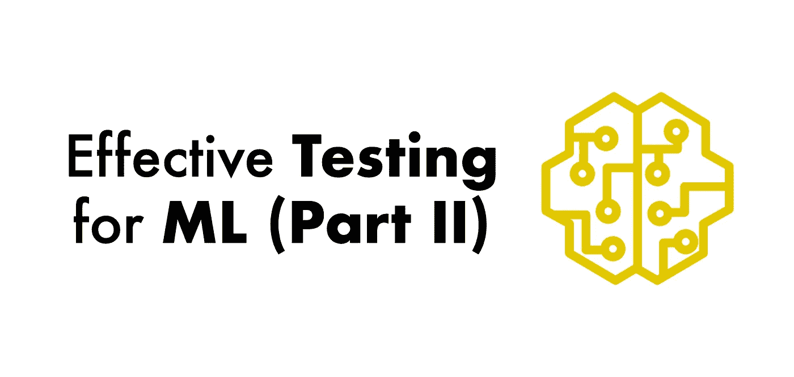
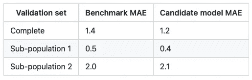
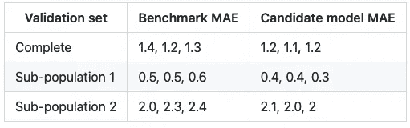

# 机器学习的有效测试(下)

> 原文：<https://towardsdatascience.com/effective-testing-for-machine-learning-part-ii-6ac7feb287a7?source=collection_archive---------24----------------------->

## 测试 ML 系列

## 用于开发健壮的 ML 项目的渐进的、逐步的框架。

图片作者。

# 介绍

在这个系列的[第一部分](/effective-testing-for-machine-learning-part-i-e6b5aeb51421)中，我们从一个简单的*冒烟测试*策略开始，以确保我们的代码在每个`git push`都能运行。然后，我们在它的基础上进行构建，以确保我们的特征生成管道产生最低质量水平的数据(集成测试)，并验证我们的数据转换的正确性(单元测试)。

现在，我们将添加更健壮的测试:分布变化，确保我们的训练和服务逻辑是一致的，并检查我们的管道产生高质量的模型。

**如果你想知道第三部何时上映，请订阅我们的** [**简讯**](https://www.getrevue.co/profile/ploomber) **，关注我们的** [**推特**](https://twitter.com/ploomber) **或**[**LinkedIn**](https://gist.github.com/edublancas/linkedin.com/company/ploomber/)**。**

# 第 3 级:分销变化和服务渠道

[**此处提供示例代码。**](https://github.com/edublancas/ml-testing/tree/3-distribution-and-inference)

## 测试目标变量分布

图片作者。

在前一级，我们引入了集成测试来检查我们对数据的假设。这种测试验证基本的数据属性，如 no `NULL` s 或数值范围。然而，如果在监督学习问题上工作，我们必须额外注意目标变量并检查其分布，以确保我们不会在不正确的数据上训练。让我们看一个例子。

在以前的项目中，我需要用新数据更新我的训练集。在这样做并训练了一个新模型之后，评估指标提高了很多。我持怀疑态度，但在最近的代码更改中找不到任何问题。于是我从生产中的模型里抽出评测报告，和我训练过的对比。评估报告包括一个带有培训数据汇总的表格；目标变量的平均值大幅下降；

由于目标变量的平均值降低，*回归问题变得更容易*。想象一个数字变量的分布:一个预测零的模型将有一个等于分布的绝对平均值的平均误差；现在，假设您添加了最近生成的数据，这些数据进一步增加了目标变量的浓度(即，平均值降低):如果您评估的模型总是预测为零，MAE 将会降低，给人的印象是您的新模型变得更好了！

在与业务涉众会面后，我们发现数据源中最近的变化引入了虚假的观察结果。在这样的事件之后，我创建了一个新的集成测试，将目标变量的平均值和标准偏差与参考值(从当前生产模型使用的训练集中获得)进行比较:

参考值不要想多了；取你之前的值，加上一些公差。然后，如果测试失败，调查是否是由于数据生成过程中的根本变化(在这种情况下，您可能需要更新您的参考值)，而不是由于一些数据错误。如果你正在处理一个分类问题，你可以比较每个标签的比例。

我们可以对所有特性应用相同的逻辑，并测试它们的分布:因为它们不应该从一次提交到下一次提交发生剧烈的变化。但是，如果您有数百个要素，手动计算参考范围将花费大量时间，因此至少要测试目标变量的分布。

注意，比较均值和标准差是一个简单(但幼稚)的测试；如果你不希望你的数据从一次迭代到下一次迭代有很大的变化，它会工作得很好，但是一个比较分布的更健壮和统计学原理的方法是 [KS 测试](https://en.wikipedia.org/wiki/Kolmogorov%E2%80%93Smirnov_test)。 [**这里有一个 KS 测试实现的例子。**](https://github.com/edublancas/ml-testing/blob/3-distribution-and-inference/tests/quality.py)

## 测试推理管道

部署一个模型比加载一个`.pickle`文件和调用`model.predict(some_input)`要多几个步骤。在将输入数据传递给模型之前，您很可能必须对其进行预处理。更重要的是，您必须确保这样的预处理步骤总是发生在调用模型之前。为此，将推理逻辑封装在一个调用中:

一旦封装了推理逻辑，就要确保对无效的输入数据抛出错误。引发异常可以防止定义不明确的情况(由您来定义)。例如，如果您期望一个包含价格数量的列，如果它有负值，您可能会引发一个错误。

可能还有其他情况，你**不想让你的模型做出预测。例如，当模型的输入在一个子群体中，而您知道该模型不准确时，您可能会提出一个错误。**

以下示例代码显示了如何测试`pytest`中的异常:

上面的例子是一种新型的单元测试；我们不是检查某个东西是否返回了特定的输出，而是测试它是否引发了错误。在您的`ServingPipeline.predict`方法中，可能会有这样的内容:

要了解更多关于用`pytest`、[测试异常的信息，请点击这里](https://docs.pytest.org/en/stable/assert.html)。

[**这里有一个示例实现**](https://github.com/edublancas/ml-testing/blob/3-distribution-and-inference/tests/test_serve.py) **，它检查我们的管道在传递不正确的输入数据时抛出一个有意义的错误。**

# 级别 4:培训-服务偏差

[**此处提供示例代码。**](https://github.com/edublancas/ml-testing/tree/4-train-serve-skew)

在这个层次上，我们测试我们的推理管道是正确的。我们必须验证两个方面来评估我们推理管道的正确性:

1.  预处理在训练和服务时是一致的。
2.  推理管道的特征生成部分正确地与模型文件集成。

## 训练发球偏斜

[培训服务](https://ploomber.io/posts/train-serve-skew/)不对称是 ML 项目中最常见的问题之一。当输入数据在服务时间(与训练时间相比)进行不同的预处理时，就会发生这种情况。理想情况下，我们应该在服务和训练时共享相同的预处理代码；然而，即使是这种情况，检查我们的训练和服务代码以相同的方式预处理数据仍然是必要的。

测试如下:从您的原始数据中采样一些观察值，并通过您的数据处理管道传递它们，以获得一组`(raw_input, feature_vector)`对。现在，取同样的输入，通过你的推理管道，并确保两个特征向量*精确匹配*。

[**这里是一个测试**](https://github.com/edublancas/ml-testing/blob/4-train-serve-skew/tests/test_train_serve_skew.py) **的示例实现，它来自我们的示例存储库，检查没有训练服务偏斜。**

为了简化培训和服务管道的维护，请查看 Ploomber，[我们的功能之一](https://github.com/ploomber/projects/tree/master/templates/ml-online)是将基于批处理的培训管道转换为内存中的管道，而无需更改代码。

## 特征和模型文件集成

假设我在一个月前部署了一个使用了十个特性的模型。现在，我正在开发一个新的，所以我将相应的代码添加到培训管道并部署:生产中断。发生了什么事？我忘了更新我的推理管道来包含最近添加的特性。因此，添加另一个测试来确保您的推理代码正确地与训练管道生成的模型文件集成是非常必要的:*推理管道应该生成与模型被训练时相同的特性。*

在我们的示例项目中，我们首先用数据样本训练一个模型，然后我们确保可以使用训练好的模型来生成预测。 [**这样的测试**](https://github.com/edublancas/ml-testing/blob/955ea0ee0fbf404f85d59d6dd9687eff7460353e/.github/workflows/ci.yml#L28) **是在** `**ci.yml**` **文件中实现的，它在每个** `**git push**` **上执行。**

# 级别 5:模型质量

[**此处提供示例代码。**](https://github.com/edublancas/ml-testing/tree/5-model-quality)

在部署模型之前，有必要对其进行离线评估，以确保它至少具有与基准模型相同的性能。基准模型通常是生产中的当前模型。这个模型质量测试帮助您快速确保将一些候选模型*发布到产品中是可接受的。*

例如，如果您正在处理一个回归问题，并使用[平均绝对误差(MAE)](https://en.wikipedia.org/wiki/Mean_absolute_error) 作为您的度量标准，您可以计算整个验证集和一些感兴趣的子群体的 MAE。假设您部署了一个模型，并计算了您的 MAE 指标；经过一些工作之后，您添加了一个新的特性来改进模型度量。最后，您将训练一个新模型并生成指标:

你如何比较这些结果？乍一看，您的模型似乎是有效的，因为它降低了前两个指标的 MAE，尽管它增加了第三组的 MAE。这种模式更好吗？

仅凭一组参考值很难判断。因此，与其只有一组参考值，不如通过多次使用相同的参数训练生产模型来创建一个分布。假设我们对基准模型和候选模型重复训练过程三次，这次我们得到三个数据点:

我们现在有了一个[经验分布](https://en.wikipedia.org/wiki/Empirical_distribution_function)。然后，您可以比较您的候选模型中的指标是否在观察到的范围内:

[**这里是我们的样本库中的一个测试实现。**](https://github.com/edublancas/ml-testing/blob/bc5606044a0bd6cee736e1db422243432db108d5/tests/quality.py#L24)

请注意，我们正在评估两边的`current`；这是很重要的，因为我们希望测试在我们的模型性能下降和急剧上升时提醒我们。虽然性能提高是个好消息，但我们应该确保这种提高是由于一些特定的改进(例如，对更多数据进行训练，添加新功能)，而不是由于方法错误，如[信息泄露](https://en.wikipedia.org/wiki/Leakage_(machine_learning))。

*注意:使用最小和最大度量值来评估模型性能是一种简单的入门方法，但是，在某些时候，您可能想要实现更具统计学原理的方法，* [*本文*](https://sebastianraschka.com/blog/2018/model-evaluation-selection-part4.html) *回顾了一些实现方法。*

在每次代码变更时测试模型质量是至关重要的。例如，假设您已经有一段时间没有运行测试了；自从上次运行以来，您增加了训练集的大小，添加了更多功能，并优化了一些数据转换的性能。然后，您训练一个模型，并且测试中断，因为管道产生了一个具有更高性能的模型。在这种情况下，您可能需要从以前的提交中训练模型，以了解是什么操作导致模型的性能超出了预期范围。与您测试每个变化的场景相比:如果您的模型在添加更多的训练数据时提高了性能，这是一个好消息！但是，如果您提高了某些数据转换的性能(例如，使用更少的内存),并且您的模型突然变得更好，那么就有理由持怀疑态度。

从统计学的角度来看，要比较的指标越多，您的[测试失败](https://en.wikipedia.org/wiki/Multiple_comparisons_problem)的几率就越高。没有明显原因就失败的测试并不好。为了提高这种测试的可靠性，您有两种选择:

1.  生成更准确的经验分布(例如，将基准模型训练 50 次，而不是 10 次)。
2.  减少要比较的指标数量。

对于关键模型，用一些手工质量评估来补充前面的模型质量测试是一个好主意。手动评估很有帮助，因为有些模型属性更难自动测试，但通过人工视觉检查可以很快显示出来；一旦您检测到任何要跟踪的关键指标，您就可以将它们包含在自动化测试中。

快速生成模型评估报告的一种方法是将您的培训代码作为笔记本运行；例如，假设您的`train.py`脚本如下所示:

您可以使用 [Ploomber](https://github.com/ploomber/ploomber) ，而不是编写额外的代码将图表和表格保存在`.html`文件中，它会在运行时自动将您的`.py`转换为`.ipynb`(或`.html`)文件，因此您可以在每次训练新模型时轻松获得模型评估报告。也可以使用 [sklearn-evaluation](https://github.com/edublancas/sklearn-evaluation) ，可以比较多个`.ipynb`文件([见本例](https://sklearn-evaluation.readthedocs.io/en/stable/user_guide/NotebookCollection.html))。

# 下一个

在第二部分中，我们增加了测试的健壮性:我们检查目标变量的分布变化，确保我们的训练和服务逻辑是一致的，并检查我们的管道产生高质量的模型，从而结束我们的 5 级框架。

在本系列接下来的(也是最后的)部分，我们将提供额外的建议来建立一个简化的工作流，允许我们重复`develop -> test -> improve`循环:我们修改我们的管道，确保它正确工作，并继续改进。

如果你想知道第三部何时上映，请订阅我们的[时事通讯](https://www.getrevue.co/profile/ploomber)，在[推特](https://twitter.com/ploomber)或 [LinkedIn](https://gist.github.com/edublancas/linkedin.com/company/ploomber/) 上关注我们。

发现错误？[点击这里让我们知道](https://github.com/ploomber/posts/issues/new?title=Issue%20in%20post%3A%20%22Effective%20Testing%20for%20Machine%20Learning%20%28Part%20II%29%22)。

*最初发表于*[*ploomber . io*](https://ploomber.io/blog/ml-testing-ii/)*。*