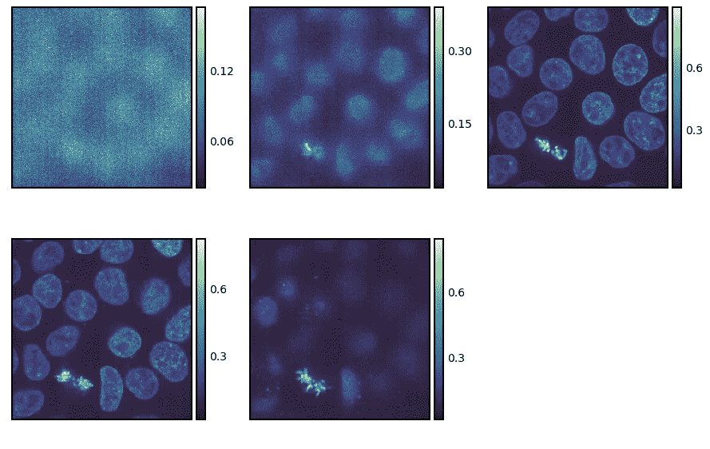
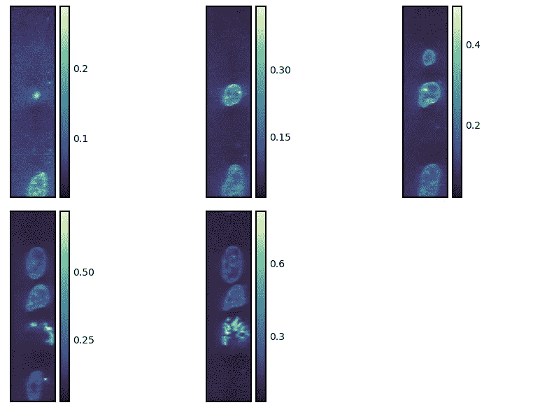
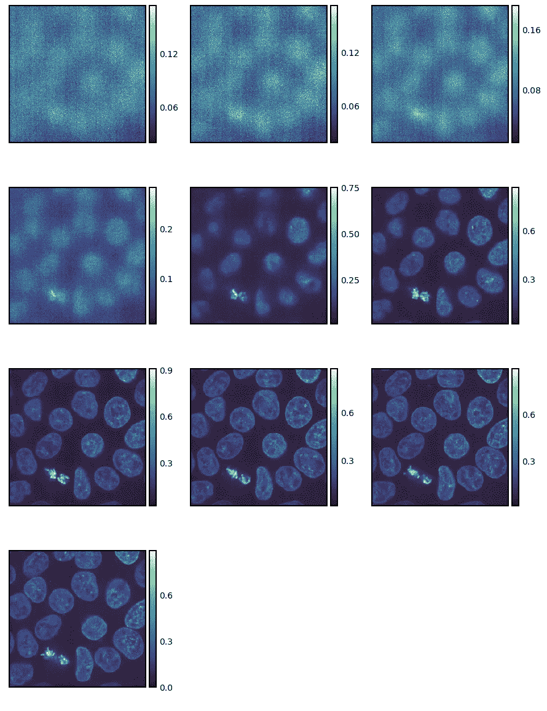
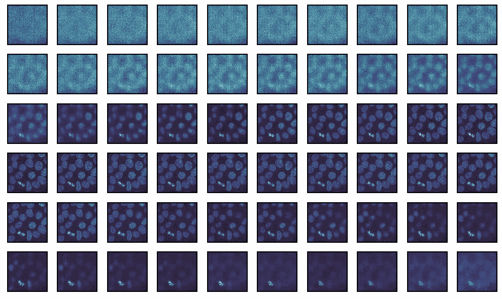
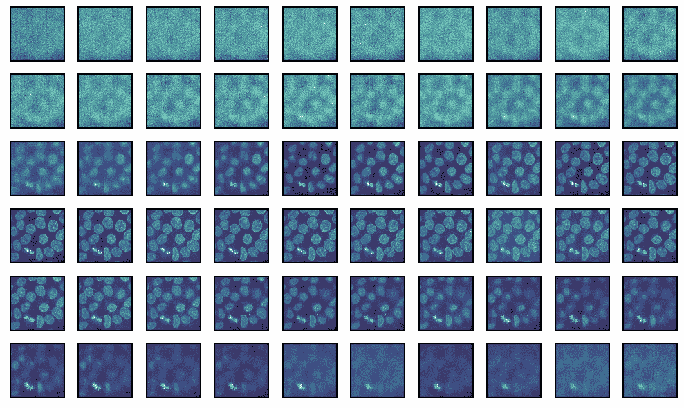

# Python 中多维图像数据的有效可视化

> 原文：<https://towardsdatascience.com/effective-visualization-of-multi-dimension-image-data-in-python-53c3c2aad947?source=collection_archive---------47----------------------->

## 获得多维图像数据？Python 可以帮忙！


安德烈·利亚科夫在 [Unsplash](https://unsplash.com?utm_source=medium&utm_medium=referral) 上拍摄的照片

一般来说，多维图像数据难以可视化。

在科学成像中(或者说在大多数成像领域)，多维图像是非常常见的。额外的维度可以是来自物理第三维度(“Z 轴”)的任何维度，其中 2D 图像是在不同深度拍摄的；时间维度，在不同的时间间隔拍摄 2D 图像；例如原子力显微镜或 RGB 图像中的不同通道。

我们将使用基于`matplotlib`的 Python 中的开源图像可视化库`seaborn-image`。

> *它深受流行的* `*seaborn*` *库的启发，用于统计可视化*

## 装置

```
pip install -U seaborn-image
```

> *你可以在* [*GitHub*](https://github.com/SarthakJariwala/seaborn-image) 上了解更多关于 `*seaborn-image*` *项目的信息*

## 加载样本 3D 数据

```
*import* seaborn_image *as* isnscells = isns.load_image("cells")cells.shape
(256, 256, 60)
```

## 设想

我们将使用`seaborn_image`中的`ImageGrid`来可视化数据。它将在网格上绘制一系列图像。

首先，我们将只使用`slices`关键字参数绘制一些选定的切片。

```
g = isns.ImageGrid(cells, *slices*=[10, 20, 30, 40, 50])
```



默认情况下，切片是沿着最后一个轴进行的。然而，我们可以使用`axis`关键字参数将它们带到另一个维度。

```
g = isns.ImageGrid(cells, *slices*=[10, 20, 30, 40, 50], *axis*=0)
```



我们还可以分别使用`start`、`stop`和`step`参数指定不同的开始/停止点以及步长。

在下面的代码中，我们从第 10 个片段开始，以 3 为步长一直到第 40 个片段。

> *如果没有指定，切片和步骤在最后一个轴上进行。*

```
g = isns.ImageGrid(cells, *start*=10, *stop*=40, *step*=3)
```



我们也可以绘制所有的图像，而不需要任何索引或切片。

```
g = isns.ImageGrid(cells, *cbar*=False, *height*=1, *col_wrap*=10)
```

> *注意——我们改变了单个图像的高度和图像列的数量。*



## 转换

最后，我们还可以对图像进行变换并将其可视化。这里，我们将使用`scikit-image`中的`adjust_gamma`功能调整曝光。

我们可以通过将函数对象传递给`map_func`参数来实现这一点。函数对象的附加参数可以作为关键字参数传递。

```
*from* skimage *import* exposureg = isns.ImageGrid(
    cells,
    *map_func*=exposure.adjust_gamma,  *# function to map
    gamma*=0.5,  *# additional keyword for `adjust_gamma`
    cbar*=False,
    *height*=1,
    *col_wrap*=10
)
```



`ImageGrid`返回一个`seaborn_image.ImageGrid`对象，是一个图形级函数，*即*生成一个新的`matplotlib`图形。我们可以分别使用`fig`和`axes`属性访问图形和所有单独的轴。这意味着对于任何在`seaborn-image`中不直接可用的定制(参见[文档](https://seaborn-image.readthedocs.io/en/latest/index.html)，我们可以下降到`matplotlib`并使用其强大的 API。

总的来说，正如我们在这篇文章中看到的，`seaborn-image`通过为*快速、有效和吸引人的*图像数据可视化提供高级 API，使我们变得更加*高效*。

你可以在 [GitHub](https://github.com/SarthakJariwala/seaborn-image) 上找到更多关于`seaborn-image`项目的信息。

感谢阅读！

*原载于 2021 年 2 月 25 日*[*https://sarthakjariwala . github . io*](https://sarthakjariwala.github.io/posts/multi-dimension-image-data/)*。*