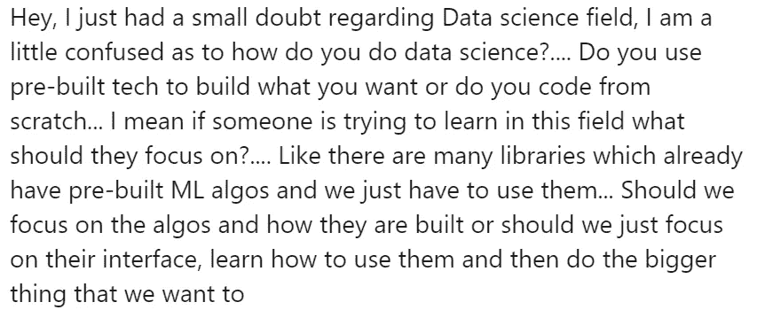
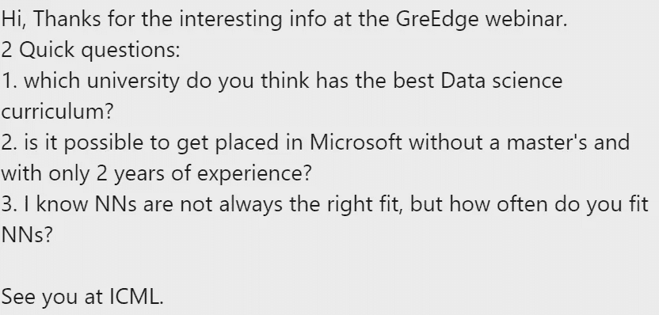
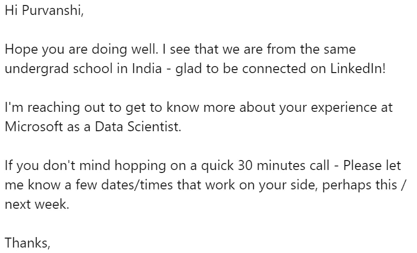

# 数据科学在线网络的有效写作

> 原文：<https://towardsdatascience.com/effective-writing-for-online-networking-6cb92a061c4e?source=collection_archive---------30----------------------->

## 如何让冷冰冰的邮件和信息发挥作用

[产品学院](https://unsplash.com/@productschool?utm_source=unsplash&utm_medium=referral&utm_content=creditCopyText)在 [Unsplash](https://unsplash.com/s/photos/networking-linkedin?utm_source=unsplash&utm_medium=referral&utm_content=creditCopyText) 上的照片

当今世界是一个网络化的世界。老实说，你认识的人越多，你就越容易找到工作，找到工作，过好自己的生活。但是本地聚会、会议和社交活动的日子已经一去不复返了。感谢伟大的在线平台(LinkedIn、Twitter、Instagram 等。)让我们保持联系，即使世界因为 Covid 而关闭。

在我的职业生涯中，我把我获得的大多数机会或面试归功于在 LinkedIn 上或通过冷冰冰的电子邮件建立关系网或接近人们。

这篇文章是我在网上接触人们时学到的。什么增加和减少了你得到回复的机会。我的经验主要基于电子邮件和 LinkedIn，但我确信这些技巧适用于任何平台和领域。这些将帮助你充分利用你的关系。

# 接近某人时不要做的事情

这部分非常主观，基于我自己的看法。但是遵循这些确实帮助我得到了回复，并导致了富有成效的讨论。

## 使用称呼

为了避免在你知道某人喜欢的代词之前不小心冒犯了他，使用中性代词是很重要的。除非对方表明自己是男是女，否则最好称呼对方的名字。

就像在这种情况下，这个人称呼我为先生。这是我们群发邮件时很常见的错误。

## 不要仅仅发送问候

我不确定如何以及为什么回复没有正文的消息。我在 LinkedIn 上得到这些，这是一个专业的网络平台。不要浪费你的时间发送嗨，你好的信息，并期待一个回应。可操作的项目总是有助于保持直截了当的对话。

## 撰写冗长的非结构化邮件

我对这条信息的唯一问题是它的结构不良。如果把信息写在一个点上，会更好地表达出来。

> 嘿，你介意回答以下问题吗-
> 
> 如何进入数据科学——学习使用库还是专注于基础？

理解每个人的时间都是宝贵的，以更好的方式提出问题会节省时间(对你和你想从中获得价值的人都是如此)。如果把这个问题设计得更好，我本可以更好地回答它。

> 保持电子邮件/信息简短明了，便于阅读。

## 询问手机号码

这个问题我已经被问过很多次了，最终，我只是忽略了这样的请求。我明白有时候问号码并不是出于恶意，但仍然尊重某人的隐私应该是非常明显的。大多数时候，这个人会说出联系他们的最佳方式。难道你不能礼貌地问~‘我联系你的最佳方式是什么？’

## 问抽象的问题

当然，这条信息是以“嗨，Purvanshi”开始的，我不知道如何回复。第二条信息更有针对性，但不具体。

*   ***稍微说说我的经历*** ~专业上？一切都已经在我的 LinkedIn 上了，还是说这是为了申请研究生院？如果是这样的话，这个人到底在寻找什么样的问题？帮助选择大学？还是迎合了签证程序？基本上，缺失的一点是*经验与什么有关？*
*   ***我申请*** 时的个人资料~还是不确定我的 LinkedIn 个人资料上没有哪个部分。也许这个人想让我在申请研究生之前列出我的经历？

这种开放式的问题令人困惑，难以回答。问清楚具体的问题是最好的方法。

# 如何构建消息/电子邮件

接近一个人背后的心理很重要。因此，始终认为对方的时间是宝贵的，你想用简洁的信息抓住他/她的注意力。构造*到点消息* s 是关键。

## 以磅为单位书写

如果你有问题，以要点的形式提出来。

如果你有很多事情要讨论，就用要点来写。

如果你想写一些不相关的话题，插入段落*。*

你也可以给你的段落加上粗体标题。要点不仅有助于快速略读，也有助于更好地回复。

这种特殊的信息有针对性的问题，使人们更容易回答。

## 给出一个共同的参考

有时给出一个共同的参考，比如同一所大学/同一家公司，或者如果你在会议上见过这个人，有助于吸引注意力。一个常见的参考也可以是这个人正在研究的主题/他开源的软件/他写的你也有兴趣了解的论文。

这里有一个例子-

这封邮件有一个很好的开头参考，分为几个段落，这样更容易阅读，最后有可操作的内容“如果你不介意跳过一个电话”。

> 这个人不会假设我会准备好接电话，而是礼貌地询问。

## 提高问题的质量

问题越有针对性，越具体，你从谈话中获得的价值就越大。这是一个例子—

前几天有人打电话问我~

> 你能谈谈微软的文化吗

这个问题没有错，但我回答说这很好，人们非常支持等等。没有提取多少价值。

为了更有针对性，我会问-

*   你平均工作多少小时？
*   截止日期有多难？你有时必须随叫随到吗？
*   在分配给你的工作中，团队在多大程度上考虑了你的个人选择？

这些更有针对性，可能会给你提供更多的信息。

# 结论

在线社交是一种技能，如果学会了，机会是无穷无尽的。没有人被限制去接近任何人，但是用对你有益的正确方式去做是需要学习的。这些是我从自己的经历中学到的一些技巧。如果有任何其他对你有用的，请随时给我发关于 purvanshi.mehta11@gmail.com 的信息，我会在这篇文章中注明。