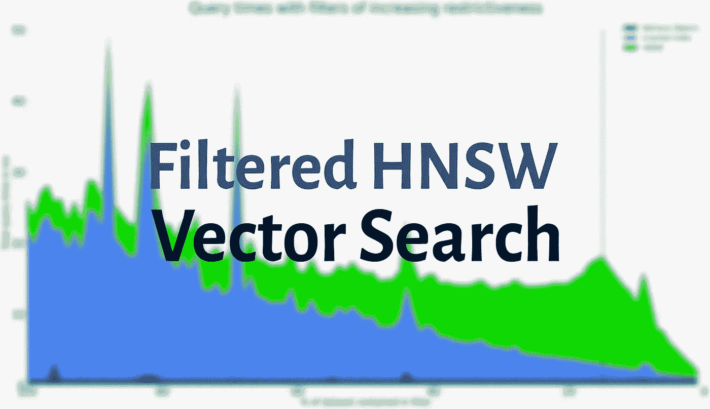
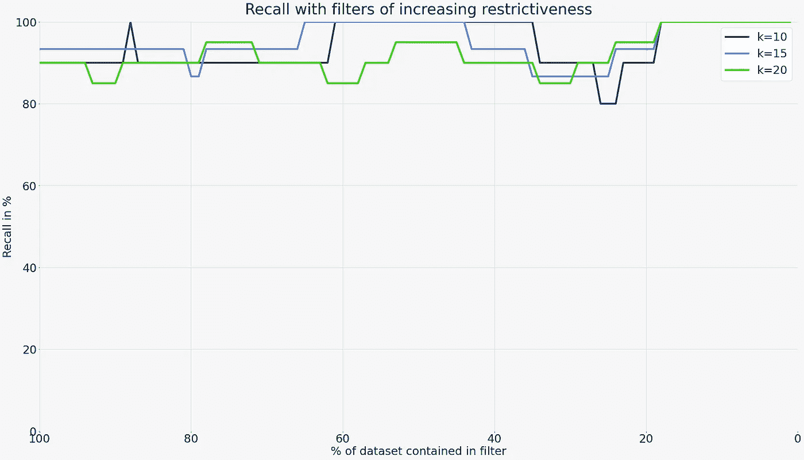
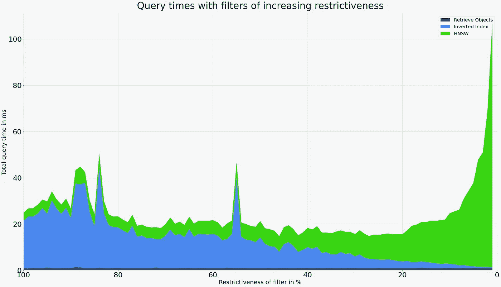
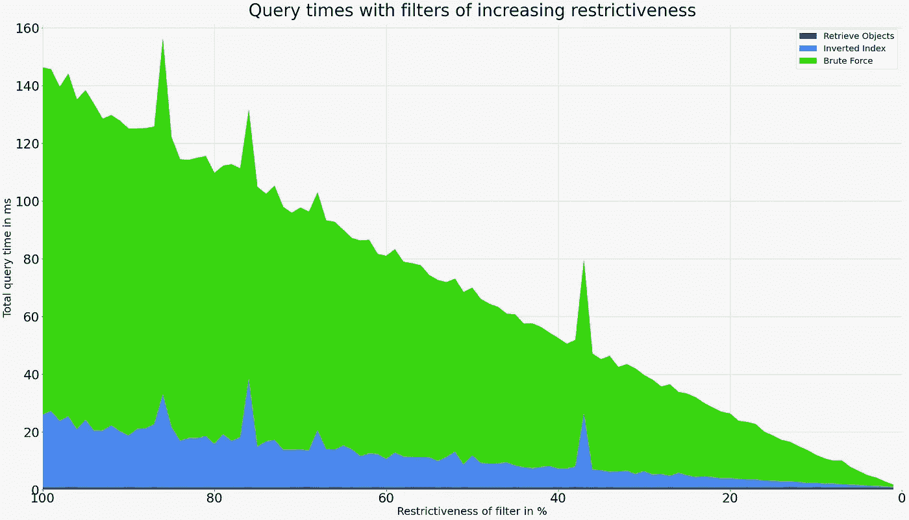

# 过滤的 HNSW 搜索对回忆和潜伏期的影响

> 原文：<https://towardsdatascience.com/effects-of-filtered-hnsw-searches-on-recall-and-latency-434becf8041c?source=collection_archive---------27----------------------->

## 一个实验，看看松散和限制性过滤器如何影响矢量搜索速度和质量。

本文包含了一个实验，该实验是关于将过滤器应用于基于 HNSW 的向量搜索如何影响召回率和查询速度的。使用一个简单的技巧，我们可以在任何类型的过滤器上实现高召回率和低响应时间——而不需要预先知道过滤器是什么样子的。

过滤的 HNSW 向量搜索—对召回和查询时间的影响。图片作者。

向量搜索现在是一个热门话题，就召回/延迟权衡而言，HNSW T1 是 ANN 索引模型的 T2 顶级竞争者 T3 之一。如果增量构建和 CRUD 操作很重要——矢量搜索引擎通常就是这种情况——HNSW 通常被认为是最佳选择。在现实生活中，向量搜索经常需要过滤。例如，在一个电子商务应用程序中，用户可能希望找到与当前购物车中的商品相关的商品(向量搜索)，但根据可用性和利润率对它们进行过滤(结构化搜索)。

可以调整 HNSW 以允许这种结构化过滤，但这带来了这种过滤对查询速度和召回率的影响的问题。现有的基准只衡量未过滤搜索的这些权衡。在本文中，我们将使用开源矢量搜索引擎 [Weaviate](https://www.semi.technology/developers/weaviate/current/) 运行一些过滤矢量搜索实验，该引擎支持[这些开箱即用的操作](https://www.semi.technology/developers/weaviate/current/graphql-references/filters.html#where-filter)。我们将应用不同限制性的过滤器，并将查询速度和召回率与未过滤的向量搜索进行比较。

# 后置过滤与前置过滤

通常，有两种关于过滤向量搜索的范例；在矢量搜索已经完成之后或之前应用过滤器。如果过滤器的限制不是很严格，即当它包含大部分数据集时，后过滤可能会工作得很好。然而，当过滤器变得非常严格时，过滤后的召回率急剧下降。想象一个场景，其中过滤器仅匹配数据集的 5%。现在执行 k=20 矢量搜索。假设数据是均匀分布的，我们希望结果集中只包含一个匹配，然而用户要求 20 个结果。

> 当过滤器变得更加严格时，后过滤会导致非常低的召回值。因此，需要预过滤结合有效的向量索引来实现更大的整体召回率。

这表明，如果我们想要解决所有限制级别的过滤器，后置过滤不是可行的选择。相反，我们需要应用预过滤。一些作者认为，术语“逐级过滤”意味着不能再使用人工神经网络模型。然而，这不是本文中使用的定义。我们使用术语预过滤来表示有效的“传统”索引结构，例如倒排表，可以用于确定允许的候选集合。然后这个列表被传递给 ANN 模型——在这个例子中是 HNSW。

# 测试设置

对于我们的实验，我们选择了以下设置:

*   使用 Weaviate v1.8.0 运行，该版本使用带有扩展过滤和 CRUD 支持的定制 HNSW 实现。
*   100 个过滤器，限制性增量为 1%(0%限制性->100%数据集包含在过滤器中，99%限制性-> 1%数据集包含在过滤器中)
*   带有随机 256d 向量的 250k 对象
*   Weaviate 的默认 HNSW 构造设置(`efConstruction=128, maxConnections=64`)
*   1 个弱服务器节点上的 1 个类碎片
*   在配有四核英特尔酷睿 i7 CPU 的 2014 款 iMac 工作站上运行

有些选择是随意的，可能会影响结果。例如，使用更现代的 CPU 会导致查询时间略微加快，但不会影响召回。使用更大的数据集会导致查询时间稍长，等等。它们是代表许多用户需求的起点，可以针对其他用例进行调整。

# 结果

## 回忆

在详细查看查询时间之前，我们想看一下不同限制的过滤器的召回。下图在左侧显示了一个非常宽松的过滤器(0%限制度)，在右侧显示了一个非常严格的过滤器(99%限制度)，以及其间的各种步骤。已经针对 k=10、k=15 和 k=20 的大小执行了查询，这将是搜索结果页面上的典型长度。

召回过滤向量搜索与削弱各种水平的限制。x 轴的左端表示宽松的过滤器，其中包含 100%的数据集，中心表示包含 50%,右端表示仅包含 1%的数据集。图片作者。

**正如我们所看到的，召回率在天平的两端都没有显著下降**。x 轴的左边缘表示匹配 100%数据的筛选器。换句话说，它相当于一个未过滤的矢量搜索。这些回忆值作为我们比较的基线。随着过滤器越来越严格，线条有时会下降到基线以下，有时会上升到基线以上。但平均而言，过滤似乎不会对矢量搜索的回忆产生负面影响。有趣的是，随着过滤器变得更加严格(少于所包含的数据集的 20%)，召回是完美的(100%)。请注意，当禁用 HNSW 切断时也是如此，这将在下面解释。

## 查询速度

知道了召回不会受到很大影响——即使应用非常严格的过滤器——我们现在可以将注意力转移到查询速度上。下面显示了与上面相同的过滤器的查询速度。速度由三个要素组成:

*   **倒排索引** 这表示为所有候选人建立一个允许列表所需的时间。这发生在列表被传递给 HNSW 实现之前。它使用磁盘上的倒排表。
*   **HNSW**
    这表示执行过滤的 HNSW 搜索所需的时间。
*   **对象检索**

各种过滤向量搜索的查询速度(毫秒)。因为搜索(几乎)是不受限制的(最左边)，所以大部分时间都花在用倒排索引构建允许列表上。随着过滤器变得更加严格，HNSW 搜索时间会稍微增加，但是总时间不会超过初始值。图片作者。

上图强调了以下几点:

*   **无论使用何种过滤器，搜索时间通常不会超过 30 毫秒，平均值远低于 20 毫秒**。注意:*有一些随机峰值是由后台任务和/或垃圾收集造成的。注意，实验是在具有各种后台任务的 macOS 工作站上执行的，而不是在专用硬件上。*
*   使用倒排索引从磁盘构建允许列表的成本大致呈线性下降，因为过滤器变得更加严格，从而减少了潜在匹配的数量。
*   HNSW 索引在搜索未过滤时效率最高(最左侧)。随着过滤器变得更加严格，搜索 HNSW 索引的成本会略微增加，但通常会被构建倒排索引的成本减少所抵消。
*   垂直虚线突出显示了一个可配置的截止值。此时，Weaviate 在内部切换搜索机制。这种截止是完全可配置的，将在下一节中详细解释。在我们的实验中，它被设置为 40，000 个对象或总数据集大小的 15%。

# 非常严格的过滤器和引入平面搜索截止的影响

在上一节中，我们强调了 Weaviate 会在指定的截止点自动切换搜索机制。为了理解为什么会发生这样的转变，我们需要看看如何使用 HNSW 执行过滤搜索。

HNSW 是一个基于图形的索引模型。这意味着图形中的节点被放置成使得相似的对象位于附近。每个节点都有一组到相邻节点的边。为了避免图形变得过于庞大，HNSW 以两种方式限制边的数量；对于边的数量有一个固定的限制，并且有一个启发式方法来确定最有价值的连接。当由于连接变得太大而需要修剪连接时，HNSW 将删除那些离现有邻居比离节点本身更近的元素。例如，在非常简单的图中，`A--B--C`没有必要将 A 连接到 C，因为只需从 A 增加一跳(通过 B)就可以有效到达 C。这被称为[小世界现象](https://en.wikipedia.org/wiki/Small-world_experiment)，它代表 HNSW 中的“SW”。

在搜索时，HNSW 总是从一个特定的入口点开始，并评估它的相邻连接。与指定的查询向量最接近的被添加为候选。在任一点保留的候选项的数量由查询时间`ef`参数控制。如果添加新的候选者不再改善候选者集合中的最差距离，则搜索完成。这就是为什么 HNSW 是一个近似的索引，并且比暴力破解要快得多。此外，该图由多个层组成(HNSW 中“H”的“分层”)。这允许在包含较少点并且边相当长的较高层上在图形的正确方向上有效地移动。

无截止的过滤搜索。图片作者。

过滤搜索时，不在允许列表中的候选人不会被添加到结果集中。这意味着，随着过滤器变得非常严格(85%及以上)，HNSW 搜索将找到越来越多从距离角度来看可行但被过滤器排除在外的候选。如果我们从上面显示的搜索中移除截止点，我们可以看到当我们移动到右边时，查询时间急剧增加(非常严格的过滤器)。

相比之下，暴力搜索会是什么样子呢？图片作者。

然而，由于 Weaviate 还具有倒排索引的特性，并且在开始向量搜索之前就已经确定了候选项，所以我们现在可以利用这少量的数据点。平面搜索(强力搜索)的成本与数据集的大小成线性关系。侧边的图表显示，平面搜索遵循与 HNSW 搜索相反的模式。随着我们对过滤器的限制越来越多，查询时间会减少。为了证明蛮力的成本是过滤器限制性的函数，我们将 Weaviate 中的截止值设置为 250k，这意味着对于每个过滤的向量搜索，HNSW 索引都被有效地跳过。

这清楚地表明，在大多数情况下，平面搜索查询时间要差得多。然而，在 HNSW 苦苦挣扎的那些案例中，平面搜索大放异彩。因此，一个简单的从一个切换到另一个的截止点允许在任何限制级别上进行非常有效的搜索。

# 结论

这个实验表明，当使用 Weaviate 的混合方法时，对于大多数过滤的搜索使用 HNSW 索引，但是对于极其有限的搜索切换到平面搜索，我们可以在任何过滤器上实现很大的召回和查询时间。

召回率在整个过滤器集合中大致恒定，并且处于与未过滤的对照搜索相当的水平。实验中的查询时间总是低于 30 毫秒，平均查询时间远低于 20 毫秒，这对于延迟最关键的用例来说已经足够快了。

要了解更多关于 Weaviate 的信息，您可以浏览文档。