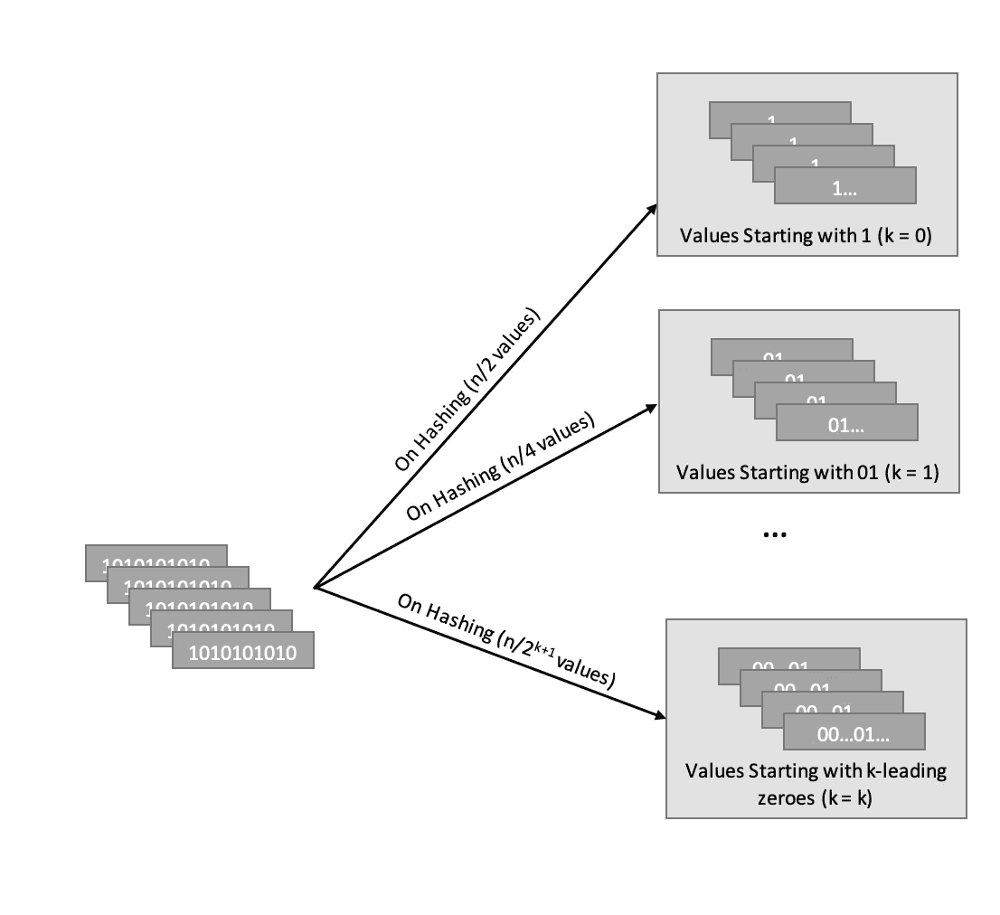
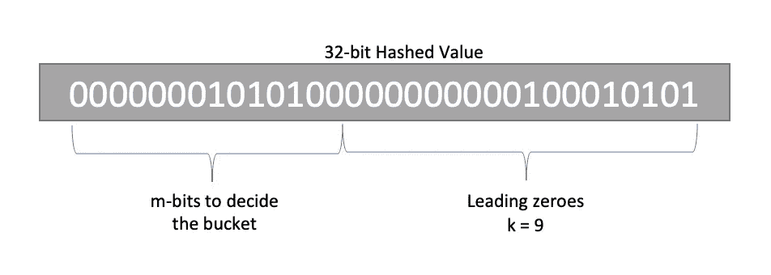
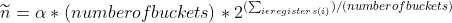
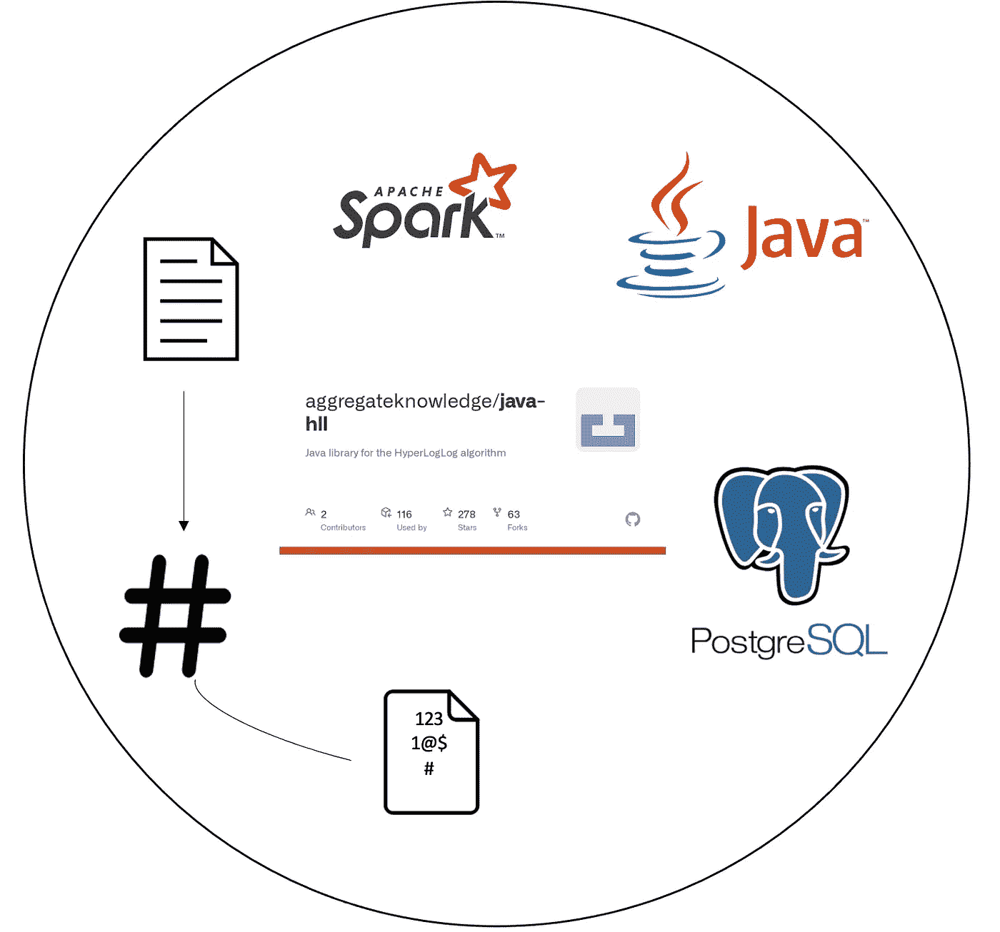

# 基于 Spark 和 Postgres 的 HLL 的有效基数估计

> 原文：<https://towardsdatascience.com/efficient-cardinality-estimation-using-hll-with-spark-and-postgres-dcf1cd66ede9?source=collection_archive---------20----------------------->

*帮助您使用超对数算法进行端到端有效基数估计的完整指南。*

# **问题陈述**

基数估计问题是寻找数据块中不同元素的数量的问题，其中相同的元素被重复多次。这个问题非常普遍，在现实世界中有很多应用，比如网站的活跃用户、独特的实时会话等等。

这个问题似乎是小孩子的游戏，但我们必须将所有的值保存在一个集合中，以跟踪我们已经考虑的所有值，当我们谈论数百万或数十亿用户/会话时，这最终将是一个问题。我们当然不能在内存中保存和处理具有如此大基数的集合。

# **可能的解决方案**

我们可以使用以下任何一种方法来进行基数估计:

1.  独特计数
2.  线性计数
3.  对数对数算法
4.  超对数算法

**不同计数**

寻找基数的蛮力方法，我们上面讨论的关于保持所有唯一元素在一个集合中并找出基数的方法。就时间和空间复杂性而言，它是线性的 O(n ),按原样存储所有对象。

**线性计数**

该技术使用容量为 B 位的哈希表，所有位初始化为 0。当一个条目到达时，我们对它进行哈希运算，该位的值被改为 1。重复数据删除通过对输入进行哈希处理来实现。该算法在时间和空间复杂度方面也是线性的，但是占用的空间少得多，因为我们只保存比特而不是精确的值。现在，让我们比较哈希表的大小和我们可以拥有的唯一元素的大小。假设您的集合中有 N 个唯一的条目:

1.  当 N << B, then hash collisions would be less and the count of 1 bit in the hash table would be a good estimate of the cardinality.
2.  When N ≈ B, then a significant number of hash collisions would surely occur. But we can estimate the number of collisions by checking how full the hash table is. Using this estimation of the number of collisions we can extrapolate to the approximate cardinality of the set.
3.  When N > > B 时，散列表中的每一位都将被设置为 1，这样就不可能计算出真正的基数。

当我们知道先验的最大可能的独特元素时，这种方法似乎是一个很好的选择。

**对数对数算法**



这种算法也是基于散列的，它跟踪散列值的二进制表示中出现的零的最大数量。让我们假设出现的零的最大数量是 k，那么估计计数将是 2^k.

它基于这样的想法:一半的值以 1 开始，四分之一以 01 开始，八分之一以 001 开始，依此类推，得到 k 个前导零的概率是 1/2^(k+1).现在，这种估计会非常不稳定，并且会有非常高的方差，因为我们可以让第一个哈希值也有 5 个前导零。



为了使它更稳定，我们采用由多个散列函数给出的估计值的平均值(算术平均值)。把我们带到另一个计算量很大的过程，哈希。现在，为了解决这个问题，LogLog 将从已经散列的值获得的值转换成 2 个值，取前 m 位，它指向一个特定的值桶，然后取剩余的位作为获得最大数量的零的值。

因此，如果我们假设我们的散列函数返回 32 位，并且我们用前 14 位来决定它所指向的桶，那么我们将有 2^14 桶来平均 k 的值。

假设在每个桶中，我们想要存储 N 个元素，那么我们将必须只存储 log(N)数量级的单个数字，并且为了存储，我们只需要 log(log(N))个比特，这就是它的名字。

举个例子，如果我们为每个桶取 5 位寄存器来存储该桶和 2^14 桶的 k 的最大值，这将允许我们为每个桶取从 0 到 31 的值，这意味着我们可能在每个桶中有 2^31 元素(使用上述概率)，这意味着我们可以仅通过使用空间(214 * 5) = 81920 位(10 KBs)来近似地将 2^(31+14 的不同元素保持在最大值。

它将估计数量定义如下:



> 其中，α →估计因子(常数值)
> 寄存器(i) →第 I 个桶的最大前导零计数的值

## 超对数算法

这是一个对数对数算法的改进算法。当组合多个桶的结果时，它使用调和平均值代替算术平均值，这迎合了最大前导零计数的异常高的值。此外，它还提供了对两种极端情况的修正，一种是不是所有的桶都被占用，另一种是哈希冲突导致低估。

# 超对数实现



不同的图书馆都在实现 HLL 算法，我们选择使用聚合知识的 HLL 实现，原因如下:

*   有一个可与 Postgres DB([PostgreSQL-hll](https://github.com/citusdata/postgresql-hll))互操作的库，同样被 Swoop 的 [Spark-Alchemy](https://github.com/swoop-inc/spark-alchemy) 使用。
*   有能力联合两个 hll。
*   易于使用的 API。

# 履行

要在 Mac 系统上试用 [postgresql-hll](https://github.com/citusdata/postgresql-hll) 扩展，请使用以下步骤:

所以，扩展安装在 Postgres 中。现在，我们需要运行以下查询来激活特定 DB 中的扩展。

为了测试上面的示例，使用以下查询创建一个表并插入一些数据:

然后尝试 Postgres 中的 hll 与 Java APIs 的互操作性。使用以下查询创建了另一个表

然后用一个 Java 程序创建 hll，使用从 0 到 n 的一系列数字，这样我们就知道其中有多少唯一的条目，将它们推送到 Postgres，然后对它们进行聚合和计数。因为我们这样知道了唯一的条目，所以我们可以计算 user_id 和 session_id 的错误百分比。

这里需要注意的几件事是:

*   如果我们想要联合两个 hll 或者合并两个 hll，那么我们应该总是用相同的种子散列它们，否则相同的值也将给出两个不同的散列值，并且将被计为两个。
*   hll 的标准误差可由以下公式给出，预计计算值分别在 65%、95%和 99%情况下的实际计数的σ、2σ和 3σ范围内。σ = (1.04)/√(桶数)

# Spark UDFs

我们使用 Java APIs 来编写 UDF

# 聚合知识的存储规范

让我们来看看 AgKn 为提高基数估计的准确性而提出的 HLLs 类型。

## 类型

*   **空**一个常数值表示空集。
*   **Explicit** 这样做是为了提高低基数时的准确性，因为我们可以直接将散列输入的显式集合保存为 64 位整数的排序列表。我们还可以调整 expthresh，根据我们的用例保留更多或更少的数字，但是自动模式支持最佳的内存使用。
*   **稀疏**
    它的思想是基于稀疏数组的，在稀疏数组中我们保存只有非零值的索引的值。类似地，它是 HLL 的基于映射的实现，只存储映射中非零寄存器的索引值，直到非零寄存器的数量超过固定基数。因此，它实际上只保存那些寄存器至少有 1 个非 0 位的桶的寄存器值。
*   **完全**
    完全具体化的、基于列表的 HLL 实现。在按寄存器索引排序的列表中显式存储每个寄存器的值。

不是，访问 Schema 布局和数据如何以字节数组格式排列，可以在这里[访问](https://github.com/aggregateknowledge/hll-storage-spec/blob/master/STORAGE.md#storage)。

# 聚合知识的参数定义和调整

## 1.Log2m

这个值决定了桶或者寄存器的数量，m 是这里实际的寄存器数量，我们可以用 2(Log2m)来计算寄存器的数量。此外，该值决定了 HLLs 的精度。下面的表达式给出了标准误差估计。此外，需要注意的一点是，对于 65%、95%和 99%的情况，计算值预计分别在实际计数的σ、2σ和 3σ范围内。σ = (1.04)/√(m)

## 2.RegWidth

这是寄存器/桶的宽度或 HLL 算法中每个寄存器使用的位数。必须至少为 1，最多为 8。该参数与 log2m 结合使用，可以调整其基数可以估计的集合的最大基数。请参考[表](https://github.com/citusdata/postgresql-hll#regwidth)了解 HLL 大小和最大基数。

**3。ExpThresh**

根据集的基数，在显式提升为稀疏提升时进行调整。

```
If the `EXPLICIT` representation is turned off, the `EMPTY` set is promoted directly to `SPARSE`. Must be -1 {Promote at whatever cutoff makes sense for optimal memory usage. ('auto' mode)}, 0 {Skip EXPLICIT representation in hierarchy. (Promotes directly to Sparse.)}, or 1-18 inclusive {Promote at 2^expthresh - 1 cardinality}.
```

您可以选择显式截断，这样它将比完整的 hll 表示占用更多的内存。这是允许的，因为在某些预设的基数范围内需要完美的精度和准确性，在此之后，基数的估计就足够了。

**4。斯巴森**

启用或禁用稀疏表示。如果显式和稀疏表示都被禁用，空集将直接提升为完整集。如果启用了稀疏，当内部稀疏表示的内存占用超过完整版本的内存占用时，将从稀疏提升到完整版本。必须为真或假。True 表示启用，false 表示禁用。

# 结论

超对数算法有助于在一定阈值内解决基数估计问题，而不会使存储空间过载以保留所有元素。

此外，聚合知识为 HLL 算法提供了强大的支持。其他可以尝试的库有 [Datasketch](https://datasketches.apache.org/docs/HLL/HLL.html) ， [Zetasketch](https://github.com/google/zetasketch) 。

# 参考

*   [https://mungingdata . com/Apache-spark/hyperlog log-count-distinct/](https://mungingdata.com/apache-spark/hyperloglog-count-distinct/)
*   [https://github . com/swoop-Inc/Spark-alchemy/wiki/Spark-HyperLogLog-Functions](https://github.com/swoop-inc/spark-alchemy/wiki/Spark-HyperLogLog-Functions)
*   [https://data bricks . com/session _ eu19/高性能-高级-分析-火花-炼金术](https://databricks.com/session_eu19/high-performance-advanced-analytics-with-spark-alchemy)
*   https://github.com/aggregateknowledge/java-hll
*   [https://www . moderndesartes . com/essays/hyperlog log/index . html](https://www.moderndescartes.com/essays/hyperloglog/index.html)
*   [https://highly scalable . WordPress . com/2012/05/01/probability-structures-we B- analytics-data-mining/](https://highlyscalable.wordpress.com/2012/05/01/probabilistic-structures-web-analytics-data-mining/)
*   [https://github . com/citus data/PostgreSQL-hll #参数解释和调整](https://github.com/citusdata/postgresql-hll#explanation-of-parameters-and-tuning)
*   [https://github . com/aggregate knowledge/hll-storage-spec/blob/master/storage . MD](https://github.com/aggregateknowledge/hll-storage-spec/blob/master/STORAGE.md)
*   [https://banner 2 . clean png . com/2019 06 23/uxe/kiss png-logo-Java-development-kit-portable-network-graphic-5d 0f 25d 68733 . jpg](https://banner2.cleanpng.com/20190623/uxe/kisspng-logo-java-development-kit-portable-network-graphic-5d0f25d6871765.6875406615612738145533.jpg)
*   [https://upload . wikimedia . org/Wikipedia/commons/thumb/f/F3/Apache _ Spark _ logo . SVG/1200 px-Apache _ Spark _ logo . SVG . png](https://upload.wikimedia.org/wikipedia/commons/thumb/f/f3/Apache_Spark_logo.svg/1200px-Apache_Spark_logo.svg.png)
*   [https://CPL . Thales group . com/sites/default/files/content/paragraphs/intro/2020-03/PostgreSQL-logo . png](https://cpl.thalesgroup.com/sites/default/files/content/paragraphs/intro/2020-03/postgresql-logo.png)