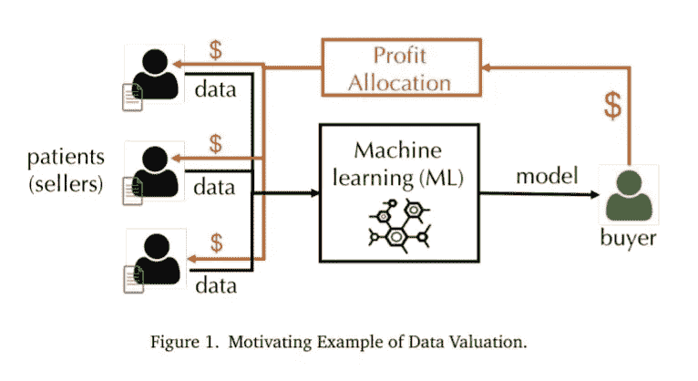
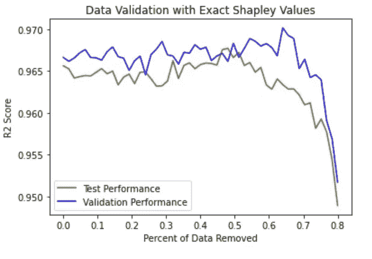

# 具有精确 Shapley 值的高效数据评估

> 原文：<https://towardsdatascience.com/efficient-data-valuation-with-exact-shapley-values-f0689ff708e?source=collection_archive---------21----------------------->

## [思想和理论](https://towardsdatascience.com/tagged/thoughts-and-theory)

## **用更少的数据产生更好的模型。**


由[拍摄的亚历山大·辛恩](https://unsplash.com/@swimstaralex?utm_source=medium&utm_medium=referral)在 [Unsplash](https://unsplash.com?utm_source=medium&utm_medium=referral)

这篇文章概述了论文中所做的工作— **“最近邻算法的高效特定任务数据评估”**。

数据越多，结果越好吗？鉴于机器学习的趋势，你会有同样的期待。鉴于最近越来越多的具有优异性能的机器学习模型的兴起，更多的数据似乎是王道。

这种模式在机器学习的进步中得到了例证，如 OpenAIs GPT-3 模型，它在来自书籍和互联网的超过 45tb 的数据上进行训练，以支持其 1750 亿个参数。但这种模式与谷歌的新开关变压器架构相比实在是相形见绌，该架构拥有 1.6 万亿个参数。因此，似乎越来越大的模型和越来越多的数据是不可避免的。

> “信息是 21 世纪的石油，而分析则是内燃机。”——Peter Sondergaard，Gartner 高级副总裁

如果数据如此有价值，我们应该收集更多吗？为什么我们不能拥有更多如此珍贵的东西？

**这种方法有一个问题**。如果你收集的额外数据与你的问题无关呢？如果纯粹是噪音呢？那么任何额外的数据都会严重影响模型的性能。那么你能做些什么来缓解这个问题呢？

首先，你可以仔细检查你的数据。这种方法可能是最有效的工具之一，但是当您拥有大量数据时，这种方法非常耗时。对于计算机视觉任务，有许多不同的技术可以使用。这篇文章展示了一些令人兴奋的技术。

[](/explaining-how-i-reached-the-top-ranks-of-the-new-data-centric-competition-888fc8e86547) [## 解释我如何在以数据为中心的新竞争中名列前茅

### 继吴君如本人代言(！)关于我的上一篇文章，很自然地分享了所有的技巧(与…

towardsdatascience.com](/explaining-how-i-reached-the-top-ranks-of-the-new-data-centric-competition-888fc8e86547) 

在许多情况下，适用的数据相对容易识别。然而，对于其他人来说，这充其量是一个不明确的任务。通常问题的一部分是数据和结果之间的关系是我们试图建模的。**然后确定什么数据最适用是一项艰巨的任务**。

幸运的是，有一种基于 Shapley 值的新方法非常适合这种情况。

# **SHAP 价值观**

**SH**apley**A**additive ex**P**lanations(SHAP)是一种解释任何机器学习模型输出的博弈论方法。这种方法是众所周知的，但是属性仅仅基于特征。

该方法将来自特征的属性值提供给模型的输出。SHAP 值基于沙普利值，沙普利值决定了如何在游戏中公平地在多个玩家之间分配报酬。对于 SHAP 价值观来说，玩家联盟是基于特征的。

[](https://github.com/slundberg/shap) [## GitHub - slundberg/shap:一种解释任何机器学习输出的博弈论方法…

### SHAP 是一种博弈论的方法来解释任何机器学习模型的输出…

github.com](https://github.com/slundberg/shap) 

SHAP 价值观非常灵活。例如，在计算机视觉任务中，SHAP 值代表不同像素对模型输出的贡献。有许多不同的方法来计算 SHAP 值，包括与模型无关的 KernelSHAP 方法。

对于 SHAP 值的每一个变化，归因总是与模型的特征有关。然而，还有一个选择。将实例用作玩家，并计算每个实例的属性。

# **数据估值**

“最近邻算法的有效的特定任务数据评估”是一篇最近的论文，提供了计算精确 Shapley 值的新算法。在本文的其余部分，我将为每个实例生成的 Shapley 值称为数据 Shapley 值。

数据 Shapley 值是最近的一项创新，它利用 Shapley 值来确定不同数据实例的属性。这项研究的动机是通过优化从数据市场中选择的记录来保护隐私的机器学习。数据市场由许多不同的医疗记录组成。因此，数据购买者选择从数据市场购买记录的子集。由于数据成本，买方的目标是为他们的模型选择最佳的患者子集。



数据市场问题[https://arxiv.org/pdf/1908.08619.pdf](https://arxiv.org/pdf/1908.08619.pdf)(图片来自论文)

该问题配置中的 Shapley 值测量归因于每个数据点平均总体可能数据子集的效用的边际改善。

计算 Shapley 值的最重要的问题是高度的复杂性。一般来说，这是在 O(2^N 的水平)进行精确计算。

然而，研究人员开发了一种使用 KNN 实用程序为 K-NN 分类器设计的精确 Shapley 值的新算法。该算法依赖于 KNN 效用满足分段效用差分性质的事实。

我将把精确的数学公式留给论文和好奇的读者。但结果是这样的。该算法以 O(N log N)复杂度执行精确计算。

[](https://github.com/AI-secure/KNN-PVLDB) [## GitHub - AI-secure/KNN-PVLDB:官方回购“高效的特定任务数据估值最近…

### 这个 repo 是 PVLDB 论文“最近邻的高效特定任务数据评估…

github.com](https://github.com/AI-secure/KNN-PVLDB) 

# **实验**

实验的结构遵循简单的格式。首先，数据被分成训练集、验证集和测试集。然后，基于训练实例对验证实例的属性来计算精确的 Shapley 值。

然后根据它们的 Shapley 值对训练实例进行排序。这种设置为用户提供了每个实例对验证集的属性。接下来，用户可以只选择那些具有最高 Shapley 值的实例，为用户提供更小的数据子集。

由于该过程选择对验证集的性能贡献最大的数据，因此移除实例将降低 Shapley 值，这通常会移除数据中噪音最大的实例。同时，保留最有代表性的例子。

实验使用了 diamonds 数据集。该数据集包含近 54，000 颗钻石。这些特征包括钻石属性，如钻石的克拉、切割、颜色和其他一些特征。一些特征是分类的，对于这些实验，我将这些特征转换成每个类别的布尔特征。

目标是钻石的价格。

[](https://www.kaggle.com/shivam2503/diamonds) [## 钻石

### 通过切割、颜色、净度、价格和其他属性来分析钻石

www.kaggle.com](https://www.kaggle.com/shivam2503/diamonds) 

我已经进行了 5000 次验证和测试。剩余的数据用于训练。

目的是利用较少的数据建立一个预测钻石价格的模型。我用一个决策树回归器评估了性能。基于 Shapley 值对数据进行排序，并且使用 R 分数来测量性能。

```
import numpy as np
from sklearn.utils import shuffle
from sklearn.tree import DecisionTreeRegressor
from exact_sp import get_true_KNN, compute_single_unweighted_knn_class_shapley
import matplotlib.pyplot as plt
import pandas as pddf = pd.read_csv('diamonds.csv', index_col='index').reset_index(drop=True)
df = pd.get_dummies(df, columns = ['cut', 'color', 'clarity'])
x_trn = df.drop(['price'], axis=1).to_numpy()
y_trn = df['price'].astype(float).to_numpy()
x_trn, y_trn = shuffle(x_trn, y_trn, random_state=10)
x_tst, y_tst = x_trn[:5000], y_trn[:5000]
x_val, y_val = x_trn[5000:10000], y_trn[5000:10000]
x_trn, y_trn = x_trn[10000:], y_trn[10000:]
K = 1
```

接下来，计算 Shapley 值进行验证。代码块也依次适合较小数据量的模型。该数据是根据递减的 Shapley 值考虑的。

一旦在训练数据的子集上训练了模型，就在测试数据集上评估该模型。

```
x_val_knn_gt = get_true_KNN(x_trn, x_val)
val_sp_gt = compute_single_unweighted_knn_class_shapley(x_trn, y_trn, x_val_knn_gt, y_val, K)g_values = np.mean(val_sp_gt, axis=0)
count = int(len(x_trn)*4/5)
interval = int(count*0.02)
x = np.arange(0, count, interval)/len(x_trn)
g_r2_scores = []
g_r2_scores_val = []
idxs = np.argsort(g_values)
keep_idxs = idxs.tolist()for j in range(0, count, interval):
    if len(keep_idxs) == len(x_trn):
        x_train_keep, y_train_keep = x_trn, y_trn
    else:
        x_train_keep, y_train_keep = x_trn[keep_idxs], y_trn[keep_idxs]
    reg = DecisionTreeRegressor()
    reg.fit(x_train_keep, y_train_keep)
    r2_score = reg.score(x_tst, y_tst)
    r2_score_val = reg.score(x_val, y_val)
    g_r2_scores.append(r2_score)
    g_r2_scores_val.append(r2_score_val)
    keep_idxs = keep_idxs[interval:]plt.plot(x, g_r2_scores, '-', label='Test Performance', color='olive')
plt.plot(x, g_r2_scores_val, '-', label='Validation Performance', color='blue')
plt.ylabel('R2 Score')
plt.xlabel('Percent of Data Removed')
plt.legend(loc="lower left")
plt.title('Data Validation with Exact Shapley Values')
plt.show()
```

实验结果表明，该模型在较少数据的情况下，对测试数据的表现较好。当几乎 50%的训练数据被删除时，测试性能达到峰值。

同样有趣的是，当超过 60%的训练数据被删除时，验证集上的模型性能达到峰值。因为实例是根据验证集的 Shapley 值删除的，所以这种模式有一定的意义。



删除数据后的性能变化(图片由作者提供)

# **结论**

尽管海量数据的可用性不断增加，但数据的质量至关重要。在低质量的数据上构建模型会产生低质量的模型。

在实例上使用 Shapley 值提供了一种替代方法。您可以用更少的实例创建模型，从而提高性能。实验表明，即使数据子集非常小，较少的数据也可以提高模型性能。

数据是新的石油，但是石油的质量很重要。

考虑在下一个机器学习模型中使用数据 Shapley 值。

如果你有兴趣阅读关于新颖的数据科学工具和理解机器学习算法的文章，可以考虑在 medium 上关注我。

*如果你对我的写作感兴趣，想直接支持我，请通过以下链接订阅。这个链接确保我会收到你的会员费的一部分。*

[](https://zjwarnes.medium.com/membership) [## 通过我的推荐链接加入 Medium-Zachary Warnes

### 阅读扎卡里·沃恩斯(以及媒体上成千上万的其他作家)的每一个故事。您的会员费直接支持…

zjwarnes.medium.com](https://zjwarnes.medium.com/membership)