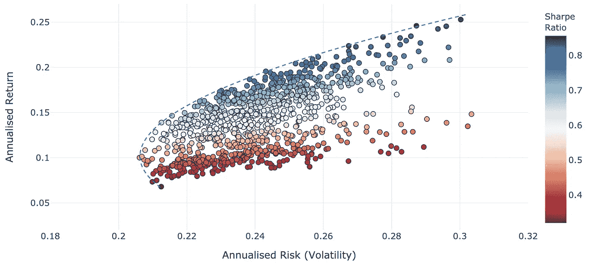
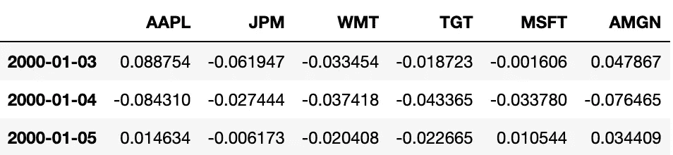
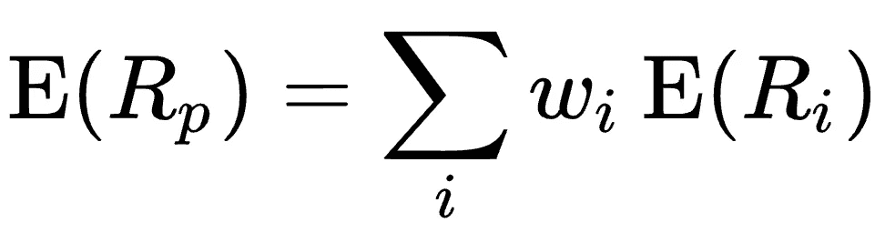
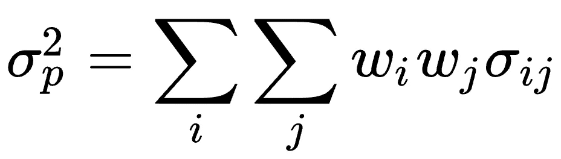
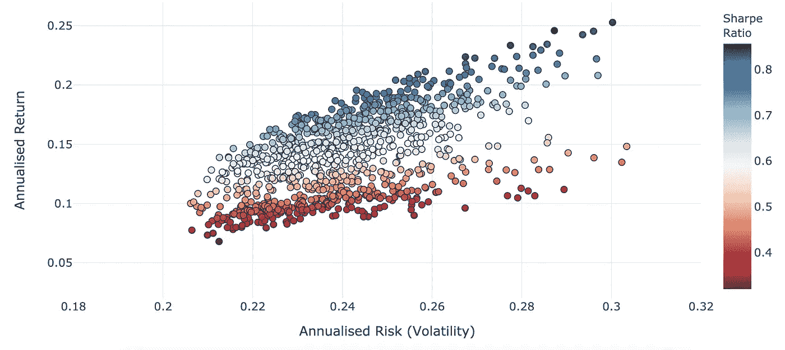
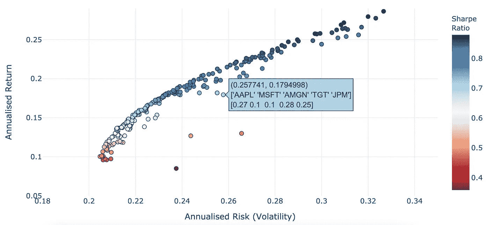

# Python 中的有效前沿—详细教程

> 原文：<https://towardsdatascience.com/efficient-frontier-in-python-detailed-tutorial-84a304f03e79?source=collection_archive---------3----------------------->

## 不用包在 Python 中实现现代投资组合理论

包含在本文中的[代码](https://nbviewer.jupyter.org/github/rian-dolphin/Efficient-Frontier-Python/blob/main/Markowitz.ipynb)的输出

## 介绍

Harry Markowitz 在他 1952 年题为 [*投资组合选择*](https://www.math.ust.hk/~maykwok/courses/ma362/07F/markowitz_JF.pdf) 的论文中介绍了现代投资组合理论。他首先概述了投资组合选择是一个两步过程；首先，投资者必须考虑可用资产的未来表现(就风险和回报而言)，随后，可以决定如何构建投资组合(即给每项资产分配多少资金)。

Markowitz 专注于投资组合构建方面，将预测未来表现的更具投机性的任务留给了读者。事实上，在整篇论文中，收益率都被假设为服从简单的高斯(正态)分布。这一假设是整个现代投资组合理论的基础，但也是许多批评的原因，因为股票价格回报已被证明不符合正态分布。

然而，让我们把批评放在一边，写一些 Python 代码来绘制马科维茨子弹，并更好地理解为马科维茨赢得诺贝尔奖的数学理论。

## 数据

我们的数据由六只股票的每日收益组成，如下所示。回报范围从 2000 年初到 2018 年末。

返回数据

我们可以使用两行代码从这些数据中立即得到*预期*年化回报、方差和协方差矩阵。我们注意到，通过像这样使用过去的数据，我们假设未来将遵循过去的趋势。在金融市场上，这是一个极具争议的假设，但就目前而言，这是可行的。

获得年度回报和协方差矩阵

我还制作了一个 YouTube 教程，使用了与本文相同的代码，如果视频是你首选的学习媒介的话！

## 获得投资组合——简单的版本

除了 numpy 之外，不需要使用任何包，我们可以使用下面的代码快速轻松地创建一个均值-方差图。均值-方差图让我们看到每个投资组合的风险和回报之间的权衡。

创造

关于这段代码，需要注意一些事情:

*   我们使用以下公式计算预期收益

更多信息请见[此处](https://en.wikipedia.org/wiki/Modern_portfolio_theory)

*   下面的投资组合方差公式(包括协方差和个体方差)

更多信息请参见[此处](https://en.wikipedia.org/wiki/Modern_portfolio_theory)

*   您可以调整每个投资组合中要考虑的资产数量。

使用我们生成的均值-方差对列表，我们现在可以绘制这些投资组合🎉

在这个图中，每个点代表一个投资组合。这里需要注意的是，这里显示的大多数投资组合都在*有效边界*上**而不是**。我们将在这篇文章的下一部分解决这个问题。

我在这里使用图形库 Plotly 如果你还没有尝试过，我强烈建议给它一个机会！在 Jupyter Notebook 中剧情是完全交互的，对于数据探索有很大的帮助。此处见[剧情互动版。](https://nbviewer.jupyter.org/github/rian-dolphin/Efficient-Frontier-Python/blob/main/Markowitz.ipynb)

## 更复杂的版本

以前我们随机抽样投资组合权重；让我们努力提高效率*(一语双关)*。我们可以引入*支配*的概念，这样我们就不会不必要地抽样“坏”投资组合。

作为一个(有点)理性的投资者，如果有两个回报相等的投资组合，我们会选择风险较低的一个，而给定两个风险相等的投资组合，我们会选择回报较高的一个。什么事？🤞就上面的情节而言，这意味着什么？左上角是最好的位置，任何在左上角有另一个投资组合的投资组合都是受*支配的*，任何理性的投资者都不会选择它。

因此，让我们确保我们的代码不包括任何由我们已经取样的投资组合支配的投资组合。

在这个版本中，我们还存储了每个投资组合的资产名称和权重。使用 Plotly 的交互功能，我们可以将鼠标悬停在图上的每个点上，它会告诉我们每个点的资产和权重。您可以在下面的截图中静态地看到这一点，但请单击此处的[查看互动情节](https://nbviewer.jupyter.org/github/rian-dolphin/Efficient-Frontier-Python/blob/main/Markowitz.ipynb)！

使用这种抽样技术，我们可以很快地沿着有效边界对投资组合进行抽样。一些早期的投资组合样本在有效边界以下清晰可见；然而，这可以很容易地通过在某次迭代后增加投资组合来补救(类似于 MCMC 中的“磨合期”的想法)。

<https://medium.com/@riandolphin/membership>  

对于那些走到这一步的人，感谢你的阅读！请随时在下面的评论中提出任何*问题。Jupyter 笔记本形式的**全部代码**可以在这里查看[。也可以从我的](https://nbviewer.jupyter.org/github/rian-dolphin/Efficient-Frontier-Python/blob/main/Markowitz.ipynb) [Github](https://github.com/rian-dolphin/Efficient-Frontier-Python) 下载使用的数据和笔记本。*