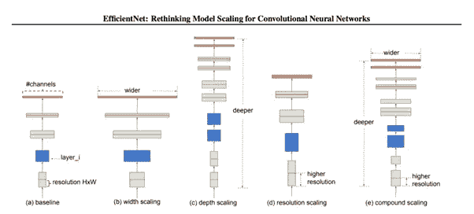
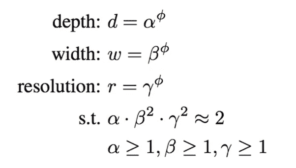
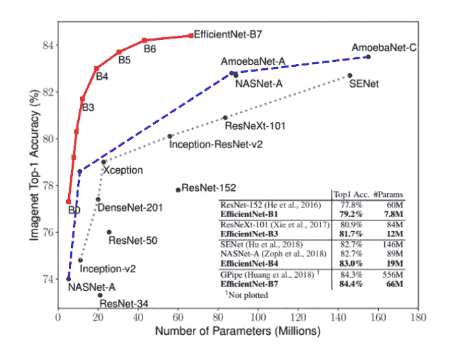
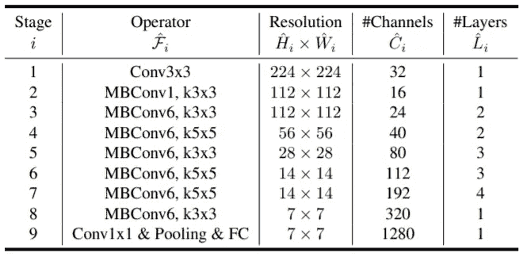
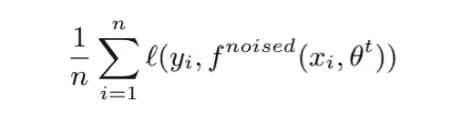
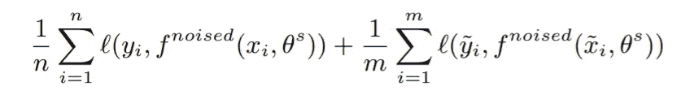
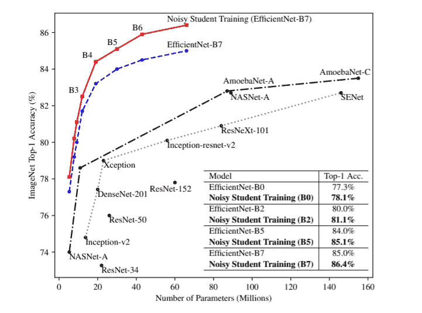
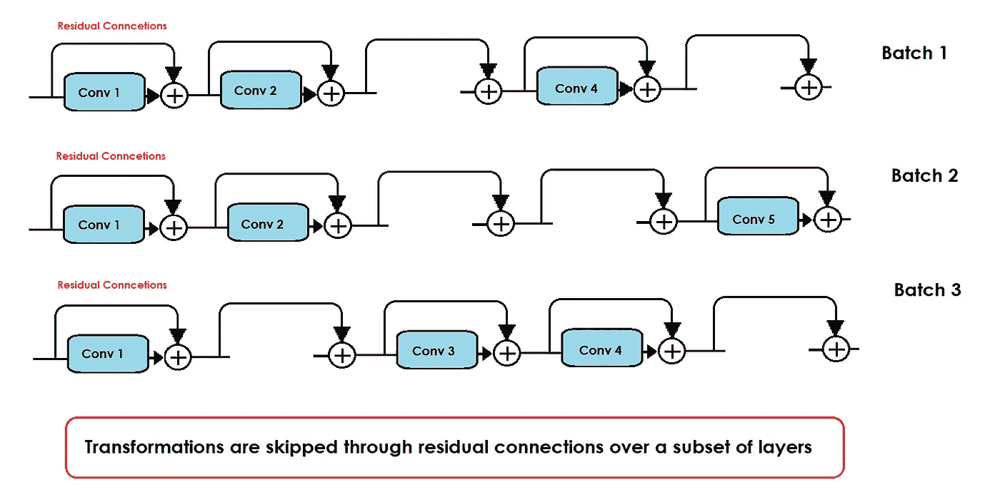
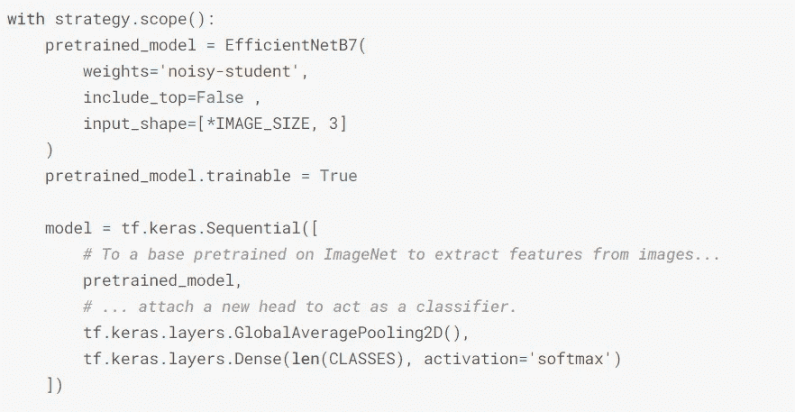
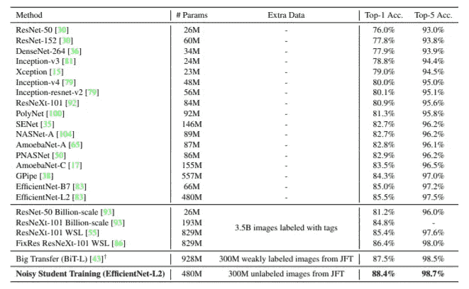

# 有效的网络与嘈杂的学生训练

> 原文：<https://towardsdatascience.com/efficient-nets-with-noisy-student-training-5ac6e239ff14?source=collection_archive---------19----------------------->

## 一种有效的方法来建立强大的 CNN 模型，并进一步提高其精度与嘈杂的学生算法。

如你所知，如果我们需要高计算能力，CNN 是可以扩展的，但是网络越大，就需要越多的资源来训练它。因此，CNN 是根据资源可用性构建的，当更多的资源可用时，它们可以缩放以获得更好的准确性。
在《高效网络》中，我们研究了如何在输入的宽度、深度和分辨率这三个维度上扩展我们的模型。

**目录**:

1.介绍和以前的方法
2。高效网络—复合扩展
3。架构
4。吵闹的学生训练
5。随机深度
6。迁移学习

## 介绍

神经网络的缩放过程还没有被很好地理解:有许多方法可以做到这一点，但参数大多是任意选择的。高效网络提供了一种沿三维扩展 CNN 的有效方式。

(a)基线模型(b)通过增加通道数量的宽度缩放通过增加层数的深度缩放(d)通过增加输入图像的分辨率的分辨率缩放(e)通过用复合系数同时增加所有三个维度的复合缩放([源](https://arxiv.org/pdf/1905.11946.pdf))

> **深度缩放** —最常见的缩放方式，根据要求增加或减少层数。随着层数的增加，我们得到越来越复杂的特征。从理论上讲，增加层数总是会给我们带来更高的精度，但事实并非如此，因为网络越深，过度拟合、渐变消失的可能性就越大。ResNet-1000 与 ResNet-101 具有相似的精度。
> 理想情况下，层数的增加也不会降低性能。ResNet-34 的性能优于 ResNet-18。
> 
> **宽度缩放—** 增加网络的宽度有助于我们捕捉更精细的特征(图像中更小的细节)。当我们想要限制区域模型尺寸时，会这样做，但是在这种缩放类型中容易发生精度饱和。
> 
> **分辨率缩放—** 增加输入图像的尺寸有助于模型更好地学习特征，因为像素携带的信息会更加准确。像 Yolo 这样的先进型号使用 418*418 作为输入图像尺寸。但是在较大模型的情况下，精度增益很快降低。

> 沿着一个维度缩放可以提高精度，但在较大模型的情况下，这种增益并不显著。

## 高效网络—复合扩展

现在我们能不能结合这些缩放方法来提高更大模型的精确度？为什么我们不增加所有三个维度的参数呢？

任意增加它们只会让事情变得更糟，因为有时维度的增加会导致模型的损失或不精确。这将是一项单调乏味的任务，因为我们必须同时在三个维度上进行尝试。

于是引入了一种新的方法， ***通过恒定比例缩放来平衡宽度、深度和分辨率的尺寸*** 。

我们取的常数比叫做**复合系数** **ɸ.**建议的等式是:

复合比例方程式([来源](https://arxiv.org/pdf/1905.11946.pdf))

**ɸ** 由用户根据可用资源的数量指定。 **Alpha、beta、**和 **gamma** 表示资源将如何分配到深度、宽度和分辨率维度。

**现在它是如何工作的**:

1 在 **(α * β * γ ) ≈ 2** 的约束下，我们固定 **ɸ (=1)** 的值，并通过训练基模型找到α、β和γ的最佳可能值。

*对 Efficient-Net-B0 模型进行训练，得到的值为α = 1.2，β = 1.1，γ = 1.15。α、β和γ是由基本网络上的网格搜索确定的常系数。*

2 现在有了上面找到的α、β和γ值，我们用不同的 **ɸ** 值放大基线模型，得到有效网 B1-B7。

高效网络的最高精度图([来源](https://arxiv.org/pdf/1905.11946.pdf))

> 通过在大型模型中查找α、β和γ可以获得更好的性能，但是它也有增加搜索成本的缺点。

## 体系结构

可以使用任何小型且易于扩展的基线架构。研究人员证明，复合缩放技术有助于不断提高 ResNets 和 MobileNets 的模型精度。

研究人员通过使用 AutoML MNAS 框架进行神经架构搜索，开发了一种新的基线网络。
基准模型 B0 的架构简单明了，因此更易于扩展。

简单高效的 Net B0 架构([来源](https://arxiv.org/pdf/1905.11946.pdf))

## 吵闹的学生训练

噪声学生训练是一种半监督学习技术，通过使用更大或相等大小的学生模型并在训练时向学生添加噪声来实现自我训练和提炼的思想。

什么！！冷静点。如果我们再深入一点，一切都会水落石出。

**算法很简单:**

**1)** 我们在带标签的图像上训练教师模型。

教师模型的损失方程([来源](https://openaccess.thecvf.com/content_CVPR_2020/papers/Xie_Self-Training_With_Noisy_Student_Improves_ImageNet_Classification_CVPR_2020_paper.pdf))

现在，我们使用教师模型为未标记的图像生成软或硬伪标签。

**3)** 我们采用了一个相同或更大尺寸的学生模型，并使用在图像和模型中添加了噪声的组合数据对其进行训练。

学生模型的损失方程([来源](https://openaccess.thecvf.com/content_CVPR_2020/papers/Xie_Self-Training_With_Noisy_Student_Improves_ImageNet_Classification_CVPR_2020_paper.pdf))

**4)** 将学生模型作为教师，重复几次步骤 2 的过程。

嘈杂的学生训练大大提高了所有模型尺寸的准确性。

嘈杂学生培训的前 1 名准确度映射([来源](https://openaccess.thecvf.com/content_CVPR_2020/papers/Xie_Self-Training_With_Noisy_Student_Improves_ImageNet_Classification_CVPR_2020_paper.pdf))

> 我们生成了大量的标签(从近 **3 亿张未标记的图像**中),这样学生模型比老师学得更好。
> 我们尝试使用**软标签**，因为它们会产生更好的结果(在某些情况下)。软标签意味着我们用对象属于那个类别的概率来标记它，而不是标记对象的类别。

顾名思义，我们在训练学生时向数据和模型添加噪声。我们在谈论什么样的噪音？

对于图像数据，我们做**增强**添加输入噪声，对于模型噪声，我们在训练时添加**丢失**和**随机深度**。

我们都知道什么是数据增加和丢失，因为它们是深度学习中的常用术语。但是什么是随机深度噪声呢？

## 随机深度

随机深度是一个毫不费力的想法，通过跳过连接绕过变换，集中于在训练期间缩小网络的深度。这样，我们得到了一个网络，它的预期深度非常小，而它的最大深度却很高。这通过跳过层的子集来创建类似集合的模型，从而从根本上减少了训练时间。

随机深度训练(图片由作者提供)

测试期间模型深度保持不变，减少了测试损失。测试期间的随机深度需要对网络进行某些改变，因为来自任何层的输出都是用该层参与训练的次数来校准的。

但这些细节是另一篇文章，因为这你应该能够理解随机深度噪声是如何在学生训练期间添加的。

> 就像**丢失**禁用信息通过层的**节点一样，**随机深度**禁用整个**层或层**的子集。**

## 迁移学习

高效网络的迁移学习节省了大量的训练时间和计算能力。您可以使用有效网络的预训练权重，并对其进行微调，以解决您自己的分类问题。只需几行代码，您就可以获得比许多已知模型更高的精度。

用于图像分类的高效网络传输学习代码

让我们来看一看，并比较所有过去的模型和高效网所达到的精度。

模型精度前 1 名和前 5 名及其可训练参数计数([来源](https://openaccess.thecvf.com/content_CVPR_2020/papers/Xie_Self-Training_With_Noisy_Student_Improves_ImageNet_Classification_CVPR_2020_paper.pdf))

 [## bharatdhyani 13/efficient net-noise-学生培训

### 此时您不能执行该操作。您已使用另一个标签页或窗口登录。您已在另一个选项卡中注销，或者…

github.com](https://github.com/bharatdhyani13/EfficientNet-Noisy-Student-Training) 

## 结论

高效网络是产生高端结果的强大模型。一般而言，与一维缩放相比，复合缩放可将精度提高 2.5%。
嘈杂的学生自我训练是一种有效的方法，可以利用未标记的数据集，并通过在训练时向学生模型添加噪声来提高准确性，从而使其学习超出教师的知识范围。
随机深度是一个简单而巧妙的想法，通过跳过连接绕过变换来给模型添加噪声。这减少了训练时间，同时可以在测试期间激活被绕过的层，以产生更准确的结果。

这是一些简单的想法，结合起来提高图像分类的准确性。这为通过简单而巧妙的数学变换来改进缩放和训练提供了可能性。

## 参考

[EfficientNet:反思卷积神经网络的模型缩放](https://arxiv.org/abs/1905.11946)

[与吵闹的学生一起进行自我训练提高了 ImageNet 分类](https://paperswithcode.com/paper/self-training-with-noisy-student-improves)

[随机深度网络加速深度网络训练](https://www.kdnuggets.com/2016/04/stochastic-depth-networks-accelerate-deep-learning.html)