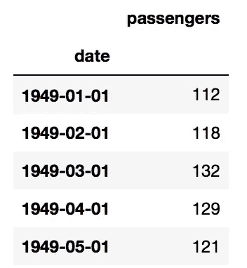
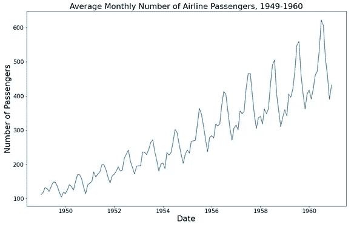
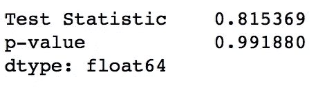
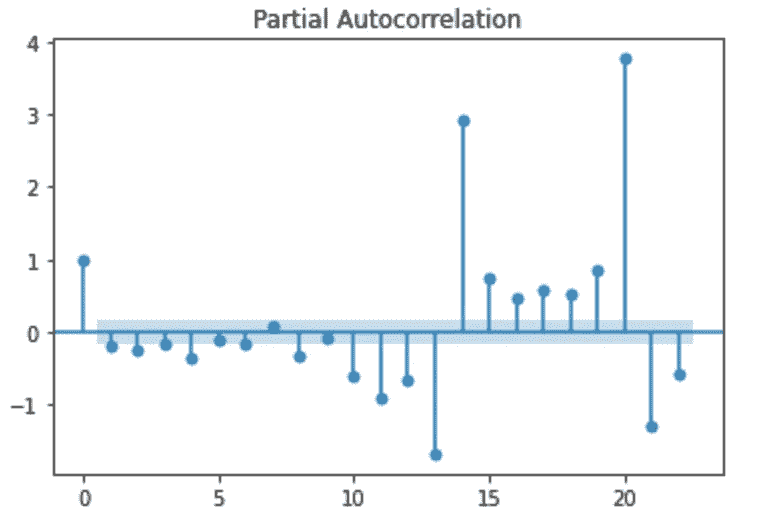
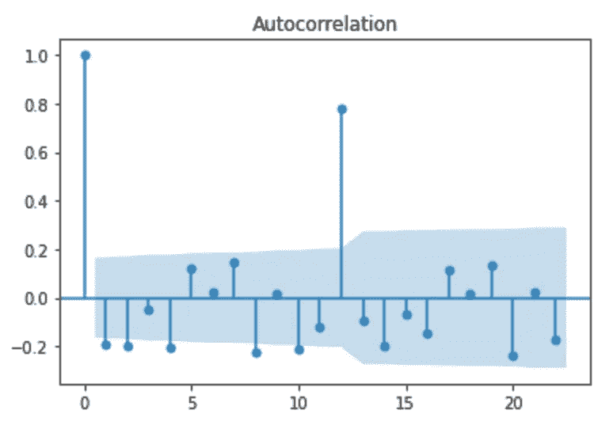
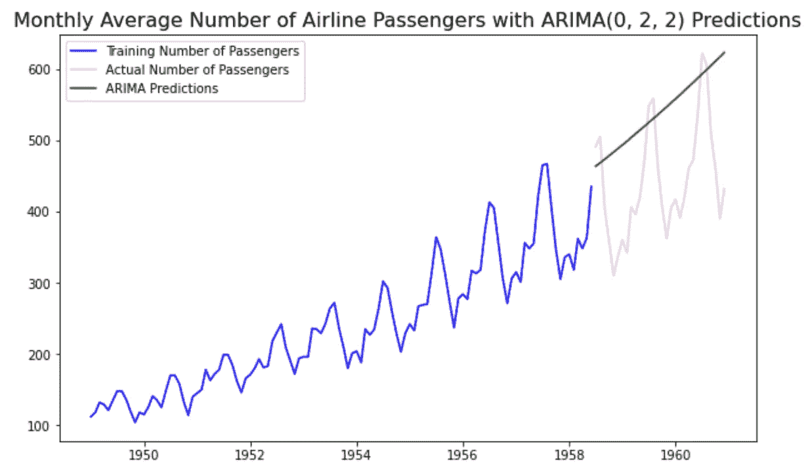
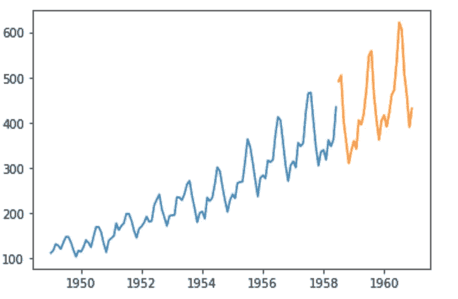
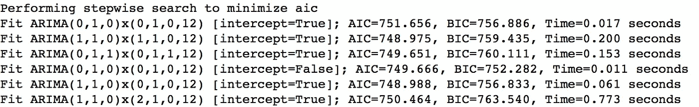
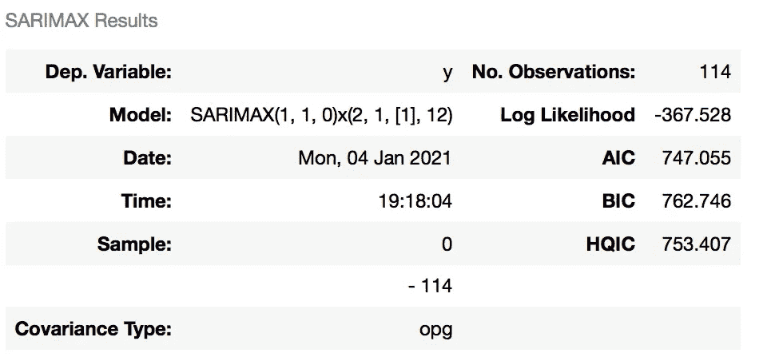
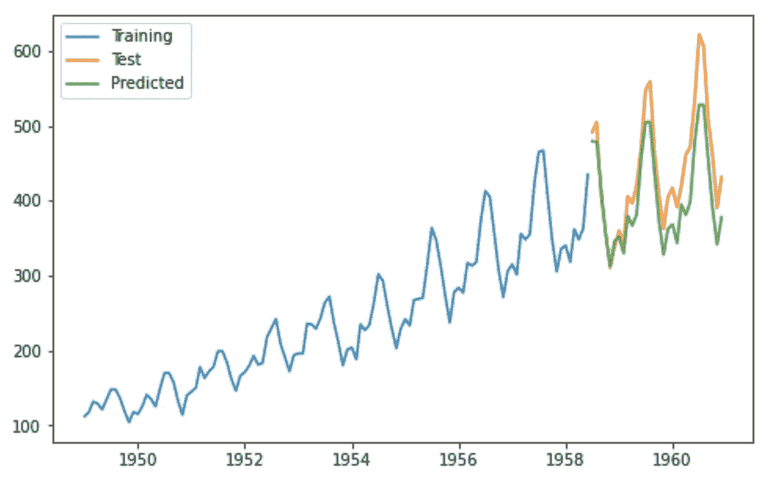

# 使用 Python 的 Pmdarima 库进行高效的时间序列分析

> 原文：<https://towardsdatascience.com/efficient-time-series-using-pythons-pmdarima-library-f6825407b7f0?source=collection_archive---------5----------------------->

## 展示了与实现传统 arima 模型相比，pmdarima 的 auto_arima()函数的效率。


阿列克谢·扎伊采夫在 [Unsplash](https://unsplash.com/s/photos/airline-passengers?utm_source=unsplash&utm_medium=referral&utm_content=creditCopyText) 上的照片

## 什么是时间序列分析？

数据科学中的一个关键概念是时间序列分析，它涉及使用统计模型根据过去的结果预测时间序列的未来值(即金融价格、天气、新冠肺炎阳性病例/死亡人数)的过程。在时间序列分析中可能会看到的一些组成部分是:

1.  趋势:显示一段时间内时间序列数据的大致方向，趋势可以是上升(向上)、下降(向下)或水平(静止)。
2.  季节性:这一部分表现出一种在时间、数量和方向上重复的趋势，例如在夏季的几个月里冰淇淋销量的增加，或者在较冷的几个月里地铁乘客的增加。
3.  周期性成分:在一定时期内没有固定重复的趋势。一个周期可以是一段起伏的时期，主要见于商业周期——周期不表现出季节性趋势。
4.  不规则变化:时间序列数据的波动是不稳定的，不可预测的，可能是/也可能不是随机的。

进行时间序列分析时，有单变量时间序列分析或多变量时间序列分析。当相对于时间仅观察到一个变量时，使用单变量，而如果相对于时间观察到两个或更多变量，则使用多变量。

## 什么是 ARIMA？为什么使用 Pmdarima？

ARIMA 是首字母缩略词，代表自回归综合移动平均，是一种建模时间序列数据进行预测的方法，由三个序参数( *p，d，q):* 指定

*   AR( *p* ):说明数据的增长/下降模式
*   I ( *d* ):说明了增长/下降的变化率
*   马(*问*):考虑时间点之间的噪声

有三种类型的 ARIMA 模型，ARIMA 模型、萨里玛模型和萨里玛模型，它们根据季节和/或外部变量的使用而有所不同。

Pmdarima 的 auto_arima 函数在构建 arima 模型时非常有用，因为它可以帮助我们确定最佳的 *p，d，q* 参数，并返回拟合的 arima 模型。

作为一名数据科学的新手，在进行时间序列分析时，我采取了“长”的方式，然后遇到了 pmdarima 的 auto_arima 函数来构建高性能的时间序列模型。在本文中，我将重点关注单变量时间序列分析，以预测航空乘客的数量(从 Kaggle 到[)，并通过传统的 ARIMA 实现与更有效的 auto_arima 方法进行讨论。](https://www.kaggle.com/rakannimer/air-passengers)

实施 ARIMA 模型的一般步骤:

1.  加载和准备数据
2.  检查平稳性(如有必要，使数据平稳)并确定 *d* 值
3.  创建 ACF 和 PACF 图以确定 *p* 和 *q* 值
4.  拟合 ARIMA 模型
5.  预测测试集上的值
6.  计算 r

首先，我通过将日期更改为 datetime 对象、使用 set_index 方法将日期设置为索引并检查 null 值来加载和准备数据。

```
df=pd.read_csv('AirPassengers.csv')
df=df.rename(columns={'#Passengers':'passengers','Month':'date'})
df['date'] = pd.to_datetime(df['date'])
df.set_index(df['date'], inplace=True)
df=df.drop(columns=['date'])
df.head()
```



作者图片

然后，我初步研究了航空乘客的月平均人数，发现数据并不是稳定的。通过进行 Dickey-Fuller 测试进一步证实了这一点，Dickey-Fuller 测试是针对平稳性的单位根测试，如下图所示:



作者图片

在对我们的数据进行两次差分后，我们的 *p 值*小于我们的 alpha (0.05)，因此我们能够拒绝零假设，并接受数据是稳定的替代假设。然后，我们通过将 *d* 参数设置为 2 来建模我们的时间序列数据。接下来，我使用差分数据查看了我们的 ACF/PACF 图，以可视化在模拟乘客数量时可能会产生影响的滞后。



作者图片

根据我们的可视化，我确定我们的 *p* 参数是 0，而 *q* 参数是 2——对于 ARIMA 模型，我们的 *p，d，q* 参数将是(0，2，2)。在将数据分成训练组和测试组，并在训练集上拟合 ARIMA 模型以预测测试集之后，我们获得了-1.52 的 r 值——告诉我们该模型根本没有遵循数据的趋势。



作者图片

我很可能错误地计算了 p，d，q 值，导致 r 值为负，但同时让我们尝试使用 PMMA 建立另一个 ARIMA 模型。

## 将 pmdarima 用于汽车 arima 模型

在之前的方法中，检查平稳性，如有必要使数据平稳，并使用 ACF/PACF 图确定 *p* 和 *q* 的值可能会非常耗时且效率较低。通过使用 pmdarima 的 auto_arima()函数，我们可以省去实现 arima 模型的第 2 步和第 3 步，从而简化这项任务。让我们用当前数据集来尝试一下。

在加载并准备好数据之后，我们可以使用 pmdarima 的 ADFTest()函数进行 Dickey-Fuller 测试。

```
adf_test=ADFTest(alpha=0.05)
adf_test.should_diff(df)# Output
(0.01, False)
```

这一结果表明数据不是平稳的，因此我们需要使用“整合(I)”概念( *d* 参数)在建立汽车 ARIMA 模型时使数据平稳。

接下来，我将数据集分为训练集和测试集(80%/20%)，以在训练集上构建自动 ARIMA 模型，并使用测试数据集进行预测

```
train=df[:114]
test=df[-30:]
plt.plot(train)
plt.plot(test)
```



作者图片

然后，我们使用 pmdarima 的 auto_arima()函数建立自动 ARIMA 模型。使用 auto_arima()函数调用代表非季节性成分的小 *p，D，q* 值和代表季节性成分的大写 *P，D，Q* 值。Auto_arima()类似于其他超参数调整方法，并确定使用不同的组合来找到 *p，d，q* 的最优值。最终的 *p、d、q* 值是在考虑了较低的 AIC 和 BIC 参数的情况下确定的。

```
model=auto_arima(train,start_p=0,d=1,start_q=0,
          max_p=5,max_d=5,max_q=5, start_P=0,
          D=1, start_Q=0, max_P=5,max_D=5,
          max_Q=5, m=12, seasonal=True,
          error_action='warn',trace=True,
          supress_warnings=True,stepwise=True,
          random_state=20,n_fits=50)
```



作者图片

我们可以查看模型摘要:



作者图片

接下来，我们可以使用训练好的模型在测试集上预测航空乘客的数量，并创建可视化效果。

```
prediction = pd.DataFrame(model.predict(n_periods = 30),index=test.index)
prediction.columns = ['predicted_passengers']plt.figure(figsize=(8,5))
plt.plot(train,label="Training")
plt.plot(test,label="Test")
plt.plot(prediction,label="Predicted")
plt.legend(loc = 'upper left')
plt.savefig('SecondPrection.jpg')
plt.show()
```



作者图片

自动 ARIMA 模型给了我们 0.65 的 r 值——与我第一次实现 ARIMA 模型相比，这个模型在捕捉数据趋势方面做得更好。

在本文中，我使用 auto_arima()演示了 ARIMA 模型的传统实现，并与自动 ARIMA 模型进行了比较。虽然传统的 ARIMA 实现需要执行差分并绘制 ACF 和 PACF 图，但使用 pmdarima 的 auto_arima()函数的自动 ARIMA 模型在确定最佳 *p，d，q* 值时更有效。

有关 pmdarima 的 auto_arima()函数的更多信息，请参见以下文档

 [## pmdarima:Python-pmdarima 1 . 8 . 0 文档的 arima 估计器

### 将 R 的宠儿引入 Python，更有力地证明了为什么数据科学不需要 R。是 100% Python +…

alkaline-ml.com](https://alkaline-ml.com/pmdarima/) 

感谢您的阅读！我的 [GitHub](https://github.com/mkosaka1/AirPassengers_TimeSeries) :)上有所有代码