# 高效计算大规模分布式数据集中的方差

> 原文：<https://towardsdatascience.com/efficiently-computing-the-variance-in-massive-and-distributed-datasets-c1f9fc1a13e3?source=collection_archive---------31----------------------->

## [理解大数据](https://towardsdatascience.com/tagged/making-sense-of-big-data)

> 针对数据分析中最基本问题之一的可扩展数据汇总技术

分布式计算数据中心。图片来自 Unsplash。

计算数据特征的方差可能是数据分析中最基本的操作之一。无论是为了可视化还是统计测试，通常都需要数据特征的方差，或者说标准差。

通常，我们只是使用一个为我们计算的库。但是，这些库假定可以访问全部数据。想象一下，在一个环境中，我们无法提供对整个数据集的访问。例如，您需要计算用户访问在线购物网站的平均时间的标准差。该网站使用几个服务器来管理来自世界各地的流量，我们无法承担存储和合并全部数据的费用。此外，我们需要考虑问题的延伸，如“一天中客户在网站上花费的时间的标准偏差是多少？”因此，我们需要以某种方式计算每台服务器上的统计数据，然后有效地汇总这些数据。

在这篇文章中，我将介绍有效计算的算法，或者更确切地说，估计大规模和分布式数据集中的方差。

## 每个坐标一次更新

在下文中，我们考虑实数值 x[i]的大规模数组 X。方差被定义

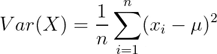

在上式中，μ是数据 x 的平均值。计算上述值的标准方法是首先计算数据的平均值，然后计算上述总和中的每一项。然而，我们不能存储数据 X。此外，数组 X 在不同的位置生成为值 x *_* i 的流，因此我们谈论每个坐标的*单次更新，这意味着我们只看到每个 x_i 一次。例如，x_i 是用户在第 I 次浏览会话期间在我们网站上花费的时间。注意，我们不关心用户身份。*

让我们重写方差的定义:

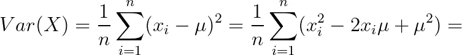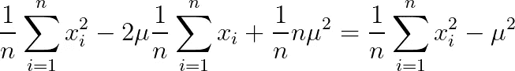

图片作者。

上面显示我们只需要存储三个量:例子的数量 *n* ，例子的总数

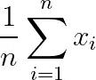

第二个时刻

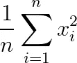

这三个量可以在不显式存储数组 x 的情况下进行计算。因此，在每一端，我们收集这三个量，并在中央服务器中将它们相加。因此，我们只需要恒定的空间和恒定的更新时间。这很简单，对吧？

## 每个坐标多次更新

现在让我们考虑一个更具挑战性的环境。我们想要计算单个条目 x[i]随时间更新的情况下的方差。输入是一个更新流(I，w_i ),表示我们通过值 w_i 更新坐标 I。例如，我们不考虑每次访问我们网站的平均时间的方差，而是考虑每个用户一周的总时间的方差。这意味着对于我们拥有的单个条目

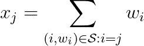

在上面的例子中， *S* 是一串更新，比如(用户 *i= "简·多伊" s* pent w_i=4 分钟浏览网站)。

请注意，上述总和可以在多个地点收集。

我们能再次应用上述方法吗？

我们可以通过简单地将不同的计数器相加来再次计算总和:

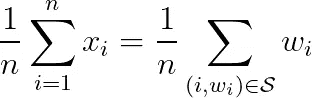

然而，在这种设置中，我们不能简单地通过保留一个计数器并将这些计数器相加来计算数据示例的数量。当我们看到像*“Jane Doe”*这样的元素时，我们需要知道他们在过去的一周是否访问过该站点。我们需要跟踪不同的**元素的总数。我们可以使用散列映射，但是这需要存储所有不同的条目，并且这可能是非常昂贵的。**

第二个问题是如何计算二阶矩:

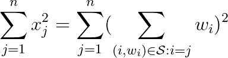

我将在数据总结的基础上提出这两个问题的解决方案。

## 估计不同元素的数量

我提出了[1]中的方法。假设我们有一个函数，它为任意整数输入生成一个区间(0，1)内的随机数。请注意，这是一个函数，因此每当我们看到相同的整数，我们就生成相同的随机数。我们处理输入并存储 k 个最小的随机数，作为用户定义的 k。让 max_k 是 k 个元素中最大的。因此，对于流中的不同值，max_k 是所有随机数中第 k 个最大的随机数。在处理流之后，我们将不同元素的数量估计为 k/max_k。为什么这样做？如果总共有 t 个不同的元素，我们预计其中一半的随机值 t/2 小于 0.5，或(t/2)/t。同样，我们预计 k 个元素小于 k/t。因此，这 k 个最小元素中的最大元素应该具有 k/t 左右的值。这种直观的解释可以是正式的，并且可以表明，对于 k=O(1/eps)，我们可以估计乘法误差为(1+eps)的不同元素的数量。例如，通过使用 k = 100，我们可以获得一个在真实值的 90%和 110%之间的估计值。如果我们使用 k = 1,000，那么估计值将在真实数字的 97%和 103%之间。在不同地点收集的草图可以很容易地聚集在一起:我们将它们合并，只保留 k 个最小的元素。

一个非常有效的方法就是[超对数](https://en.wikipedia.org/wiki/HyperLogLog)算法。

## 估计二阶矩

现在我将介绍一种估算二阶矩的方法:

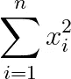

AMS 草图以其发明者 Noga Alon、Yossi Mattias 和 Mario Szegedy 的名字命名[2]。输入是更新流(I，w ),其中 I 是索引，w 是相应的权重。AMS 草图非常简单:

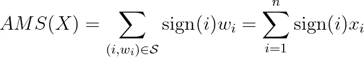

对 X 的二阶矩的无偏估计就是

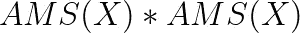

为什么会这样？AMS 草图只是一个单一的数字，对吗？如果我们计算得到的期望值

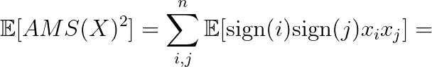

第二个和是 0，因为 sign(i)*sign(j)是概率为 1/2 的-1 和概率为 1/2 的 1，因此期望值是 0。

当然，估计量的方差是显著的。在[2]中，作者证明了 1/eps 估计量的均值在(1-eps)，(1+eps)的乘法误差内产生一个估计。

AMS 草图的一个主要优点是它们可以简单地互相添加。如果我们在几个不同的地点收集数据，那么通过简单地使用相同的符号函数，我们可以计算每个地点的草图并将它们相加。

## 改进 AMS 草图。

AMS 草图有一个缺点。也就是说，每个输入(I，w_i)必须更新所有 1/eps 草图。研究人员提出了一个想法，允许每次更新的处理时间保持不变。所谓的 CountSketch [3]用包含 1/eps 元素的哈希表 *B* 代替 AMS sketch。想法是，除了散列函数之外，我们使用散列函数 h 将索引映射到随机选择的箱。

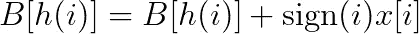

方差的估计值只是哈希表内部的一个向量:

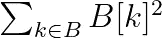

注意，如果没有两个项目共享一个桶，那么我们精确地计算二阶矩。

为了保证估计是大概率正确的，建议取 *m* 个独立估计量的中值，其中 m 是 7 或 9 这样的小数字。

请注意，在各个站点收集的哈希表可以相互添加。

实现可以在这里找到:【https://github.com/konstantinkutzkov/variance_estimation】T4

[1]齐夫·巴尔-优素福、T. S .贾伊兰、拉维·库马尔、d .西瓦库马尔、卢卡·特雷维桑。对数据流中的不同元素进行计数。兰登 2002

[2] Noga Alon，Yossi Matias，Mario Szegedy:
逼近频率矩的空间复杂度。STOC 1996

[3]摩西·沙里卡尔、凯文·陈、马丁·法拉奇-科尔顿。
在数据流中寻找频繁项。Theor。计算机。Sci。312(1)