# 使用 NumPy 在 Python 中高效地将图像分割成图块

> 原文：<https://towardsdatascience.com/efficiently-splitting-an-image-into-tiles-in-python-using-numpy-d1bf0dd7b6f7?source=collection_archive---------3----------------------->

## 发展对数组步长和 numpy.reshape()的直觉

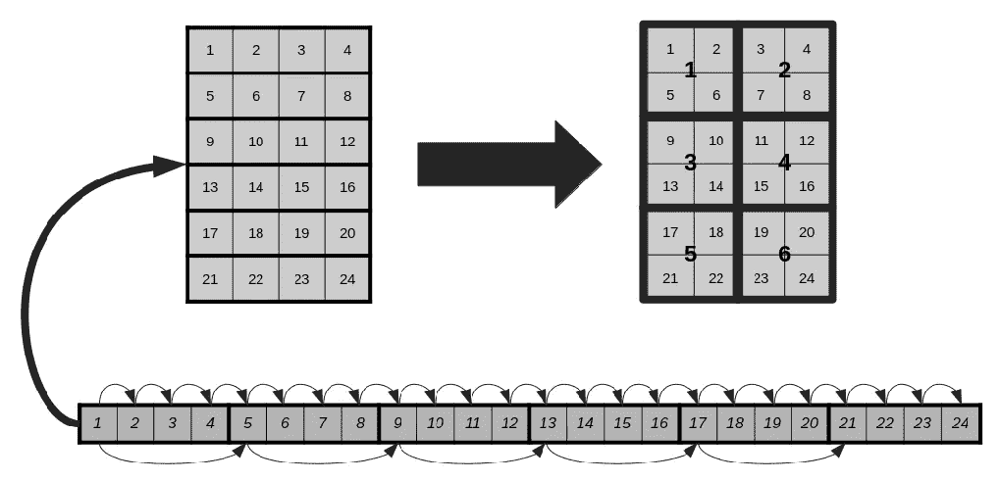

图一。问题图解。图片作者。

在很多情况下，您需要将一幅大图像分解成小块(例如，作为 ML 预处理管道的一部分)来进行批处理。本文旨在探索用 Python 实现这一点的更低级的方法。

## 1.嵌套 for 循环:低效的方法。

我见过的创建图像块堆栈的最常见方法之一是使用嵌套的 for 循环，例如用所需的维度实例化一个新数组，并将其填充到这些循环中。然而，这种方法在 Python 中效率特别低(尤其是),并且根本不适合大型数据集(也不适合较小的切片)。

嵌套的 for-loops 方法类似于下面的代码片段:

```
# Nested for-loops method.
# Creating a stack of 2 x 2 tiles out of a 4 x 4
# RGB image with channels on the last axis.

import numpy as np

image = np.random.randn(4, 4, 3)
tiles = np.zeros((4, 2, 2, 3))

c = 0

for i in range(0, image.shape[1], 2):  

    for j in range(0, image.shape[2], 2):

        tiles[c] = image[i:i+2, j:j+2, :]
        c += 1
```

随着迭代的增长*(图像大小与图块大小的比率)*，更不用说迭代大量的图像(第三个 for-loop)，这可能会占用资源并迅速在您的管道中产生瓶颈。

## 2.或者:内存视图

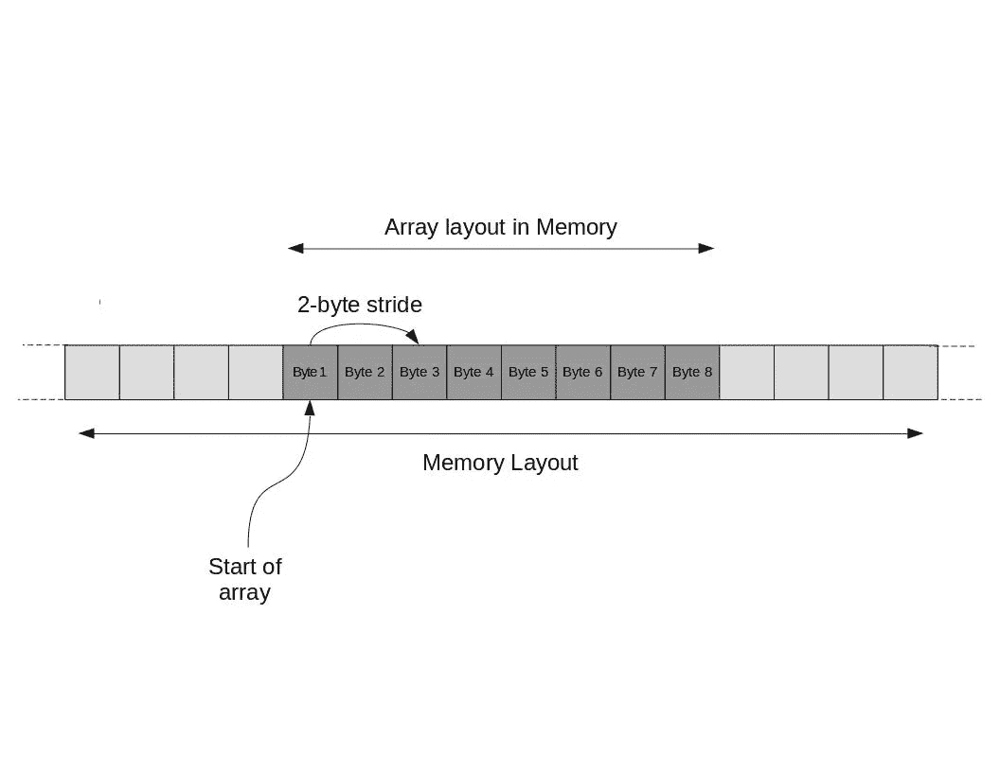

图 2.1。阵列存储器布局。图片作者。

如果我们可以对同一块内存使用不同的视图，并将其显示为图块，会怎么样？让我们来谈谈数组。

Numpy 数组和一般意义上的数组在内存中以连续字节块的形式排列。然后可以使用[步长](https://ajcr.net/stride-guide-part-1/)以不同的形状查看那块连续的内存。

在数组的内存级别上，跨距表示为了到达数组中包含的下一个元素，需要向前跳转的字节数。这取决于数组中包含的数据类型的字节长度。

*例如，16 位整数(2 字节长)的一维数组的跨度为 2 字节。*

另外需要注意的是，数组必须包含相同数据类型的元素，以保证相等的字节长度间隔。当然，有多种方法可以在单个数组中表示不同的数据类型，但这超出了本文的范围。

## 2.1.数组维度

那么，数组中的元素是什么呢？只是按顺序排列的字节。元素的长度可以变化，这取决于表示每个元素所需的字节数。

因此，元素是字节的集合，而字节又是位的集合，特别是 8 位。都生活在同一个物理空间。那么，有没有可能将一个数组进一步聚合成更大的块呢？是的，它是。这正是数组维数的作用。

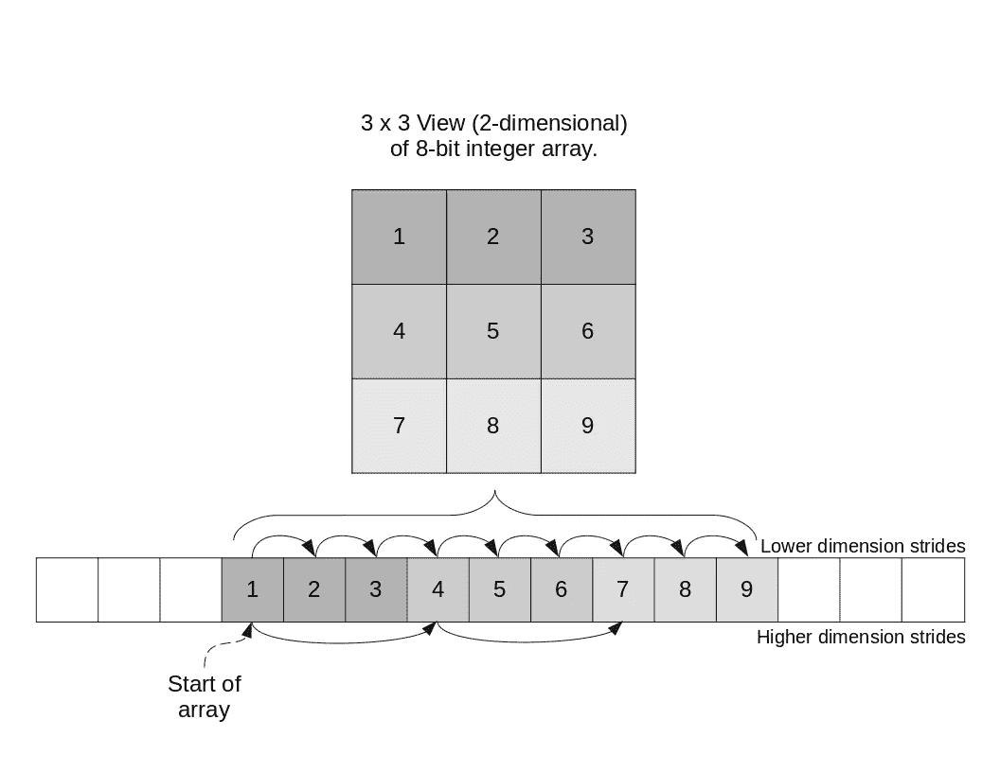

图 2.2。内存中 C 阶二维数组的图示。图片作者。

为了将数组元素组织成行并创建第二维度，您需要做的就是定义第二个步幅来指向每一行的开头。在那个维度上，各个元素就是行。这也可以看作是将一个数组分割成多个大小相等的子数组。

在 numpy.shape()返回的数组维度大小中，上面描述的示例将呈现为一个**二维 shape (3，3)** 。返回的维度顺序总是从最高级别的*(最左边)*开始，到最低级别的*(最右边)*。这意味着元组中第一个**维度** *i* 的大小 3 表示**行**的数量，而第二个**维度**的大小 3 表示每行的单个**元素的数量。正如我们将在后面看到的，有一些 numpy 方法可以改变维度层次结构，但是上面的方法通常代表使用 numpy.reshape()形成的数组视图以及 numpy 中新实例化的数组。**

*注 1:上面的维度顺序是指 numpy.shape()返回的元组中访问的顺序，第一维度在索引位置 0 (shape[0])，第二维度在索引位置 1 (shape[1])。*

*注 2:有多种布局(行/列优先)，但本文仅讨论行优先顺序，因为这是我最熟悉的一种。更多布局信息* [*点击*](https://eli.thegreenplace.net/2015/memory-layout-of-multi-dimensional-arrays) *。*

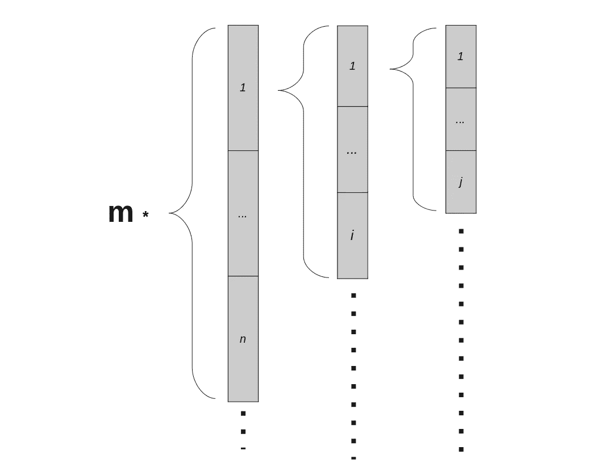

图 2.3。连续数组维数的图示。图片作者。

*出于我们的目的，我们将给出尺寸大小的一般定义如下:*

以 shape *(m，n，I，j)* 的 4 维数组为例，第 1 个*(最高&最左边)*维包含以 shape*(n，I，j)* 组织的 *m* 个元素。第二维保存形状为 *(i，j)* 的 *n* 个元素，而第三维保存大小为 *( j )* 的 *i* 个元素。第四个也是最后一个维度只是一行 *j* 元素。然后:

> 尺寸大小:后续*(下)*尺寸描述的元素个数。

## 2.2.通过指定自定义步幅，将 2D numpy 图像数组分割成图块

现在，表示为 numpy 数组的 2D 图像将具有形状 *(m，n)，*，其中 *m* 将指示以像素为单位的*图像高度*，而 *n* 将指示以像素为单位的*图像宽度*。作为一个例子，让我们以一个 6×4、8 位灰度图像阵列为例，通过使用步长创建一个新的内存视图，将它分成 2×2 的小块。记住，元素的长度必须相等，因此，两个数组的维数都必须能被 2 整除。

我们的图像可以被认为是由 6 行 4 个元素组成的。我们示例的可视化如下所示:

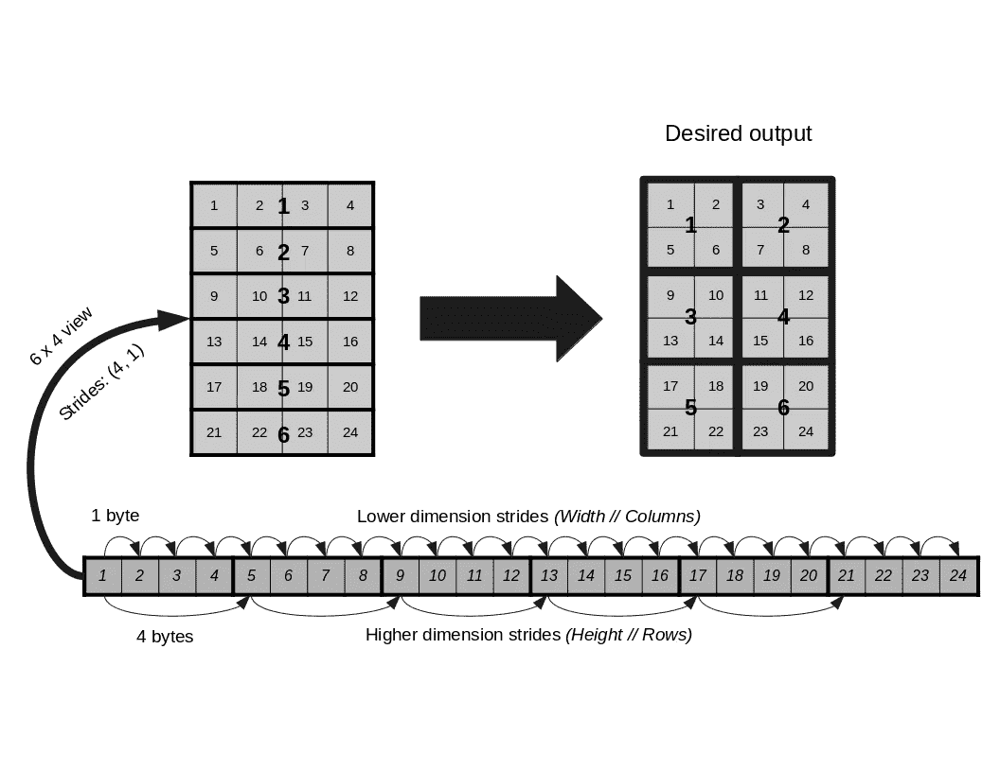

图 2.4。说明我们的瓷砖问题。图片作者。

那么，我们怎么去呢？

让我们一步一步来。看到我们总共需要 6 个图块，组织成 3 行 2 列，让我们首先尝试将当前行分成 2 列。我们当前的形状是(6，4)，因此，我们需要将最后一个维度减半，并添加一个更高的维度 2，表示我们想要形成的列。这一步的目标三维形状是(2，6，2): *2 列×6 行×每行 2 个数组元素*。现在我们知道了我们需要的形状。我们可以继续计算步幅。

我们来观察下图。我们的 2D 形象的步幅是(4，1)。**最低维度的步幅 1** 必须保持不变，因为对其进行改动会使我们失去像素级别的空间关系*(例如，增加它将意味着跳过像素)*。**行尺寸的跨度 4** 也将保持不变，因为所需的行数保持为 6。一般来说，如果你改变这两个步幅中的任何一个，最终都会扭曲图像。然后，我们需要做的就是计算出尺寸为 2 的最高维度的步幅，它代表我们正在定义的新的*更高级别的* *列*。记住，我们将原来的每行 4 个元素分成两半，这样它们可以包含在单独的列中，这给了我们一个提示。


图 2.5。列跨距解决方案的插图。图片作者。

查看图 2.5。我们数组中的所有像素按照它们在内存中的排列顺序进行编号(C 顺序)。以前，每 4 个元素我们必须改变一行，这个规则仍然有效。我们希望包含一个额外的规则:*在每一行中，* ***每隔 2 个元素*** 改变列。所以我们最高维度的步幅是 *2 x element_byte_size* 。在我们的 8 位整数的例子中，步距是 *2x1 字节= 2。*

让我们打开一个终端并用代码测试它:

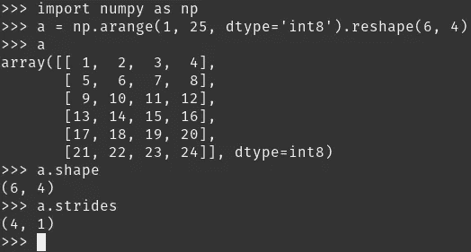

图 2.6。我们的示例数组的形状和大小。图片作者。

在 numpy 中，您可以使用**numpy . lib . stride _ tricks . as _ strided()**来操作数组的跨度。我们需要指定我们想要操作的数组、我们想要它的形状以及我们想要每个维度的步距:

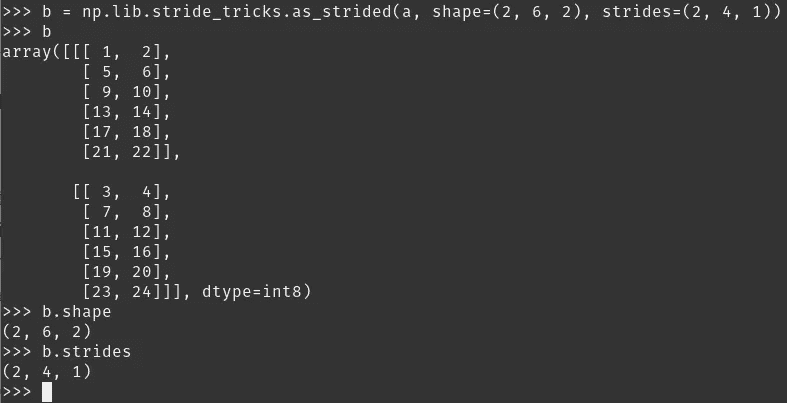

图 2.7。将示例图像分成两列。图片作者。

我们得到了包含我们想要的元素的两列！现在，我们可以继续将每列分为 3 组，每组 2 行，这样总共有 6 块瓷砖。

我们当前的形状是(2，6，2)，6 是我们在图像中的行数。类似于上一步，我们需要第 3 维元素(2 列)来保存每一行(第 1 维元素)中只有 2 个数组元素的行，现在我们需要顶层层次结构中的第 4 维元素来保存每一行只有 2 个图像。因此，我们需要将“图像行”的维度从 6 减少到 2。我们的目标形状将是(3，2，2，2)。

总之，较低级别的元素仍然是 2，我们的行减少到 2，第 3 维的列仍然是 2，我们现在添加第 4 维来将这些列分成 3 个部分。

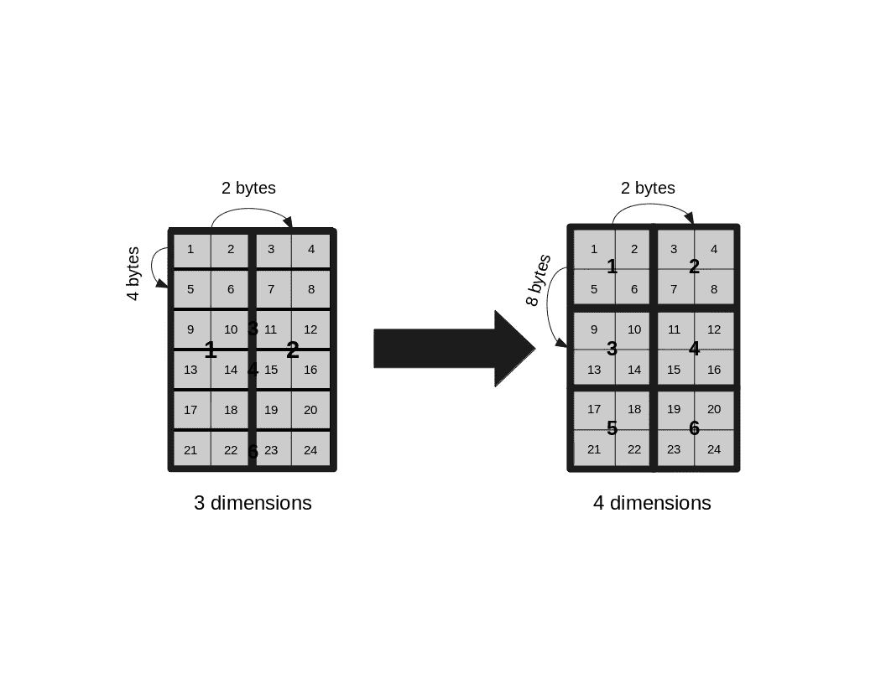

图 2.8。瓷砖步幅解决方案插图。图片作者。

我们对这个 4 维数组的定义表明，最高维现在将改变每 *2* 图像行的元素，而不是 *1* 。因此，总之，新的步幅必须是图像行的两倍。那么，我们新维度的步距将是 *2 x row_stride = 2x4 = 8 字节*。

在代码中测试它:

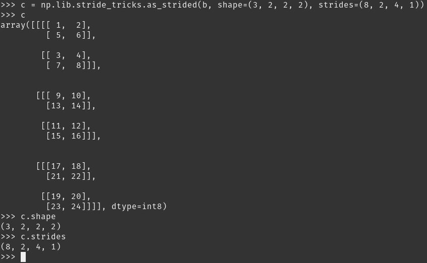

图 2.9。自定义步长解决方案的实施。图片作者。

我们完事了。6 块瓷砖全部成型。现在，我们可以使用 numpy.reshape()合并 2 个最高维度，使我们的数组成为 *(number_of_tiles，tile_height，tile_width)* 的三维形状，如果我们愿意的话，因为这是图像批处理的基本格式。我们首先需要 4 个维度而不是 3 个维度的原因是因为内存中每个区块的位置不能由一个单独的步幅来表示。我们的形象毕竟是二维的。

我们刚刚实现的使用步长将 8 位整数的 6×4 图像分割成 2×2 块的方法，可以推广到任何 *C 排序的* 2D 图像，如下所示:

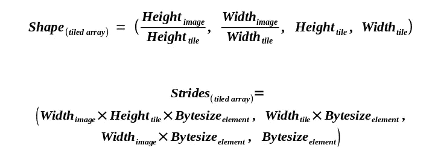

情商。2.1.用于将灰度图像分割成图块的形状和步幅。图片作者。

事实证明，对于特定格式的多通道图像，我们也可以使用类似的公式。具体来说，它们是连续的 C 有序阵列，具有最低维度的通道*(具有彼此相邻的相同像素 RGB 值)*，否则在每种情况下步幅将不同。有些库像那样直接加载图像，有些库不这样，但是重塑它们并不是特别困难。

*例如，GDAL 将以通道作为最高(最左侧)维度加载图像。*

当我们的多通道数组维度以这种方式格式化时，最低的维度将是每个像素的每通道值，我们可以通过只做一个字节长度的步骤来导航。因为，不是 1 个单个像素值，我们将有 *n* 个像素值用于 *n* 个通道，我们需要做的就是将所有其他步幅乘以通道数。总之，一切都保持不变，但我们现在每个像素有多个值要跳转，每个通道一个值:

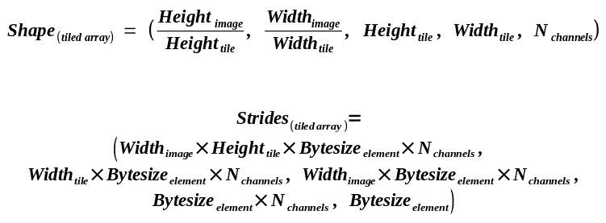

情商。2.2.用于将多通道图像分割成小块。图片作者。

这不是一种特别干净的方法，但是我们将在下一节中看到有一种更干净的方法。处理跨步是一个非常敏感的过程，需要非常小心。每次您都必须验证邻近性并采取必要的步骤。

幸运的是，numpy 提供了一些更高级的方法来省去我们大部分的麻烦。

## 2.3.Numpy.reshape()

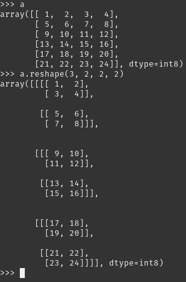

图 2.10。numpy.reshape()的输出给出了错误的结果。图片作者。

[Numpy . shape()](https://numpy.org/doc/stable/reference/generated/numpy.reshape.html)是在 numpy 中操作数组形状的标准、最常见的方法。然而，如果我们在之前的 6 x 4 图像示例中简单地声明我们想要一个形状为(3，2，2，2)的数组，它就不会工作。

这是因为默认情况下，numpy.reshape()试图保持后续值的连续性。这意味着在程序中使用的数组的顺序索引将继续存在于相邻的内存块中。不幸的是，为了得到我们的结果，我们需要打破连续性。*尽管如此，出于性能原因，我们可以在将它分成瓦片后使其再次连续。*

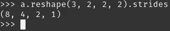

图 2.11。numpy.reshape()输出的步幅。步幅与我们在上一节中期望的解决方案不同。图片作者。

*< <步幅与我们之前的方案不同。*

它是如何工作的？它基本上接受一个维度(在任何级别)，将其分解为相等的相邻部分，并在更高的级别将它们堆叠在一起。在我们的例子中，它的作用如下:

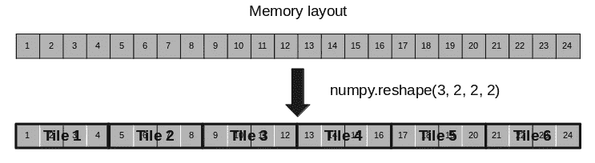

图 2.12。numpy.reshape()输出的图示。图片作者。

相反，我们想要的是这个:

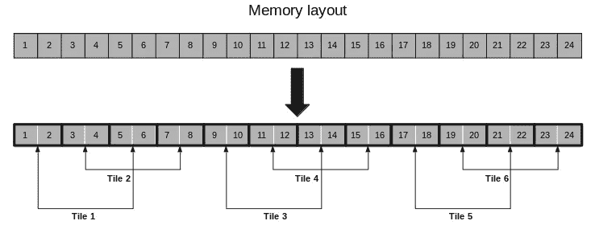

图 2.13。内存中我们想要的输出布局图。图片作者。

那么，我们该怎么解决呢？

作为两个数组步距提示的简单比较，我们需要做的就是在轴 1 和轴 2(第一维和第二维)之间交换步距。具体来说，我们需要的步距是 *(8，2，4，1)* ，但是 numpy.reshape()返回一个步距为 *(8，4，2，1)* 的数组。Numpy 数组为此公开了一个方法，称为 *swapaxes:*

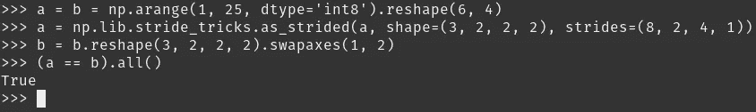

图 2.14。使用 numpy.reshape()和 swapaxes 方法更正解决方案。图片作者。

然后，numpy.reshape()实现可以推广到最后维度中具有通道的任何 2D 或 3D 图像，如下所示:

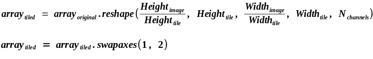

情商。2.3.用于将多通道图像分割成拼贴的形状尺寸和 swapaxes 实现。对于灰度图像，您可以省略通道尺寸。图片作者。

## 3.比较和结论

我们来对比一下执行力！

我们将使用这个看起来很酷的家伙的 RGB JPEG:


*图 3.1。测试图像。照片由* [*安娜斯塔西娅*](https://unsplash.com/@tarasovaanastasiia?utm_source=unsplash&utm_medium=referral&utm_content=creditCopyText) *上* [*下*](https://unsplash.com/s/photos/fun?utm_source=unsplash&utm_medium=referral&utm_content=creditCopyText)

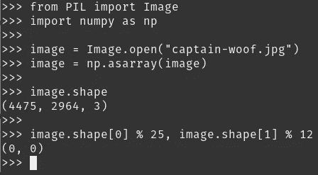

图 3.2。图像检查。图片作者。

在我们探索了图像的尺寸之后，我们可以看到它们可以被 25 和 12 整除，所以让我们用它们来表示我们的平铺尺寸。

我们还将使用这个装饰器来为每次执行计时:

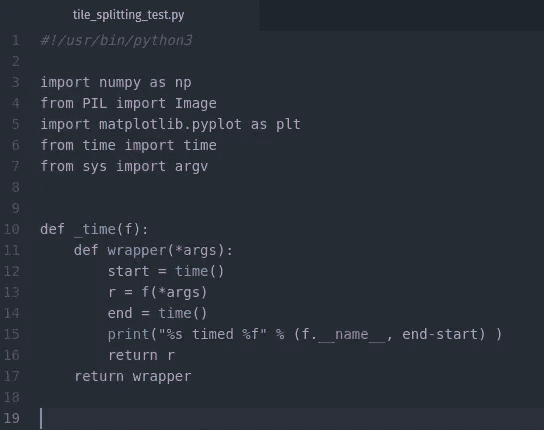

图 3.3。我们的计时器装饰器和依赖项。它将用于记录每次进场的时间。图片作者。

我们的 for 循环实现如下所示:

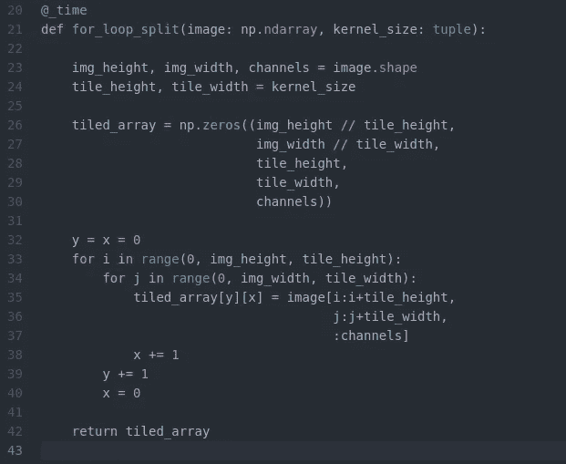

图 3.4。For 循环实现函数被修饰为定时。图片作者。

大踏步的实现是:

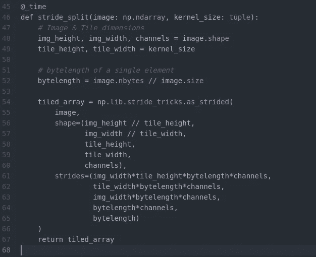

图 3.5。跨步装饰实现定时功能。图片作者。

numpy.reshape()的实现是:

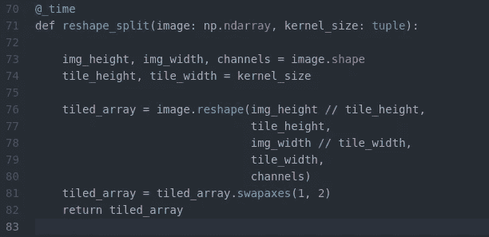

图 3.6。Numpy.reshape()实现被修饰为计时。图片作者。

我们将加载我们的图像作为一个 numpy 数组，从命令行设置图块尺寸，运行每个函数并检查数组的相等性。

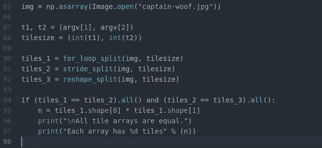

图 3.7。我们的代码包括平等测试。图片作者。

关键时刻:

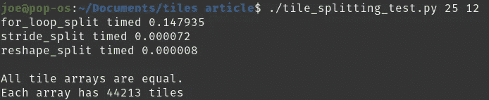

图 3.8。结果。Numpy.reshape()优于其他方法。图片作者。

numpy.reshape()方法似乎是最干净也是最有效的。此外，很明显，for 循环实现不能真正与内存视图方法相比较。同样值得注意的是，内存视图性能几乎不受必须生成的切片“数量”的影响，而 for 循环的执行时间会随着工作负载的增加而增加。

*最后一点:正如大多数框架所期望的那样，还有一个额外的步骤来将我们的瓦片以批处理的形式带来。要在单个索引中合并我们的图块，我们所要做的就是****tiled _ arr . shape(-1，* tile _ dimensions)****并使用****numpy . moveaxis()****在适当的地方重新定位通道维度。通常为(n_tiles，n_channels，t_height，t_width)。*

感谢您的阅读！

我希望这篇文章很有见地，你可以在自己的计算机视觉工作流程中实现这里演示的内容！

在 LibreOffice 中创建了插图和公式。

*代码:您可以在这里* *找到测试脚本* [*。*](https://1drv.ms/u/s!AvEi405pB_8lyAWJbNNVo8E1LZKy?e=UoXHhI)

*如有任何建议或修改，请随时联系我，地址:****iosif.doundoulakis@outlook.com***

*你可以在*[*LinkedIn*](https://www.linkedin.com/in/jdoun/)*上联系我。*

*来源:*

[*【1】:多维数组的内存布局*](https://eli.thegreenplace.net/2015/memory-layout-of-multi-dimensional-arrays)

[*【2】:形体与步幅图解指南(上)*](https://ajcr.net/stride-guide-part-1/)

[*【3】:Numpy 文档:Numpy . lib . stride _ tricks . as _ strided()*](https://numpy.org/doc/stable/reference/generated/numpy.lib.stride_tricks.as_strided.html)

[*【4】:Numpy 文档:Numpy . shape()*](https://numpy.org/doc/stable/reference/generated/numpy.reshape.html)