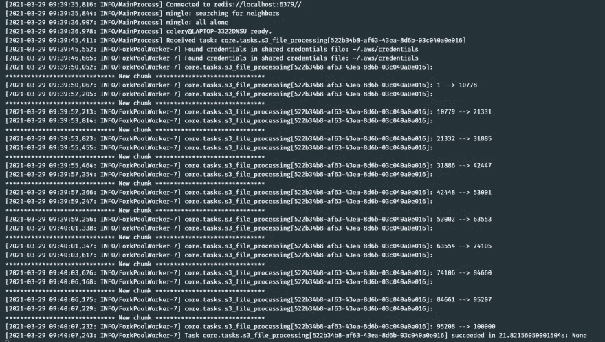

# 通过 S3 选择有效地传输大型 AWS S3 文件

> 原文：<https://towardsdatascience.com/efficiently-streaming-a-large-aws-s3-file-via-s3-select-85f7fbe22e46?source=collection_archive---------32----------------------->

## [理解大数据](https://towardsdatascience.com/tagged/making-sense-of-big-data)

## 使用 AWS S3 选择将一个大的 S3 文件流式处理成易于管理的块，而不需要将整个文件下载到本地


在[公共许可](https://undraw.co/license)下[解压缩](https://undraw.co/)生成的图像

AWS S3 是行业领先的对象存储服务。我们倾向于在 S3 上存储大量数据文件，有时需要处理这些文件。如果我们正在处理的文件很小，我们基本上可以采用传统的文件处理流程，从 S3 获取文件，然后逐行处理。但是问题来了，如果文件的大小比。`> 1GB`？😓

导入(读取)大文件导致`Out of Memory`错误。它还会导致系统崩溃。有图书馆即。[熊猫](https://pandas.pydata.org/docs/)、[达斯克](https://docs.dask.org/en/latest/)等。非常擅长处理大文件，但同样的文件是在本地，即我们将不得不从 S3 进口到我们的本地机器。但是如果我们不想在本地获取和存储整个 S3 文件呢？🤔

📜**让我们考虑一些用例:**

*   我们希望每天处理一个大的 CSV S3 文件(~2GB)。它必须在一定的时间范围内处理(如 4 小时)
*   我们需要定期处理来自 FTP 服务器的大型 S3 文件。新文件以特定的时间间隔出现，并被顺序处理，即在开始处理新文件之前必须处理旧文件。

这些是一些非常好的场景，其中本地处理可能会影响系统的整体流程。此外，如果我们在容器中运行这些文件处理单元，那么我们可以使用的磁盘空间是有限的。因此，需要一个云流式传输流(它还可以通过在并行线程/进程中流式传输同一文件的不同块来`parallelize the processing of multiple chunks`同一文件)。这就是我偶然发现`AWS S3 Select`功能的地方。😎

📝这篇文章关注的是将一个大文件分成更小的可管理的块(按顺序)。然后，通过在并发线程/进程中运行，这种方法可用于并行处理。查看我在这个上的[下一篇帖子。](/parallelize-processing-a-large-aws-s3-file-d43a580cea3)

# S3 精选

使用`Amazon S3 Select`，您可以使用简单的结构化查询语言(SQL)语句来过滤亚马逊 S3 对象的内容，并只检索您需要的数据子集。使用`Amazon S3 Select`过滤这些数据，您可以减少亚马逊 S3 传输的数据量，降低检索这些数据的成本和延迟。

Amazon S3 Select 适用于以 CSV、JSON 或 Apache Parquet 格式存储的对象。它还可以处理用 GZIP 或 BZIP2 压缩的对象(仅适用于 CSV 和 JSON 对象)和服务器端加密的对象。您可以将结果的格式指定为 CSV 或 JSON，并且可以确定如何分隔结果中的记录。

📝我们将使用 Python `boto3`来完成我们的最终目标。

# 🧱构造 SQL 表达式

为了配合`S3 Select`，`boto3`提供了[select _ object _ content()](https://boto3.amazonaws.com/v1/documentation/api/latest/reference/services/s3.html#S3.Client.select_object_content)函数来查询 S3。您在请求中将 SQL 表达式传递给亚马逊 S3。`Amazon S3 Select`支持 SQL 的子集。[查看此链接，了解关于此](https://docs.aws.amazon.com/AmazonS3/latest/userguide/s3-glacier-select-sql-reference.html)的更多信息。

```
response = s3_client.select_object_content(
    Bucket=bucket,
    Key=key,
    ExpressionType='SQL',
    Expression='SELECT * FROM S3Object',
    InputSerialization={
        'CSV': {
            'FileHeaderInfo': 'USE',
            'FieldDelimiter': ',',
            'RecordDelimiter': '\n'
        }
    },
    OutputSerialization={
        'JSON': {
            'RecordDelimiter': ','
        }
    }
)
```

在上面的请求中，`InputSerialization`决定了 S3 文件的类型和相关属性，而`OutputSerialization`决定了我们从这个`select_object_content()`中得到的`response`。

# 🌫️流块

现在，我们已经对`S3 Select`的工作原理有了一些了解，让我们试着完成一个大文件的流块(子集)用例，就像`paginated API works`一样。😋

`S3 Select`支持`ScanRange`参数，该参数通过指定要查询的字节范围来帮助我们流式传输对象的子集。`S3 Select`请求一系列不重叠的扫描范围。扫描范围不需要与记录边界对齐。查询将处理在指定扫描范围内开始但超出该扫描范围的记录。这意味着将在扫描范围内提取该行，并且可以扩展到提取整行。如果是`doesn't fetch a subset of a row`，要么读取整行，要么跳过整行(在另一个扫描范围内读取)。

让我们尝试用两个简单的步骤来实现这一点:

## 1.找出 S3 文件的总字节数

下面的代码片段展示了将对我们的 S3 文件执行`HEAD`请求并确定文件大小(以字节为单位)的函数。

```
def get_s3_file_size(bucket: str, key: str) -> int:
    """Gets the file size of S3 object by a HEAD request

    Args:
        bucket (str): S3 bucket
        key (str): S3 object path

    Returns:
        int: File size in bytes. Defaults to 0 if any error.
    """
    aws_profile = current_app.config.get('AWS_PROFILE_NAME')
    s3_client = boto3.session.Session(profile_name=aws_profile).client('s3')
    file_size = 0
    try:
        response = s3_client.head_object(Bucket=bucket, Key=key)
        if response:
            file_size = int(response.get('ResponseMetadata').get('HTTPHeaders').get('content-length'))
    except ClientError:
        logger.exception(f'Client error reading S3 file {bucket} : {key}')
    return file_size
```

## 2.创建一个生成器来传输块

现在，逻辑是产生 S3 文件的字节流块，直到我们达到文件大小。请放心，这种连续的扫描范围不会导致响应中的行重叠😉(检查输出图像/ GitHub repo)。很简单，嗯？😝

```
import ast
import boto3
from botocore.exceptions import ClientError

def stream_s3_file(bucket: str, key: str, file_size: int, chunk_bytes=5000) -> tuple[dict]:
    """Streams a S3 file via a generator.

    Args:
        bucket (str): S3 bucket
        key (str): S3 object path
        chunk_bytes (int): Chunk size in bytes. Defaults to 5000
    Returns:
        tuple[dict]: Returns a tuple of dictionary containing rows of file content
    """
    aws_profile = current_app.config.get('AWS_PROFILE_NAME')
    s3_client = boto3.session.Session(profile_name=aws_profile).client('s3')
    expression = 'SELECT * FROM S3Object'
    start_range = 0
    end_range = min(chunk_bytes, file_size)
    while start_range < file_size:
        response = s3_client.select_object_content(
            Bucket=bucket,
            Key=key,
            ExpressionType='SQL',
            Expression=expression,
            InputSerialization={
                'CSV': {
                    'FileHeaderInfo': 'USE',
                    'FieldDelimiter': ',',
                    'RecordDelimiter': '\n'
                }
            },
            OutputSerialization={
                'JSON': {
                    'RecordDelimiter': ','
                }
            },
            ScanRange={
                'Start': start_range,
                'End': end_range
            },
        )

        """
        select_object_content() response is an event stream that can be looped to concatenate the overall result set
        Hence, we are joining the results of the stream in a string before converting it to a tuple of dict
        """
        result_stream = []
        for event in response['Payload']:
            if records := event.get('Records'):
                result_stream.append(records['Payload'].decode('utf-8'))
        yield ast.literal_eval(''.join(result_stream))
        start_range = end_range
        end_range = end_range + min(chunk_bytes, file_size - end_range)

def s3_file_processing():
    bucket = '<s3-bucket>'
    key = '<s3-key>'
    file_size = get_s3_file_size(bucket=bucket, key=key)
    logger.debug(f'Initiating streaming file of {file_size} bytes')
    chunk_size = 524288  # 512KB or 0.5MB
    for file_chunk in stream_s3_file(bucket=bucket, key=key,
                                     file_size=file_size, chunk_bytes=chunk_size):
        logger.info(f'\n{30 * "*"} New chunk {30 * "*"}')
        id_set = set()
        for row in file_chunk:
            # perform any other processing here
            id_set.add(int(row.get('id')))
        logger.info(f'{min(id_set)} --> {max(id_set)}')
```



*图片作者*

恭喜你！👏我们已经成功地解决了在不使系统崩溃的情况下处理大型 S3 文件的关键挑战之一。🤘

📌您可以[查看我的 GitHub 库](https://github.com/idris-rampurawala/s3-select-demo)以获得这种方法的完整工作示例。

🔖实现更多并发性的下一步是并行处理文件。点击查看这篇文章的续集[。](/parallelize-processing-a-large-aws-s3-file-d43a580cea3)

# 使用 S3-Select 的✔️优势

*   减少 IO，从而提高性能
*   由于数据传输费用减少，成本降低
*   使用多线程/进程中的`ScanRange`,可以并行运行多个块来加速文件处理

# S3 选择的❗限制

*   输入或结果中记录的最大长度是 1 MB
*   亚马逊 S3 选择只能使用 JSON 输出格式发出嵌套数据
*   S3 选择返回一个编码字节流，所以我们必须循环返回的流并解码输出`records['Payload'].decode('utf-8')`
*   仅适用于以 CSV、JSON 或 Apache Parquet 格式存储的对象。为了更多的灵活性/功能，您可以选择 [AWS Athena](https://docs.aws.amazon.com/athena/latest/ug/what-is.html)

# 📑资源

*   [我的 GitHub 库演示了上述方法](https://github.com/idris-rampurawala/s3-select-demo)
*   [AWS S3 选择 boto3 参考](https://boto3.amazonaws.com/v1/documentation/api/latest/reference/services/s3.html#S3.Client.select_object_content)
*   [AWS S3 选择用户指南](https://docs.aws.amazon.com/AmazonS3/latest/userguide/selecting-content-from-objects.html)
*   [AWS S3 选择示例](https://aws.amazon.com/blogs/aws/s3-glacier-select/)
*   [这篇文章的续篇展示了并行文件处理](/parallelize-processing-a-large-aws-s3-file-d43a580cea3)

*原载于 2021 年 4 月 6 日*[*https://dev . to*](https://dev.to/idrisrampurawala/efficiently-streaming-a-large-aws-s3-file-via-s3-select-4on)*。*