# 借助 Azure 机器学习和 PyTorch 加速，轻松实现 PyTorch 模型的分布式培训

> 原文：<https://towardsdatascience.com/effortless-distributed-training-for-pytorch-models-with-azure-machine-learning-and-32797bd2336d?source=collection_archive---------24----------------------->

## 帮助您开始使用 AzureML CLI v2 的全面指南

当训练深度学习模型时，通常会有一个点，当使用单一机器不再适合你时，通常是因为你需要更多的 GPU 来加速训练！即使对于有经验的从业者来说，从在本地机器上训练模型转移到云中的集群也是一个令人望而生畏的前景。通常，这个过程需要更新您的 PyTorch 训练脚本，以包括初始化过程组和用“分布式数据并行”包装模型等步骤，以及提供和管理基础设施；确保环境一致，并设置正确的变量等。令人欣慰的是，PyTorch 加速的工具和 Azure 机器学习工具使得这个过程尽可能的简单，只需要对你的脚本进行最小的修改。

本文的目的是展示使用 AzureML 运行分布式培训作业是多么简单，并帮助您尽快获得培训！例如，我们将探索如何在 [Imagenette 数据集](https://github.com/fastai/imagenette)上训练图像分类模型；imagenette 是 Imagenet 中 10 个容易分类的类的子集。然而，虽然我们将使用此培训脚本作为示例，但我们的重点主要是整体工作流程，而不是试图最大限度地提高给定任务的性能。任务本身是本文中最不重要的部分，因为它的想法是，您将会很乐意将脚本更改为您自己的脚本！

**免责声明**:在我为微软工作期间，我没有被要求以任何方式推广 Azure 机器学习，也没有得到任何报酬。在 Data Intelligence &设计团队中，我们引以为豪的是，根据具体情况和我们正在合作的客户，使用我们认为最适合工作的工具。如果我们选择不使用微软产品，我们会向产品团队提供详细的反馈，说明原因，以及我们认为缺少或可以改进的地方；这种反馈循环通常会导致微软产品非常适合我们的需求。在这里，我选择推广 Azure 机器学习的特性，因为 CLI v2 是我个人选择的基于云的培训工具。

# 在本地进行培训

在我们看 AzureML 之前，让我们了解并验证一下，我们如何在本地运行训练脚本。

## 下载数据集

首先，让我们为数据创建一个文件夹，并下载 Imagenette 数据集:

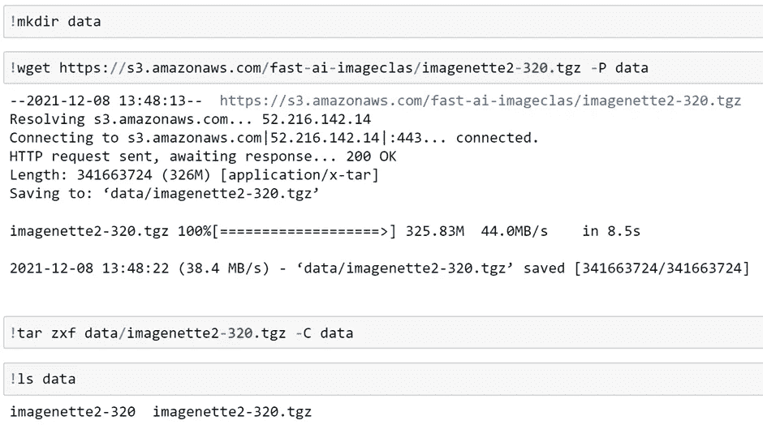

## 定义培训脚本

现在我们已经下载了数据，让我们为培训任务和输出创建文件夹，并编写脚本:

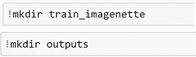

在这里，我们正在训练一个来自优秀的 [timm 库](https://github.com/rwightman/pytorch-image-models)的 [Resnet-RS50](https://arxiv.org/abs/2103.07579) 模型——这是标准 Resnet 架构的改进版本，我建议使用它来代替常规的[Resnet 50](https://arxiv.org/abs/1512.03385)——带有 [AdamW 优化器](https://arxiv.org/abs/1711.05101v3)和[单周期](https://arxiv.org/abs/1506.01186)学习速率表；我发现这个配置对于大多数图像分类任务来说是一个很好的默认配置。

因此，我们不需要编写训练循环，或者管理向不同设备移动数据，我们使用 P *yTorch-accelerated* 的[训练器](https://pytorch-accelerated.readthedocs.io/en/latest/trainer.html)来为我们处理这些问题。这样，我们的代码将保持不变，无论我们是在单个 GPU 上训练，还是在分布于不同节点的多个 GPU 上训练。由于建议使用 [Accelerate CLI](https://huggingface.co/docs/accelerate/quicktour.html#launching-your-distributed-script) 启动 P *yTorch-accelerated* 脚本，这也意味着我们使用的命令也将保持一致，不管我们的硬件如何。

*如果您对* [*PyTorch 加速*](https://github.com/Chris-hughes10/pytorch-accelerated) *不熟悉，并且想在开始阅读本文之前了解更多信息，请查看* [*介绍性博客文章*](https://medium.com/@chris.p.hughes10/introducing-pytorch-accelerated-6ba99530608c?source=friends_link&sk=868c2d2ec5229fdea42877c0bf82b968) *或* [*文档*](https://pytorch-accelerated.readthedocs.io/en/latest/)*；或者，这很简单，缺乏这方面的知识不会影响您对本文所探讨内容的理解！*

## 在本地进行培训

让我们验证一下训练脚本是否在我们的本地机器上运行。首先，让我们创建一个配置文件，使用 accelerate CLI 指定我们的硬件选项。我们可以通过运行以下命令并回答问题来做到这一点:

```
accelerate config --config_file train_imagenette/accelerate_config.yaml
```

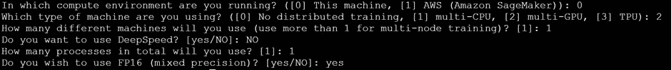

我们可以生成以下 yaml 文件:

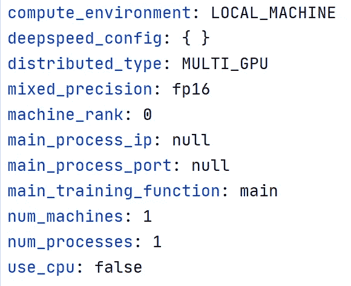

我们现在可以使用 accelerate launch 命令开始我们的训练跑了:

```
accelerate launch --config_file train_imagenette/accelerate_config.yaml \
train_imagenette/train.py --data_dir data/imagenette2-320 --epochs 1
```

这将产生以下输出:

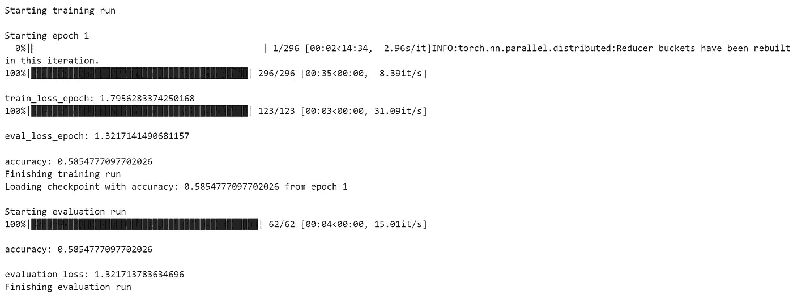

为了使用额外的 GPU 进行训练，我们需要修改我们的 accelerate 配置文件。一种方法是使用与之前相同的过程。或者，由于我们想要更改的只是进程的数量，我们可以直接从命令行覆盖该属性，如下所示。为了避免不得不在不同的运行之间运行“accelerate config”命令，我们将在稍后使用 AzureML 时利用这一点。

```
accelerate launch --config_file train_imagenette/accelerate_config.yaml --num_processes 2 \
train_imagenette/train.py --data_dir data/imagenette2-320 --epochs 1
```

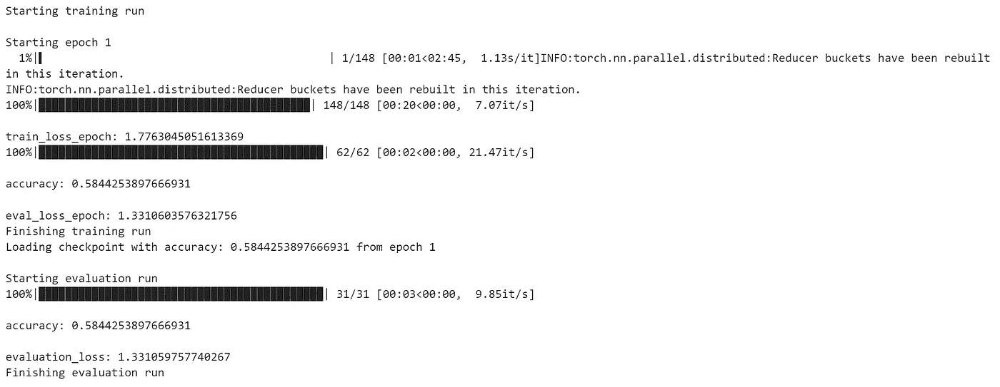

我们可以从输出中看到，由于使用了两个 GPU，在训练和验证期间需要的步骤减少了一半。

现在我们已经验证了我们可以在本地运行我们的脚本，让我们探索如何使用 AzureML 来扩展我们的训练。

如果您更喜欢使用 vanilla PyTorch 编写脚本，您仍然可以遵循本文中概述的方法，但是您必须手动处理脚本中所有复杂的分布式训练，并确保您为您的硬件使用正确的启动命令！

# **azure ml 上的分布式培训**

AzureML 为训练模型提供了两种不同的方法:

*   使用 [CLI v2](https://docs.microsoft.com/en-us/azure/machine-learning/how-to-train-cli) (我个人偏好)
*   使用 [Python SDK](https://docs.microsoft.com/en-us/python/api/overview/azure/ml/?view=azure-ml-py)

这里，我们将重点介绍 CLI v2 的使用。

AzureML CLI v2 提供了一种基于命令行的模型训练方法，其中我们的配置是在 yaml 文件中定义的。如果你习惯于在笔记本上使用 SDK，这可能会有点令人生畏，但是一旦你理解了可用的选项是什么，这就很简单了！

在我们开始培训之前，需要注意一些先决条件。要遵循本指南，您需要:

*   一个 **Azure 订阅**——在这里很容易注册一个订阅[，它包括前 30 天的免费积分，然后在特定阈值下免费使用。](https://azure.microsoft.com/en-gb/free/)
*   安装 **Azure CLI** 和
*   创建一个 **Azure 机器学习工作区—** 这很简单，可以使用[门户](https://docs.microsoft.com/en-us/azure/machine-learning/how-to-manage-workspace?tabs=python)或[CLI](https://docs.microsoft.com/en-us/azure/machine-learning/how-to-manage-workspace-cli?tabs=createnewresources%2Cvnetpleconfigurationsv1cli)来完成
*   为了[安装**azure ml CLI v2**](https://docs.microsoft.com/en-us/azure/machine-learning/how-to-configure-cli)

在撰写本文时使用的版本如下所示:


***注意:*** *重要的是，CLI v2 的扩展名显示为“ml”，如果您看到的是“azure-cli-ml”，这是 CLI v1，以下步骤将不起作用！*

为了获得 Azure ML CLI v2 中可用功能的概述，我们可以运行命令:

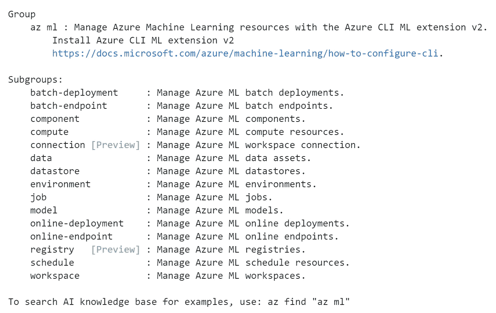

一旦一切都安装好了，我们就可以开始了！

## **将日志记录添加到培训脚本(可选)**

尽管我们的脚本已经准备好按原样运行，但是唯一将被捕获的输出是标准输出日志，当在 AzureML 上运行时，它将被写入一个文本文件。为了帮助我们跟踪和比较不同的实验运行，而不必查看日志，我们可以设置一个日志记录器来记录某些指标和工件，以显示在 AzureML 门户上。

使用 *azureml-mlflow* 包，我们可以使用 [MLFlow fluent API](https://mlflow.org/docs/latest/python_api/mlflow.html) 进行日志记录；更多关于使用 MLFlow 和 AzureML 的信息可以在[这里](https://docs.microsoft.com/en-us/azure/machine-learning/how-to-use-mlflow)找到。

通过 PyTorch 加速，我们可以[为此创建一个回调](https://pytorch-accelerated.readthedocs.io/en/latest/callbacks.html#creating-new-callbacks)，如下图所示:

正如我们所见，这根本不需要太多代码！这里，我们子类化了一个现有的 PyTorch 加速回调函数，并覆盖了日志记录方法来记录 MLFlow 这只能在所有节点的主流程中完成，以防止相同的指标被记录两次。通常，当使用 MLFlow 时，我们必须显式地开始和结束运行，但 AzureML 将为我们处理这一点；以及确保为我们设置了包含跟踪 URI 的环境。除了记录指标，我们还将记录训练者的[跑步配置](https://pytorch-accelerated.readthedocs.io/en/latest/run_config.html)，其中包含诸如训练周期数和是否使用了混合精度等信息。如果我们需要重新运行相同的实验，获取这些信息将有助于我们在将来复制训练条件。

此外，正如我们前面看到的，PyTorch-accelerated 默认显示一个进度条。让我们删除它，以保持日志尽可能清晰。我们可以通过移除 [ProgressBarCallback](https://pytorch-accelerated.readthedocs.io/en/latest/callbacks.html#pytorch_accelerated.callbacks.ProgressBarCallback) 来做到这一点。

让我们更新我们的脚本来反映这些变化。

这里我们可以看到，我们已经更新了传递给培训师的回访列表。因为我们正在将模型保存到。outputs '文件夹，这将由 AzureML 为我们存储。

## **定义我们的培训环境**

既然我们的训练代码已经准备好了，我们需要定义代码执行的环境。AzureML 提供了[管理环境](https://docs.microsoft.com/en-us/azure/machine-learning/concept-environments)——旨在按原样使用——以及通过指定 conda 依赖文件来[创建环境](https://docs.microsoft.com/en-us/azure/machine-learning/how-to-manage-environments-v2)的选项，conda 依赖文件定义了要安装到默认基本 docker 映像上的指定包。

虽然这些方法可能是一个很好的开始，因为它们是建立在“默认”docker 映像之上的，并且以这种方式创建的环境通常包括许多您没有指定和不需要的包；在这些环境中安装额外的包可能会产生您没有意识到的冲突。

这些方法的替代方法是定义我们自己的 docker 图像。就我个人而言，尤其是在生产环境中，我喜欢完全控制环境的所有方面，并且倾向于发现，在第一次设置实验时，我花在创建 docker 映像上的少量时间可以节省我以后花在调试环境问题上的更多时间！

对于这个实验，我们可以使用 [base PyTorch image](https://hub.docker.com/r/pytorch/pytorch/tags/) 来定义一个自定义 Dockerfile，如下所示。由于我们的基本映像包含 PyTorch 和所有必要的 cuda 库，我们需要指定的唯一包是 AzureML 组件、MlFlow 和运行我们的训练脚本所需的依赖项。

下面演示了这一点:

我们也可以在此时将我们的训练脚本复制到 docker 映像中，但是我们会让 AzureML 稍后为我们做这件事！为此，我们将在实验文件夹中使用一个单独的目录来存储 docker 文件，它将被用作 docker 构建上下文；AzureML 只会在该文件夹中的内容发生变化时触发映像构建过程。通过使用 AzureML 将我们的脚本复制到环境中，我们可以避免在每次修改脚本时触发构建和推送映像的过程。

关于创建 Dockerfiles 的更多信息可以在[这里](https://kevalnagda.github.io/dockerfile)找到。

## **注册数据集**

我们必须做的另一件事是将数据集上传到云中。虽然我们有多种方法可以做到这一点(取决于数据的位置)，但我们将通过从本地文件夹注册数据集来做到这一点。我们可以通过定义以下 yaml 文件来做到这一点:

现在，我们可以使用 CLI 在工作区中注册该数据集，并使用以下命令上传文件:

```
az ml data create -f data/register_dataset.yaml \
--resource-group myResourceGroup --workspace-name myWorkspace
```

虽然在培训工作中有其他[选择](https://docs.microsoft.com/en-us/azure/machine-learning/how-to-train-cli#data-inputs)来访问数据，但注册和版本化数据集是一种推荐的方法，可以实现实验的跟踪和再现性。

## **创建计算目标**

接下来要做的是定义我们希望运行培训脚本的计算目标。我们可以通过访问 [Azure 文档](https://docs.microsoft.com/en-us/azure/virtual-machines/sizes-gpu)或运行以下命令来了解可用的选项:

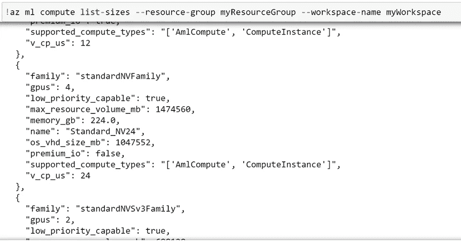

这里我们用一个 [Standard_NV24](https://docs.microsoft.com/en-us/azure/virtual-machines/nv-series) ，它有 4 个[NVIDIA Tesla M60](https://images.nvidia.com/content/tesla/pdf/188417-Tesla-M60-DS-A4-fnl-Web.pdf)GPU。

我们可以按如下方式定义和配置我们的计算集群:

```
az ml compute create -f infra/create_compute_target.yaml \
--resource-group myResourceGroup --workspace-name myWorkspace
```

由于我们已经定义了一系列实例，AzureML 将根据需求管理集群的伸缩。

## 定义培训工作配置

现在，是时候为我们的训练运行定义配置了！这是通过使用一个[任务](https://docs.microsoft.com/en-us/azure/machine-learning/how-to-train-cli#hello-world)来完成的，它指定了以下内容:

*   跑什么
*   在哪里运行
*   如何运行它

让我们定义我们的作业配置文件，然后分解它:

首先，我们已经指定了我们想要运行的内容，这非常类似于我们用来在本地运行培训的 accelerate launch 命令；关键的区别在于我们覆盖了 accelerate 配置文件的一些属性。

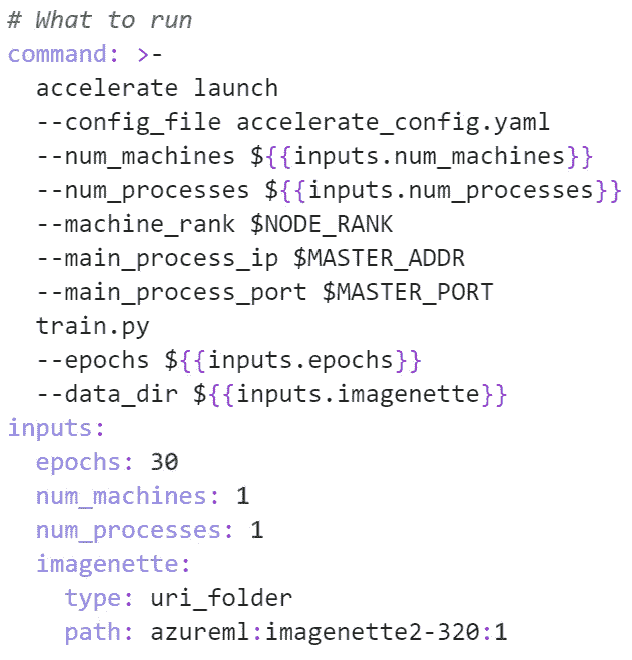

这里，我们使用了由 AzureML 自动设置的环境变量来指定分布式训练所需的机器等级、主进程 IP 地址和主进程端口的值。这将确保在每个节点上使用正确的值，这样我们就不需要为每台机器创建单独的配置文件。

我们还定义了一些输入，作为参数传递给我们的脚本。通过定义输入部分，我们可以选择从命令行覆盖这些值，这样我们就不必为不同的超参数配置修改 yaml 脚本。

要访问我们的数据集，因为它是在我们的工作区中注册的，我们可以使用' azureml '前缀来访问它，后跟它注册时的名称和数据集版本标签；AzureML 将把这个数据集挂载到每个计算实例，并将正确的数据路径传递给我们的训练脚本。

接下来，我们定义了想要运行代码的位置:

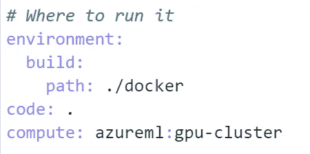

这里，我们指定环境——包含我们之前创建的 docker 文件的目录——我们代码的本地路径，以及我们提供的计算目标。提交时，AzureML 将构建 docker 映像，然后将此映像推送到容器注册中心；这将被缓存，直到做出更改。对于每次运行,“代码”路径中的所有内容都将被复制到 docker 映像中，并在指定的计算目标上执行。

最后，我们已经定义了希望如何运行作业，在本例中，就是指定我们的分布式培训配置。

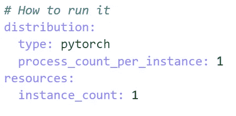

因为 accelerate launch 命令将处理为每个 GPU 创建进程的任务，所以我们只需要在每台机器上执行一个进程。在参考资料部分，我们已经指定了我们希望用于培训的实例数量。

要了解配置作业的所有可用选项，您可以查看文档或检查[命令作业模式](https://azuremlschemas.azureedge.net/latest/commandJob.schema.json)。

## 启动 AzureML 培训

现在，让我们使用下面的命令启动我们的培训作业。默认情况下，我们的配置指定在单台机器上使用单个 GPU，因此我们覆盖了其中的一些值，以便在两台机器上使用八个 GPU。

```
az ml job create -f train_imagenette/train_config.yaml --set \
 inputs.num_machines=2 \
 inputs.num_processes=8 \
 resources.instance_count=2 \
--resource-group myResourceGroup --workspace-name myWorkspace
```

现在，如果我们导航到 AzureML 工作区中的实验部分，我们应该能够看到我们的训练运行！

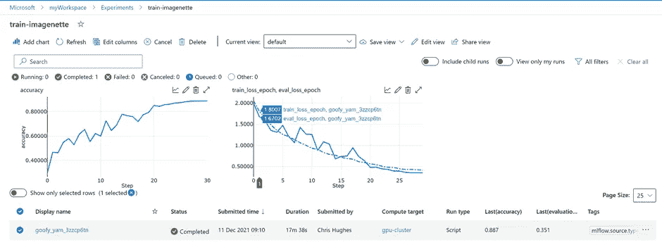

在这里，我们可以看到一些图表是基于我们在培训期间记录的值绘制的；这个视图可以根据你的喜好定制。由于我们没有在配置文件中指定显示名称，AzureML 已经指定了一个随机名称；如果我们对多次运行使用相同的显示名称，将会使图表上显示的指标与正确的运行相关联变得更加困难。

我们还可以选择我们的跑步来查看其他信息，包括从教练的跑步配置中记录的标签。

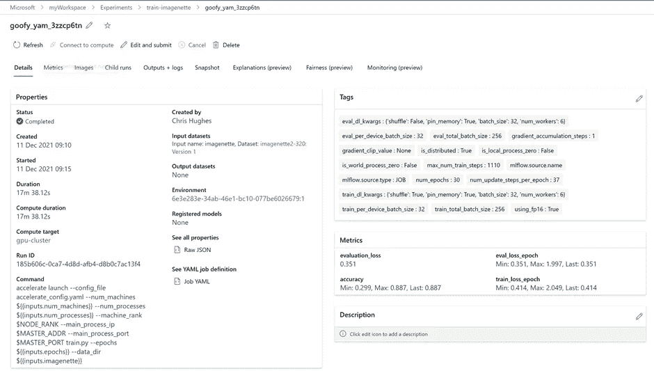

浏览选项卡，我们可以看到记录的指标的更细粒度视图，以及所用代码的快照。

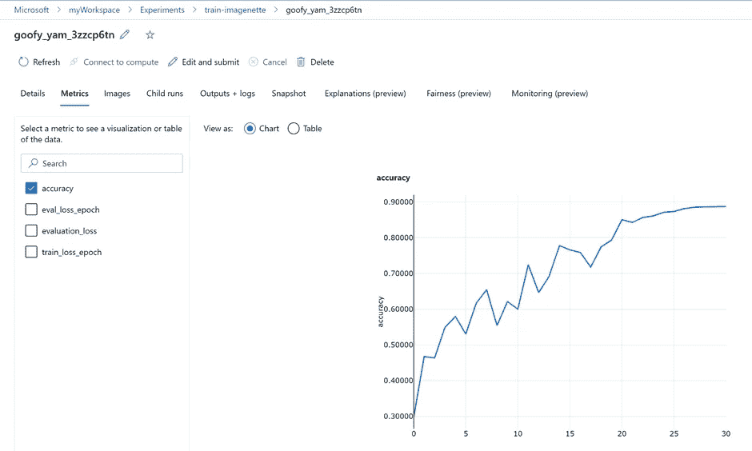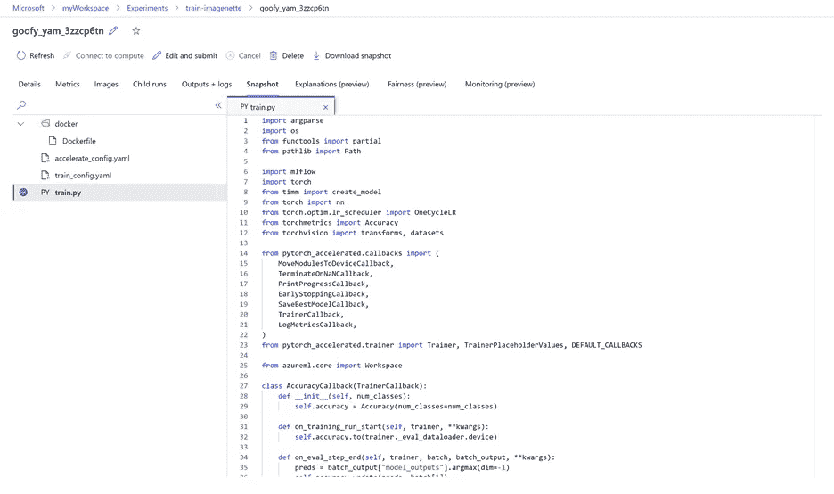

在“Outputs + Logs”选项卡中，我们可以看到由我们的脚本生成的日志，以及我们保存到 Outputs 文件夹的模型检查点:

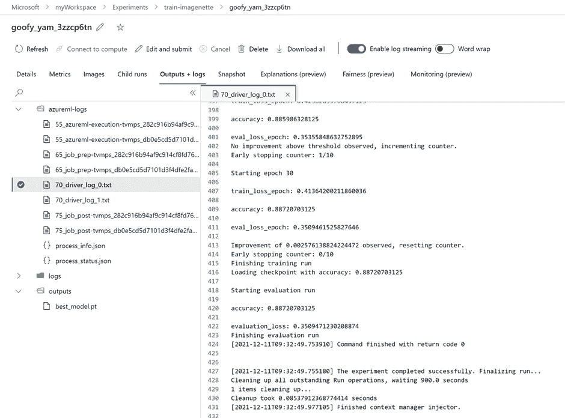

# 结论

希望这已经展示了使用 [Azure 机器学习](https://docs.microsoft.com/en-us/azure/machine-learning/)和 [PyTorch 加速](https://github.com/Chris-hughes10/pytorch-accelerated)的强大组合，在 Azure 上开始 PyTorch 模型的分布式培训是多么容易！

*克里斯·休斯上了*[*LinkedIn*](http://www.linkedin.com/in/chris-hughes1/)*。*