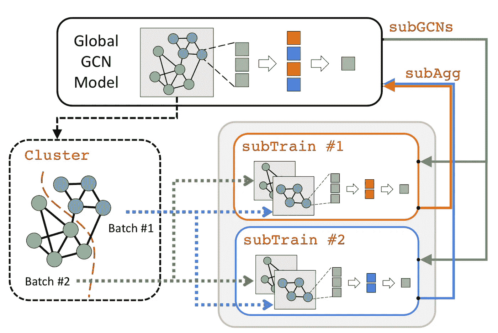
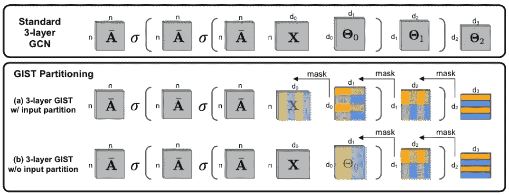
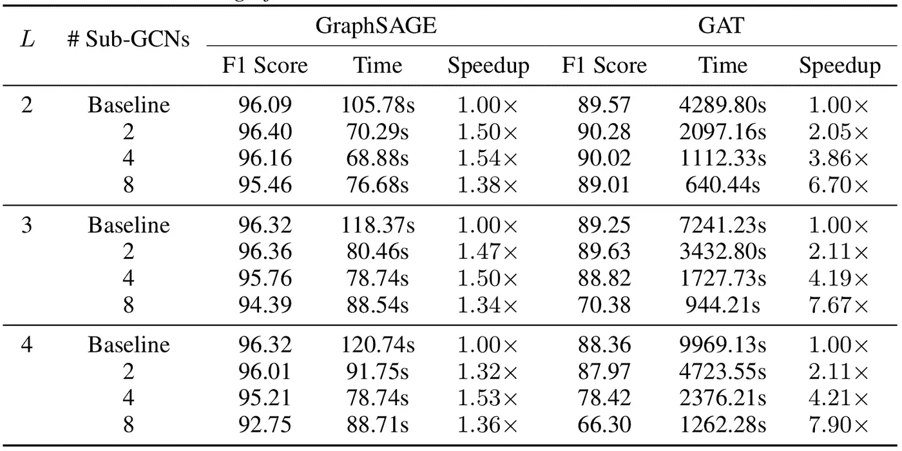
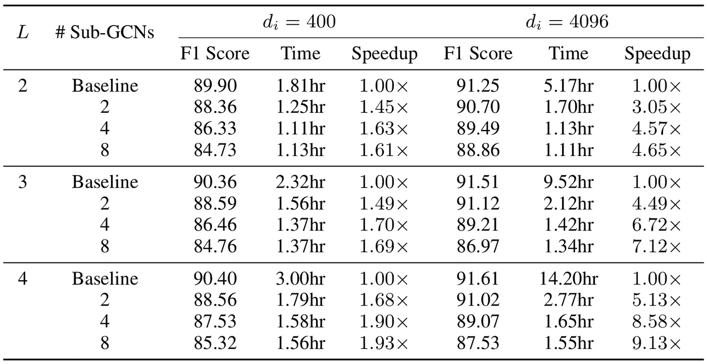
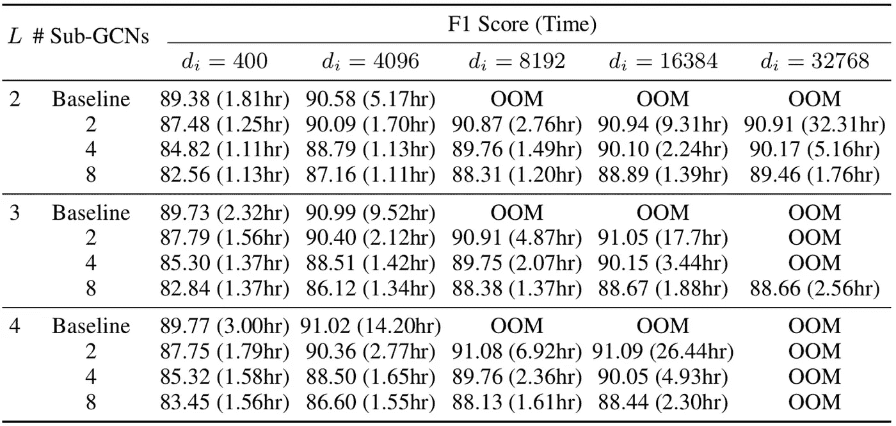

# 轻松的超宽 GCNs 分布式训练

> 原文：<https://towardsdatascience.com/effortless-distributed-training-of-ultra-wide-gcns-6e9873f58a50?source=collection_archive---------38----------------------->

图 GIST 培训管道的描述。子 GCNs 将 GCN 模型分成多个子 GCNs。每个子 GCN 都是用聚类操作构造的小批量子训练的。通过 subAgg 操作，子 GCN 参数被间歇地聚集到全局模型中。【图由作者创作。]

在这篇文章中，我将概述最近提出的用于大规模图卷积网络(GCNs)的分布式训练框架，称为图独立子网训练(GIST) [1]。GIST 极大地加速了任何架构的 GCN 训练过程，并可用于支持超过单个 GPU 能力的大规模模型的训练。我的目标是在这篇文章中涵盖 GIST 的最关键的方面，包括相关的背景信息，对训练方法的全面描述，以及关于 GIST 的实验验证的细节。一份完整、详细的手稿被用来描述 GIST，可在 Arxiv 上获得[。此外，使用 GIST 进行的所有实验的源代码都可以在 GitHub](https://arxiv.org/abs/2102.10424) 上公开获得[。](https://github.com/wolfecameron/GIST)

# 介绍

机器学习和深度学习已经通过它们在工业和科学问题上的许多应用而普及(例如，自动驾驶汽车、推荐系统、人员跟踪等)。)，但图形上的机器学习(我将简称为 graphML)最近刚刚成为计算机科学和人工智能研究的焦点。虽然 graphML 的普及有许多原因，但一个主要原因是一个简单的事实，即并非所有数据都可以在欧几里得空间中编码。在许多应用中，图是更直观的数据结构，例如社交网络(即，图的节点是人，边代表社交关系)或化学(即，图的节点代表原子，边代表化学键)。同样地，在欧几里德数据上概括现有的学习策略(例如，卷积神经网络、变换器等。)研究图表是一个很有价值的问题。

为了实现这个目标，已经开发了几种针对图的(深度)学习技术，其中最流行的是图卷积网络(GCN) [2]。受光谱图卷积的一阶近似的启发，GCN 实现了图的卷积运算的一般化。尽管 GCN 很受欢迎，并且在执行节点和图级别的分类任务方面取得了广泛的成功，但该模型的效率非常低，并且难以扩展到大型图。这一问题促进了节点划分技术的发展，包括邻域采样(例如，LADIES 和 FastGCN)和图划分(例如，ClusterGCN 和 GraphSAGE)，其将大图划分成计算上易处理的部分。尽管如此，graphML 研究中使用的数据仍然保持在相对较小的规模，由于更深层次网络中的过度平滑问题，大多数 GCN 模型的规模有限[3]。graphML 实验中这种较小数据和模型的使用与主流深度学习研究形成鲜明对比，后者的实验规模不断扩大。

为了弥合深度学习和 graphML 之间的规模差距，GIST 旨在利用更大的模型和数据集进行实验。GIST 可用于训练任何 GCN 体系结构，并与现有的节点划分技术兼容，它通过随机划分全局模型内的隐藏特征空间，将全局 GCN 模型分解成几个等深度的窄子 gcn 来操作。然后，这些子 gcn 被分发到单独的 GPU，并在将它们的更新聚合到完整的全局模型中之前，独立且并行地训练几次迭代。然后，创建/分发一组新的子 gcn，重复相同的过程，直到收敛。在非常大的图的情况下，我们采用现有的图划分方法来形成小批量，这允许 GIST 在任意大的图上训练 GCN 模型。

简而言之，GIST 旨在以最少的挂钟训练时间为大规模 GCN 实验提供一个分布式训练框架。此外，因为 GIST 训练子 gcn 而不是直接训练全局模型，所以它可以用于训练具有超过单个 GPU 能力的极大隐藏层的模型(例如，我们使用 GIST 在 Amazon2M 上训练“超宽”32，768 维 GraphSAGE 模型)。需要注意的是，我们选择关注缩放模型的宽度，而不是深度，因为深度 GCN 模型会受到过度平滑的影响[3]。

# 要点是什么？

这里，我们解释 GIST 使用的一般训练方法。这种培训方法旨在实现快速、大规模的 GCN 实验，适用于任何 GCN 建筑或取样方法。在我们的解释中，我们假设读者对 GCN 建筑有一个大致的了解。为了全面了解 GCN 的建筑，我们推荐[这篇文章](https://tkipf.github.io/graph-convolutional-networks/)。图 1 提供了 GIST 培训方法的全局视图，我们将在以下部分进一步解释该方法的每个组成部分。

## 创建子 gcn

图 2:m = 2 的 GCN 分割。橙色和蓝色代表不同的功能分区。两个隐藏维度(d1 和 d2)都被分区。输出维度(d3)没有分区，对输入维度(d0)的分区是可选的。GIST 不划分输入维度。【图由作者创作。]

用 GIST 训练 GCN 模型的第一步是划分全局模型的隐藏维度，以形成多个等深度的窄子 gcn(即，图 1 中的`sub-GCNs`)。在划分之前，必须知道子 gcn 的数量，表示为`m`。然后，对于全局模型的每个隐藏层，该层内的神经元的索引被随机划分成大小相等的`m`不相交组，对应于不同的子 gcn。一旦构造了这些分区，通过用来自前一层的分区索引来索引全局权重矩阵的行，用当前层的分区索引来索引全局权重矩阵的列，可以构造任意层的子 GCN 权重矩阵。这样，这种划分方法为对应于已经选择的随机特征划分的每个子 GCN 创建更小的权重矩阵。

图 2 中描述的上述方法对全局 GCN 模型的所有层执行，但是输入和输出维度不包括在划分中。输入维度(即，图 2 中的 d0)没有被划分，因为这将导致每个子 GCN 只能访问每个节点的输入向量的一部分，这将导致`m`的值越大，性能越下降。类似地，全局模型的输出维度(即，图 2 中的 d3)没有被分割，使得每个子 GCN 产生相同大小的输出向量。因此，不需要对损失函数进行修改，并且可以训练所有子 gcn 来最小化相同的全局损失函数。

一旦构建了子 gcn，它们每个都被发送到单独的 GPU 进行独立和并行的训练。应当注意的是，完整模型从不被传送(即，仅子 gcn 在设备之间被传送)，这极大地提高了利用 GIST 的分布式训练的通信效率。子 GCN 分区的过程如图 2 所示，其中不同的子 GCN 分区用橙色和蓝色表示。回想一下，GIST 中没有划分输入和输出维度，如图 2 的(b)所示。

## 培训子 GCNs

在子 gcn 被构造并被发送到它们各自的设备之后，它们每个都被独立且并行地训练一组迭代次数(即图 1 中的`subTrain`),这被称为局部迭代。当子 GCN 已经完成它们的局部迭代时，每个子 GCN 的参数更新被聚集到全局模型中，并且新的子 gcn 组被创建。这个过程重复进行，直到收敛。如前所述，训练子 gcn 以最小化相同的全局损失函数。此外，在相同的数据上训练每个子 GCN(即，不假设跨设备的数据的非 iid 分区)。

为了确保使用 GIST 训练的模型和使用标准单 GPU 方法训练的模型之间的训练总量保持恒定，使用 GIST 训练的 GCN 模型具有跨子 gcn 分割的训练历元总数。例如，如果普通的基线 GCN 模型使用单个 GPU 训练 10 个时期，那么使用两个子 GCN 用 GIST 训练的可比 GCN 模型将为每个子 GCN 进行 5 个时期的训练。因为子 GCN 是并行训练的，所以每个子 GCN 的训练历元数量的这种减少导致了大的训练加速。

如果训练图足够小，子 gcn 可以并行进行整批训练。然而，在训练图对于要执行的整批训练来说太大的情况下，作为预处理步骤，采用图划分方法将训练图分解成更小的、计算上易处理的子图(即，图 1 中的`Cluster`)。然后，这些子图在独立的训练迭代期间被用作小批量，这大致反映了 clusterGCN 提出的训练方法[4]。尽管可以使用任何划分方法，但 GIST 使用 METIS 是因为它在大规模图形上证明了效率[5]。

## 聚集子 gcn

在子 gcn 完成独立训练之后，在新的子 gcn 的另一轮独立训练开始之前，必须将它们的参数聚集到全局模型中(即图 1 中的`subAgg`)。这种聚集通过简单地将每个子 GCN 的参数复制到它们在全局模型中的相应位置来执行。由于在 GIST 中创建的特征分区是不连续的，因此在此过程中不会发生冲突。有趣的是，不是所有的参数都在每一轮独立训练中更新。例如，在图 2 的(b)中，实际上只有重叠的橙色和蓝色块被划分为子 gcn，而其他参数被排除在独立训练之外。然而，如果进行了足够多的独立训练回合，则全局模型中的所有参数都应该被更新多次，因为每个训练回合都利用了新的随机特征划分。

# GIST 为什么有用？

乍一看，GIST 培训方法似乎有些复杂，让人想知道为什么要使用它。在这一节中，我概述了 GIST 的好处，以及为什么它会带来更有效的、大规模的图形实验。

## 与架构无关的分布式培训

GIST 是一种分布式培训方法，可用于任何 GCN 架构。特别地，GIST 被用于训练原始手稿中的普通 GCN、GraphSAGE 和图形注意力网络(GAT)架构，但是 GIST 不限于这些模型。因此，它是一个通用框架，可用于加速任何 GCN 模型的训练。

## 与取样方法的兼容性

GIST 中的特征划分策略与为有效的 GCN 训练而提出的许多节点划分策略是正交的。因此，这些策略中的任何一种都可以很容易地与 GIST 相结合，以提高训练效率。例如，图划分被用于在具有 GIST 的较大图上训练 gcn，GIST 甚至被用于训练 GraphSAGE 模型。这些实验证明了 GIST 与现有的图形和邻域采样方法的兼容性。

## 超宽 GCN 训练

GIST 通过训练更小的子 GCN 来间接更新全局 GCN 模型，这使得具有极大隐藏维度(即超过单个 GPU 的能力)的模型能够被训练。例如，当使用 8 个子 GCN 训练具有 GIST 的 GCN 模型时，在单个 GPU 的容量限制下，该模型的隐藏维度可以比模型大大约 8 倍。这种性质使得能够用 GIST 训练“超宽”GCN 模型，如在用 GIST 的实验中所证明的。

## 提高了模型的复杂性

GIST 显著降低了分布式 GCN 训练的通信和计算复杂度，导致挂钟训练时间的急剧加速。这种复杂度的降低是由于 GIST 只传送和训练比全局模型小得多的子 gcn。GIST 提供的复杂性降低的更精确的表达可在原始手稿中获得。

# GIST 在实践中表现如何？

在这一节中，我概述了使用 GIST 进行的实验，这些实验验证了它在显著减少挂钟时间的情况下训练 GCN 模型达到高性能的能力。实验在大量数据集上进行，包括 Cora、Citeseer、Pubmed、OGBN-Arxiv、Reddit 和 Amazon2M。然而，在本文中，我将重点放在 Reddit 和 Amazon2M 的实验上，因为这些数据集要大得多，并且与实际的 graphML 应用程序更相关。较小的数据集主要用作 GIST 方法的设计/消融实验，更多细节可在手稿中获得。

## Reddit 数据集

图 3:在 Reddit 数据集上使用 GIST 和标准单 GPU 方法训练的 GraphSAGE 和 GAT 模型的 F1 分数和挂钟训练时间。【图由作者创作。]

GIST 在 Reddit 数据集上的实验是用 256 维 GraphSAGE 和 GAT 模型两到四层进行的。使用多个不同数量的子 GCN 用 GIST 训练模型，其中假设每个子 GCN 被分配到单独的 GPU(即，8 个子 GCN 实验总共使用 8 个 GPU)。使用 Adam 优化器执行总训练的 80 个时期，并且没有权重衰减，并且局部迭代的数量被设置为 500。在训练期间，训练图被分成 15，000 个子图。基线模型使用标准的单 GPU 方法进行训练，所有其他实验细节保持不变。如图 3 所示，使用 GIST 训练的所有模型的性能都达到或超过了使用标准单 GPU 方法训练的模型。此外，与标准的单 GPU 训练相比，GIST 的训练时间显著减少。

## Amazon2M 数据集

图 GraphSAGE 模型的 F1 分数和挂钟训练时间，这些模型具有不同的隐藏维度和层数，使用 GIST 和标准的单 GPU 方法在 Amazon2M 数据集上进行训练。【图由作者创作。]

在 Amazon2M 数据集上使用 GraphSAGE 模型进行 GIST 实验，该模型具有 400 和 4096 的隐藏维度(即窄模型和宽模型)以及不同的层数。再次，使用多个不同数量的子 gcn 用 GIST 训练模型，并且训练图被分解成 15，000 个分区。基线实验使用标准的单 GPU 训练方法来执行。使用 Adam 优化器进行训练，在总共 400 个时期内没有权重衰减，并且局部迭代的数量被设置为 5，000。如图 4 所示，与使用标准单 GPU 方法训练的基线模型相比，使用 GIST 训练的模型完成训练的速度明显更快。此外，在所有情况下，用 GIST 训练的模型与用标准方法训练的模型表现相当。

## 超宽 GCNs

图 5:在 Amazon2M 数据集上使用 GIST 和单 GPU 方法训练的 400 到 32，768 个隐藏维度的 GraphSAGE 模型的性能指标。标有“OOM”的事例在训练过程中导致内存不足错误。【图由作者创作。]

如前所述，GIST 可以用于训练非常广泛的 GCN 模型，因为全球模型是通过子 gcn 的独立训练间接更新的。为了展示这种能力，在 Amazon2M 数据集上训练了具有越来越大的隐藏维度的 GraphSAGE 模型。如图 5 所示，GIST 可用于在 Amazon2M 数据集上训练隐藏维度高达 32，768 的 GraphSAGE 模型，从而以相对最少的训练时间获得高性能。在这些情况下，单 GPU 训练方法会出现内存不足的错误(即使是在小得多的 GCN 模型中)，从而证明 GIST 可以用于训练远远超过单个 GPU 能力的模型。此外，与使用 GIST 训练的模型相比，仅使用单个 GPU 训练的模型的挂钟训练时间变得非常令人望而却步，从而突出了其加速大规模 GCN 实验的能力。正如这些实验所表明的，GIST 使 GCN 实验能够在以前不可行的规模上进行。

# 结论

在这篇博文中，我概述了 GIST，一种用于大型 GCN 模型的新型分布式训练方法。GIST 通过将全局 GCN 模型划分为几个狭窄的子 gcn 来运行，这些子 gcn 分布在单独的 GPU 上，并且在将它们的参数聚集到全局模型中之前独立地并行训练。GIST 可以用于训练任何 GCN 体系结构，与现有的采样方法兼容，并且可以在不降低模型性能的情况下显著加快训练时间。此外，GIST 能够将难以置信的宽 GCN 模型训练到最先进的性能，如 Amazon2M 数据集上的 32，768 维 GraphSAGE 模型。

我真的很感谢你对这篇博客感兴趣。如果您有任何意见或问题，请随时联系我或留下您的意见(联系信息可在[我的网站](https://wolfecameron.github.io)上找到)。GIST 是作为独立子网训练(IST)计划的一部分，在莱斯大学我的研究实验室(T3)内开发的。更多相关项目信息请点击[这里](https://akyrillidis.github.io/ist/)。

# *引文*

[1][https://arxiv.org/abs/2102.10424](https://arxiv.org/abs/2102.10424)

[https://arxiv.org/abs/1609.02907](https://arxiv.org/abs/1609.02907)

[3][https://arxiv.org/abs/1801.07606](https://arxiv.org/abs/1801.07606)

[https://arxiv.org/abs/1905.07953](https://arxiv.org/abs/1905.07953)

[http://citeseerx.ist.psu.edu/viewdoc/summary?[5]doi=10.1.1.106.4101](http://citeseerx.ist.psu.edu/viewdoc/summary?doi=10.1.1.106.4101)