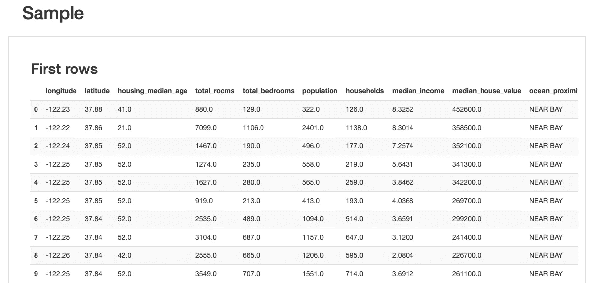
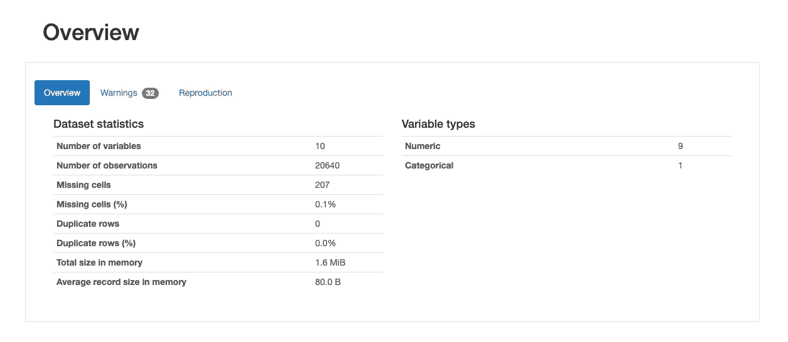
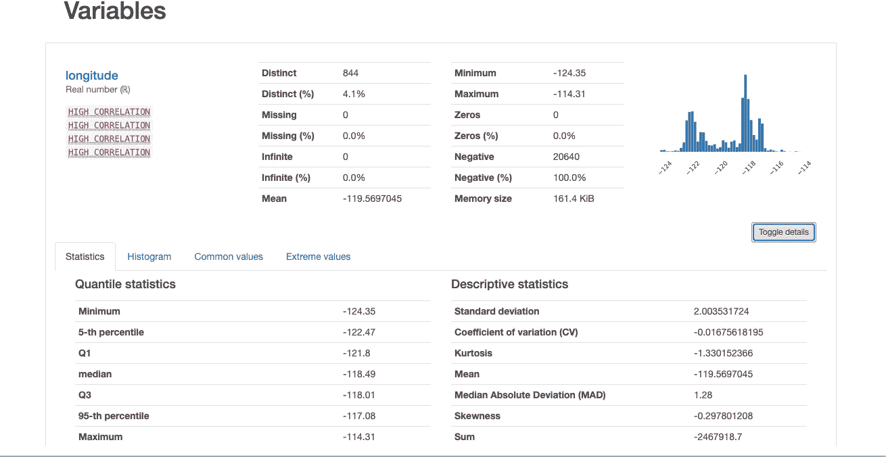
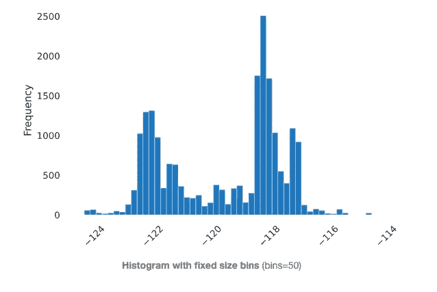
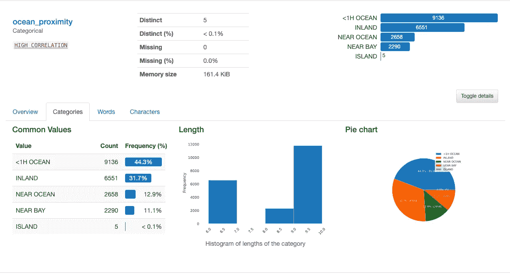
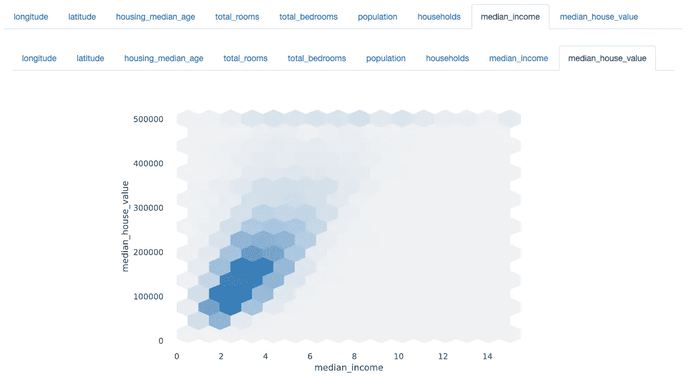
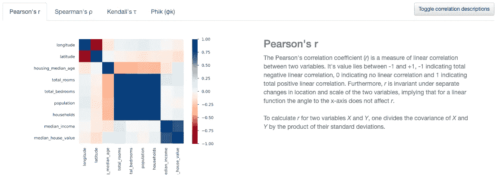
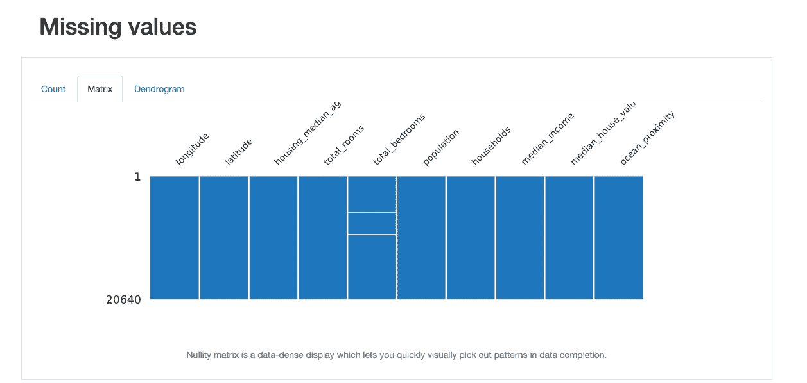

# 轻松的探索性数据分析(EDA)

> 原文：<https://towardsdatascience.com/effortless-exploratory-data-analysis-eda-201c99324857?source=collection_archive---------22----------------------->

## 使用 PyCaret 在 1 行代码中生成全面的 EDA 报告。

# 什么是 EDA，为什么它是必不可少的？

在我们开始建模之前，理解手头的数据是至关重要的。单单分析数据就能给我们提供有价值的见解来解决我们的问题。此外，理解数据对于确定哪些特征将有助于我们的模型、哪些特征可以去除、我们如何处理缺失值和相关性等等非常有用。在考虑了所有这些因素之后建立一个模型将确保它是稳健的，并且可以很好地推广。

# PyCaret 是什么？

由于从 EDA 到模型原型的数据科学管道有些结构化(至少对于简单的 ML 任务)，我们可以使用 PyCaret 等工具来自动化 EDA、模型构建和调整超参数。它还有许多其他功能，如打包、提升、堆叠模型、从数据生成多项式特征、用高基数转换分类数据等等，所有这些我将在后面的文章中讨论。今天我们的重点是 EDA。值得注意的是 PyCaret 使用 **pandas-profiling** 来执行 EDA。

# **让我们在几秒钟内生成一个回归问题的 EDA 报告。**

我在这里使用了流行的[加州房价数据集(1990)](https://www.kaggle.com/camnugent/california-housing-prices) 。让我们试着分析一下什么特征会影响一个街区内的房价。我强烈建议用户在 Google Colab 或 Jupyter 上尝试这段代码，除非你的设备有足够的 RAM。

1.  正在安装 PyCaret 并准备好 Colab。

```
!pip install pycaret
from pycaret.utils import enable_colab
enable_colab()
import pandas as pd
from pycaret.regression import *dataset=pd.read_csv('/content/housing.csv') #Read the Csv File
```

2.生成 EDA 报告！

```
exp1 = setup(data = dataset, target = 'median_house_value', session_id=123 , profile=True)
```

确保配置文件参数设置为 True

# 让我们看看我们有什么

首先，值得注意的是，该报告仅在 **18.99 秒内生成。另外，我们有一个非常酷的导航栏，可以跳转到报告中的各个部分。**

快速转到 sample，它基本上向我们展示了数据集的头部。


导航条



样本部分

## 接下来



概述部分

*概述*部分告诉我们数据集结构、缺失单元、重复单元的数量、数据集占用的大小以及**变量的数量及其类型。**

让我们在*变量*部分详细观察一个数字特征(**经度)**。



观察数字特征

一旦我们点击变量名下的 toggle details，我们就有了大量的数据、分位数统计数据、标准偏差、**列中的不同值。**这只是开始！一旦我们切换到直方图选项卡，我们可以看到变量的分布。



切换到直方图选项卡时

这里还有**常用值和极值**选项卡，向我们显示列&中值的频率以及列中的最小值和最大值。

## 现在让我们来看一个分类变量(Ocean_Proximity)

在切换到类别选项卡时，我们会看到一些惊人的图表，尤其是非常重要的**饼状图。我们还可以通过图表看到我们的列中不同的值。**



分类变量

# 印象深刻吧？还有呢！

## 交互式双变量分析

在 interactions 选项卡下，我们可以看到两个变量是如何关联的。请随意使用这些特性。作为一个例子，我们可以看到中值收入与中值房价之间的关系。



相互作用

## 描述相关性的热图。

我们可以看到所有数字特征是如何相关的&还可以切换相关类型。该报告还描述了如何计算特定类型的相关性。



相关

# 缺少值！

这一节告诉我们列中缺少的值。我最喜欢的特性是缺失值的**矩阵描述，因为它向我们展示了包含缺失值的行！**在下图中，白色水平线表示缺少的值。



缺少值

# 结论

这份 EDA 报告非常有用，几乎涵盖了我们完成简单 EDA 任务所需的所有基本要求。它确实错过了一些重要的特性，比如单向 Anova 测试和卡方测试**,但是你不可能在 19 秒和一行代码中完成所有的事情！**

虽然这非常方便，但我觉得 EDA 并不是一个僵化的过程，对于棘手的问题，目前不属于本库的创造性技术可能非常有见地。

查看我的**G**[**itHub**](https://github.com/rajlm10)的一些其他项目和完整代码。你可以在我的[***w*ebsite**](https://rajsangani.me/)***上联系我。*** 感谢您的配合！