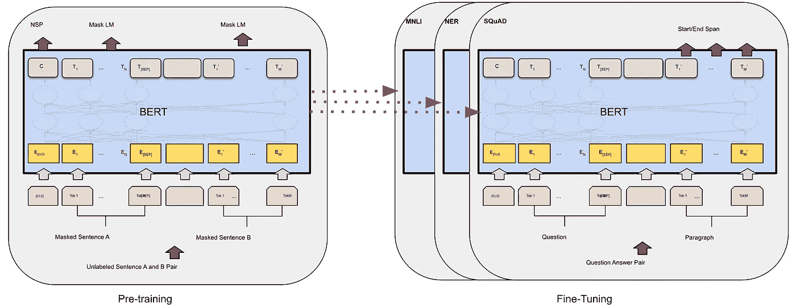

# 轻松的自然语言处理使用预先训练的拥抱脸管道

> 原文：<https://towardsdatascience.com/effortless-nlp-using-pre-trained-hugging-face-pipelines-with-just-3-lines-of-code-a4788d95754f?source=collection_archive---------20----------------------->

## 学习如何用 3 行代码进行自然语言处理

[腾雅特](https://unsplash.com/@tengyart?utm_source=medium&utm_medium=referral)在 [Unsplash](https://unsplash.com?utm_source=medium&utm_medium=referral) 上的照片

最近，BERT 模型在语言处理领域越来越受欢迎，因为它成功地将最先进的性能与有限的计算能力结合起来。在这篇文章中，我将向你展示如何使用拥抱脸变形金刚库，只用 3 行代码就可以使用这个模型！但首先，让我们看看伯特模型是如何工作的。

# 伯特是什么？

BERT 代表来自变压器的双向编码器表示。它是一种最新的语言模型，能够在广泛的自然语言处理任务中获得前沿的结果。

BERT 的主要优势之一是它是双向的，这意味着该模型可以一次考虑整个单词序列。与从左到右的方法相反，这允许 BERT 使用所有周围的单词(在左侧和右侧)来上下文化每个单词。

伯特模型的两个阶段。图片来自[原创研究论文](https://arxiv.org/abs/1810.04805)

此外，您可以使用计算能力有限的 BERT 模型，因为它利用了**迁移学习**:首先在一些一般任务上训练一个模型(**预训练**)，然后将获得的知识‘转移’到相关的 NLP 任务(**微调**)。让我们更详细地看看这两个步骤。

## 预培训

首先，该模型是在像维基百科这样的大型纯文本语料库上预先训练的。预培训应该是通用的，以便以后将该模型用于广泛的目标。其次，预训练是在自我监督的情况下完成的，因此不需要对输入进行标记，这反过来意味着我们拥有几乎无限的训练数据。BERT 模型的预训练在两个任务上完成:

*   **掩蔽语言建模(MLM):** 对语料库中 15%的词进行掩蔽，目标是预测掩蔽作品。例如，一个被屏蔽的句子可能是`Paris is the [MASK] of France`，模型将尝试预测`capital`。
*   **下一句预测(NSP):** 从语料库中随机抽取两个句子进行组合。目标是预测这两个句子是否在原始语料库中相邻出现。例如，这两个句子可以是`the man went to the store`和`he bought a gallon of milk`，它们在逻辑上可以相互跟随。然而，句子也可以是`the man went to the store`和`penguins are flightless`，它们不太可能连续出现。

这些任务的结合使伯特既能理解单词之间的关系，也能理解句子之间的关系。预训练只需要进行一次(节省计算能力)，并且预训练的模型在网上广泛可用，用于一种或多种语言，以及有大小写和无大小写的文本。

## 微调

但是，预先训练好的 BERT 模型还是很一般的。为了能够将其用于情感分析、命名实体识别、摘要、翻译或其他用途，我们需要针对我们的特定用例对模型进行微调。很大的好处是，这种微调相对便宜:大部分繁重的工作已经在预训练阶段完成，只需要做一次。

谢尔盖·斯韦奇尼科夫在 [Unsplash](https://unsplash.com?utm_source=medium&utm_medium=referral) 上的照片

如果你没有一个已标记的训练集，已经微调过的模型也可以在网上广泛获得，例如在[拥抱脸模型中心](https://huggingface.co/models)。这是我将在本文中使用的方法。

关于伯特的更多信息，我会推荐[github.com/google-research/bert](https://github.com/google-research/bert)，或者为更高级的读者推荐原始研究论文“[伯特:语言理解的深度双向转换器的预训练](https://arxiv.org/abs/1810.04805)

# 拥抱面部变形金刚

使用 BERT 模型最简单的方法之一是使用拥抱脸变形金刚:一个基于 PyTorch 和 TensorFlow 的最先进的 NLP 库。通过他们的[模型中心](https://huggingface.co/models)，Hugging Face 目前提供超过 7500 个预训练模型，用于各种 NLP 任务和各种语言。这样，您几乎总能找到符合您特定目标的模型。

看看拥抱脸模型库，其中包含超过 7500 个预先训练的模型。(图片由作者提供)

这些模型中的每一个都可以使用拥抱脸变形金刚库提供的简单方法在您自己的数据集上进行微调。然而，更容易的是，模型也可以开箱即用，只需最少的编程，使用拥抱面部变形器为这 11 个任务提供的管道之一:

*   特征抽出
*   情感分析
*   命名实体识别
*   问题回答
*   遮罩填充
*   摘要
*   翻译
*   语言生成
*   文本到文本生成
*   零射击分类
*   多回合对话

更多信息，请看 github.com/huggingface/transformers 的

# 使用管道(只有 3 行代码！)

确保你首先安装拥抱脸变形库，比如在你的终端上运行`pip install transformers`。然后，您可以开始使用只有 3 行代码的拥抱脸模型！例如，请看下面的情感分析代码:

看，那很简单！您所要做的就是导入库，初始化管道，然后您就可以开始使用这个模型了！如前所述，这些功能使用来自拥抱面部模型中枢的预训练模型。默认情况下，情感分析管道使用[distil Bert-base-un cased-fine tuned-SST-2-English](https://huggingface.co/distilbert-base-uncased-finetuned-sst-2-english)模型，但是您可以使用模型中心的任何模型。

我们来看两个扩展:从模型中枢挑选不同的模型，解决不同的任务。

## 使用模型中心的 7500+模型之一

创建管线时，通过设置`model`参数，可以很容易地使用不同于缺省模型的模型。例如，假设我们正在进行一个项目，想要预测财务状况。在 model hub 上快速搜索，我们会看到 [ProsusAI/finbert](https://huggingface.co/ProsusAI/finbert) 模型，它专门针对金融内容的情感进行训练。这个模型的实现和前面的例子一样简单，只需包含`model`参数:

拥抱脸变形金刚会自动为你下载选中的型号！

## 其他 NLP 任务

管道目前能够处理 11 种不同的任务，从命名实体识别到翻译。创建管线时，可通过将`'sentiment-analysis'`更改为其他名称来选择模型。例如，让我们试着翻译“我喜欢狗！”从英语到德语。转到模型中心，过滤任务“翻译”和语言“德”，您将看到 100 多个模型。我将使用[t5-小型](https://huggingface.co/t5-small)型号:

就是这样！要获得管道可以完成的所有任务的完整列表，请看一下[这个维基](https://huggingface.co/transformers/main_classes/pipelines.html#the-pipeline-abstraction)页面。

# 结论

在本文中，您已经了解了 BERT 模型的工作原理及其训练方式。此外，你已经看到了拥抱脸变形金刚管道是多么强大和容易使用。**的确，NLP 对每个人都是可行的！**

*本文是作为荷兰鹿特丹伊拉兹马斯大学* [*图灵机&深度学习*](https://www.tstudents.nl/) *课程的一部分而撰写的。更多我的内容，可以看看我的中页或者 GitHub 简介:*[*RvMerle*](https://github.com/RvMerle)*。*