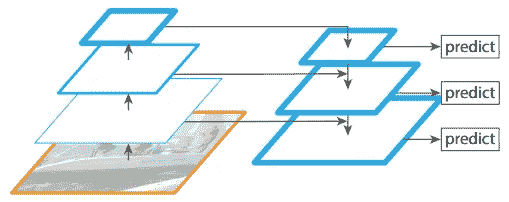
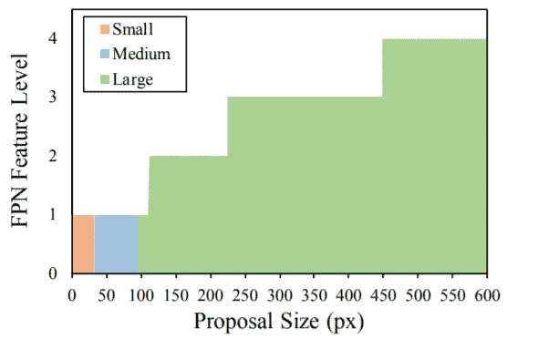
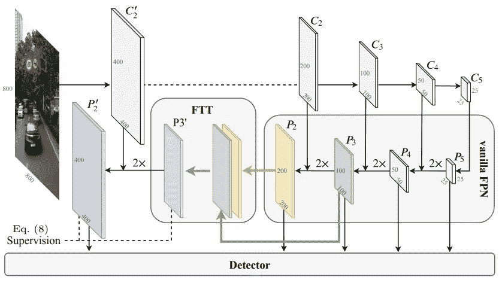
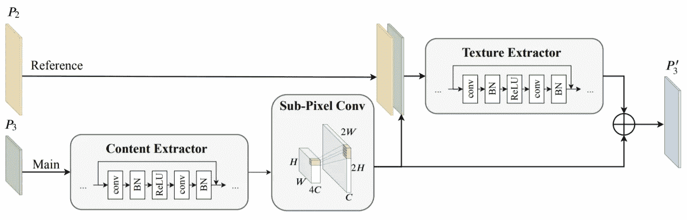
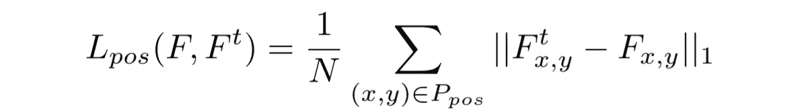
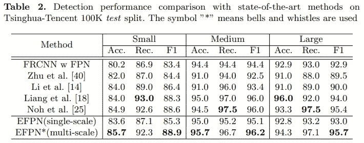
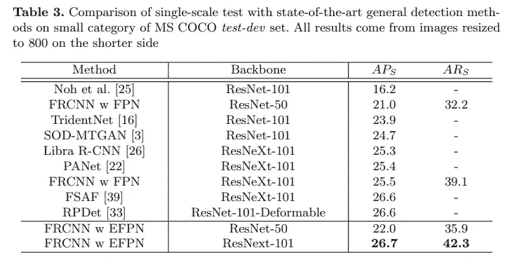
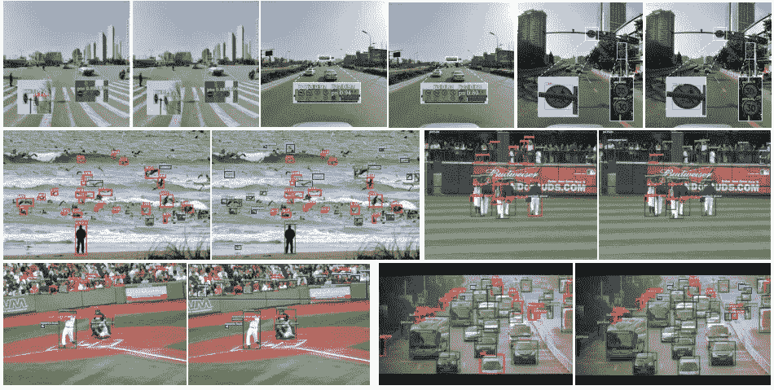

# EFPN:用于小目标检测的扩展特征金字塔网络

> 原文：<https://towardsdatascience.com/efpn-extended-feature-pyramid-network-for-small-object-detection-980af794a093?source=collection_archive---------21----------------------->

## [思想和理论](https://towardsdatascience.com/tagged/thoughts-and-theory)

## 当小事情造成大问题时

自最初几天的智能机器系统以来，目标检测一直是计算机视觉应用中的一个突破。尽管被研究了很长时间，但这个话题似乎永远不会过时，已经成为视频理解和计算机视觉中必须知道的问题之一。我希望你已经了解了物体检测的一些背景知识，因为我将忽略关于物体检测的几个基本概念，比如什么是物体检测，物体检测器有多少种。我相信你可以很容易地找到大量关于计算机视觉的定义和解释。

当技术刚刚取得显著成就时，人们喜欢让事情变得更复杂。在对象检测中，尽管已经提出了许多更具创新性的算法，但我们还会有更多的数据。随着现代图像数据变得越来越具有挑战性，例如包括大量小(或非常小)的物体，传统的物体检测器，如 R-CNN、单次检测器(SSD)和 YOLO，正变得过时，因为它们不能处理小物体检测问题。因此，作为上述方法(级联 R-CNN、DSSD、约洛夫 4、约洛夫 4-5D)的继承者的现代模型已被提出来应对挑战。你可以在这里看看我为 yolov 4-5D 评论和解说[写的帖子。在这篇文章中，我将回顾用于小物体检测的扩展特征金字塔网络(EFPN)，你可能想在这里阅读全文](/yolov4-5d-an-enhancement-of-yolov4-for-autonomous-driving-2827a566be4a)。

# 香草 FPN 探测器的问题

香草特征金字塔网络(图片来自[论文](https://arxiv.org/abs/1612.03144)

如论文中所述，特征金字塔网络(FPN)是在不同尺度的特征地图上检测对象的第一个概念，以增强对象检测器的性能，特别是在小对象检测中。fpn 具有与编码器-解码器架构相同的结构，其中从输入图像提取的特征首先被编码到提取的特征图(瓶颈),然后该信息被再次放大并与相应的特征级别组合以形成用于预测的最终特征图。通过这样做，较低层中的位置信息可以与较深层中的丰富语义信息相结合，以提高整体检测性能。

尽管传统的 FPN 目标检测器可以在一定范围内获得良好的检测结果，但是它们仍然存在一个缺点。如下图所示，检测器不能有效地使用特征图来预测合适的物体尺寸。具体而言，在 FPN 的工作机制中，高分辨率特征图(例如下图中的 1 级)应用于小物体检测，低分辨率特征图(例如 4 级)应负责预测大物体。然而，在几乎所有的特征图级别中都产生了大物体建议，在相同的特征级别(级别 1)中提出了中等物体和小物体，这些统计数据证明了普通 FPN 检测器并不以我们字面上预期的方式工作。

传统 FPN 检测器中金字塔等级和提案规模之间的映射(图来自[论文](https://arxiv.org/abs/2003.07021v1)

# 扩展要素金字塔网络(EFPN)

为了解决上述问题，Deng 等人提出了用于小目标检测的扩展特征金字塔网络([全文](https://arxiv.org/abs/2003.07021v1) r)。本文的主要贡献可以概括为:

*   改进小目标检测性能的扩展特征金字塔网络(EFPN)。
*   一个特征纹理传输(FTT)模块，为更准确的小物体检测结果提供可信的细节。
*   前景-背景平衡损失函数，以减轻前景和背景之间的区域不平衡。

现在，让我们浏览一下每一项。

## 1.EFPN 的建筑

EFPN 的管道(图来自[报](https://arxiv.org/abs/2003.07021v1)

如上图所示，与香草 FPN 的架构相比，主要区别包括:(1) EFPN 多了一个检测层 P2’；(2) EFPN 利用 FTT 模块将 P2 和 P3 的功能转移到 P2。不同于仅使用较低的和相邻的特征图进行放大的先前步骤，FTT 模块将两个特征图 P2 和 P3 作为其过程的输入，并生成 P3‘其随后用于新的检测层 P2’。EFPN 能够在 5 个不同的尺度上做出预测。

## 2.FTT 模块

FTT 模块的管道(图来自[纸](https://arxiv.org/abs/2003.07021v1)

在 FFT 模块中，首先使用**内容提取器**从 P3 (Main)中提取语义特征，然后应用亚像素卷积层来放大**内容提取器**的输出。然后，最新信息与特征图 P2(参考)相关联，以形成用于选择小物体的可信纹理的**纹理提取器**的输入。最后，建立残差连接用于特征融合并产生输出特征图 P3’。通过应用这种方式，P3 从浅层特征图 P2 中导出选择性特征，并从深层 P3 中接收语义。

## 3.前景背景平衡损失

提高对象检测性能的经典方法是使用高分辨率输入。受这一想法的启发，作者提出了一种新的训练机制，称为**交叉解析蒸馏**。

为了应用知识提炼，学生模型需要从教师网络的输出中学习。为了应对这种情况，作者使用该模型以 2x 输入进行测试，然后利用前 4 层的输出作为知识提取的训练目标。例如，与原始输入(1x 输入)的 P5 相比，2x 输入的 P5 具有两倍的分辨率，并且与原始输入(1x 输入)的 P4 具有相同的分辨率，如上图所示。因此，2x 输入的 P3 和 P2 将被分别用作训练原始输入(1x 输入)的 P3 和 P2 的目标。使用以下损失函数来训练学生 EFPN:

其中 *L_fbb* 是建议的前景-背景平衡损失。这个损失函数实际上是 L1 损失，然而，它由两部分组成:全局重建损失 *L_glob* 和正补片损失 *L_pos。*建议的前景-背景平衡损失可描述为:

其中 *F* 表示计算的特征图，而 *Ft* 表示目标特征图。λ是重量平衡参数。 *L_glob* 和 *L_pos* 公式如下:

其中 *P_pos* 表示地面真实物体的块， *(x，y)* 表示特征地图坐标， *N* 表示正像素的数量。更多详情可以找[原论文](https://arxiv.org/abs/2003.07021v1)。

# 结果

与其他现代方法相比，作者在清华-腾讯 100K 小交通标志数据集和 MS COCO 小对象数据集上测试了 EFPN。定量结果如下表所示。与其他最新算法相比，EFPN 在各种实验设置中呈现了最先进的检测结果。

表格来自[纸](https://arxiv.org/abs/2003.07021v1)

表来自[的论文](https://arxiv.org/abs/2003.07021v1)

视觉检测结果如下图所示，每个图像对显示了香草 FPN(左)和 EFPN(右)结果之间的比较(红色:假阴性，蓝色:假阳性，绿色:真阳性)。很明显，EFPN 在小物体探测方面优于 FPN。

FPN 和 EFPN 的视觉对比(图来自[报](https://arxiv.org/abs/2003.07021v1))

# 结论

在这篇文章中，我回顾了扩展特征金字塔网络(EFPN)，这是一个用于小物体检测的普通特征金字塔网络(FPN)的改进。EFPN 在准确性和计算方面都显示了它的有效性。EFPN 已经在清华-腾讯 100K 小型交通标志数据集和 MS COCO 小型物体数据集上产生了最先进的结果。

欢迎读者访问我的脸书粉丝页面，这是一个分享关于机器学习的东西的页面:[深入机器学习](https://www.facebook.com/diveintomachinelearning)。我关于物体检测的其他著名帖子也可以在[yolov 4–5D 评论](/yolov4-5d-an-enhancement-of-yolov4-for-autonomous-driving-2827a566be4a)和 [Darkeras](/darkeras-execute-yolov3-yolov4-object-detection-on-keras-with-darknet-pre-trained-weights-5e8428b959e2) 找到。

感谢阅读！