# 主成分分析中的特征值和特征向量

> 原文：<https://towardsdatascience.com/eigenvalues-and-eigenvectors-378e851bf372?source=collection_archive---------2----------------------->

## 关于我们的数据，他们告诉了我们什么？


(作者 GIF)

# 介绍

我在大学的一门线性代数课上学过特征值和特征向量。这是非常枯燥和数学，所以我不明白，这是怎么回事。但是我想用一种更直观的方式向你们展示这个话题，我会用很多动画来说明。

首先，我们将看看如何应用一个矩阵到一个矢量**旋转**和**缩放**一个矢量。这将向我们展示什么是**特征值**和**特征向量**。然后我们将学习**主成分**，它们是**协方差矩阵**的特征向量。这些知识将帮助我们理解我们最后的主题，**主成分分析**。

# 矩阵乘法

为了理解特征值和特征向量，我们必须先看看矩阵乘法。

让我们考虑下面的矩阵。

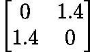

(图片由作者提供)

当我们取一个矩阵和一个向量的点积时，得到的向量是原始向量的**旋转**和**缩放**版本。

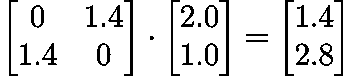

(图片由作者提供)

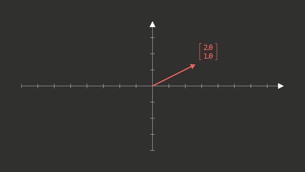

(作者 GIF)

在数据科学中，我们大多谈论数据点，而不是向量。但它们本质上是相同的，可以互换使用。数据点也可以像矢量一样通过矩阵乘法进行变换。

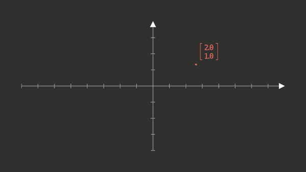

(作者 GIF)

但即使矩阵乘法旋转缩放，也是一个**线性**变换。

为什么矩阵乘法是一种**线性**变换？考虑一组数据点(用红色表示)。想象一下这些点所在的网格。当我们将矩阵应用于我们的数据点并沿着数据点移动网格时，我们看到网格的线保持笔直。如果这些线是曲线，那么转换将是非线性的。

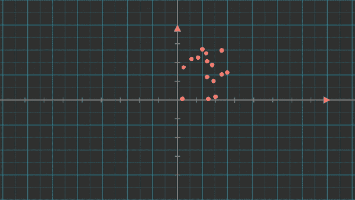

(作者 GIF)

# 特征向量

我们考虑与上面相同的矩阵。


(图片由作者提供)

当将这个矩阵应用于不同的向量时，它们的行为是不同的。他们中的一些可能会得到**旋转和缩放**。有些**只旋转了**，有些**只缩放了**，有些**可能根本没有变化。**

**特征向量** s 是向量，其中

*   **只进行缩放。**
*   或者做**完全不变。**


(作者 GIF)

你可以看到，特征向量保持在同一条线上，其他向量(一般向量)旋转了一定角度。

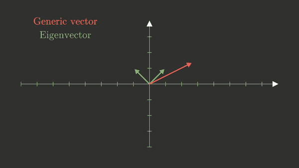

(作者 GIF)

2x2 矩阵总是有两个特征向量，但并不总是相互正交。

# 本征值

每个特征向量有一个相应的特征值。当矩阵对特征向量进行变换时，它是特征向量缩放的因子。如上所述，我们考虑相同的矩阵，因此考虑相同的两个特征向量。


(图片由作者提供)

这个矩阵的两个特征向量之一(我称之为特征向量 1，但这是任意的)被缩放 1.4 倍。

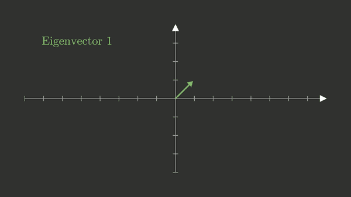

(作者 GIF)

特征向量 2 的缩放系数也是 1.4，但它的方向是相反的。因此，特征值 2 为-1.4。

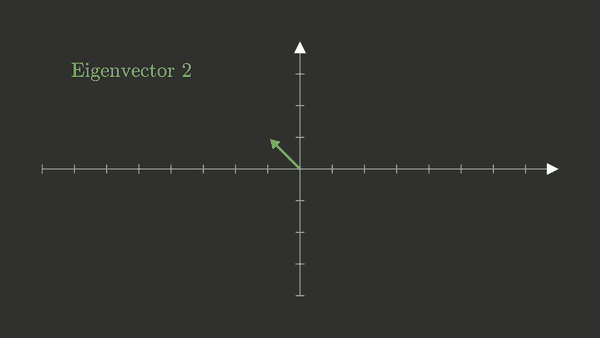

(作者 GIF)

# 特征向量和特征值在数据科学中的应用

## 主成分

使用特征值和特征向量，我们可以找到数据的主轴。第一主轴(也称为“第一主成分”)是数据变化最大的轴。第二主轴(也称为“第二主成分”)是变化第二大的轴，以此类推。

让我们考虑一个二维数据集。


(作者 GIF)

为了找到主成分，我们首先计算方差-协方差矩阵 **C** 。

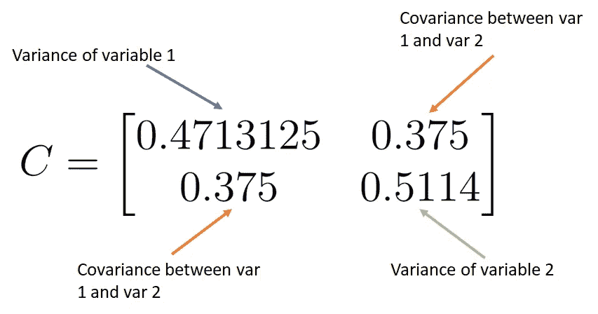

(图片由作者提供)

我们可以用 numpy 来计算它们。注意，我们的数据( **X** )必须像熊猫数据框一样排序。每列代表一个不同的变量/特征。

```
import numpy as np
C = np.cov(X, rowvar = False)
```

然后我们就可以计算出 **C** 的特征向量和特征值。

```
import numpy as np
eigenvalues,eigenvectors = np.linalg.eig(C)
```

特征向量向我们展示了数据主轴(主成分)的方向。特征值越大，沿该轴的变化越大。因此，具有最大特征值的特征向量对应于具有最大方差的轴。

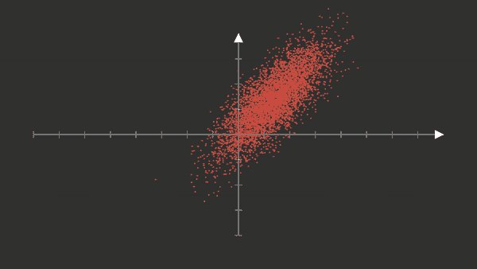

(作者 GIF)

我们应该记住，矩阵代表线性变换。当我们将协方差矩阵与我们的数据相乘时，我们可以看到数据的中心没有变化。并且数据在具有较大方差/特征值的特征向量的方向上被拉伸，并且沿着具有较小方差的特征向量的轴被压缩。

直接位于特征向量上的数据点不会旋转。

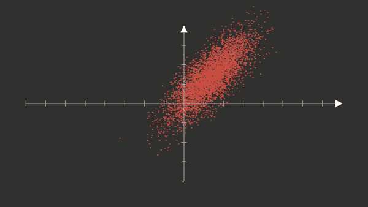

(作者 GIF)

## 主成分分析

主成分分析使用特征向量和特征值的能力来减少数据中的特征数量，同时保留大部分方差(因此也保留了大部分信息)。在 PCA 中，我们预先指定想要保留的成分数量。

PCA 算法由以下步骤组成。

1.  通过减去平均值并除以标准差来标准化数据
2.  计算协方差矩阵。
3.  计算特征值和特征向量
4.  将特征向量合并成矩阵，并将其应用于数据。这将旋转和缩放数据。主要组件现在与我们的特征轴对齐。
5.  保留引起最大变化的新特征，丢弃其余的。

让我们看看 PCA 在二维数据集上做了什么。在这个例子中，我们没有减少特征的数量。减少特征的数量对于高维数据是有意义的，因为这样可以减少特征的数量。


(作者 GIF)

让我们加载[虹膜数据集](https://www.openml.org/d/61)。它包含了三种不同种类的鸢尾花的尺寸。这些品种是海滨鸢尾、杂色鸢尾和刚毛鸢尾。

(作者代码)

让我们快速浏览一下数据集。

```
print(iris_df.head())
```

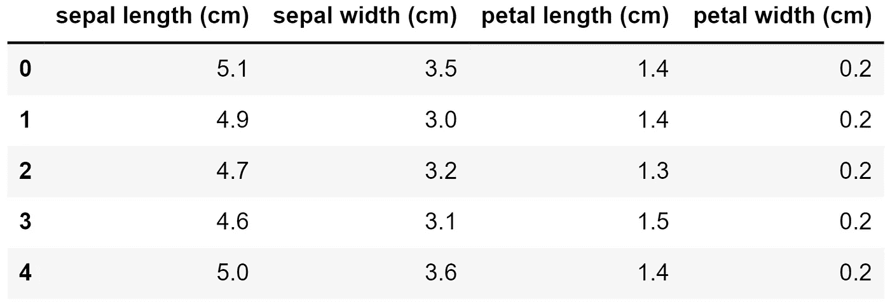

(作者 GIF)

我们可以创建一个所谓的“scree plot ”,看看哪些变量对数据的可变性最大。为此，我们执行第一个主成分分析。

(作者代码)

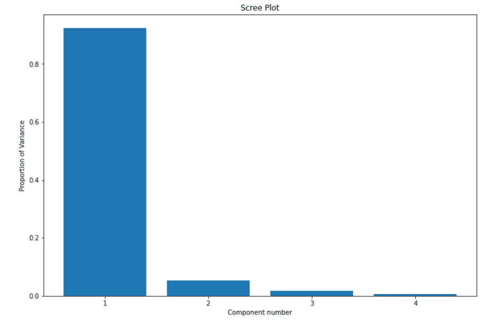

(图片由作者提供)

正如我们所看到的，前两个部分解释了数据中的大部分可变性。因此，我决定只保留前两个组件，放弃其余的。确定要保留的元件数量后，我们可以运行第二个 PCA，减少特征的数量。

我们看一下我们的数据，它现在是一个数组。

```
print(iris_transformed[:5,:])
```

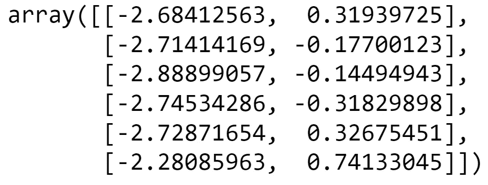

(图片由作者提供)

我们可以看到，我们只剩下两列。这些列/变量是我们原始数据的线性组合，并不对应于原始数据集的特征(如萼片宽度、萼片长度等)。

让我们将数据可视化。

(作者代码)

我们会在 x 轴和 y 轴上看到新的组合特征。植物种类由数据点的颜色表示。

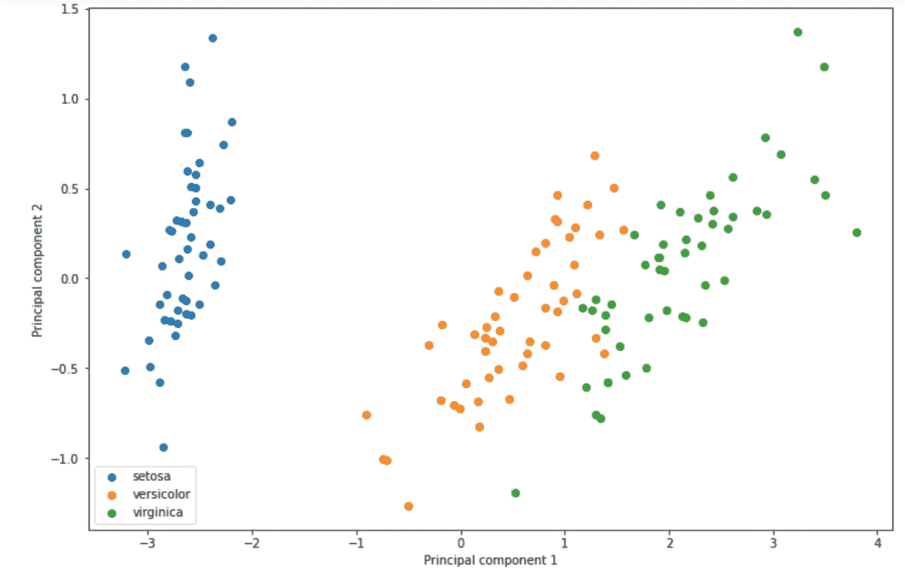

(图片由作者提供)

我们可以看到，数据中的许多信息都被保留了下来，我们现在可以训练一个 ML 模型，根据三个物种对数据点进行分类。

# 结论

我现在将总结最重要的概念。

## 矩阵乘法

当我们用一个向量乘一个矩阵时，向量是线性变换的。这种线性变换是旋转和缩放矢量的混合。只缩放而不旋转的向量称为特征向量。它们被缩放的因子是相应的特征值。

## 主成分

主成分是我们的数据显示变化最大的轴。第一主成分解释了观察到的变化的最大部分，第二主成分解释了第二大部分，以此类推。主分量是协方差矩阵的特征向量。第一主分量对应于具有最大特征值的特征向量。

## 主成分分析

主成分分析是一种减少数据集中特征数量的技术。它由以下处理步骤组成。

1.  通过减去平均值并除以标准差来标准化数据
2.  计算协方差矩阵。
3.  计算特征值和特征向量
4.  将特征向量合并成矩阵，并将其应用于数据。这将旋转和缩放数据。主要组件现在与我们的特征轴对齐。
5.  保留我们指定的尽可能多的新特性，放弃其余的。我们保留能够解释数据中最大变化的特征。

# 来源

[https://datascienceplus . com/understanding-the-协方差矩阵/](https://datascienceplus.com/understanding-the-covariance-matrix/)

https://en.wikipedia.org/wiki/Iris_flower_data_set

[https://scikit-learn . org/stable/auto _ examples/decomposition/plot _ PCA _ iris . html](https://scikit-learn.org/stable/auto_examples/decomposition/plot_pca_iris.html)

# 数据集

## 彩虹女神

Iris 数据集和许可证可在以下位置找到:

[https://www.openml.org/d/61](https://www.openml.org/d/61)

它是在 [creative commons](https://creativecommons.org/publicdomain/mark/1.0/) 下许可的，这意味着你可以复制、修改、分发和执行作品，即使是出于商业目的，都无需征得许可。

# 相关文章

</einstein-index-notation-d62d48795378>  </backpropagation-in-neural-networks-6561e1268da8>  </matrix-calculus-for-data-scientists-6f0990b9c222>  

# 作者撰写的其他文章

</how-you-can-use-gpt-j-9c4299dd8526>  </deep-q-learning-is-no-rocket-science-e34912f1864>  </transfer-learning-3e9bb53549f6>  

想要连接吗？

领英
[https://www.linkedin.com/in/vincent-m%C3%BCller-6b3542214/](https://www.linkedin.com/in/vincent-m%C3%BCller-6b3542214/)
脸书
[https://www.facebook.com/profile.php?id=100072095823739](https://www.facebook.com/profile.php?id=100072095823739)
推特
[https://twitter.com/Vincent02770108](https://twitter.com/Vincent02770108)
中等
[https://medium.com/@Vincent.Mueller](https://medium.com/@Vincent.Mueller)
你可以成为中等会员，同时支持我
[https://medium.com/@Vincent.Mueller/membership](https://medium.com/@Vincent.Mueller/membership)

# 数学附录

## 计算特征值和特征向量

如果你喜欢数学并想深入研究，我总结了这篇博文中用到的一些数学知识。

我们可以很容易地在 python 中计算特征向量和特征值。

```
import numpy as np
eigenvalues,eigenvectors = np.linalg.eig(M)
```

如果我们想手工计算它们，那就有点复杂了。

正如我们所见，当我们将矩阵 **M** 乘以一个特征向量(用 **𝑣** 表示)时，这与缩放其特征值 **𝜆.是一样的**

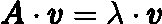

(图片由作者提供)

我们现在重新排列等式。

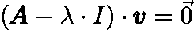

(图片由作者提供)

其中 **I** 是单位矩阵，对角线上有 1，其他地方有 0。它的形状和 **A** 一样。

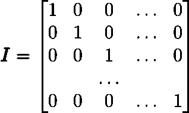

(图片由作者提供)

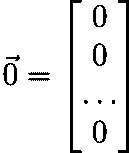

(图片由作者提供)

这个等式成立的唯一方法。


(图片由作者提供)

这只在矩阵的行列式(**a**-𝜆⋅**I**)**变为 0 时成立。**

> **矩阵的行列式是一个因子，在 2×2 矩阵的情况下，矩阵通过该因子缩放面积，在 3×3 矩阵的情况下缩放体积。如果行列式为零，那么矩阵(**a**-𝜆⋅**I**)**挤压指向原点(原点就是零点)。这是非零向量成为零向量的唯一方法。****

****所以我们寻找所有特征值𝜆，使行列式为 0。****

****在我们找到了特征值之后，我们可以求解这个方程:****

********

****(图片由作者提供)****

****我们找到了特征向量。****

## ****协方差矩阵****

****方差-协方差矩阵可以使用以下公式根据数据进行估计:****

****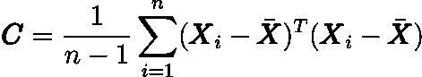****

****(图片由作者提供)****