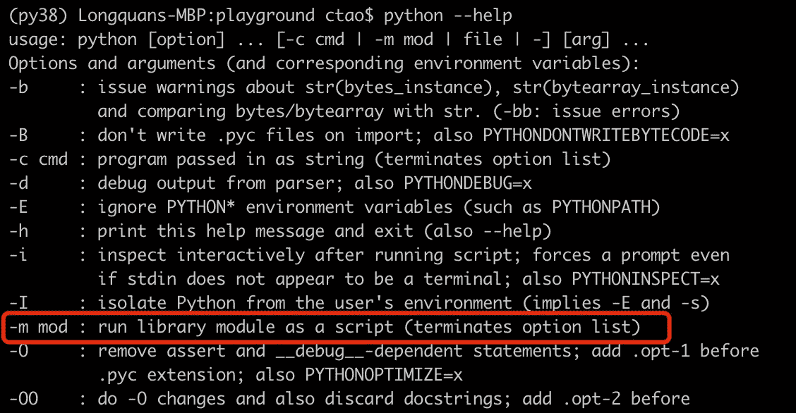
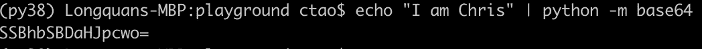

# Python 中的八个“无代码”特性

> 原文：<https://towardsdatascience.com/eight-no-code-features-in-python-15744e8c01f4?source=collection_archive---------3----------------------->


图片由[格尔德·奥特曼](https://pixabay.com/users/geralt-9301/?utm_source=link-attribution&utm_medium=referral&utm_campaign=image&utm_content=1044145)来自[皮克斯拜](https://pixabay.com/?utm_source=link-attribution&utm_medium=referral&utm_campaign=image&utm_content=1044145)

## 有时候，你不需要写代码来使用 Python。

Python 变得流行的原因之一是我们可以编写相对较少的代码来实现复杂的功能。Python 开发人员社区欢迎使用简单接口封装复杂实现的库。

然而，这还不是最简单的。你能相信我们甚至可以不用任何代码就使用 Python 吗？

在本文中，我将介绍无需编写任何代码就可以利用的 8 个 Python 内置特性。

# 0.Python CLI "-m "


图片由 [wal_172619](https://pixabay.com/users/wal_172619-12138562/?utm_source=link-attribution&utm_medium=referral&utm_campaign=image&utm_content=5219747) 发自 [Pixabay](https://pixabay.com/?utm_source=link-attribution&utm_medium=referral&utm_campaign=image&utm_content=5219747)

一切从 Python CLI(命令行界面)开始吧。尽管我们不必编写代码来使用稍后将介绍的特性，但我们仍然需要让 Python 知道我们想要执行什么。为此，我们可以使用 Python CLI。

只要我们的机器上安装了 Python，我们就可以在 Python CLI 中显示所有支持的参数。

```
$ python --help
```



该屏幕截图只显示了部分帮助输出，因为它太长了。我想强调的是`-m`选项。它将运行一个库模块作为脚本。因此，如果该模块实现为支持 CLI，我们将能够直接使用它。

现在我们应该开始了:)

# 1.不使用 Telnet 测试端口号


图片来自 [Pixabay](https://pixabay.com/?utm_source=link-attribution&utm_medium=referral&utm_campaign=image&utm_content=2507499) 的 [FunkyFocus](https://pixabay.com/users/funkyfocus-3900817/?utm_source=link-attribution&utm_medium=referral&utm_campaign=image&utm_content=2507499)

有时，我们希望测试 IP:端口的出站网络流量。通常，telnet 是一个不错的选择，尤其是在 Windows 平台上。但是，默认情况下通常不会安装它。我们必须在使用前下载并安装它，如果我们只是想要一个简单的测试，然后丢弃它，这可能是一种浪费。

但是，如果你安装了 Python，你就不必下载 telnet，因为 Python 已经有了。我们试试 Google 搜索它的 443 端口的一个 IP。

```
python -m telnetlib -d 142.250.70.174 443
```


正如截图所示，流量是可以的，我们甚至收到了谷歌的空字符串。如果我们试图 telnet 一个我们不应该访问的随机端口，将会抛出一个错误。

```
python -m telnetlib -d 142.250.70.174 999
```


# 2.启动 Web 服务器


图片由[图片混合](https://pixabay.com/users/photomix-company-1546875/?utm_source=link-attribution&utm_medium=referral&utm_campaign=image&utm_content=1433323)来自 [Pixabay](https://pixabay.com/?utm_source=link-attribution&utm_medium=referral&utm_campaign=image&utm_content=1433323)

如果你以前不知道这个，我想这可能会很惊讶。是的，我们可以不用写任何代码就能使用 Python 启动一个 web 服务器。只需运行如下命令。

```
python -m http.server
```


在我们运行它之后，它显示服务器正在监听端口 8000 上的本地主机。然后，我们可以尝试从浏览器访问`http://localhost:8000/`。


web 服务器将使用我们作为 root 启动服务器的路径来呈现我们的本地文件系统。换句话说，我们将无法访问根目录以上的任何目录。

你是在问这是做什么用的吗？例如，如果我们在目录或任何子目录中有许多文本/PDF/图像文件，我们可以非常容易和快速地访问它们。


如果你想知道更多有趣的用法，请查看这篇文章。

</3-lines-of-python-code-to-write-a-web-server-46a109666dbf>  

如果你遵循上面的文章，并把它变成一个“低代码”的解决方案，你也许能给它添加更多的定制功能。

# 3.验证和美化 JSON


图片来自 [Pixabay](https://pixabay.com/?utm_source=link-attribution&utm_medium=referral&utm_campaign=image&utm_content=3101151) 的 [Felix Wolf](https://pixabay.com/users/felix_w-6547745/?utm_source=link-attribution&utm_medium=referral&utm_campaign=image&utm_content=3101151)

如果您有一个没有格式化的长 JSON 字符串，它可能很难阅读。通常，我更喜欢使用带有 JSON 插件的文本编辑器，如 Sublime 或 VS code，来使字符串更漂亮。然而，如果我们手头没有这些工具，Python 将能够暂时提供帮助。

假设我们有这样一个 JSON 字符串。出于演示目的，我将使用一个短的。

```
echo '{"name": {"first_name":"Chris", "last_name":"Tao"} "age":33}'
```


我们的操作系统不识别它，所以字符串将按原样显示。然而，如果我们添加 Python `json.tool`作为魔术，它将被很好地格式化。

```
echo '{"name": {"first_name":"Chris", "last_name":"Tao"} "age":33}' | python -m json.tool
```


哎呀！JSON 字符串无效，`json.tool`帮助我们识别了这个问题。我们在名称对象后面漏掉了一个逗号。让我添加逗号使其有效。

```
echo '{"name": {"first_name":"Chris", "last_name":"Tao"}, "age":33}' | python -m json.tool
```


现在，它以完美的缩进输出！现在很容易读懂。

# 4.创建文本编辑器


图片来自 [Pixabay](https://pixabay.com/?utm_source=link-attribution&utm_medium=referral&utm_campaign=image&utm_content=265132) 的 [Werner Moser](https://pixabay.com/users/pixelcreatures-127599/?utm_source=link-attribution&utm_medium=referral&utm_campaign=image&utm_content=265132)

是的，我们可以使用 Python 来“创建”一个文本编辑器。当然不是很强大，但是如果你没有装更好的会很方便。此外，它不会比 Vim 和 Nanos 更强大，但它完全是基于 UI 的，而不是命令行文本编辑器。这个编辑器是由`idlelib`用 Tkinter 创建的，所以它甚至是跨平台的。

假设我们要编写一个简单的 Python 应用程序来显示当前时间。我们想快速编写代码，但不想下载和安装代码编辑器。现在，让我们运行这个命令。

```
mkdir get_time_app
python -m idlelib get_time_app/print_time.py
```

`idlelib`如果目录不存在就无法创建，所以如果需要的话我们需要创建一个。在我们运行这个命令之后，在我们保存之前，不会创建`print_time.py`。

编辑器现在应该会弹出来。我们可以在里面写一些代码。代码甚至可以是语法着色的。


现在，我们可以按 ctrl+s 保存它，然后关闭它。让我们回到命令行并显示文件的内容，代码肯定在那里。

```
cat get_time_app/print_time.py
```


# 5.创建可执行的应用程序


图片来自 [Pixabay](https://pixabay.com/?utm_source=link-attribution&utm_medium=referral&utm_campaign=image&utm_content=292994) 的[托马斯·乌尔里希](https://pixabay.com/users/lobostudiohamburg-13838/?utm_source=link-attribution&utm_medium=referral&utm_campaign=image&utm_content=292994)

如果我们只想创建一个简单的应用程序，就像上面写的那样，我们不需要任何第三方库，比如 PyInstaller。Python 内置的 Zipapp 可以提供帮助。

假设我们要打包“获取时间”应用程序，我们可以运行下面的命令。

```
python -m zipapp get_time_app -m "print_time:main"
```

在命令中，我们只需要让`zipapp`知道 app 的名字`get_time_app`，将被用作入口点的 Python 文件的名字`print_time`和主方法`main`。

扩展名为`.pyz`的是我们刚刚创建的应用程序。我们可以将它作为一个文件而不是一个文件夹来分发。


要使用打包的 app，只需用 python 调用即可。

```
python get_time_app.pyz
```


# 6.对字符串或文件进行编码和解码


图片来自 [Pixabay](https://pixabay.com/?utm_source=link-attribution&utm_medium=referral&utm_campaign=image&utm_content=441280) 的[托马兹·米科扎奇克](https://pixabay.com/users/tomasz_mikolajczyk-106840/?utm_source=link-attribution&utm_medium=referral&utm_campaign=image&utm_content=441280)

使用 Python CLI，我们可以加密字符串或文件。先说个有意思的。Rot 13 是一种简单地将任何英文字母向右移动 13 个位置的加密方法。例如，一个“a”(位置:1)将变成一个“n”(位置:14)。

我们可以使用`encodings.rot_13`来加密一个字符串，如下所示。

```
echo "I am Chris" | python -m encodings.rot_13
```


当然，不要把这个用在任何真正机密的东西上。因为英语有 26 个字母，所以我们可以通过再次运行这个算法非常容易地破译字符串:)

```
echo 'V nz Puevf' | python -m encodings.rot_13
```


现在，让我们来看看一个更有用的 base64。我们可以用 base64 格式对字符串进行编码，如下所示。

```
echo "I am Chris" | python -m base64
```



然后，我们可以添加一个标志`-d`来解码它。

```
echo "SSBhbSBDaHJpcwo=" | python -m base64 -d
```


如果我们有一个动态编码的图像文件，这将非常有用。我们可以对文件进行如下编码。

```
python -m base64 get_time_app/print_time.py
```


非常有趣的是，解码后的 Python 脚本文件可以动态执行。

```
echo "ZnJvbSBkYXRldGltZSBpbXBvcnQgZGF0ZXRpbWUKCgpkZWYgbWFpbigpOgogICAgY3VycmVudF90aW1lID0gZGF0ZXRpbWUubm93KCkKICAgIHByaW50KGYnQ3VycmVudCB0aW1lIGlzIHtjdXJyZW50X3RpbWV9LicpCgoKaWYgX19uYW1lX18gPT0gJ19fbWFpbl9fJzoKICAgIG1haW4oKQo=" | python -m base64 -d | python
```


# 7.获取系统元数据


图片由来自 [Pixabay](https://pixabay.com/?utm_source=link-attribution&utm_medium=referral&utm_campaign=image&utm_content=5603790) 的[照片合成](https://pixabay.com/users/photomix-company-1546875/?utm_source=link-attribution&utm_medium=referral&utm_campaign=image&utm_content=5603790)

如果我们想获得当前的系统信息，Python 提供了一种简单的方法。我们可以运行下面的命令。

```
python -m sysconfig
```


显示所有系统配置，如路径和环境变量。还有更多的东西显示，截图只显示了一部分。

如果我们只想显示路径和当前工作目录，我们也可以运行这个命令。

```
python -m site
```


# 8.压缩文件


图片来自 [Pixabay](https://pixabay.com/?utm_source=link-attribution&utm_medium=referral&utm_campaign=image&utm_content=624220) 的[Steve buiss NNE](https://pixabay.com/users/stevepb-282134/?utm_source=link-attribution&utm_medium=referral&utm_campaign=image&utm_content=624220)

我们也可以使用 Python 压缩文件，而不需要下载 tar/zip/gzip。例如，如果我们想压缩我们刚刚在第 4 节中编写的应用程序，我们可以运行下面的命令将文件夹添加到一个 zip 文件中。在该命令中，选项`-c`代表“创建”。

```
python -m zipfile -c get_time_app.zip get_time_app
```


当然，我们也可以提取它。让我们提取文件夹，并把它放入一个新的目录，这样它就可以从原来的目录中分离出来。在下面的命令中，选项`-e`代表“提取”。

```
python -m zipfile -e get_time_app.zip get_time_app_extracted
```

然后，我们就可以验证了。

```
ls get_time_app_extracted
cat get_time_app_extracted/get_time_app/print_time.py
```


我用 zip 做演示，Python 也支持 tar 和 gzip。

# 摘要


图片由[安吉丽卡·瓦赫尔](https://pixabay.com/users/angelicavaihel-19662978/?utm_source=link-attribution&utm_medium=referral&utm_campaign=image&utm_content=6855367)从[皮沙贝](https://pixabay.com/?utm_source=link-attribution&utm_medium=referral&utm_campaign=image&utm_content=6855367)拍摄

在本文中，我介绍了一种无需编写任何代码就能使用 Python 内置库的方法。如果我们确实记得使用它们，它确实提供了许多方便。希望你喜欢阅读这篇文章，内容会有所帮助！

<https://medium.com/@qiuyujx/membership>  

如果你觉得我的文章有帮助，请考虑加入 Medium 会员来支持我和成千上万的其他作者！(点击上面的链接)