# 爱因斯坦指数符号

> 原文：<https://towardsdatascience.com/einstein-index-notation-d62d48795378?source=collection_archive---------11----------------------->

## 爱因斯坦求和、指数符号和数值


照片由[汉尼斯·里克特](https://unsplash.com/@weristhari?utm_source=medium&utm_medium=referral)在 [Unsplash](https://unsplash.com?utm_source=medium&utm_medium=referral) 上拍摄

# 爱因斯坦符号与矩阵

作为一个线性代数迷，向量和矩阵迷，我很长一段时间都不清楚为什么我应该使用爱因斯坦符号。但是当我对反向传播微积分感兴趣的时候，我到了一个点，张量参与其中，然后我意识到用矩阵的方式思考将我的思维限制在二维。在这篇文章中，我仍然会使用许多矩阵和向量的类比，以便这个主题变得更容易理解。

# 自由指数

自由指数是出现在等式两边的指数。例如:

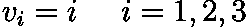

(图片由作者提供)

𝑣现在可以表示一行或一列向量。

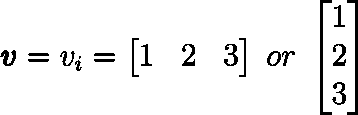

(图片由作者提供)

这并不是索引符号的要点。你把自己从任何矢量的具体表示中解放出来。

我们还可以有两个自由指数:

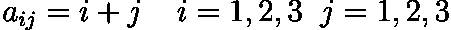

(图片由作者提供)

我们可以想象这个方程描述了矩阵的行和列 **𝐴** 。

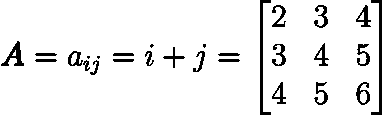

(图片由作者提供)

然而，如果我们继续增加自由指数的数量，就越来越难以想象一个具体的表示。

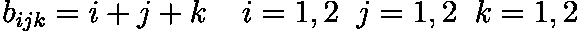

如果有 3 个自由指数，它将是一个张量，我们可以把它想象成一个矩阵向量。

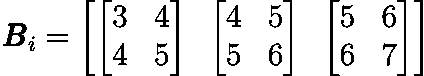

(图片由作者提供)

# 虚拟指数

哑元可以出现在等式的一边，作为指数，它们在每个产品中出现的次数是偶数。

一个例子是:

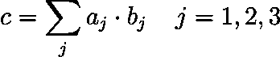

(图片由作者提供)

这个等式也可以写成一个行向量和一个列向量的内积。

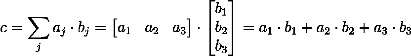

(图片由作者提供)

# 爱因斯坦求和约定

当我们使用应用这一惯例时，即使没有求和符号，我们也会对虚拟索引求和。这个约定是有用的，因为虚拟指数的求和在线性代数中经常发生。

应用这一约定，最后一个等式可以改写如下:

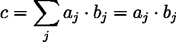

(图片由作者提供)

# 上限和下限指数

有些人适用以下约定，有些人不适用。如果我必须在索引符号和矢量化形式之间快速转换，我自己也会使用它。

使用这个惯例，我们写下和上索引。请不要将上面的指数与“的幂”相混淆。

那么只有彼此对角的相同指数被求和。

重复索引的示例，我们对其求和:


(图片由作者提供)

另一个例子:

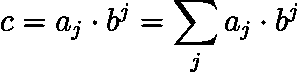

(图片由作者提供)

重复索引的示例，我们**不对其进行**求和:

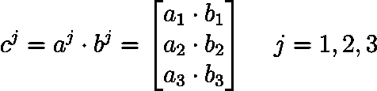

(图片由作者提供)

# 组合自由和虚拟索引

大多数情况下，我们会在同一个等式中找到空闲和虚拟索引。对于一些读者来说，这可能一开始听起来很可怕，但是看过几次之后，我相信你会欣赏它的抽象性。

让我们看看下面的等式:

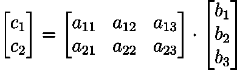

(图片由作者提供)

我们将用索引符号重写它:

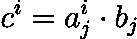

(图片由作者提供)

这里可以看到，索引 I 是一个自由索引，索引 j 是一个伪索引，get 被求和。

如果你想只使用下标，你可以这样写:

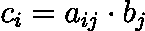

(图片由作者提供)

# np.einsum

在 numpy 中，你可以使用爱因斯坦符号来乘数组。这为 np.dot()函数提供了一个替代方法，它是线性代数点积的 numpys 实现。

但是 np.einsum 能做的比 np.dot 多。

np.einsum 可以以任何可能的方式将数组相乘，此外:

*   沿轴求和
*   转置输入和输出数组

以及这些操作以任何顺序的任何可能的组合。

## np.einsum 的第一个例子

我们先来看一个例子。我们创建两个 2D 数组: **A** 和 **B** 。

(作者代码)

当现在计算 A 与 B 的点积时:

(作者代码)

输出是:

```
[[ 6 12 18]
 [ 9 18 27]
 [12 24 36]]
```

我们现在想对 np.einsum 做同样的事情:

(作者代码)

结果是一样的:

```
[[ 6 12 18]
 [ 9 18 27]
 [12 24 36]]
```

但是这是怎么回事呢？我们必须理解所谓的签名字符串:“ik，kj->ij”。

箭头的左边是:ik，kj。这部分指定了输入数组的索引。

箭头的右边是:ij。这部分指定了结果数组的索引。

整个签名串将意味着:“第一输入数组具有索引 ik，第二输入串具有索引 kj。这些索引被转换成输出数组中的索引 ij”。

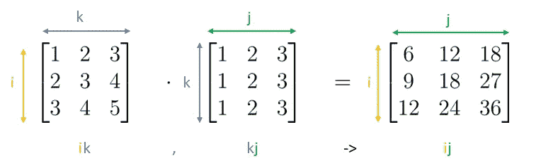

(图片由作者提供)

相应的数学等式如下所示:

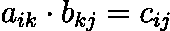

(图片由作者提供)

**NP . einsum 的第二个例子**

假设我们有相同的两个数组 **A** 和 **B** 。

(作者代码)

我们想在元素方面增加它们。在 numpy 中，我们可以这样做:

结果将是:

```
[[ 1 4 9 ]
 [ 2 6 12]
 [ 3 8 15]]
```

我们对 np.einsum 做同样的事情:

(作者代码)

得到的数组是相同的。

```
[[ 1 4 9 ]
 [ 2 6 12]
 [ 3 8 15]]
```

阵列乘法以如下方式执行:

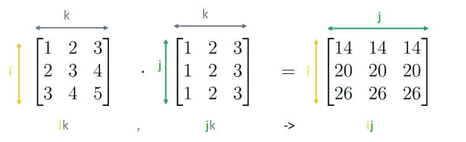

(图片由作者提供)

**NP . einsum 的第三个例子**

我们现在想要 A 和 b 的转置的点积。

我们编写了与 A 和 B 的点积相同的代码，但是我们交换了 B 的索引。

阵列乘法以如下方式执行:

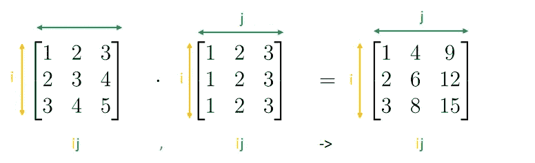

(图片由作者提供)

**NP . einsum 的第四个例子**

好吧，假设我们想要执行相同的元素乘法，但是想要在列轴(轴 1)上求和。

np.einsum 可以做到:

结果如下所示:

```
[14 20 26]
```

请注意，numpy 减少了输出结果中的一个维度，得到的向量只是 1D。

数组乘法是这样执行的:

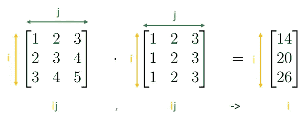

(图片由作者提供)

# 结论

到目前为止，您应该对爱因斯坦符号和 np.einsum 的工作原理有了基本的了解。如果对你来说这是一个新的话题，那么我强烈建议你用 np.einsum 做实验，改变虚拟索引和自由索引，看看结果如何变化。

# 相关文章

[https://towards data science . com/back propagation-in-neural-networks-6561 e 1268 da 8](/backpropagation-in-neural-networks-6561e1268da8)

[https://towards data science . com/back propagation-in-neural-networks-6561 e 1268 da 8](/backpropagation-in-neural-networks-6561e1268da8)

## 想联系支持我？

LinkedIn
[https://www.linkedin.com/in/vincent-m%C3%BCller-6b3542214/](https://www.linkedin.com/in/vincent-m%C3%BCller-6b3542214/)
脸书
[https://www.facebook.com/profile.php?id=100072095823739](https://www.facebook.com/profile.php?id=100072095823739)
Twitter
[https://twitter.com/Vincent02770108](https://twitter.com/Vincent02770108)
Medium
[https://medium.com/@Vincent.Mueller](https://medium.com/@Vincent.Mueller)
成为 Medium 会员并支持我(你的部分会费直接归我)
[https://medium.com/@Vincent.Mueller/membership](https://medium.com/@Vincent.Mueller/membership)