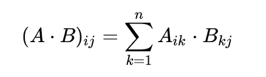
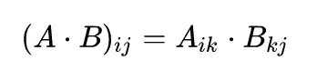

# 一个被低估的函数

> 原文：<https://towardsdatascience.com/einsum-an-underestimated-function-99ca96e2942e?source=collection_archive---------24----------------------->

## 一个功能—多种可能性。如何简单明了地使用线性代数进行深度学习？


Taton moise 在 [Unsplash](https://unsplash.com/s/photos/einstein?utm_source=unsplash&utm_medium=referral&utm_content=creditCopyText) 上拍摄的照片

线性代数在深度学习领域发挥着基础作用。它总是关于形状，移调等。PyTorch、Numpy 和 Tensorflow 等库为此提供了很多函数。但是您可能会忘记其中的一个或另一个，或者将一个函数与另一个库中的一个函数混淆。

尽管阿尔伯特·爱因斯坦肯定没有这个问题，他用所谓的 [*爱因斯坦符号*](https://en.wikipedia.org/wiki/Einstein_notation) 帮助我们。这个想法很简单:省略了 sum 字符以改善概述，取而代之的是，对出现两次以上的索引进行求和。



变成了:



谢谢，艾伯特🙏！

有了*爱因斯坦符号*和 *einsum* 函数，我们可以只用一个函数就用向量和矩阵进行计算: ***torch.einsum(方程，*操作数)*** 。我将在接下来的代码中使用 [Pytorch 的 einsum](https://pytorch.org/docs/stable/generated/torch.einsum.html?highlight=einsum#torch.einsum) 函数，但你也可以使用 [Numpy 的](https://numpy.org/doc/stable/reference/generated/numpy.einsum.html)或 [Tensorflow](https://www.tensorflow.org/api_docs/python/tf/einsum) 的函数——它们可以互换。我们将看到 *einsum* 的不同用法，以及本机 PyTorch 函数。

对于这种神奇的理解来说，最重要的是指数的概念。有两种类型:

*   自由索引-在输出中指定
*   总和指数—所有其他

让我们看一个简短的例子:

```
torch.einsum(‘ik, kj->ij’, X, Y)
```

也许你已经明白这里发生了什么:这是矩阵乘法。 *i* 和 *j* 是所谓的*自由指标，*，k 是一个*求和指标。*后者可以定义为发生求和的指标。如果我们将矩阵乘法想象成嵌套循环， *i* 和 *j* 将是外部循环，k 循环将是求和循环:

很简单，对吧？所以让我们开始吧！

## 排列

这可能用于其他事情，但转置一个向量或一个矩阵似乎是最著名的用例。

我们只需切换标识符——瞧。简单，即使 *X.T* 也是一个精致的解决方案😉*。*

## 总和

在这种情况下——简单的求和，我们不返回索引。输出是一个标量。或者准确的说，只有一个值的张量。

## 行列求和

一个索引产生了差异——按行或列求和。

## 逐元素乘法

Pytorch 的实现非常简单——只需使用乘法运算符( *** )。用 *einsum* 看起来怎么样？

这里的索引总是平均排列的。 *i* ， *j* 乘以 *i* ， *j* 给出一个形状相同的新矩阵。

## 点积

可能是比较有名的手术之一。也称为标量积。顾名思义，它返回一个标量。

*einsum* 函数没有输出索引，这意味着它返回一个标量。

## 外部产品

两个坐标向量的外积是一个矩阵。

## 矩阵向量乘法

要将矩阵乘以向量，矩阵的列数必须与向量的行数相同。

这是一个很好的例子，说明了 *einsum* 函数如何处理两个操作:转置 *y* 和乘法。

## 矩阵-矩阵乘法

深度学习中最重要的计算之一就是矩阵乘法。而且在机器学习的其他领域，也经常用到这个函数。

## 批量矩阵乘法

最后，我们来看看批量矩阵乘法。即使 Pytorch 的实现简洁明了，但用一个函数来完成所有的线性代数计算还是不错的。

我希望这几个例子能让我的理解更加清晰。关于它还有很多(例如，广播)。但是现在，应该就是这样了。然后还有 [*einops*](https://github.com/arogozhnikov/einops) 。一整个图书馆都是张量运算——看看吧。下次见——再见。