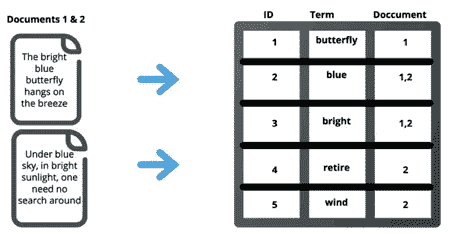

# 弹性搜索 411

> 原文：<https://towardsdatascience.com/elasticsearch-411-5f2f1872977c?source=collection_archive---------11----------------------->

## Elasticsearch 是一个开源的分布式数据搜索引擎，越来越受欢迎——下面是你应该知道的 411

JOSHUA COLEMAN 在 [Unsplash](https://unsplash.com?utm_source=medium&utm_medium=referral) 上拍摄的照片

如今，由于数字化，非结构化数据正以比以往更高的数量和速度生成。组织坐拥大量非结构化数据，但从这些数据中检索有效信息并非易事。Elasticsearch 是一个流行的面向文档的搜索引擎，以其快速高效地搜索和检索非结构化和结构化数据的能力而闻名。

在本文中，我将对 Elasticsearch 做一个简单的介绍，到此结束时，初学者将能够理解它的优势、架构和一些值得注意的用例。

# 什么是 Elasticsearch？

有很多像 MongoDB、PostgreSQL、Solr 这样的 NoSQL 数据库可以用来存储和查询非结构化数据。然而，这些 NoSQL 数据库执行复杂查询的能力有限，并且它们通常不能很好地执行实时信息检索。这就是 Elasticsearch 填补空白的地方。

Elasticsearch 是一个具有分析能力的开源分布式搜索引擎。它建立在 Lucene 框架之上，用 Java 编写。从 2010 年它的创造者 Shay Banon 首次发布以来，Elasticsearch 就获得了开发者和公司的积极关注。它越来越受欢迎很大程度上是因为它强大的搜索引擎，可以搜索[任何类型的数据，包括文本、数字、地理空间、结构化和非结构化数据。](https://www.elastic.co/what-is/elasticsearch)

与 NoSQL 数据库不同，Elasticsearch 主要被设计成一个搜索引擎，而不是一个数据库。它有惊人的能力来执行快速，几乎实时，和先进的搜索。通常，它集成在其他数据库之上，但 Elasticsearch 本身也可以用作数据存储。

Elasticsearch 的另一个强大且广受欢迎的特性是，可以使用其强大的 Restful APIs 进行搜索，因此其他系统很容易与之集成。

# 弹性研究架构

让我们一个接一个地快速看一下 Elasticsearch 架构的不同组件。

## 文档和类型

一个*文档*是 Elasticsearch 中数据的基本单位。文档以 JSON 格式保存，可以有多个属性，并且与一个*类型*相关联。例如，如果我们想要添加关于电子商务产品的数据，那么我们可以创建一个“产品”类型的文档对象，其属性类似于*名称、描述、价格、评论*。类似地，我们可以创建*客户*类型的文档，这些文档可能具有像*姓名、联系人、地址、订单历史*这样的属性。

对于那些来自 SQL 背景的人来说，他们可能将类型关联为 RDBMS 的表，将文档关联为表的行，将属性关联为表的列。

然而应该注意的是，Elasticsearch 已经计划淘汰类型的概念。他们已经在 6.0 和 7.0 中限制了类型的使用

## 弹性搜索指数

逻辑上相关的文档或那些具有相似特征的文档被组织在称为索引的公共集合下。在我们的例子中，所有的产品文档被绑定到一个索引，所有的客户文档被绑定到另一个索引。

索引类似于 RDBMS 中的数据库。然而，请注意，我们与 RDBMS 的所有类比都是为了便于理解，这并不是说 Elasticsearch 的工作方式与 RDBMS 类似。

## 倒排索引

一旦文档被编入索引，Elasticsearch 就会创建一个称为倒排索引的数据结构，它主要负责闪电般快速的搜索结果检索。简而言之，倒排索引包含这些术语以及这些术语在所有文档中出现的信息。下图将清楚地说明这一点。例如，如果搜索“blue ”, elastic search 将在倒排索引中进行查找，并快速返回文档 1 和 2。

弹性搜索指数图解(图片由作者提供，来源)

## 节点和集群

在 Elasticsearch 中，数据分布在多个称为节点的服务器上。当启动查询时，必须从多个节点整合搜索数据的结果。所有这些节点的集合称为一个集群。

## 分片和复制

Elasticsearch 将一个索引分解成多个分片，每个分片本身就是一个保存在一个节点上的全功能索引。分片有助于跨多个节点水平分布索引所需的资源，并确保将来的可伸缩性。

Elasticsearch 的另一个非常重要的特性是跨集群上的多个节点复制分片，以提高容错能力。如果一个节点由于某种原因出现故障，那么由于碎片的复制，相同的数据在另一个节点上可用。

# 什么是弹性栈(以前叫 ELK 栈)

不谈到弹性叠加，对弹性研究的介绍是不完整的。Elasticsearch 是一个通用的文档搜索引擎，可以独立工作。然而，大约在 2010 年代早期创建 ES 的同时，乔丹·西塞尔创建了一个名为 Logstash 的数据摄取工具，它能够将日志数据摄取到任何目标系统中，其中之一就是 Elasticsearch。

现场还有一个可视化工具，叫做 Kibana。基巴纳是由拉什德·卡汉开发的，因此它可以用来有效地可视化日志数据。人们发现这三个工具对于日志搜索和日志分析的常见用例非常有用。于是三位产品负责人决定在 [2012](https://www.elastic.co/about/history-of-elasticsearch#group-1) 年联手，正式组建了 ELK stack，即 Elasticsearch、Logstash、Kibana stack。这个名字后来更名为弹性堆栈。此后，弹性堆栈在数据工程领域广为人知。

弹性栈基巴纳仪表板(信用:【https://www.elastic.co/】T2)

# 基巴纳的挑战

尽管 Kibana 仍然是可视化组件的一个流行选项，但是最近出现了一些具有更多特性的其他选项。

其原因是，尽管 Kibana 非常适合在 Elasticsearch 中可视化日志数据，但 Elastic 的用例已经远远超出了它们最初的日志数据来源(参见下面关于用例的部分)。

由于范围的扩大，基巴纳

# 为什么 Elasticsearch 受欢迎

根据 Stackshare 的[调查](https://stackshare.io/elasticsearch#description)，以下是开发者和公司选择 Elasticsearch 的主要原因:

1.  强大的 API
2.  伟大的搜索引擎
3.  开放源码
4.  安静的
5.  近实时搜索
6.  自由的
7.  搜索一切
8.  易于上手
9.  分析学
10.  分布的

# 弹性搜索的用例

Elasticsearch 在日志搜索和分析、应用程序监控、网络搜索、应用程序搜索和商业分析方面有着广泛的应用。有许多知名的公司和企业都在使用 Elasticsearch，让我们来看看其中的一些用例。

● [辉瑞](https://www.elastic.co/elasticon/tour/2019/boston/elastic-as-a-fundamental-core-to-pfizers-scientific-data-cloud)在其名为科学数据云(SDC)的数据湖之上使用 Elasticsearch 进行审计、搜索和近乎实时的仪表板报告。

● [纽约时报](https://www.elastic.co/elasticon/conf/2016/sf/all-the-data-thats-fit-to-find-search-at-the-new-york-times)正在利用 Elasticsearch 搜索过去 160 年出版历史中的 1500 万篇文章。

● [Ebay](https://www.elastic.co/videos/ebay-and-elasticsearch-this-is-not-small-data) 正在使用 Elasticsearch 在几秒钟内搜索 8 亿个商品列表。

● [Groupon](https://www.elastic.co/elasticon/tour/2015/chicago/extended-custom-scripting-at-groupon) 正在利用 Elasticsearch 为其客户检索最相关的本地交易。

● [GoDaddy](https://www.elastic.co/blog/improving-the-godaddy-user-experience-with-elastic-machine-learning) 正在使用 Elasticsearch 及其内置的机器学习功能来检测他们日志中的异常，以提供更好的客户体验。

弹性机器学习(信用:[https://www.elastic.co/)](https://www.elastic.co/))

# 结论

如果您是初学者，这篇文章会让您对 Elasticsearch 及其特性有一个较高层次的了解。我们还简单介绍了麋鹿生态系统以及一些真实的行业用例。我们希望这将成为你为你的项目需求采用 Elasticsearch 的动力和垫脚石。