# 肘部和轮廓:Python 中的实际客户细分

> 原文：<https://towardsdatascience.com/elbows-and-silhouettes-hands-on-customer-segmentation-in-python-66c2e794c552?source=collection_archive---------1----------------------->

## 用 k-Means 和 Mean Shift 对混合分类和数值数据进行聚类。Scree 图、肘点和轮廓分数。

不是所有的顾客都一样。他们的偏好、购买力、签订长期合同的意愿以及其他特征会有很大差异。

StockSnap 拍摄的站着的女孩购物袋——由 StockSnap 拍摄的免费照片

产品供应、价格价值主张或促销活动可能会引起一部分客户的共鸣，但对其他客户来说却没有效果。会有代沟和性别差异。一些顾客在购买某些产品时会更加吝啬，这可能是出于需要，也可能是出于意愿。一些人会犹豫是否签订长期合同或订阅，而另一些人则喜欢与他们信任的商业伙伴建立长期稳定的关系。他们中的一些人可以享受全面的一揽子商品和服务，即“黄金会员”。其他人喜欢从产品范围中自由挑选几个选项。另一方面，将每一位顾客都视为唯一的买家是荒谬的。这是一个很好的广告口号，向所有顾客保证他们是独一无二的，每个人都是如此。但我们没有。

客户细分——又名聚类——有助于将市场划分为兴趣和属性相似的子群体。市场由当前活跃的客户组成；由于已知或未知的原因在某个时间点停止从该企业购买产品的不活跃客户，以及营销团队希望重新激活的客户；以及公司希望吸引的潜在未来客户，以获得市场份额。客户细分有助于企业定制其产品和服务、价格策略和营销信息，以提高对不同客户群体的影响力。

传统的客户细分方法依赖于公司销售人员的直觉:“我了解我们的客户。我每天和其中的 3 个，有时甚至 5 个聊天。”或许他们是对的。但是在一个有一定规模的公司里，单个的销售经理只能监管整个市场的一小部分，比如某个特定的区域或某条产品线。

现代方法使用数据科学方法来分析所有销售区域和整个产品范围的源数据。它试图客观地识别区分不同客户群的模式。与第一种方法一样，判断要求将随后出现:在分析从原始数据中提炼出可量化的事实之后。

客户细分是一个聚类问题。我们将浏览一个示例，并从不同的角度处理集群任务。

我们将讨论以下步骤:

*   将分类变量转化为数值变量
*   k 均值聚类
*   —k 均值的概念
*   —主要成分
*   —肘图和惯性分数
*   —剪影分数
*   —集群景观:集群间距离图
*   —解释:群集分析—仪表板
*   均值漂移聚类
*   结论

[电子商务在线销售，由 Mediamodifier 提供 Pixabay 上的免费照片](https://pixabay.com/photos/ecommerce-selling-online-2140604/)由 Mediamodifier 提供

# 1.属国

除了我们的核心库——numpy、pandas 和 matplotlib——之外，我们还导入

*   **Scikit-learn** 与聚类、PCA 和预处理相关的类
*   **Yellowbrick** 包——在 sklearn 的许多其他可视化工具中——提供了 k-Means 算法的肘图
*   kmodes 包——覆盖我们将应用 k 原型的章节
*   **kneed** 包，将牵制肘点为我们

# 2.数据加载和争论

我们将使用的数据源是电信数据集，它是 IBM 在一个公开的 [GitHub](https://github.com/IBM/telco-customer-churn-on-icp4d) 站点上提供的，并且多年来，它已经成为 TDS 文章和其他地方的客户流失预测演示的全球首选数据集。今天，我们将使用它的摘录作为客户细分的教程。

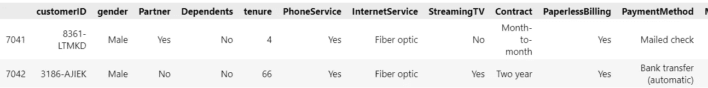

作者图片

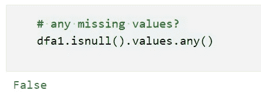

作者图片

对缺失值的检查不会在源数据中发现任何缺口。我们可以进入下一步:为 k-Means 聚类准备非数字值。

# 3.数字变量的分类

k-Means 和 Mean Shift 算法只能处理数字数据。因此，我们将把非浮点值的源数据转换成整数，使它们在数学上易于理解。

*   我们要对其应用聚合函数(如 sum 或 mean)的列应为类型 *float64* 。
*   除了对其元素进行计数之外，不进行计算的列应该是类型 *object/string* ，为即将到来的转换步骤做准备。

我们首先将*任期*变量从整数转换为浮点数。任期是一个变量，我们可以并希望计算平均值，中位数和其他描述性统计数据。我们还将 *SeniorCitizen* 列重新定义为字符串/对象变量，它只是一个值为 0 或 1 的二进制变量。

*select_dtypes()。nunique()* 函数显示了我们在每个类别列中找到的唯一值的数量。这些是将被映射到集群的特征。

具有连续数值的两列是 MonthlyCharges 和 tenure，我们可以对它们应用 pandas 的 *describe()* 函数来理解它们的内容。

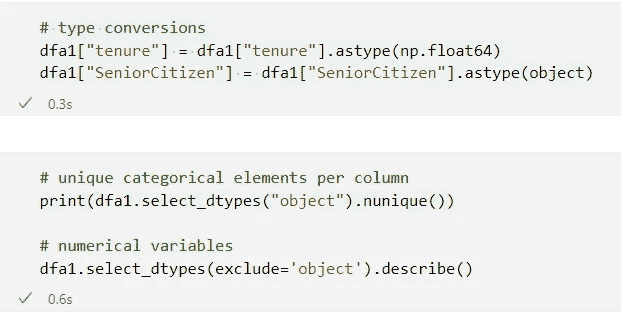

作者图片

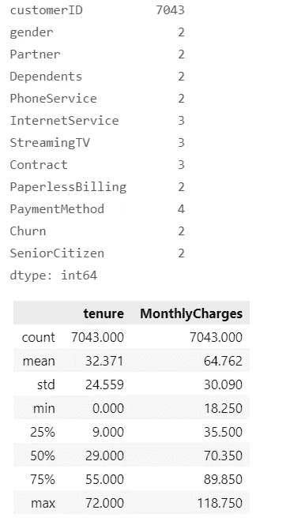

作者图片

在对源数据进行更深入的更改之前，我们复制数据帧，以便保留其原始值和结构。

*   包含数千个唯一值的列 *customerID* 对于聚类没有意义，因此我们将其从复制的数据帧 dfa2 中删除。
*   然后我们选择第 8 行中的所有数值变量；
*   并在第 10 到 13 行对其应用 sklearn 的标准 scaler，以防止聚类算法被列值之间的巨大差异所困。

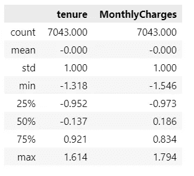

作者图片

接下来，我们需要将分类变量转换成数值。我们可以在两种可供选择的方法中进行选择:

*   **one-hot 编码**，它为每个分类列中的唯一值创建虚拟变量——这是后续文章将演示的方法；

或者

*   pandas 的 **cat.codes** 构造函数，它自动将字符串值映射到唯一的整数。

这两种方法都不是没有问题的。我们需要意识到，当我们计算平均距离时，它们会产生近似值。如果一个列包含不同的字符串值，例如，四个客户会员等级，如白金、黄金、白银和经济，标签将被转换为 0 到 3 之间的整数。数字的排序顺序不会反映任何固有的值差异。整数不会是序数。1 可以自动分配给白金，2 分配给经济，3 分配给白银，0 分配给黄金，这种排序顺序与现实没有合理的联系。此外，整数值并不表示会员等级经济从任何可以想象的角度来看都比白金价值高 2 倍。

在第 2 行到第 4 行，我们编写了一个助手函数 *catcode* ，它将 dataframe 的一个 categorial 列作为其参数，并对其应用 pandas 的*as type(" category "). cat . codes*转换器。然后，它从数据帧中删除原始列。

第 9 行的 list comprehension 调用了 helper 函数。在其右侧，comprehension 选择它在 dataframe 中找到的所有非数字列(过滤掩码: *dtypes == np.object* )。中间的*for-in*构造将这些分类列中的每一个、 *col、*传递给左侧的表达式，该表达式将其传递给 *catcode* 方法，在该方法中，字符串被转换为唯一的整数值。

第 10 行报告了每一列包含多少唯一值——现在是 integer 或 float 类型。

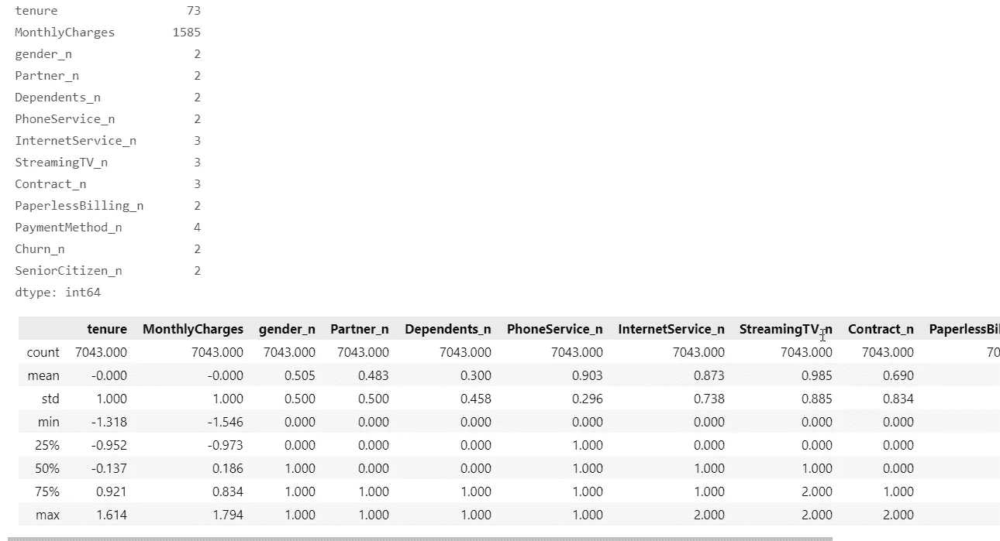

作者图片

# 4.k 均值聚类

## 4.1 均值概念

k-Means 是一种无监督的数据科学方法，它将观察值映射到更小数量的标签，即所谓的聚类。一个星团的中心，即质心，是其观测值的平均值。每个点都必须比其他质心更靠近自己簇的中心。我们希望在一个集群内获得相似的分组，紧紧围绕其中心，但与相邻的集群不同。

该算法最重要的超参数是应该将观察值映射到的聚类数 k。

三种可供选择的方法将有助于我们推断出适当的数字 k:

*   一个视觉线索和一个度量:主成分的数量
*   一个视觉线索，由一个度量证实:在一个碎石图中的*肘*点；我们还将应用一种直接计算肘点的方法，而无需参考图
*   一个由视觉线索支持的指标:最大*轮廓分数*

稍后，我们将试用 sklearn 的 Mean Shift 聚类类作为 k-Means 的替代。均值漂移是一种聚类算法，它不需要将聚类数预设为超参数。

*拐点*试探法要求我们找到图表中曲线的拐点。因为它们是启发性的，它们并不总是提供一个困难的、唯一的答案，而是开放的解释。第三种方法搜索最大的*轮廓分数*，并返回唯一的答案。

让我们研究一下这些方法。

## 4.2 聚类数:主成分

**主成分分析** PCA 将揭示数据帧中有多少列可以解释总体方差的 80%—90%。

当我们处理高维数据集时，一个有许多列的数据集，我们应该从 PCA 开始提取相关的维数。所谓的*维度诅咒*会折磨欧几里德距离度量，就像那些在 k-Means 聚类中使用的度量，因为“在高维数据中……所有的对象都显得稀疏和不相似”([维基百科](https://en.wikipedia.org/wiki/Curse_of_dimensionality))。PCA 有助于确定表征数据集的特征分组的数量。

主要成分排列在下图所示的碎石图中。图表显示，前五列可以承担大部分的解释责任。超过第十个 PCA 特征的成分的贡献变得可以忽略。我们可以得出结论，可以描述数据的聚类数量不会超过 k = 12，并且可能在 4 到 6 附近，之后 PCA 特征贡献开始减弱。

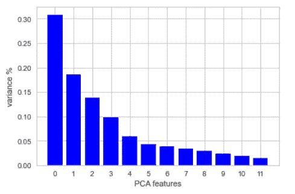

作者图片

## 4.3 集群数量:搜索弯头

k-Means 试图最小化**惯性**。惯性测量一个观察值和它被分配到的簇的中间(质心)之间的距离，是所有观察值的总和。它表达了聚类的内聚性:聚类算法能够将它们紧密地组合在一起。

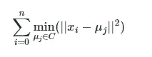

[2.3。集群-sci kit-learn 1 . 0 . 1 文档](https://scikit-learn.org/stable/modules/clustering.html)

**肘图**是一种启发式方法，使我们能够根据图表中的视觉线索选择适当数量的集群。该图表绘制了一条得分曲线，每一个备选的聚类数对应一个得分。肘部标记了线条显示其最大曲率的点。在我们达到这一点之前，群集数量的增加有助于降低误差平方和 SSE。当每个观察值都有自己的聚类时，SSE 缩小到零，这将违背聚类练习的目的。因此，我们并不寻求将 SSE 最小化到零，而是找到一个合理的折衷方案。在拐点之后，我们会看到收益递减:通过增加更多的集群，上证综指的增量下降会随着我们越出拐点而变得越来越微不足道，并且在越过曲线的拐点(拐点)后会相对更快。

为了绘制肘图，我们可以使用 *Yellowbrick* visualizer 包。Yellowbrick 包装了 sklearn 的许多类，并提供了一个图表类型目录，其中一个肘图接受 k-Means 算法的一个实例作为其参数。

要 pip 安装或 conda 安装 Yellowbrick，请使用:( [Yellowbrick](https://www.scikit-yb.org/en/latest/quickstart.html) )

*   $ pip 安装 yellowbrick
*   $ conda install-c district data labs yellow brick

Yellowbrick 为集群任务提供了三种类型的图表:

*   **手肘法**
*   **剪影可视化器**
*   **聚类间距离图**

我们通过编写一个助手函数 *elbowplot* 来开始搜索**肘点**，该函数将实例化 Yellowbrick 的 *KElbowVisualizer* (第 2 到 13 行)。

第 23 行的 list comprehension 调用 helper 函数三次，对于**三个可选的度量:**

*   ***扭曲*** 或观察点与其质心的平方距离
*   ***剪影分数***
*   ***卡林斯基-哈拉巴斯分数***

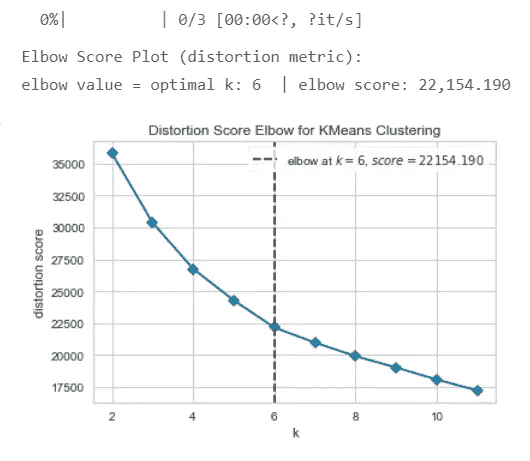

作者图片

*失真*测量观察值与它们的聚类中心的平方距离的平均值。

失真度量的 scree 图报告了 k = 6 个聚类处的肘形，这与我们从主成分分析中得出的结论一致。

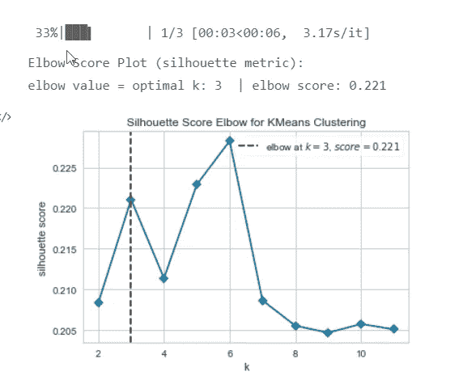

作者图片

*轮廓得分*返回最近聚类距离与聚类内距离的平均比率。分数越高，表示聚类质量越好。

然而，局部最大值在位于 k = 3 的第一个肘点处捕获了 Yellowbrick 的轮廓度量。然而，同一图表显示了第二个肘部，即 k = 6 个聚类处的全局最大值，这将使剪影结果与失真度量对齐。

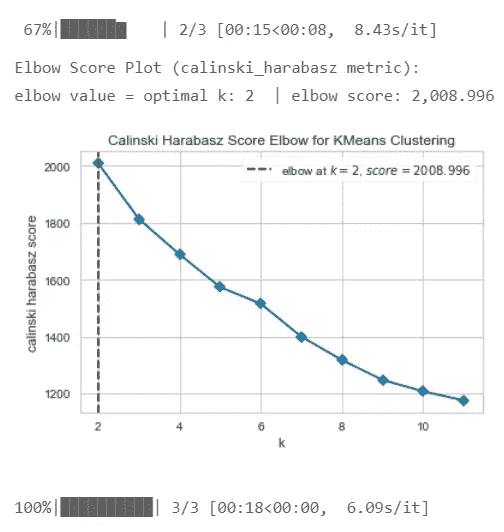

作者图片

*Calinski-Harabasz* 得分(也称为方差比标准)被定义为聚类之间和聚类内部的离差比，其中离差代表距离平方的和。高系数表示密集且分离良好的聚类结果。

在我们的例子中，CH 分数的曲线在 k = 6 处显示了小的凸起，但是它太弱而不能被识别为肘，并且它还在错误的方向上凸起，这将使它变成“膝”。

主成分、离差和最大轮廓分数强调了第四个结果，即 CH 分数，应该被解释为异常值。总之，我们可以得出结论，我们不应该依赖一个单一的指标，而是应该评估我们到目前为止讨论的所有四种方法。在这个例子中，我们已经收集了足够的证据来得出结论，集群的适当数量是 6。

或者，我们也可以从 sklearn 中推断出集群的数量，而不需要像 Yellowbrick 那样导入额外的库。

下面的 list comprehension，在第 4 行到第 9 行，运行 sklearn 的 k-Means 算法来选择聚类数，并记录它们的结果**惯性分数**。

*   第 9 行定义了聚类数的范围，在 2 和 nK = 12 之间，我们将进行评估。
*   第 4 到 7 行包含 KMeans 方法及其参数。list comprehension 将为 k 提供一个接一个的可选值，从第 9 行的范围到顶部的 KMeans 方法。
*   然后，第 8 行将接收 KMeans 模型，将其拟合到数据帧 dfa3，并将相应 k 的结果惯性分数传递给结果列表，*惯性分数。*
*   第 12 行的字典 *dict_inertia* 将分数与其对应的聚类数 k 相结合。
*   第 14 行的列表理解将逐行打印分数。
*   在第 17 行和第 22 行之间，我们创建了一个 scree 图表，该图表将绘制惯性得分以揭示拐点。

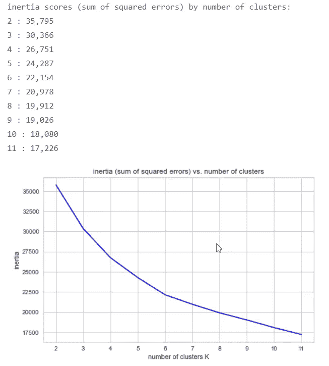

作者图片

**惯性得分**的曲线非常平滑。当我们眯着眼睛看时，我们可以在 k = 6 个集群处辨别出一个肘点。

不是很有特色的肘关节。我们应该通过计算一个精确的度量来验证这个微弱的视觉线索，这个度量有望为我们提供更多的确定性。“‘肘’不能总是被明确地识别，使得这种方法非常主观和不可靠。”([维基百科](https://en.wikipedia.org/wiki/Determining_the_number_of_clusters_in_a_data_set))

此外，如果我们仅仅依赖于我们对图表的解释，那么这个任务就变成了一种实际的监督问题。每当有更新时，Python 脚本将不得不暂停并等待用户根据对图表的观察做出决定，尽管聚类被认为是一种无监督的数据科学方法。相比之下，量化的指标将使 Python 脚本能够不受阻碍地继续运行，而无需等待用户输入。

任何曲线的拐点都代表一个微分问题。或者，因为我们在处理离散值，一个差分问题。[的论文](https://raghavan.usc.edu//papers/kneedle-simplex11.pdf)“在干草堆中寻找‘Kneedle’……”(Satop 等人)概述了 Kneedle 算法， *kneed* 包已经用 Python 实现了该算法。kneed 包使我们能够自动搜索肘点( [kneed](https://kneed.readthedocs.io/en/stable/) )。

要 pip-install 或 conda-install *kneed* ，使用以下命令:

[kneed PyPI](https://pypi.org/project/kneed/)

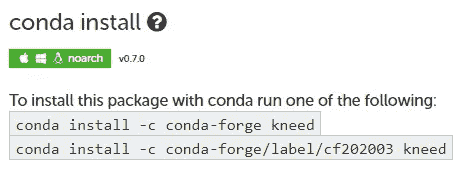

[尼德::Anaconda.org](https://anaconda.org/conda-forge/kneed)

Kneed 是一个轻量级的包，不会与现有的 Python 环境发生冲突。

*   如果我们将其*曲线*参数设置为“凹面”，则*膝盖定位器*会在给定曲线中找到一个“膝盖”——由一系列 x(水平轴)和一系列平行的 y(垂直轴)组成
*   而“凸”曲线将识别相反的形状，即我们想要定位的肘关节，下降曲线从最初的陡峭下降过渡到较平坦的末端。

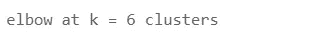

作者图片

膝盖定位器证实了我们之前得出的结论。**惯性分数**表明集群的适当数量是 6。

## 4.4 聚类数:搜索最大剪影

**轮廓分数**测量观察值如何简洁地映射到单独的聚类，以及它们与相邻聚类的分离程度。它表达了“[一个物体与自己的集群相比(相干性)与其他集群(分离性)是多么的相似。”(维基百科)](https://en.wikipedia.org/wiki/Silhouette_(clustering))

对于单个观察，分数计算如下

*   (b — a) / max(a，b)，

在哪里

*   变量 *a* 测量*内聚力*:来自同一聚类中所有其他点的观察值的平均距离= *平均聚类内距离；*其值越小，观察值与其自身聚类的差异越小或匹配越好；
*   而 *b* 测量*间隔*或相异度:一个观测值与该观测值不属于的最近聚类中所有点的平均距离= *平均最近聚类距离*
*   Sklearn 的函数 *silhouette_score* 计算所有观察值的平均值。它测量所有观察值围绕各自聚类中心的紧密程度。
*   通过 *silhouette_samples* 方法可以获得一个填充了*个人*分数的数组。

轮廓分数的范围在-1 和+1 之间。

*   高分是优选的，它们表明密集且分离良好的聚类。
*   低值或负值表示簇的数量太低或太高，无法生成良好的映射。
*   如果值接近-1，则表示观察值被映射到了错误的聚类，这与相邻聚类更相似。
*   接近零的值表示聚类的观测值非常接近相邻聚类的边界；他们忍受着不完美的分离。

我们通过在候选数 k 中搜索最大轮廓分数来找到最佳的聚类数。

下面的代码片段显示了一个简单的例子，说明了如何对随机选择的几个聚类进行 k 均值分析，k = 4。它在第 6 行获得结果*轮廓分数*。

作者图片

让我们检查一下是否可以通过在剪影得分中找到全局最大值来改进这个初步结果。

在下面的脚本中，第 2 行到第 6 行中的 list comprehension 对备选数字 k 运行 k-Means 方法。

*   第 6 行定义了要尝试的数字范围，在 2 和 kN = 12 之间。
*   list comprehension 将 k 的值一个接一个地输入到顶部的表达式中，如第 2 行到第 4 行所示:我们在上面代码片段的第 6 行看到的 *silhouette_score* 函数。
*   第 5 行将 k-Means 模型与数据帧中的定标观察值进行拟合。
*   列表理解将每次 k-Means 迭代产生的轮廓分数附加到第 2 行的列表 *sil_scores* 中。
*   第 8 行收集了一个字典中的分数列表及其对应的集群编号 k，第 10 行中的 list comprehension 将逐行打印出来。
*   第 11 行和第 12 行标识了字典中聚类的最佳数量和相关联的最大轮廓分数。
*   第 15 到 21 行绘制了分数曲线，其峰值在 k = 6 个聚类。

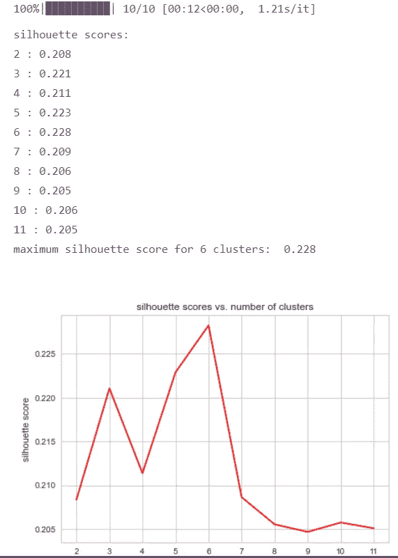

作者图片

到目前为止，肘图和侧影分数都证实了六个聚类充分描述了我们的数据。

我们可以再次使用黄砖图表包来确认计算结果。它提供了**轮廓图**，帮助我们可视化从分数中获得的数字洞察力。

我们正在寻找产生最大轮廓的聚类数。优选地，所有聚类的形状应该延伸超过平均轮廓分数的垂直线；并且簇应该具有相似的宽度，理想的是均匀的宽度。

然而，在这个特殊的例子中，我们不得不再次眯起眼睛来确认六个图中的哪一个在 x 轴的最大位置显示了垂直的红色虚线。所有的图都展示了不远处右侧 0.2 的轮廓分数。列表分数证实最大值位于 k = 6 个聚类。

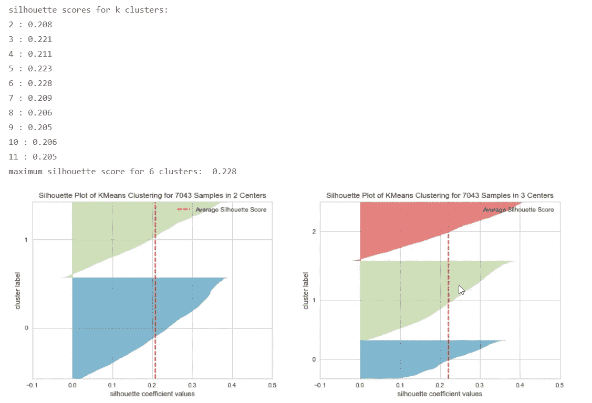

作者图片

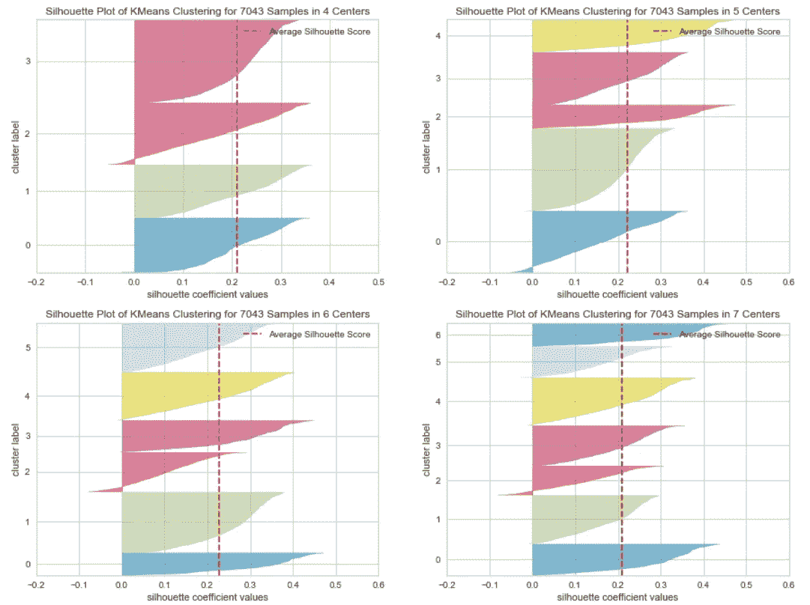

作者图片

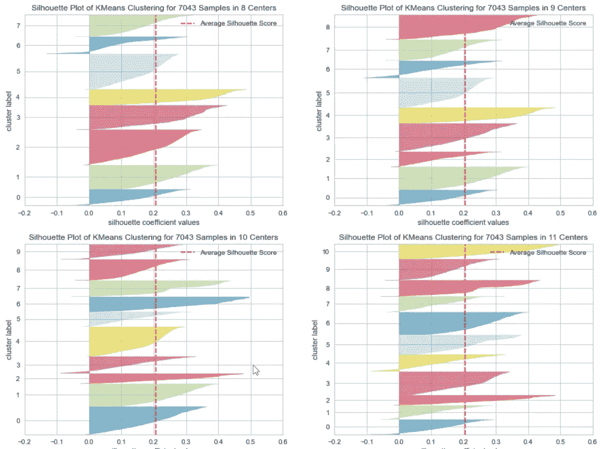

作者图片

## 4.5 聚类数:聚类间距离图

最后，Yellowbrick 的*星团间距离*图表使我们能够从另一个角度研究星团。

这个图表显示了集群的相对距离和大小。它仅在二维空间中绘制聚类中心。气泡的大小代表了每个聚类中的观察次数。

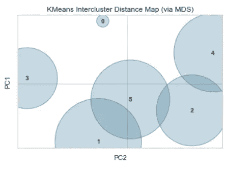

作者图片

重叠的圆圈并不意味着集群的分离已经失败。重叠仅仅是它们的大小(一个簇中的记录数量)的结果，结合特征空间的扁平到仅仅 2 维。即使聚类在 2D 空间中看起来重叠，它们在它们的原始特征空间中也不一定彼此靠近。“维度诅咒”将它们之间的距离置于一个比 2D 可见的更高维的空间中。

下面的图表显示了介于 4 和 7 之间的备选集群数量的情况。

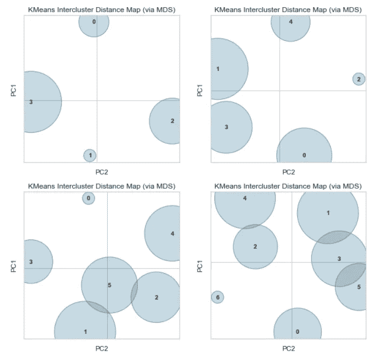

作者图片

## 4.6 训练:k 均值聚类

我们已经完成了对源数据的分析，并且从不同的角度确认了最合适的聚类数是 6。

在下一步中，我们在训练和测试数据集之间拆分观察。

第 6 行到第 7 行对训练数据集运行 k-Means 算法。我们将惯性和轮廓分析的结果(六个集群)输入到该方法中。第 8 行将生成的分类标签作为新列分配给定型数据集中的记录。

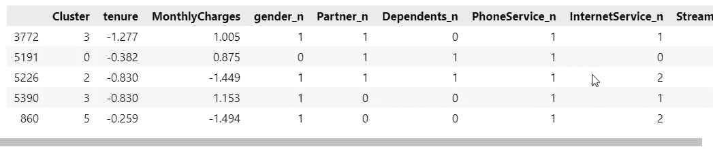

作者图片

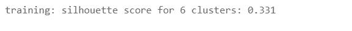

作者图片

## 4.7 解释:集群分析和仪表板

我们从聚类标签中获得了什么样的洞察力？

我们的脚本在 dataframe 中生成了一个新的列“Cluster”。我们如何将其转化为*可操作的*信息？营销团队中的计划者或执行团队中的决策者可以使用哪些信息来定义将增强公司竞争优势的战略？我们能否使用集群标签来设计针对特定客户集群的产品和促销活动？

首先，我们应该研究星团的大小。截屏显示所有六个集群具有相似的量值，在 757 和 1，515 之间。没有明显的异常值或奇异的小星团，也没有让其他星团相形见绌的优势星团。分组过程在这方面没有缺陷。

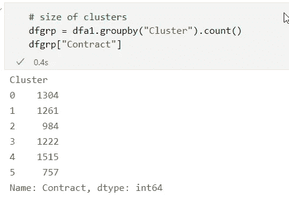

作者图片

为了获得每个集群的配置文件，我们可以使用许多 pandas 对象，它们从不同的角度提供了洞察。

一个**交叉表**使我们能够比较多达两个其他变量，以及它们在一个集群或另一个集群中的存在或不存在。

例如，下面的交叉表询问客户流失是否与每月费用相关；如果是，聚类是否反映了这种相关性。该表表明，集群 2 已经失去了一些高价值客户，他们可能发现价格/价值定位对他们来说太贵了。没有续签合同的客户(流失=是)的月费是那些留在公司的客户(流失=否)的两倍多。

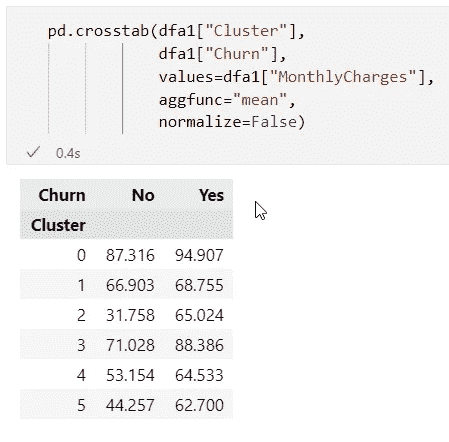

作者图片

下一个交叉表对比了这些集群对互联网和流媒体服务的选择。第 1 类客户主要是那些没有通过电视选项预订互联网服务的客户。

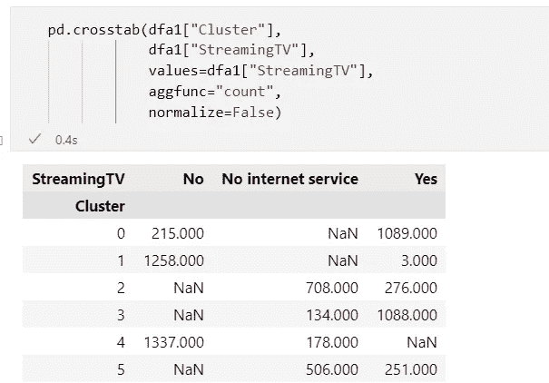

作者图片

尽管如此，交叉表还是有点麻烦，因为我们必须为我们想要研究的每一对特征设置它们。

让我们寻找额外的替代工具。

下面的 **groupby** 方法可以逐个分类地确定每列中最频繁出现的值。

例如，集群 0 的特点是大部分女性客户拥有长期的使用权，她们预订了光纤互联网服务和电视，并签署了最长的合同期限，即两年。我们可以使用这种表来标识每一列中的模式，从而为每个分类开发一个配置文件:“该分类代表哪种类型的客户？”在我们向营销团队提供的技术含量较低的说明或用户指南中，我们可以选择将集群 0 标记为“高价值客户:稳定的客户”

第二类客户主要是男性客户，他们倾向于签订月租合同，只选择电话服务，可以被称为“轻浮先生”或“试探先生”。营销团队需要考虑产品报价，以说服集群 2 的客户签订更长期、更稳定的合同。

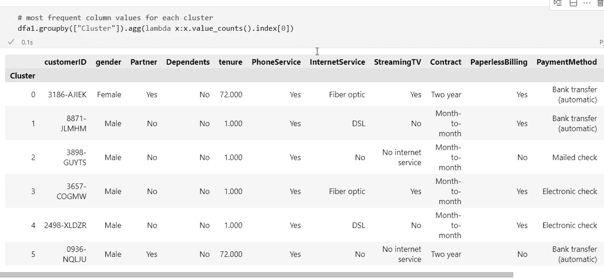

作者图片

不过，上面的 groupby 视图并不完美，因为它显示了每一列中的模式:最频繁出现的值也显示在数字列中，这与分类变量相比没有什么意义。

对于数值变量，我们应该显示平均值或中位数，而不是众数。我们还希望创建图表，使营销策略师和决策者更容易识别每个聚类的概况。

下面的截图将显示我们下一步可以对集群数据做什么。

*配置文件表*在其列中列出了六个集群，并在其行中显示了它们的特征。对于分类变量:模式；对于数值(每月费用和任期):中间值。

下面的*饼图*有助于理解每个星团的组成。每行饼图代表单个集群的七个核心属性:从左边的合同条款到右边的电视流媒体选项。像这样排列，馅饼为每个集群提供了一个视觉轮廓。

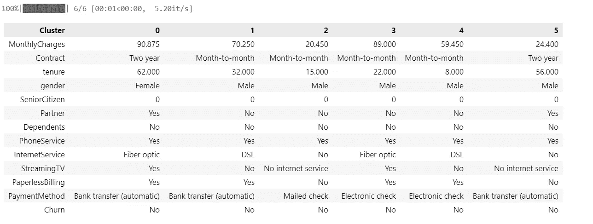

作者图片

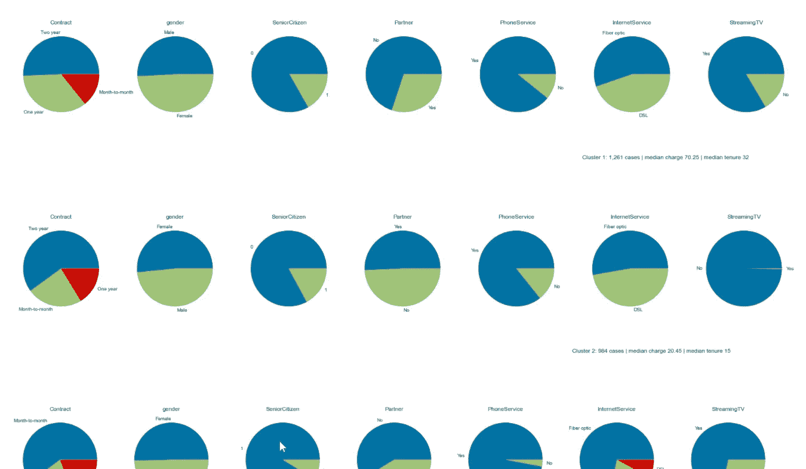

作者图片

两个辅助函数生成了上面的表格和饼图。

*   函数 c *luster_profile，*通过其聚合函数 *agg* 和特定于列的 lambda 函数，识别中值或众数( *value_counts()。index[0])* 用于属于给定聚类的记录。

助手函数 *cluster_pies* 创建饼图。

一个循环贯穿所有六个集群。在每一列中， *value_counts()* 函数确定有多少元素已经或尚未映射到相应的分类，并通过饼图回答以下问题:给定分类的该特征(该列)的组成是什么？

# **5。均值漂移聚类**

与 k-Means 不同， **Mean Shift** 算法不需要我们预先估计聚类数。相反，它采用一个*带宽*参数来限定搜索空间。带宽决定了它将评估距离的感兴趣区域。带宽可以由用户设置；或者可以通过算法来估计。

均值漂移的最大缺点是计算量大。当它进行多次最近邻搜索时，它的时间复杂度是数据点数的平方:O(n)。因此，均值漂移不容易扩展到大型数据集。

像 k-Means 一样，它不能处理分类数据。因此，我们将把用于 k-Means 的相同的转换后的全数字数据帧 dfa3 传递给它。

我们在单个笔记本单元中结合了我们已经讨论过的 k-Means 的步骤。它的所有行都相当于 k-Means 脚本。

*   在第 5 行，我们建议算法自己估计带宽。如果分位数设置为 0.5，则所有成对距离的中值用于估计。默认值为 0.3。
*   在第 7 行，我们运行算法。参数 bin_seeding 如果设置为 True，将加快算法的速度。如果为 false 或省略，均值漂移搜索将运行更长时间。
*   第 11 行将集群标签作为一个新列映射到数据帧。
*   第 14 行计算轮廓分数。
*   第 20 行调用助手函数，该函数将返回集群概要表和饼状图。

均值漂移与 k-Means 一致，并发现六个聚类充分描述了我们的源数据的结构。

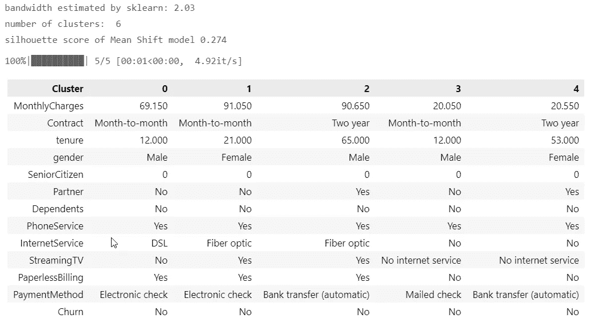

作者图片

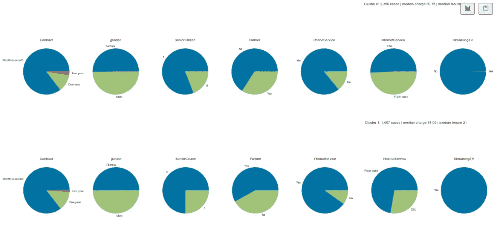

作者图片

# 6.结论

*   我们已经讨论了如何将 k-Means 和 Mean Shift 聚类算法应用于混合(分类和数值)数据类型。
*   我们使用了一系列技术来确定最重要的超参数:最佳聚类数。
*   我们还编写了为计划者和决策者准备仪表板的代码:特定于集群的饼图和显示每个集群特征值的表格。

下一篇文章将演示当我们需要处理分类数据时可以应用的另外两种聚类方法:

*   分类变量的一键编码

和

*   k 原型

Jupyter 笔记本可在 GitHub 上下载: [h3ik0th/clustering:用 kmeans、meanshift、kprototypes、one-hot encoding、inertia 和 silhouette scores(github.com)对混合变量进行聚类](https://github.com/h3ik0th/clustering)

数据集:Apache-2.0 许可证。【IBM/telco-customer-churn-on-ICP 4d:在 IBM Cloud Pak for Data(github.com)上使用 WML 进行数据分析、模型构建和部署