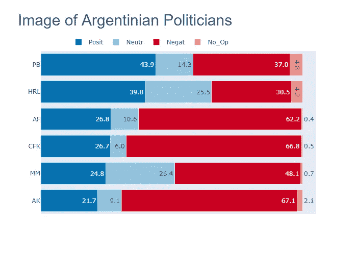
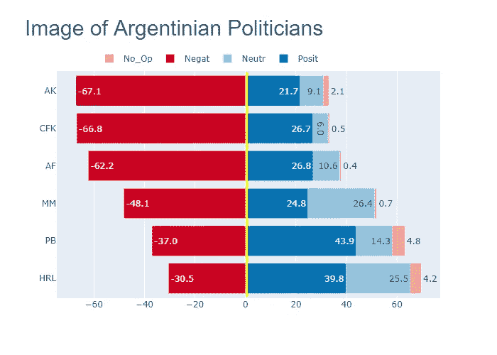
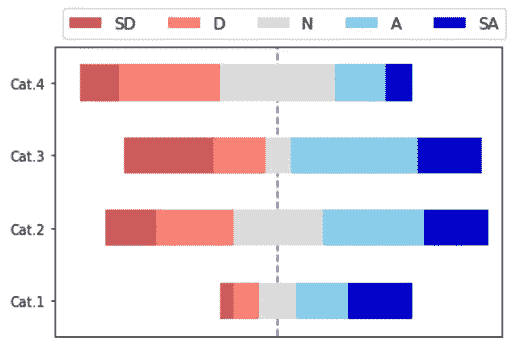

# 用 Plotly 进行的选举调查

> 原文：<https://towardsdatascience.com/election-surveys-with-plotly-50c904d730de?source=collection_archive---------39----------------------->

## **堆叠棒线还是发散棒线？**


由[詹妮弗·格里芬](https://unsplash.com/@dotjpg?utm_source=unsplash&utm_medium=referral&utm_content=creditCopyText)在 [Unsplash](https://unsplash.com/s/photos/election-surveys?utm_source=unsplash&utm_medium=referral&utm_content=creditCopyText) 上拍摄的照片

2021 年，阿根廷将举行全国立法选举。PASO(*Primarias Abiertas simultáneas y Obligatorias*，同步强制性公开初选)将于 9 月 12 日举行，而大选将于 11 月 14 日举行。众议院将更新其 257 个席位中的 127 个，参议院将更新其 54 个席位中的 24 个。这被认为是一次超越性的选举，因为执政党距离在众议院获得自己的多数席位只有 7 名代表。由于它已经在参议院占多数，有利的结果将使它获得完全的立法控制权。

竞选活动尚未开始，因为参加不同选举联盟竞选的所有候选人尚未确定。尽管如此，每周还是会发布几项民意调查，试图确立选民的未来行为。其中一些调查关注仅有的两个有机会赢得选举的选举力量的主要政治对象的形象，作为预测选民在投票时行为的代理人。

一位主要的民意调查者询问了现任总统、前两任总统、在任的两位主要州长以及反对党主要政党的主席的形象。当然，显示结果的最佳方式是通过某种数据可视化技术。

在下文中，我指出了 Plotly 允许显示选举调查结果的两种选择。

# **备选项 1: 100%堆叠水平条**

人们认为**调查应该是对称的，因为正面或正面的回答与负面或负面的回答数量相等。**当然，中立的回应也不能缺席(以免在立场严格中立的情况下，强迫被回应者选择任何一方)。也不应该没有“不知道-不回答”选项，以包括被调查者对所研究项目的无知程度。

显示调查结果最常用的图表之一是 1 **00%堆积水平条形图**。一个[堆积条形图](/stacked-bar-graphs-why-how-f1b68a7454b7)显示了一组条形或矩形，每个条形或矩形代表一个被划分为子类别的主类别。每个子类别的数值由一个接一个堆叠的矩形线段的长度表示。在调查结果的特殊情况下，矩形**水平定向。**此外，在 100%堆积条形图的情况下，每个区段代表每个子类别的**百分比**，注意百分比的总和必须等于 100。

以下 100%堆积条形图显示了阿根廷主要政治家的形象水平。该图根据正面图像按降序排序。堆叠的条的顺序如下:正图像；中性形象；负面形象；政客的无知。



图 1:作者用 Plotly 制作的 100%堆积水平条形图。

获得图 1 的代码如下:

首先，我们将 [Plotly Express](/scatter-plots-with-plotly-express-1b7f5579919b) 导入为 *px，*Plotly . graph _ objects 模块导入为 *go* ，Pandas 和 Colorlover 库分别导入为 *pd* 和 *cl* :

```
import plotly.express as pximport plotly.graph_objects as goimport pandas as pdimport colorlover as cl
```

然后，我们创建了包含调查结果的数据框架，并根据正面形象的级别对其进行了分类:

```
surv = {‘Pol_List’: [‘PB’, ‘HRL’, ‘AF’, ‘CFK’, ‘MM’, ‘AK’], ‘Posit’: [43.9, 39.8, 26.8, 26.7, 24.8, 21.7], ‘Neutr’: [14.3, 25.5, 10.6, 6.0, 26.4, 9.1], ‘No_Op’: [4.8, 4.2, 0.4, 0.5, 0.7, 2.1], ‘Negat’: [37.0, 30.5, 62.2, 66.8, 48.1, 67.1] }df_surv = pd.DataFrame(surv)df_surv = df_surv.sort_values(by=’Posit’, ascending = True)images  = [‘Negat’, ‘No_Op’, ‘Neutr’, ‘Posit’]
```

现在，我们准备创建我们的图表。

plotly 的通常程序是使用方法`.add_trace(go.Bar())`生成图形，然后使用方法`.update_layout()`和`.update_xaxes`对其进行操作。最后用`.show()`显示图表，用 `.write_image()`导出。

我们需要将`.add_trace(go.Bar())`方法放在*中，以便*循环遍历数据帧，提取政治家的首字母(`y = df_surv[‘Pol_List’]`)和调查中记录的量化值`(x = df_surv[column]`。用 `orientation = ‘h’`我们表示我们的条将水平定向，用 `text`和 `textposition`我们将在矩形段内包含数值。`cl.scales`选择一个色标，以便快速辨别正值和负值。

`fig.update.layout`允许我们设置标题文本和字体，以及图例的方向和位置。包含`barmode = ‘stack’`非常重要，以确保杆段一个接一个地堆叠。

最后，我们指出，在 x 轴上，我们不想放置标尺或网格，因为它们对我们讲故事来说是不必要的。

```
fig = go.Figure()for column in df_surv.columns[1:5]: fig.add_trace(go.Bar( x = df_surv[column], y = df_surv[‘Pol_List’], name = column, orientation = ‘h’, text = df_surv[column], textposition = ‘auto’,                  marker_color=cl.scales[
                                 str(len(images))]’div’]’RdBu’]            
                                 images.index(column)] ))fig.update_layout( title = ‘Image of Argentinian Politicians’, title_font= dict(family = ‘Arial’, size = 30), barmode = ‘stack’, legend_orientation =’h’, legend_traceorder=”normal”, legend_x = 0.10, legend_y = 1.1, )fig.update_xaxes( visible = False, showgrid = False)fig.write_image(path + ‘Survey1.png’)fig.show()
```

# **备选方案 2:发散堆积条形图**

[发散堆积条形图](/diverging-bars-why-how-3e3ecc066dce)是之前描述的堆积条形图的延伸，增加了一条垂直基线**。概念上的想法是**否定回答放在基线的左边，而肯定回答放在基线的右边**。这种特殊的设计便于对各种类别的积极或有利的反应和不利或消极的反应进行比较。**

每个条形被分成水平矩形段，一个接一个地堆叠。正如所有条形图的特点一样，每段的长度与要表示的数值成正比。根据要绘制的数据集的特征，该数值可以是绝对值或百分比。

为了将否定回答放在基线的左侧，我们继续将相应的列转换为负值，并根据该列进行排序:

```
df_surv['Negat'] = df_surv['Negat'] * -1df_surv = df_surv.sort_values(by=['Negat'], ascending = False)
```

我们继续用相同的方法`.add_trace(go.Bar())`绘制图表，使用的代码等同于之前用 100%堆积水平条表示的代码。

```
fig2 = go.Figure()for column in df_surv.columns[1:5]: fig2.add_trace(go.Bar( x = df_surv[column], y = df_surv['Pol_List'], name = column, orientation = 'h', text = df_surv[column], textposition = 'auto',
                   marker_color=cl.scales[
                                 str(len(images))]’div’]’RdBu’]            
                                 images.index(column)] ))
```

我们必须在 update.layout 方法中做两处修改:现在我们指定`barmode = ‘relative’`和`legend_traceorder=”reversed”.`

```
fig2.update_layout( title   = 'Image of Argentinian Politicians', title_font= dict(family = 'Arial', size = 30), barmode = 'relative', legend_orientation ='h', legend_traceorder="rerversed", legend_x = 0.10, legend_y = 1.1, )
```

然后，我们画一条中心垂直线，表示发散的堆叠棒线:

```
# Draw a central vertical linefig2.add_shape(type='line', x0 = 0.5, y0 = -0.5, x1 = 0.5, y1 = 5.5, line=dict(color = 'yellow', width = 3))
```

在 x 轴上，我们保留默认选项来显示数字值和网格，这增强了故事的讲述:

```
fig2.update_xaxes( visible  = True, showgrid = True)fig2.write_image( path + 'Divergent1.png')fig2.show()
```



图 2:作者用 Plotly 做的发散堆积条形图。

发散堆积条形图中的一个常见替代方法是将中性响应放置在正响应和负响应之间，并在代表中性响应的线段中心画一条垂直线。图 3 示出了用具有这些特征的 Matplotlib 制作的图:SD:强烈不同意；d:不同意；n:中性；答:同意；山:非常同意。很明显，这种布局很难对阳性和阴性反应进行直接比较，因为它们不是从同一基线开始的。



图 3:作者用 Matplotlib 制作的发散堆积条形图。

你可以选择讲述你的故事。

如果你对这篇文章感兴趣，请阅读我以前的(**https://medium.com/@dar.wtz)**:

棒棒糖和哑铃图，有曲线、平均值或中值？

[](/lollipop-dumbbell-charts-with-plotly-696039d5f85) [## Plotly 的棒棒糖和哑铃图表

### 均值还是中值？

towardsdatascience.com](/lollipop-dumbbell-charts-with-plotly-696039d5f85) 

斜率图表，为什么和如何，用斜率讲故事

[](/slope-charts-why-how-11c2a0bc28be) [## 斜率图表，为什么和如何

### 用斜坡讲故事

towardsdatascience.com](/slope-charts-why-how-11c2a0bc28be)