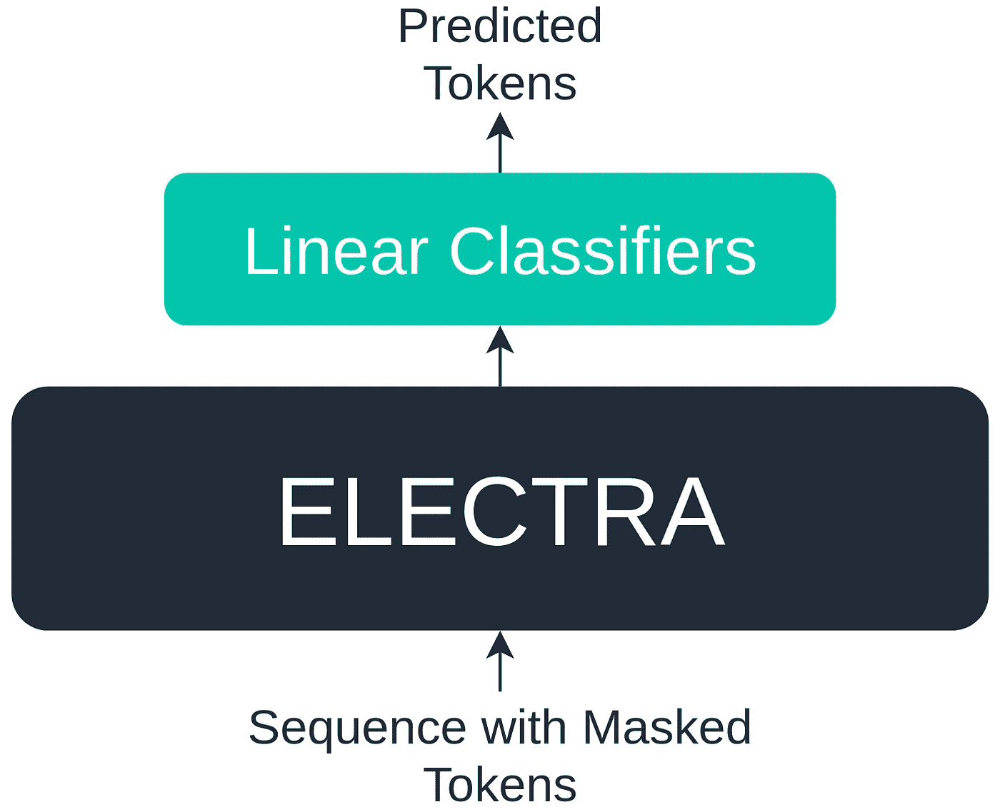
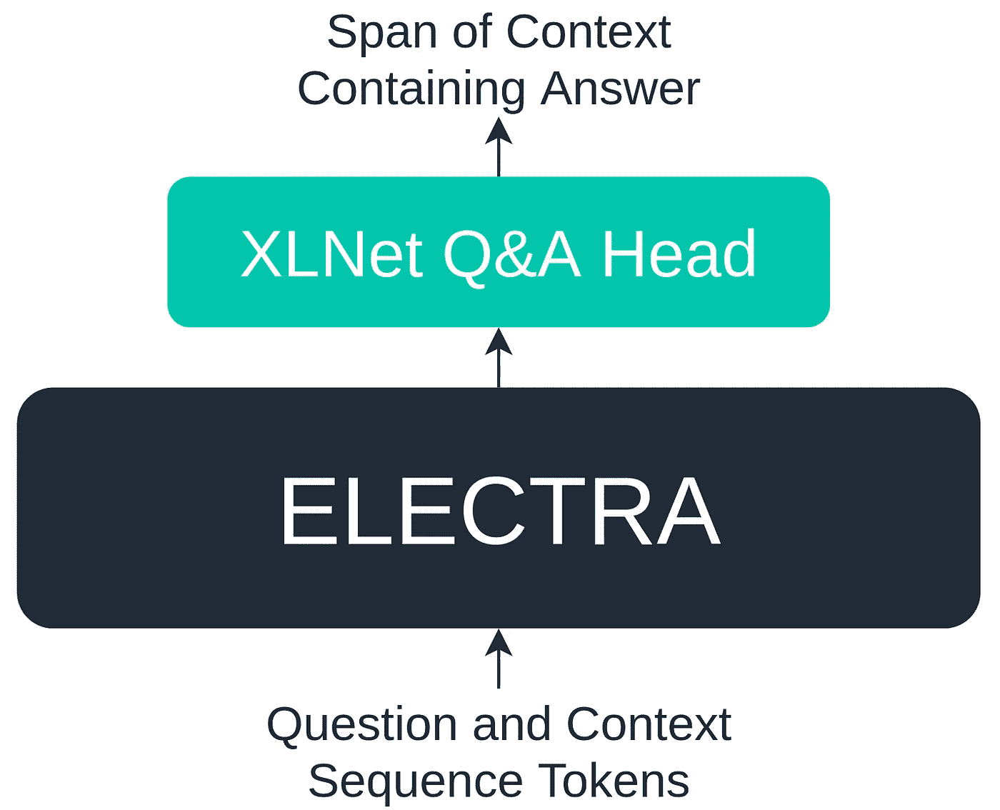

# 伊莱克特拉是伯特——超级增压

> 原文：<https://towardsdatascience.com/electra-is-bert-supercharged-b450246c4edb?source=collection_archive---------7----------------------->

## ELECTRA 的性能优于所有其他变压器，体积仅为其 1/4


照片由[乔恩·泰森](https://unsplash.com/@jontyson?utm_source=medium&utm_medium=referral)在 [Unsplash](https://unsplash.com?utm_source=medium&utm_medium=referral) 上拍摄

转换器主宰了自然语言处理(NLP)领域。2017 年的论文“注意力是你所需要的一切”介绍了第一个变压器——此后没有其他架构取代了这些 NLP 发电站。

快进一年到 2018 年，我们发现 [BERT](https://arxiv.org/pdf/1810.04805.pdf) (变压器的双向编码器表示)。一个巨大的预先训练好的模型，无需进一步训练就可以应用于广泛的语言任务。

BERT 的方法已经成为 NLP 的标准——在难以想象的大数据集上训练一个大规模的基于 transformer 的架构，在几个标准化的基准上测试它——并向公众发布。

此后推出了几个模型，它们在 BERT 的成功基础上有所改进，如 RoBERTa 和 XLNet，但它们都依赖于更大的网络和更大的数据集。

除了 2020 ELECTRA 模型之外，所有模型都引入了一种新的训练方法，可以产生与最好的变压器性能相当(通常更好)的模型，并且只需要一小部分计算能力。

```
> How to Train a Transformer
> A Different Pre-Training Approach
> Performance Compared to Other Models
```

# 如何训练一名变压器

伯特在预训练中使用了掩蔽语言模型(MLM)。MLM 包括获取输入序列并用掩码标记`[MASK]`替换其中一些标记。

这意味着:

```
["the", "chef", "cooked", "the", "meal"]
```

变成了:

```
[**"[MASK]"**, "chef", **"[MASK]"**, "the", "meal"]
```

在屏蔽了这些输入之后，模型被训练来用正确的单词替换这些`[MASK]`记号。

MLM 的方法非常有效，并产生了真正惊人的结果。成千上万的 ML 工程师和数据科学家正在将 BERT 作为解决方案的关键组件应用于许多行业。对于每一个 BERT 用例，我们看到另一个用于 XLNet，另一个用于 GPT-2/3。

这些模式取得了巨大的成功。但是它们都依赖于大量的训练数据。训练这些模型的计算成本是另一个影响巨大的因素——GPT-3 的训练成本估计为 460 万美元[1]。

训练一个模特的 460 万美元是一笔巨款——而这只是一次训练。没有一个研究团队会在第一次尝试中成功地设计和训练一个模型。这些事情需要时间和大量的培训和再培训。

展望未来，这些大型变压器模型的趋势是添加更多的训练数据和更多的参数，从而推动性能越来越高。这自然会导致更长的训练时间和更多的计算。

# 不同的预培训方法

伊莱克特拉打破了这一趋势。与依赖于 MLM 预训练的前辈不同，ELECTRA 使用了一种更有效的方法，称为“替换令牌检测”。

这种方法不是屏蔽随机选择的输入令牌，而是使用另一种神经网络，试图通过用假令牌替换随机令牌来欺骗我们的模型。


生成对抗网络(GAN)的数据流和生成器-鉴别器结构

该方法与 GANs 采用的方法相似。在训练 GANs 时，我们让两个网络(生成器和鉴别器)相互竞争。生成器经过优化，可以用越来越有说服力(但仍然是假的)的数据“欺骗”鉴别器。

然后，我们的鉴别器可以识别由生成器模型生成的数据哪些是真的，哪些是假的。

ELECTRA 采用了类似的方法。我们的模型是鉴别器，它的任务是识别哪些令牌是真的，哪些是生成器放在那里的赝品。


ELECTRA 论文中使用的类似但不同的发生器-鉴别器架构方法，[来源](https://openreview.net/pdf?id=r1xMH1BtvB)

这不是 GAN 型架构的原因是，发生器没有优化以增加鉴频器的损耗，而是像典型的 MLM 模型一样训练，它必须最好地猜测`[MASK]`值。

根据 ELECTRA 的论文，这种预训练方法比 MLM 更有效，因为模型必须考虑它看到的每个样本中的每个标记——而 MLM 只要求模型专注于`[MASK]`标记[2]。

因为该模型关注并训练每一个标记，所以该模型产生了对上下文的改进的理解。

*边注:*使用较小的生成器模型可以改善结果——特别是使用 25–50%的参数作为鉴别器的生成器[2]。

预训练完成后，发电机模型被丢弃，留给我们新的 ELECTRA 变压器模型。然后，我们可以将 ELECTRA 应用于由 transformers 处理的典型语言任务，例如文本生成或问答。

# 与其他型号相比的性能

总的来说，ELECTRA 看起来是性能最高的变压器型号之一，同时比与其性能相当的所有其他型号都小得多。

在 2020 年的论文中，该模型在 GLUE 和 SQuAD 基准上进行了测试。

GLUE 是一项分类任务，其中语言模型必须准确预测给定句子的正确单词。该基准旨在通过测量不同语言现象的九项任务来深入测量模型在自然语言理解(NLU)方面的能力[3]。



ELECTRA 论文作者用于 GLUE 基准测试的模型架构的高级视图。

对于 GLUE 基准测试，在 ELECTRA 的基础上使用额外的线性分类器对模型进行微调。

SQuAD 是斯坦福大学创建的问答基准，有两个版本，SQuAD 和 SQuAD 2。在这里，伊莱克特拉是以两者为基准的——她的任务是选择回答一个给定问题的文章的跨度。



ELECTRA 论文作者用于团队基准测试的模型架构的高级视图。

对于小队基准，来自 XLNet 的问答模块被添加到 ELECTRA 中。

## 胶

GLUE 基准测试结果，RoBERTa 和 ELECTRA 分别参考了 RoBERTa-500K 和 ELECTRA-1.75m[2]。

在 GLUE 测试集上，伊莱克特的表现优于所有其他 transformer 模型(当取几个指标的平均分时)——尽管比所有其他模型(除了 Bert)需要更少的计算来训练。

## 班

小队基准测试结果，RoBERTa 和 ELECTRA 分别参考了 RoBERTa-500K 和 ELECTRA-1.75m[2]。

将伊莱克特与 SQuAD 基准测试中的其他模型进行比较表明，伊莱克特在性能和训练计算要求方面都是明显的赢家，只有 Bert 在计算方面和 XLNet 在 SQuAD 1.1 开发集上的性能例外。

为了解决这个问题——实际上，伯特仍然非常重要——但伊莱克特展示了用一点点创新思维可以做些什么，并且看到未来出现其他迷人的模型将是令人难以置信的。

如果你还没有——我绝对推荐你在你正在做的任何基于 transformer 的 NLP 任务中尝试伊莱克特。

如果这一切对你来说都是新的，但你想尝试一下伊莱克特，看看 [HuggingFace 的变形金刚库](https://huggingface.co/transformers/)和他们的[关于伊莱克特本身的文档](https://huggingface.co/transformers/model_doc/electra.html)。

我希望你喜欢这篇文章！如果你有任何建议或问题，请随时通过[推特](https://twitter.com/jamescalam)或在下面的评论中联系我们！如果你有兴趣看到更多这样的内容，我也会在 YouTube 上发布。

感谢阅读！

# 参考

[1] L. Chuan， [OpenAI 的 GPT-3 语言模型:技术概述](https://lambdalabs.com/blog/demystifying-gpt-3/) (2020)，Lambda Labs

[2]K·克拉克等， [ELECTRA:将 Tect 编码器作为鉴别器而不是发生器进行预培训](https://openreview.net/pdf?id=r1xMH1BtvB) (2020)，ICLR

[3] A. Wang 等， [GLUE:自然语言理解多任务基准与分析平台](https://www.aclweb.org/anthology/W18-5446.pdf) (2018)，EMNLP

[🤖NLP 与变形金刚课程](https://bit.ly/nlp-transformers)

有兴趣进一步了解变形金刚吗？我写过很多关于它们的文章*——但这很容易成为我最喜欢的开场白:*

*[](/evolution-of-natural-language-processing-8e4532211cfe) [## 自然语言处理的演变

### 对 NLP 过去十年的直观直观解释

towardsdatascience.com](/evolution-of-natural-language-processing-8e4532211cfe) 

**除*另有说明外，所有图片均为作者所有*