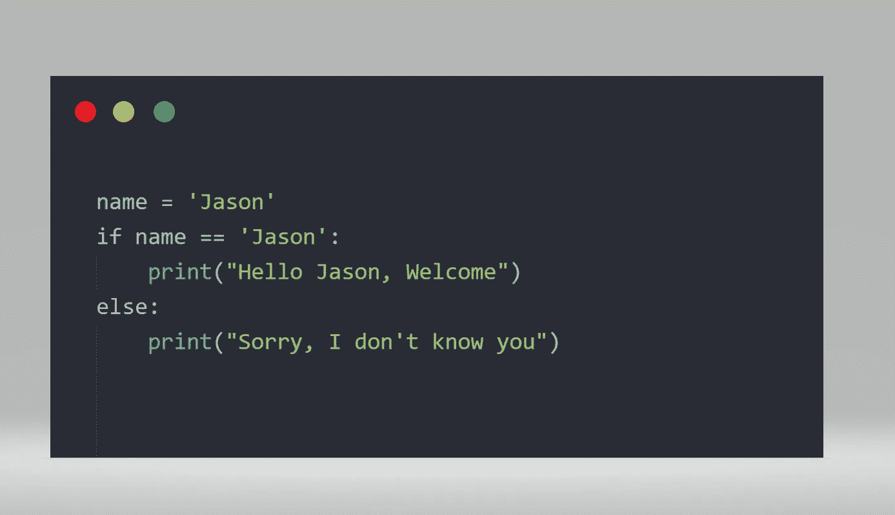
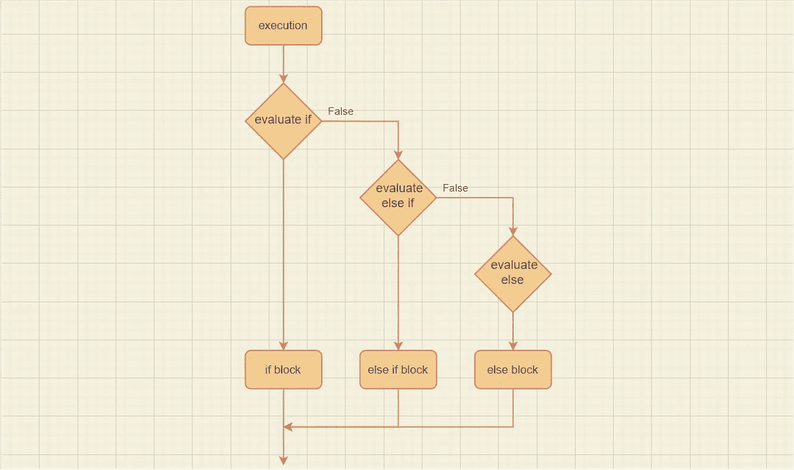
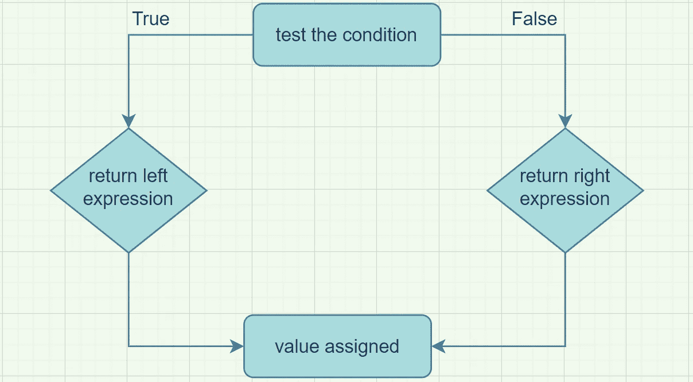

# 优雅高效地使用 If-Else 子句

> 原文：<https://towardsdatascience.com/elegant-and-efficient-usage-of-if-else-clauses-d41d3e88fe07?source=collection_archive---------2----------------------->

## 编程；编排

## 用优雅的 if-else 语句润色你的代码



作者图片

拿一张纸。去掉衔接手段(然而，因此……)。并阅读它。这还有意义吗？不要！同样的事情也适用于没有`if-else`语句的代码。

条件分支是一个基本的和强制性的编程概念。它标志着推理的转变。明智地利用条件可以得到简短、可维护和可读的代码。

也就是说，自从我开始写代码，我就把尽可能多的时间花在阅读高级和入门级程序员的代码上。在这里，我列出了我用来揭开高级代码神秘面纱的轨迹。

[](/how-to-read-advanced-code-even-if-you-are-a-beginner-4ce0e1087859) [## 即使是初学者，如何阅读高级代码

### 揭开任何代码神秘面纱的实用步骤

towardsdatascience.com](/how-to-read-advanced-code-even-if-you-are-a-beginner-4ce0e1087859) 

令人惊讶的是，我读得越多，就越发现经验丰富的程序员和初学者之间的差距有多大。高年级学生写的代码让你大吃一惊。大三写的代码让你想揪头发。

结论:**不是语法的问题，是如何使用语法的问题。**

在这篇文章中，我将尽我所知解释伟大的程序员如何利用`if-else`子句的力量。

请记住:

> 不是剑的问题，是剑客的问题。

# 控制流工具:如果

教授:“*大家好，今天我们要来看看一个重要的流程控制工具:If-else 语句。所以，请注意这个流程图。*”

我:*“哦，又来了，流程图。该睡觉了。Zzzz"* 。

我必须承认。我不是一个专心的学生。每当教授们的演讲超过 15 分钟，我就开始打哈欠。通过流程图的解释只会加速这个过程。那是一个让我付出巨大代价的错误。

流程图是表示工作流程的最简单的方式。我确信，一旦你理解了`if-else`流程图，你的大部分条件分支问题就会迎刃而解。

它看起来是这样的:



作者在[diagrams.net](https://app.diagrams.net/)创建的 if 语句流程图

从图中可以看出`if-else`是如何解读的相当容易。这意味着一旦一个`if`表达式被评估为*真*，它的主体被执行，其余的子句被忽略。

完全理解流程图是至关重要的，因为遗漏一个细节可能会让你失去高效的`if`语句。不要担心，我们将在这篇文章的后面详细讨论这个问题。

# 两组程序员

我已经编码 5 年多了。在这段时间里，我意识到有两种类型的程序员。

*   那些使用冗长松散的`if-else`语句的人。
*   那些使用简洁干净的`if-else`语句。

具有讽刺意味的是，虽然*【如何】*与*不同，但**【为什么】*却是一样的。为了证明这一点，我们将使用上述两种观点来解决下面的问题。

**问题:**

你有一堆信用卡。你想把它们归类为“可能是万事达卡”、“可能是维萨卡”或无效卡。Visa 卡的第一个数字必须是 4，总共有 16 或 13 个数字。万事达卡必须有 51，52 …直到 55 作为前两位，总共 16 位。

第一组样本代码:

```
ccn = 13
fd = 4
**if** ccn == 16 **and** (fd == 51 **or** fd == 52 **or** fd == 53 **or** fd == 54 **or** fd == 55):
    print("Maybe MASTERCARD")
**elif** (ccn == 13 **or** ccn == 16) **and** fd == 4:
    print("Maybe VISA")
**else**:
    print("INVALID")
```

输出:

```
>>> Maybe VISA
```

第二组样本代码:

```
ccn = 13
fd = 54
**if** ccn == 16 **and** 51 <= fd <= 55:
    print("Maybe MASTERCARD")
**elif** ccn **in** [13, 16] **and** fd == 4:
    print("Maybe VISA")
**else**:
    print("INVALID")
```

输出:

```
>>> Maybe VISA
```

您可以看到，虽然两个代码执行相同的任务，但每个代码的编写方式都不同。第一个是冗长和不优雅的。二是简洁，有感染力。这是你想写的那种`if-else`式的陈述。但是怎么做呢？

1.  学习数理逻辑。斯坦福大学的这个班级是一个很好的参考
2.  每当有多个值要检查时，就使用数组
3.  阅读有经验的程序员代码

我很确定如果你遵守这三条规则。你会写出更好的`if-else`陈述。

# 三元运算符

三元算子字面意思是由三部分组成的算子。这些部分是:

*   中间部分:一个条件
*   左半部分:条件为真时要执行的表达式
*   右半部分:否则要执行的表达式

这转化为下面的流程图:



作者在[diagrams.net](https://app.diagrams.net/)创建的三元运算符流程图

就像标准的`if-else`语句一样，您可以使用三元运算符来编写平面和嵌套表达式。

**平**

```
<expression1> **if** <condition> **else** <expression2>
```

**嵌套**

```
<expression1> **if** <condition1> **else** <expression2> **if** <condition2> **else** <expression3> .... **if** <condition(N-1)> **else** <expressionN>
```

看到一些程序员滥用这个操作符只是因为它比显式的`if-else`语句短，这让我很难过。

使用三元运算符的主要原因是为赋值提供一个简洁的媒介。因此，当涉及多个分支时，最好使用标准的控制流工具，而不是使用运算符来编写嵌套表达式。

引用 Python [PEP 308](https://www.python.org/dev/peps/pep-0308/) 条件表达式提案的作者:

> “Python 的一个设计原则是，每当对该走哪条路有疑问时，就倾向于保持现状。”

# 高效的 if-else 语句

你有没有想过串行`if`块和`if-else`块有什么区别？例如:

```
**if** <expression1>:
   statement1
**if** <expression2>:
   statement2
       .
       .
       .
**if** <expressionN>:
    statementN
```

并且:

```
**if** <expression1>:
   statement1
**elif** <expression2>:
   statement2
       .
       .
       .
**elif** <expressionN>:
    statementN
```

第一次向我介绍条件表达式时，我并没有完全理解`if-else`流程图。结果，我总是使用连续的`if`语句，因为它们总是产生预期的结果。我错了！

在串行`if`块中，所有条件都被测试，而在`if-else`块中，一旦`if`表达式评估为*真*，剩余的测试被一起跳过。这种方法被称为*断路器行为*，比串行`if`块更有效。

也就是说，当你处理一个只需要满足一个条件的案例时，使用`if-else if-else`语句。

# 逃离嵌套 if-else 语句的噩梦

也许我们已经到了这篇文章最重要的部分。嵌套的`if-else`语句。

条件子句的过度使用有时会导致深度嵌套的`if-else`语句，这是编程社区所不赞同的，并被认为是一个糟糕的设计。

幸运的是，有一种方法可以战胜嵌套的`if-else`语句。那是**的决策表。**

了解如何充分利用决策表。我们将编写以下代码，比较 200 的数字:

(此示例是来自[教程要点](https://www.tutorialspoint.com/python/nested_if_statements_in_python.htm)的代码的修改版本)

输出:

```
Value is less than 200
Between 100 and 150
It is 125
```

哦，天哪，我们有一堆嵌套在 3 层上的`if-else`语句。这是一段糟糕的代码，因为它冗长，难以阅读和维护。

让我们试着弄平这些嵌套的`if-else`语句。

但是在我们这样做之前，为了最大化学习成果，我们要分析并记下上面代码的注释。

1.  第一级`if`将数字分类为大于或小于 200
2.  第二级`if`将数字分为小于 100、小于 150、大于或等于 150
3.  第三级`if`打印与条件中的数字相等的数字

现在，我们将把 remarque n 2 和 n 3 注入到单独的函数中。`print_interval(val)`和`print_value(val)`。然后我们将两个嵌套的`if-else`块存储在两个*字典*(决策表)中。第一个按照备注 2 进行分类的人。第二个按照备注 3 打印号码。

一切就绪后，我们得到以下代码:

输出:

```
Value is less than 200
Between 100 and 150
It is 125
```

正如你所看到的，我们通过使用*函数*和*决策表*成功去除了嵌套的`if-else`语句。这使得我们能够编写设计更好的代码。可读性和可维护性。

最终，你可以看到我们混合使用了*条件语句、函数、字典*而不是滥用`if-else`。然而，如何操作这些取决于你和你自己的判断。

# 外卖食品

为了帮助您将条件分支技能提高到一个新的水平，我们讨论了`if-else`语句的陷阱以及如何绕过它们。以上信息是 5 年编程的成果。尽管如此，编程是一个无限的领域。这就是为什么他们说:

> “编程是一盘棋。简单易学。很难掌握”。