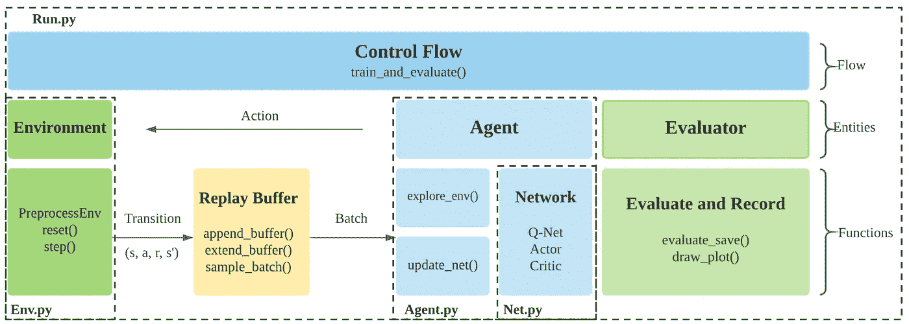
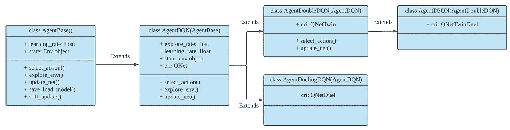
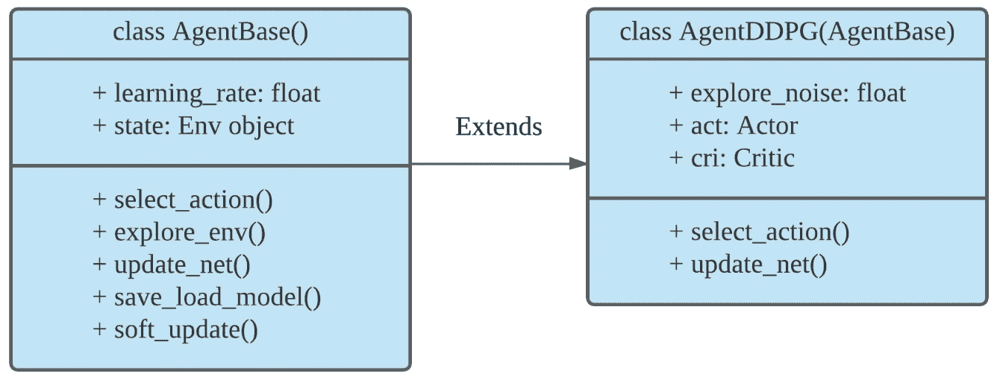
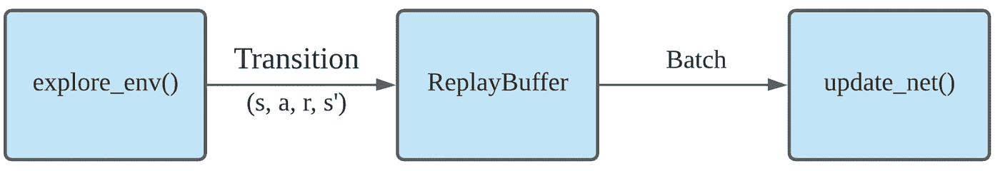

# ElegantRL-Helloworld:一个轻量级且稳定的深度强化学习库

> 原文：<https://towardsdatascience.com/elegantrl-a-lightweight-and-stable-deep-reinforcement-learning-library-95cef5f3460b?source=collection_archive---------15----------------------->

## [实践教程](https://towardsdatascience.com/tagged/hands-on-tutorials)

## 24 小时学会实现深度强化学习算法。

由、Steven Li 和 Zeng 撰写的这篇文章描述了 ElegantRL 库( [Twitter](https://twitter.com/softraeh) 和 [Github](https://github.com/AI4Finance-LLC/ElegantRL) )。

# **ElegantRL 的优势**

强化学习(RL)的一句话总结:在 RL 中，智能体通过不断地与环境交互，以试错的方式进行学习，在不确定性下做出顺序决策，并在探索(新领域)和开发(使用从经验中学到的知识)之间实现平衡。

深度强化学习(DRL)在解决对人类具有挑战性的现实世界问题方面具有巨大潜力，例如自动驾驶汽车、游戏、自然语言处理(NLP)和金融交易。从 AlphaGo 的成功开始，各种 DRL 算法和应用正在以颠覆性的方式出现。ElegantRL 库使研究人员和从业人员能够对 DRL 技术的颠覆性“设计、开发和部署”进行流水线作业。

要展示的图书馆在以下几个方面具有“优雅”的特点:

*   **轻量级**:核心代码少于 1000 行，如[教程](https://github.com/AI4Finance-LLC/ElegantRL/tree/master/elegantrl/tutorial)。
*   **高效**:性能堪比 [Ray RLlib](https://github.com/ray-project/ray) 。
*   **稳定**:比[稳定基线 3](https://github.com/DLR-RM/stable-baselines3) 更稳定。

ElegantRL 支持最先进的 DRL 算法，包括离散和连续算法，并在 Jupyter 笔记本中提供用户友好的教程。

ElegantRL 在 Actor-Critic 框架下实现 DRL 算法，其中一个代理(也称为 DRL 算法)由 Actor 网络和 Critic 网络组成。由于代码结构的完整性和简单性，用户能够容易地定制他们自己的代理。

# **概述:文件结构和功能**



图一。 **Agent.py** 中的代理使用 **Net.py** 中的网络，并通过与 **Env.py** 中的环境交互，在 **Run.py** 中接受训练。【*图片由作者提供。】*

ElegantRL 的文件结构如图 1 所示:

1.  **Env.py** :它包含代理与之交互的环境。

*   一个用于体育馆环境修改的预处理类。
*   以自己创建的股票交易环境为例进行用户定制。

2. **Net.py** :网络有三种类型:

*   Q-Net，
*   演员网络，
*   评论家网络，

每个都包括一个用于继承的基础网络和一组用于不同算法的变体。

3. **Agent.py** :包含不同 DRL 算法的代理。

4. **Run.py** :为训练和评估过程提供基本功能；

*   参数初始化，
*   训练循环，
*   评估员。

作为高层次的概述，文件之间的关系如下。初始化 **Env.py** 中的一个环境和 **Agent.py** 中的一个代理。代理由 **Net.py** 中的演员和评论家网络构成。在 **Run.py 中的每个训练步骤中，**代理与环境交互，生成存储在重放缓冲区中的转换。然后，代理从重放缓冲区获取转换来训练其网络。每次更新后，评估器评估代理的性能，如果性能良好，则保存代理。

# **DRL 算法的实现**

本部分分别介绍 **DQN 系列**算法和 **DDPG 系列**算法。每个 DRL 算法代理都遵循从其基类开始的层次结构。



图二。DQN 级数算法的继承层次。【*图片由作者提供。】*

如图 2 所示，DQN 级数算法的继承层次如下:

*   标准的 DQN 代理。
*   **AgentDoubleDQN** :继承自 AgentDQN 的一个双 DQN 代理，具有两个 Q 网，用于减少高估。
*   **AgentDuelingDQN** :具有不同 Q 值计算的 DQN 代理，继承自 AgentDQN。
*   **agend 3 qn**:AgentDoubleDQN 和 AgentDuelingDQN 的组合，继承自 AgentDoubleDQN。

```
class **AgentBase**:
    def **init**(self); 
    def **select_action**(states); # states = (state, …) 
    def **explore_env**(env, buffer, target_step, reward_scale, gamma);
    def **update_net**(buffer, max_step, batch_size, repeat_times); 
    def **save_load_model**(cwd, if_save);
    def **soft_update**(target_net, current_net);class **AgentDQN**: 
    def **init**(net_dim, state_dim, action_dim); 
    def **select_action**(states); # for discrete action space 
    def **explore_env**(env, buffer, target_step, reward_scale, gamma); 
    def **update_net**(buffer, max_step, batch_size, repeat_times);
    def **save_or_load_model**(cwd, if_save);class **AgentDuelingDQN**(AgentDQN): 
    def **init**(net_dim, state_dim, action_dim);class **AgentDoubleDQN**(AgentDQN): 
    def **init**(self, net_dim, state_dim, action_dim);
    def **select_action**(states); 
    def **update_net**(buffer, max_step, batch_size, repeat_times);class **AgentD3QN**(AgentDoubleDQN): # D3QN: Dueling Double DQN 
    def **init**(net_dim, state_dim, action_dim);
```



图 3。DDPG 级数算法的继承层次。【*图片作者。】*

如图 3 所示，DDPG 级数算法的继承层次如下

*   AgentBase :所有演员评论家代理的基类。
*   **AgentDDPG**:DDPG 代理，继承自 AgentBase。

```
class **AgentBase**: 
    def **init**(self); 
    def **select_action**(states); # states = (state, …) 
    def **explore_env**(env, buffer, target_step, reward_scale, gamma);
    def **update_net**(buffer, max_step, batch_size, repeat_times);
    def **save_load_model**(cwd, if_save);
    def **soft_update**(target_net, current_net);class **AgentDDPG**(AgentBase): 
    def **init**(net_dim, state_dim, action_dim);
    def **select_action**(states);
    def **update_net**(buffer, max_step, batch_size, repeat_times);
```

在构建 DRL 代理时应用这样的层次有效地提高了**轻量级**和**有效性**。用户可以以类似的流程轻松设计和实现新的代理。



图 4。培训代理的数据流。【*图片作者。]*

基本上，代理有两个基本功能，数据流如图 4 所示:

*   **explore_env()** :它允许代理与环境交互，并为训练网络生成转换。
*   **update_net()** :先从重放缓冲区取一批变迁，然后用反向传播训练网络。

# 培训渠道

培训代理的两个主要步骤:

1.  **初始化**:

*   超参数 *args* 。
*   *env = PreprocessEnv()* :创建一个环境(以 OpenAI gym 格式)。
*   *agent = AgentXXX()* :为 DRL 算法创建代理。
*   *evaluator = Evaluator()* :评估并存储训练好的模型。
*   *buffer = ReplayBuffer()* :存储过渡。

2.然后，**训练过程**由 while-loop 控制:

*   *agent.explore_env(…):* 代理在目标步骤中探索环境，生成转换，并将它们存储到 ReplayBuffer 中。
*   *agent.update_net(…)* :代理使用 ReplayBuffer 中的批处理更新网络参数。
*   *evaluator . evaluate _ save(…)*:评估代理的表现，保留最高分的训练好的模型。

当条件满足时，while 循环将终止，例如，达到目标分数、最大步数或手动中断。

# **测试示例:**两足步行器-v3

[两足步行机-v3](https://gym.openai.com/envs/BipedalWalker-v2/) 是机器人学中的一项经典任务，它执行一项基本技能:移动。目标是让 2D 两足步行机走过崎岖的地形。双足步行器被认为是连续动作空间中的一个困难任务，能够达到目标奖励的 RL 实现只有少数。

# 步骤 1:安装 ElegantRL

```
pip install git+https://github.com/AI4Finance-LLC/ElegantRL.git
```

# 步骤 2:导入包

*   **优雅的**
*   **OpenAI Gym** :开发和比较强化学习算法的工具包。
*   py bullet Gym:open ai Gym MuJoCo 环境的开源实现。

```
from **elegantrl.run** import *from **elegantrl.agent** import AgentGaePPOfrom **elegantrl.env** import PreprocessEnvimport gymgym.logger.set_level(40) # Block warning
```

# 步骤 3:指定代理和环境

*   **args.agent** :首先选择一个 DRL 算法，用户可以从 agent.py 中的一组代理中选择一个
*   **args.env** :创建并预处理环境，用户可以自定义自己的环境，也可以从 env.py 中的 OpenAI Gym 和 PyBullet Gym 中预处理环境

```
args = Arguments(if_on_policy=False)args.agent = AgentGaePPO() # AgentSAC(), AgentTD3(), AgentDDPG()args.env = PreprocessEnv(env=gym.make(‘BipedalWalker-v3’))args.reward_scale = 2 ** -1 # RewardRange: -200 < -150 < 300 < 334args.gamma = 0.95args.rollout_num = 2 # the number of rollout workers (larger is not always faster)
```

# 步骤 4:培训和评估代理

训练和评估过程在函数**train _ and _ evaluate _ _ multi processing(args)**内部，参数为 **args** 。它包括 DRL 的两个基本目标:

*   代理人，
*   环境。

训练的参数是:

*   批量大小，
*   目标 _ 步骤，
*   奖励 _ 尺度，
*   伽马等。

用于评估的参数还有:

*   break_step
*   随机种子等。

```
train_and_evaluate__multiprocessing(args) # the training process will terminate once it reaches the target reward.
```

# 第五步:测试结果

达到目标奖励后，我们为每个状态生成帧，并将帧合成为视频结果。从视频来看，步行者能够不断地向前移动。

```
for i in range(1024):
    frame = gym_env.render('rgb_array')
    cv2.imwrite(f'{save_dir}/{i:06}.png', frame)

    states = torch.as_tensor((state,), dtype=torch.float32, device=device)
    actions = agent.act(states)
    action = actions.detach().cpu().numpy()[0]
    next_state, reward, done, _ = env.step(action) if done:
        state = env.reset()
    else:
        state = next_state
```


图 5。(左)随机行动的特工。(右)ElegantRL 里的一个 PPO 特工。【*图片作者。]*

看看这个 BipedalWalker-v3 演示的代码。