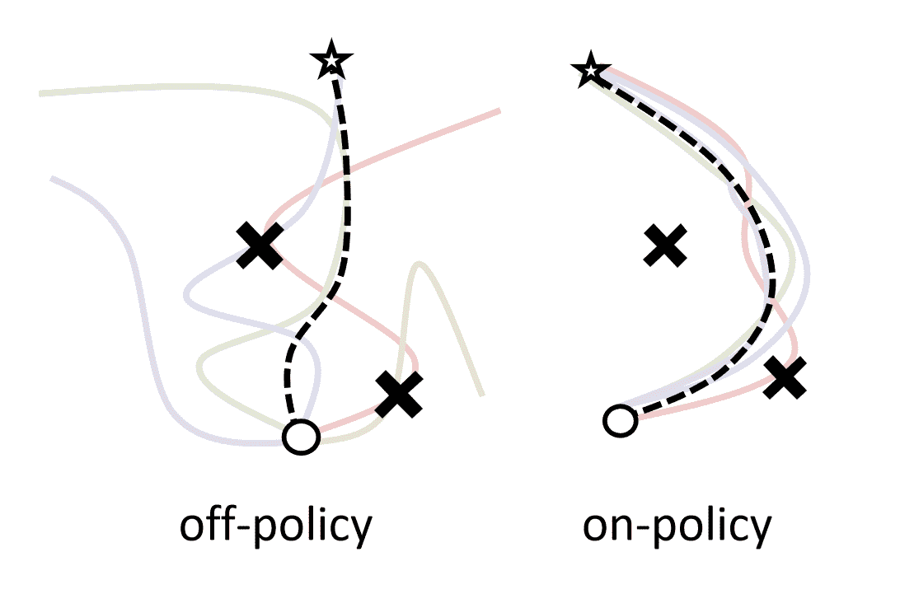
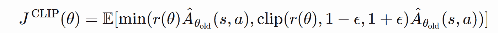
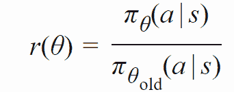
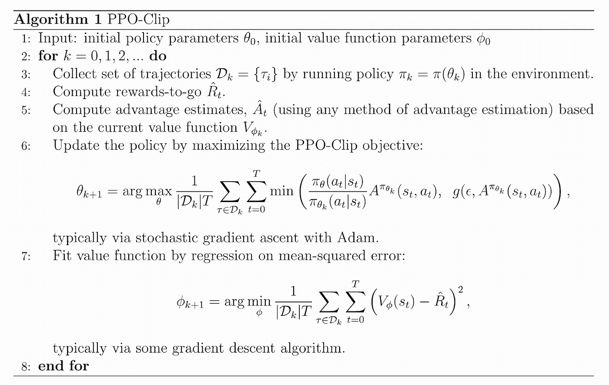
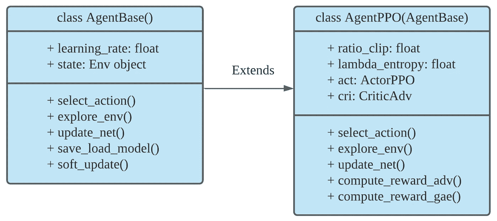
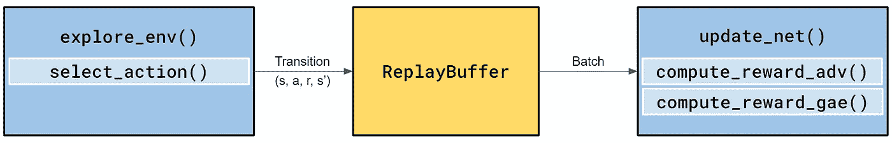

# ElegantRL:掌握 PPO 算法

> 原文：<https://towardsdatascience.com/elegantrl-mastering-the-ppo-algorithm-part-i-9f36bc47b791?source=collection_archive---------11----------------------->

## [思想和理论](https://towardsdatascience.com/tagged/thoughts-and-theory)

## 近似策略优化算法(PPO)教程

由和 Steven Li 撰写的这篇文章描述了在 ElegantRL 库中实现近似策略优化(PPO)算法( [Twitter](https://twitter.com/softraeh) 和 [Github](https://github.com/AI4Finance-LLC/ElegantRL) )。PPO 算法是目前广泛使用的深度学习算法，被许多研究机构和学者选为基准。

请查看 ElegantRL 库的介绍性[文章](/elegantrl-a-lightweight-and-stable-deep-reinforcement-learning-library-95cef5f3460b)。

# **PPO 算法概述**

**符合策略和不符合策略的算法有什么区别？**



图一。策略外和策略内算法。【图片由作者提供。]

对于基于策略的算法，它们根据当前策略网络生成的转换来更新策略网络。评论家网络将在普通环境下对当前策略网络做出更准确的价值预测。

对于非策略算法，它们允许使用旧策略的转换来更新当前策略网络。因此，可以重新利用旧的转换，如图 1 所示，点分散在由不同策略生成的轨迹上，这提高了采样效率并减少了总的训练步骤。

**有没有一种方法可以提高基于策略的算法的样本效率而不损失它们的好处？**

答案是**是的**。作为一种基于策略的算法，PPO 利用替代目标来避免新策略与旧策略相差太远，从而解决了样本效率问题。代理目标是 PPO 的关键特征，因为它既规范了策略更新，又支持训练数据的重用。

标准 PPO 有一个削波目标函数[1]:



PPO-Clip 只是在概率比项上加了一个剪辑区间，剪辑成一个范围[1 — ϶，1 + ϶]，其中϶是一个超参数。则该函数取原始比率和限幅比率之间的最小值。

**目标函数内部的概率比项是什么？**

由于替代目标，PPO 允许使用梯度上升的多个时期，而不会与旧政策相差太远。在这种情况下，我们必须使用重要性抽样估计器来补偿训练数据分布和当前策略状态分布之间的差距，这是概率比项:



# **伪代码和算法细节**

对于策略正则化，标准 PPO 算法使用剪切目标；对于策略参数化，标准 PPO 算法在连续动作空间使用高斯分布，在离散动作空间使用 Softmax 函数。此外，它遵循一个经典的演员-评论家框架，由四个部分组成:

*   **初始化**:初始化相关属性和网络。
*   **探索**:通过演员网络与环境的互动来探索过渡。
*   **计算**:计算相关变量，如比率项、确切报酬、估计优势等。
*   **更新**:基于损失函数和目标函数更新演员和评论家网络。

接下来，我们解释 Alg。1 以逐步的方式:



Alg。1:PPO-Clip 算法。来自[1]。

*   **步骤 1** :初始化演员和评论家网络以及参数϶.
*   **第三步**:从最新的演员策略中收集一批轨迹。
*   **第 4 步**:计算每一步中每条轨迹的确切奖励。
*   **步骤 5** :根据最新的 Critic 网络计算每个轨迹的估计优势。
*   **步骤 6** :通过在 K 个时期内最大化 PPO-CLIP 目标函数，通过随机梯度上升来更新演员的参数。当我们开始运行优化时，旧策略与更新后的策略相同，这意味着比率为 1。随着我们不断更新政策，该比率将开始触及上限。
*   **步骤 7** :通过均方误差的梯度下降来更新评论家的参数。

# **雅致放射中的多酚氧化酶**

ElegantRL 中的每个 DRL 代理都遵循其基类的层次结构，以实现轻量级编码。在本节中，我们将讨论标准 PPO 在 **agent.py** 中的设计和实现。



图二。PPO 算法的继承层次结构。【图片由作者提供。]

# **代理库:**

基本上，大多数经典的 DRL 算法都继承自 AgentBase 类。在 AgentBase 内部，我们初始化公共的**变量**:

*   学习率
*   环境状态

和**功能**:

*   **select_action()** :给定环境的状态，获取相应的动作。
*   **explore_env()** :使用 **select_action()** ，通过演员网络和环境之间的交互来探索过渡。
*   **update_net()** :从 ReplayBuffer 中采样批量数据，更新神经网络。
*   **save_load_model()** :保存模型用于训练，或者加载模型用于推理。
*   **soft_update()** :如果需要，从当前网络更新目标网络。

# AgentPPO:

在 AgentPPO 中，我们添加了一些与 PPO 算法相关的新变量，并重新定义了几个函数。

我们遵循 Alg 中的步骤。1、先讨论变量(第 1 行):

*   **ratio_clip** :限幅后的区间范围。
*   **λ_ 熵**:探测参数。
*   **act = ActorPPO()** :演员网。
*   **cri = CriticAdv()** :评论家网。



图 3。AgentPPO 中的函数结构。【图片由作者提供。]

我们在 Alg 中拆分 for 循环(第 3–7 行)。1 分为两个核心功能:

*   **explore_env** (第 3 行):使用 Actor-network 来探索环境，并将结果转换存储到 ReplayBuffer 中。

```
def **explore_env**(self, env, buffer, target_step, reward_scale, gamma):
    """    
    :**env:** RL training environment.
    :**buffer:** Experience Replay Buffer.
    :**int target_step:** explored target_step number of step in env.
    :**float reward_scale:** scale reward, 'reward * reward_scale'.
    :**float gamma:** discount factor, 'mask = 0.0 if done else gamma'.
    :**return** **int target_step:** collected target_step number of step in 
                             env.
    """
    **# empty the ReplayBuffer (necessary for on-policy algorithm)**
    buffer.empty_buffer_before_explore()
    actual_step = 0 

    while actual_step < target_step:
        **# for each trajectory, reset the environment at beginning** 
        state = env.reset() for _ in range(env.max_step): 
            **# get the action from Actor network**
            action, noise = self.select_action(state) 

            **# step the environment forward based on the action**
            next_state, reward, done, _ = env.step(np.tanh(action))

            ... other = (reward * reward_scale, 0.0 if done else gamma,      
                     *action, *noise) 
            **# append transition into ReplayBuffer**
            buffer.append_buffer(state, other) ... state = next_state return actual_step
```

*   **update_policy** (第 4–7 行):从 ReplayBuffer 中抽取一批转换，并计算更新网络的目标。

```
def **update_net**(self, buffer, _target_step, batch_size, repeat_times=4): 
   """
   **:buffer:** Experience replay buffer.
   :**int target_step:** explore target_step number of step in env.
   **:int batch_size:** sample batch_size of data for Stochastic
                    Gradient Descent        
   **:float repeat_times:** the times of sample batch.
   **:return float obj_a:** the objective value of Actor.
   **:return float obj_c:** the objective value of Critic.
   """ ... with torch.no_grad(): 
       ** # sample data from ReplayBuffer**
        buf_reward, buf_mask, buf_action, buf_noise, buf_state = 
        buffer.sample_all() 
        **# compute the expected value from critic network**
        bs = 2 ** 10 
        buf_value = torch.cat([self.cri(buf_state[i:i + bs]) for i 
                    in range(0, buf_state.size(0), bs)], dim=0) 
        **# compute the log of probability, which is the denominator 
        of the probability ratio in the surrogate objectve**
        buf_logprob = -(buf_noise.pow(2).__mul__(0.5) + 
                      self.act.a_std_log +                              
                      self.act.sqrt_2pi_log).sum(1) 
       ** # compute the reward and advantage**
        buf_r_sum, buf_advantage = self.compute_reward(buf_len, 
        buf_reward, buf_mask, buf_value)    ... for _ in range(int(repeat_times * buf_len / batch_size)):  
        **# randomly select a transition**
        indices = torch.randint(buf_len, size=(batch_size,), 
                  requires_grad=False, device=self.device) 
        state = buf_state[indices] 
        action = buf_action[indices] 
        r_sum = buf_r_sum[indices] 
        logprob = buf_logprob[indices] 
        advantage = buf_advantage[indices]        **# compute the new log of probability and probability ratio**
        new_logprob = self.act.compute_logprob(state, action)      
        ratio = (new_logprob — logprob).exp() 

        **# compute the surrogate objective with entropy exploration**
        obj_surrogate1 = advantage * ratio 
        obj_surrogate2 = advantage * ratio.clamp(1 — 
                         self.ratio_clip, 1 + self.ratio_clip) 
        obj_surrogate = -torch.min(obj_surrogate1, 
                        obj_surrogate2).mean() 
        obj_entropy = (new_logprob.exp() * new_logprob).mean()
        obj_actor = obj_surrogate + obj_entropy * 
                    self.lambda_entropy         **# compute the loss of Critic network**
        value = self.cri(state).squeeze(1)
        obj_critic = self.criterion(value, r_sum) 

        **# update Actor and Critic networks together**
        obj_united = obj_actor + obj_critic / (r_sum.std() + 1e-5)
                     self.optimizer.zero_grad() 
        obj_united.backward()
        self.optimizer.step()     return self.act.a_std_log.mean().item(), obj_critic.item()
```

# 培训渠道

培训代理的两个主要步骤:

1.  **初始化**:

*   超参数 *args* 。
*   *env = PreprocessEnv()* :创建一个环境(以 OpenAI gym 格式)。
*   *agent = AgentXXX()* :为 DRL 算法创建一个代理。
*   *evaluator = Evaluator()* :评估并存储训练好的模型。
*   *buffer = ReplayBuffer()* :存储过渡。

2.然后，**训练过程**由 while 循环控制:

*   *agent.explore_env(…):* 代理浏览目标步骤中的环境，生成转换，并将它们存储到 ReplayBuffer 中。
*   *agent.update_net(…)* :代理使用 ReplayBuffer 中的批处理更新网络参数。
*   *evaluator . evaluate _ save(…)*:评估代理的表现，保留最高分的训练好的模型。

当条件满足时，while 循环将终止，例如，达到目标分数、最大步数或手动中断。

# 测试示例

欢迎感兴趣的用户测试 [PPO 单档](https://github.com/AI4Finance-Foundation/ElegantRL/blob/master/eRL_demo_PPOinSingleFile.py)。

[1] OpenAI 在深度 RL 中加速旋转，[近端策略优化](https://spinningup.openai.com/en/latest/algorithms/ppo.html#id3)。

[2]政策梯度算法， [PPO](https://lilianweng.github.io/lil-log/2018/04/08/policy-gradient-algorithms.html#ppo) 。