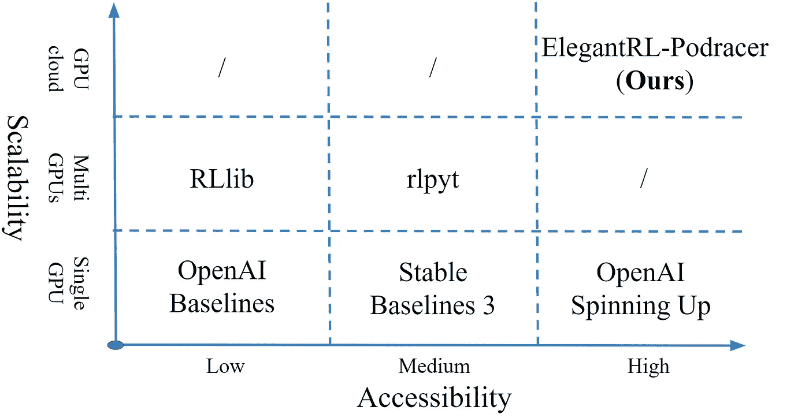
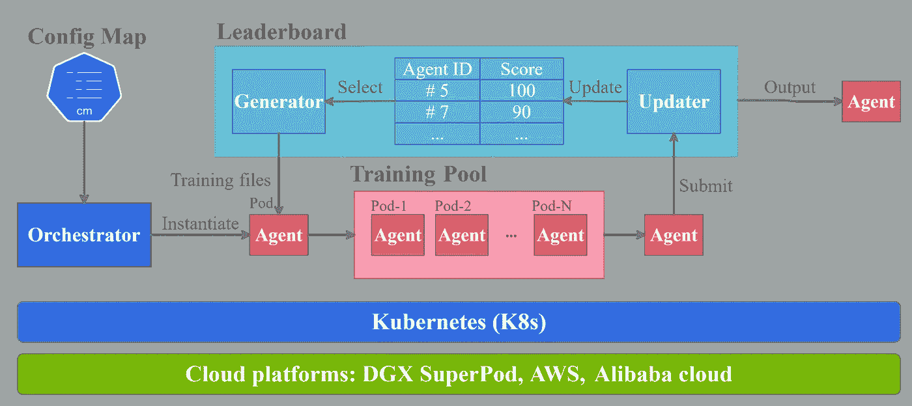
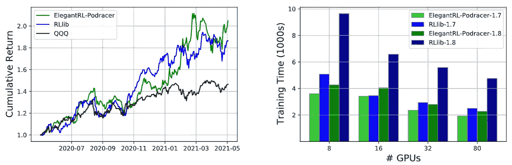
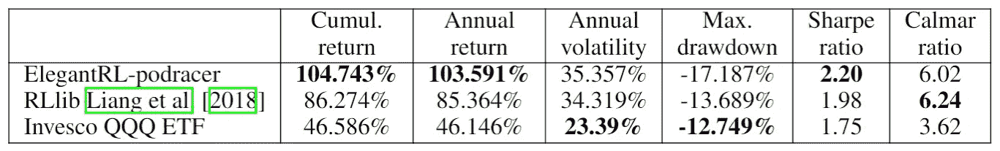

# ElegantRL-Podracer:一个可扩展的弹性库，用于云原生深度强化学习

> 原文：<https://towardsdatascience.com/elegantrl-podracer-scalable-and-elastic-library-for-cloud-native-deep-reinforcement-learning-bafda6f7fbe0?source=collection_archive---------9----------------------->

代理作为 pod 在云上进行赛车比赛。

> “当风暴结束时，你可以看到我的赛车。我在造一辆赛车！”
> 
> —阿纳金·天行者

我们正在云上构建一个赛车，使用<https://github.com/AI4Finance-Foundation/ElegantRL>**。**

*如果你想看一个在几分钟内训练一个强大的深度强化学习(DRL)代理的“赛车”，这篇文章就是为你准备的。ElegantRL-Podracer 是一个云解决方案，支持数百万个 GPU 核心在多个级别上进行大规模并行 DRL 训练。让我们开始吧！*

*Steven Li 和[刘晓阳](https://twitter.com/XiaoYangLiu10)的这篇文章描述了我们最近在**neur IPS 2021:Deep RL Workshop**上发表的论文 **ElegantRL-Podracer:可扩展和弹性的云原生深度强化学习库**。*

*<https://arxiv.org/abs/2112.05923>  

代码、文档和演示可在 [GitHub](https://github.com/AI4Finance-Foundation/ElegantRL) 上获得。

<https://github.com/AI4Finance-Foundation/ElegantRL>  

# 最大的挑战是什么？

eep 强化学习平衡了(未知领域的)探索和(当前信息的)利用，在游戏和机器人控制等应用中彻底改变了学习和驱动。

然而，数据收集的**成本**仍然是在复杂和动态环境的现实世界问题中更广泛采用 DRL 的一个主要挑战。因此，一个引人注目的解决方案是在数百甚至数千个 GPU 上进行大规模并行训练，比如数百万个 GPU 核心。

现有的 DRL 框架/库要么缺乏可伸缩性，要么学习难度很大。

图 1:不同框架/库的比较。【图片由作者提供。]

# 设计原则

我们开发了一个用户友好的开源库，利用云资源来训练 DRL 特工。该库强调以下设计原则:

*   **横向扩展**:可伸缩性和弹性。
*   **效率**:低通信开销，大规模并行模拟，代理的健壮性。
*   **可达性**:轻量化、定制化。

# 基于锦标赛的集成方案

ElegantRL-Podracer 采用基于锦标赛的合奏方案，在数百甚至数千个 GPU 上编排训练过程，安排排行榜和具有数百个代理(pod)的训练池之间的交互。

图 2:基于锦标赛的合奏方案。【图片由作者提供。]

与进化策略(es)不同，在进化策略中，一群智能体经过几代进化，我们的基于锦标赛的集成方案并行地异步更新智能体，这将群体进化和单个智能体学习解耦。基于锦标赛的合奏方案的关键是**排行榜**和**训练池**之间的互动。

1.  一个**编排器**实例化一个新的代理(pod)并将其放入一个训练池。
2.  一个**生成器**用从排行榜中选择的网络和优化器初始化一个代理(pod)。
3.  一个**更新器**在一个代理被训练一定步数或一定时间后，根据其表现确定是否将代理插入排行榜以及在何处插入。

直觉上，ElegantRL-Podracer 的灵感来自凯文·凯利的书《失控》(失控)(嵌套层次结构的优点)和《从愚蠢的事情中变得聪明》。对于低级别的训练，ElegantRL-Podracer 通过采用面向硬件的优化来实现嵌套层次。对于高级调度，我们从数百个弱代理中获得一个智能代理。

# **云原生范式**

ElegantRL-Podracer 通过实现微服务和容器化的开发原则，遵循了云原生范式。我们将培训过程分解为五个组成部分，并将其作为微服务来实施，例如，编排者、排行榜、工作者、学习者和评估者。我们使用 [Kubernetes](https://kubernetes.io/) (K8s)作为资源管理器，并在独立的容器和 pod 中执行每个流程。

# ElegantRL-Podracer 的特点

**可扩展的并行性**:ElegantRL-pod racer 的多级并行性带来了很高的可扩展性。

*   **代理并行**:训练池中的代理是并行的，因此可以扩展到大量。并行代理的异步训练也可以减少代理对代理的通信频率。
*   **学习者并行**:一个 agent 采用多个学习者并行训练神经网络，然后融合网络的参数得到一个结果 agent，而不是使用分布式 SGD。这种通过网络参数的模型融合涉及低频通信，因为融合过程发生在一个时期的末尾。
*   **Worker parallelism** :一个代理利用多个部署工作器并行地对转换进行采样。

**弹性资源分配**:弹性对于云级应用至关重要，因为它有助于用户适应云资源的变化，防止资源过度供应和供应不足。ElegantRL-Podracer 可以通过使用 orchestrator 来监控可用的计算资源和当前的训练状态，从而灵活地分配代理(pod)的数量。

**面向云的优化** : ElegantRL-Podracer 在 GPU 上共同定位微服务，以加速数据收集和模型训练的并行计算。对于数据传输和存储，ElegantRL-Podracer 将数据表示为张量以加快通信速度，并在 GPU 的连续内存上分配共享重放缓冲区以提高寻址速度。

# 实验

金融是 DRL 算法的一个充满希望和挑战的现实世界应用。作为例子，我们将 ElegantRL-podracer 应用于股票交易任务，以展示其在量化金融中的潜力。

我们的目标是训练一个 DRL 代理人来决定在股票市场上在哪里交易，在什么价格交易，在什么数量交易，因此问题的目标是最大化期望收益和最小化风险。我们将股票交易任务建模为马尔可夫决策过程(MDP)，如 [FinRL](https://github.com/AI4Finance-Foundation/FinRL) 所示。我们遵循一个训练-回溯测试管道，并将数据集分为两组:从 2016 年 1 月 1 日到 2020 年 5 月 25 日的数据用于训练，从 2020 年 5 月 26 日到 2021 年 5 月 26 日的数据用于回溯测试。

这些实验是在一个 [DGX SuperPOD 云](https://www.nvidia.com/en-us/data-center/dgx-superpod/)中使用 NVIDIA DGX-2 服务器执行的，这是一个云原生基础设施。

左图:分钟级别纳斯达克 100 指数成份股的累积回报率(初始资本
$1，000，000，交易成本 0.2%)。右图:使用 ElegantRL-podracer 和 RLlib 的模型快照，达到累积
奖励 1.7 和 1.8 的训练时间(挂钟时间)。

纳斯达克 100 成份股的分钟级数据的股票交易表现。

就累积回报而言，所有 DRL 代理人都可以取得比市场基准更好的表现，证明了算法的有效性。我们观察到 ElegantRL-podracer 累计回报 104.743%，年回报 103.591%，夏普比率 2.20，大幅跑赢 RLlib。然而，ElegantRL-podracer 在回溯测试期间不像 RLlib 那样稳定:它实现了最大 35.357%的年波动率。下降-17.187%，卡尔马尔比率为 6.02。这种不稳定性有两个可能的原因:

1.  股票交易环境中的报酬设计主要与累积收益相关，从而导致代理人较少顾及风险；
2.  ElegantRL-podracer 在 2021–03 年前后持有大量资金，自然导致了更大的滑盘。

我们比较了不同数量的 GPU 上的训练性能，即 8、16、32 和 80。我们测量所需的训练时间，以获得两个分别为 1.7 和 1.8 的累积回报。无论是 ElegantRL-podracer 还是 RLlib，随着 GPU 数量的增加，达到相同的累积回报所需的训练时间更少，这直接证明了云计算资源在 DRL 训练上的优势。对于 80 个 GPU 的 ElegantRL-podracer，需要(1900，2200)才能达到 1.7 和 1.8 的累积回报。拥有 32 个和 16 个 GPU 的 ElegantRL-podracer 需要(2400、2800)和(3400、4000)才能实现相同的累积回报。它展示了 ElegantRL-podracer 的高可扩展性和我们面向云的优化的有效性。对于使用 RLlib 的实验来说，增加 GPU 的数量并不会带来很大的加速。

# 确认

这项研究使用了由 [IDEA 研究院](https://idea.edu.cn/en)提供的 GPU 云平台的计算资源。

# 参考

[1]埃里克·梁、理查德·廖、罗伯特·西原、菲利普·莫里茨、罗伊·福克斯、肯·戈德堡、约瑟夫·冈萨雷斯、迈克尔·乔丹和扬·斯托伊察。RLlib:分布式强化学习的抽象。在 *ICML* ，第 3053–3062 页。PMLR，2018。

[2] J .舒尔曼、f .沃尔斯基、普拉富拉·德里瓦尔、亚历克·拉德福德和奥列格·克里莫夫。近似策略优化算法。 *ArXiv* ，abs/1707.06347，2017。

[3] Erik Wijmans、Abhishek Kadian、Ari S. Morcos、Stefan Lee、Irfan Essa、Devi Parikh、M. Savva 和 Dhruv Batra。DD-PPO:从 25 亿帧中学习近乎完美的 pointgoal 导航仪。在 *ICLR* ，2020 年。

[4]凯文·凯利。*失控:新生物文明的崛起*。艾迪森-韦斯利朗曼出版公司，1994 年。*