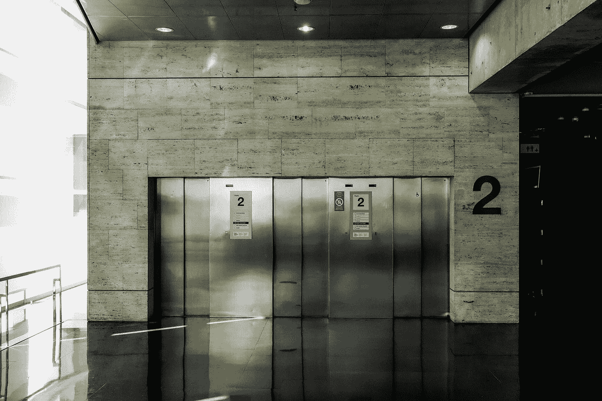
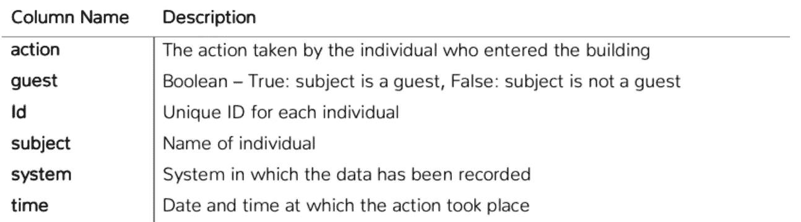
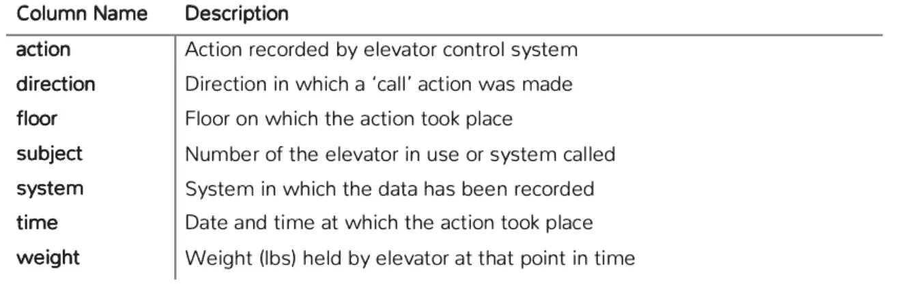
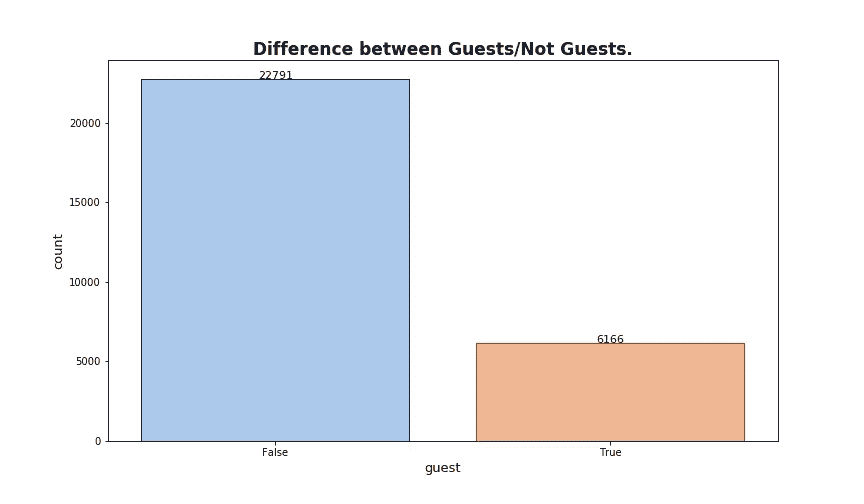
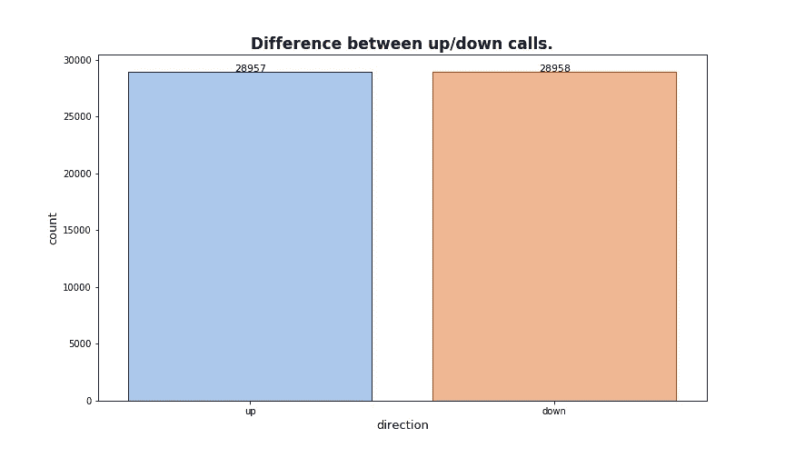
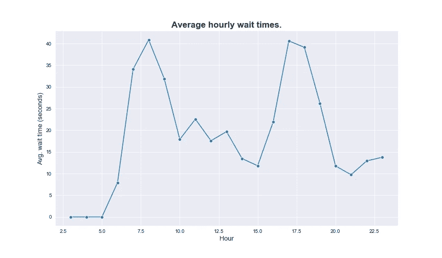
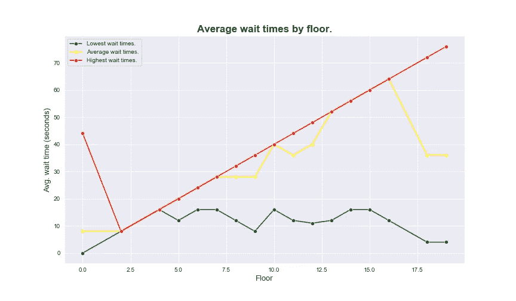
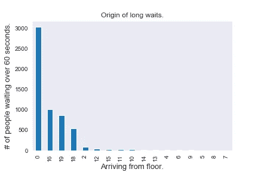
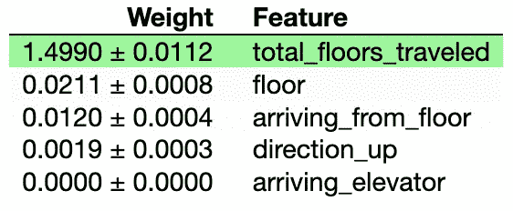

# 电梯优化问题。

> 原文：<https://towardsdatascience.com/elevator-optimization-in-python-73cab894ad30?source=collection_archive---------23----------------------->



照片由 [Izhak 机构](https://unsplash.com/@izhak?utm_source=medium&utm_medium=referral)在 [Unsplash](https://unsplash.com?utm_source=medium&utm_medium=referral) 上拍摄

最近，我完成了一个小项目，该项目要求我为优化纽约市一座理论上的高层建筑内的电梯配置提出建议。该建筑的结构如下。进入大楼的人必须首先通过安全系统刷卡，然后他们可以按下电梯呼叫按钮，等待电梯到来。我被要求回答 5 个主要问题，并且只花几个小时完成这项任务。主要问题是:

> 概述电梯等待时间的当前状态。
> 
> 算出总的平均等待时间。
> 
> 确定一天中等待时间较长的时间。
> 
> 确定电梯等待时间较长的楼层。
> 
> 就如何优化电梯配置以减少等待时间提供至少 2 条建议。

为了回答这些问题，提供了 2 个数据集。一个名为`people.csv`的记录了所有进入大楼安全系统的刷卡记录，另一个名为`simulation.csv`的记录了我们拥有数据的几个月中每部电梯的状态和操作。这座 20 层的大楼里总共有 4 部电梯。



people.csv 的数据描述



simulation.csv 的数据描述

## 初步见解。

我想做的第一件事是把我的头缠在数据上，这样我就可以开始思考如何回答提供的问题。正是在这一阶段，我确定只有 4 部电梯，而且这栋建筑有 20 层。我还了解到，为了正确地分析数据，我需要将每个数据集中的日期时间列从字符串转换为 pandas 日期时间。

```
simulation['time'] = pd.to_datetime(simulation['time'], infer_datetime_format=True)
people['time'] = pd.to_datetime(people['time'], infer_datetime_format=True)
```

还有一些额外的列没有在数据描述中列出，但是存在于数据集中，其中包括`date`、`date_daily`，这两个列似乎都是从`time`列派生出来的，因此我决定删除它们。

```
simulation.drop(['date','date_daily', 'weight'], axis=1, inplace=True)
```

为了查看谁进入了大楼，我使用了 seaborn countplot 来可视化进入大楼的客人/非客人的总数。



## 更深入的分析。

我想弄清楚大厅里的人刷卡进入后需要多长时间才能呼叫电梯。为了做到这一点，我需要对一个人去电梯的路径做一个假设。我假设在进入大楼的安全系统后，一个人的下一个动作是点击呼叫按钮。

为了解决这个问题，我使用了 [pd.merge_asof](https://pandas.pydata.org/pandas-docs/stable/reference/api/pandas.merge_asof.html) ，它类似于一个左连接，但是它不是匹配精确的键，而是匹配最近的键。在我们的例子中，我们希望将距离 0 楼(大厅)最近的*呼叫*与记录的进入大楼的时间最接近。我们希望进行反向搜索，因为刷卡时间会早于所有人进入大楼的电梯呼叫时间。然后，我们可以从*刷卡时间*中减去电梯*呼叫*时间，以确定一个人刷卡后按下呼叫按钮的时间。

现在我们知道，人们刷过安检后，平均需要 28 秒才能按下电梯呼叫按钮。有人按下呼叫按钮的最长时间是 59 秒。在确定这一点之后，我决定将我的精力集中在`simulation.csv`文件上，它有每个电梯的日志，可以用来回答主要的问题。

要确定电梯完成每一次行程需要多长时间，搜索*系统(呼叫)*动作的数据，然后找到下一次电梯门在呼叫按钮被按下的楼层打开的时间。然后，我可以找出哪部电梯到达了，用了多长时间，以及电梯从哪一层到达。这些信息足以回答主要问题。

通过从到达的电梯楼层中减去电梯呼叫楼层，我们可以看到电梯运行了多少层到达呼叫它的人，这可以提供一些关于长于平均等待时间的见解。

现在我们应该有足够的数据来分析和回答主要问题。

## 一天中电梯等待时间较长的时间？



正如我们在上面看到的，等待时间在工作日的开始(上午 7:30 后不久)和结束(下午 4:00-7/8:00)时达到峰值。午餐时间还有两个较小的峰值，在上午 11:00 到下午 1:00 之间。

## 在哪个楼层等待时间更长？



上图绘制了第一、第二和第三分位数的等待时间。红线描述了那些等待电梯时间最长的人等待的时间。从这个图表中我们可以看到，在高峰时段，你在大楼里越高，你等电梯的时间就越长。为什么？进一步的分析表明，那些等待时间最长的人是在等待电梯运行超过 10 层才能到达他们那里。这意味着电梯默认是通往大厅的。

下图显示，对于等待电梯到达时间超过 60 秒的电梯用户，到达的电梯通常来自大厅(0 层)。



## 总体平均等待时间？

```
wait_times = simulation.loc[simulation['action'] == 'call']overall_average = wait_times.wait_time.mean()
```

电梯的总平均等待时间为 25.69 秒。

## 描述性机器学习。

作为一种健全性检查并满足我自己的好奇心，我对数据拟合了一个线性回归模型，然后计算了特征的[排列重要性](https://www.kaggle.com/dansbecker/permutation-importance)，以确定模型认为对电梯等待时间影响最大的因素是什么。事实证明,`total_floors_traveled`对电梯使用者等待的时间影响最大。



## 建议。

为了减少我们虚拟建筑中电梯的等待时间，我建议首先在用户刷过安检时触发电梯呼叫大厅，这将节省一些乘坐电梯到达目的地楼层的时间。

我的第二个建议是实施一个[固定分区公共分区系统](http://vedantmisra.com/elevator-algorithms/)的一些变体，这是一种配置，其中每个电梯被给予它自己的优先分区。由于我们总共有 4 部电梯，我们将有 4 个不同的区域，一部指定的电梯将服务于这些区域。

我还建议至少配置一部电梯默认到顶层(19 层)，以减少等待电梯到达的时间超过一分钟。这些改变将减少大楼占用者与等待相关的投诉。

## 下一步。

这是一个值得思考和尝试“解决”的非常有趣的项目。我对此做了很少的研究，欢迎在评论中对我的方法和方式提出批评。在完成这个迭代之后，我发现有大量的工作致力于解决这个问题。我觉得特别有趣的一本书是鲁提菲·谢里夫·吉娜·巴尼的《电梯交通手册理论与实践》。在我读完这本书之后，重访这个项目并应用我所学到的东西/看看我可以在哪里改进我最初的分析会很有趣。

在那之前，编码快乐！

你可以在这里找到这个项目的数据和笔记本。