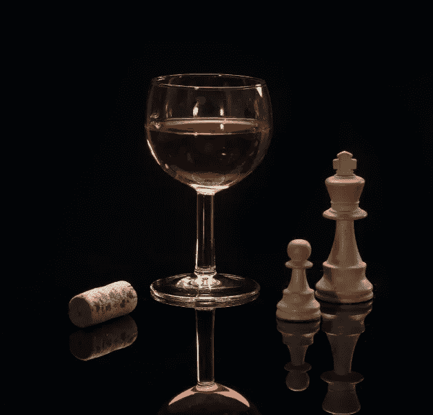
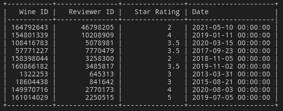
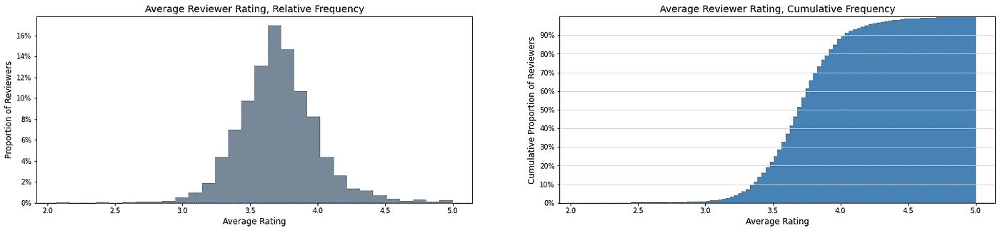
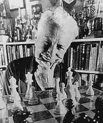
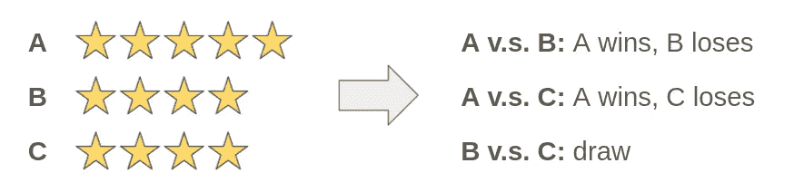
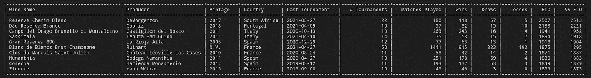
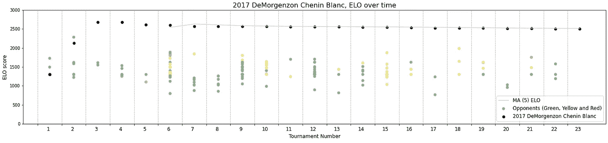
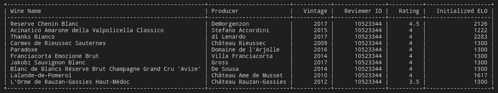
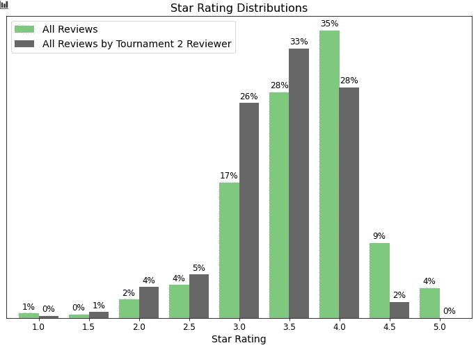
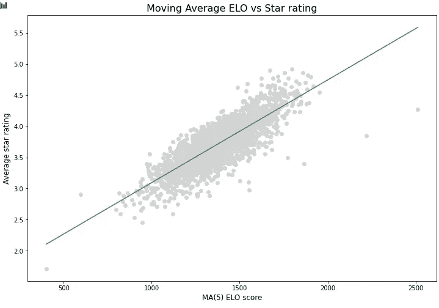

# ELO:新的葡萄酒评级系统

> 原文：<https://towardsdatascience.com/elo-a-new-rating-system-for-wine-386e4bee56c0?source=collection_archive---------19----------------------->

## 探索星级评定系统的替代方案

无论是优步、亚马逊还是谷歌，如今我们到处都可以看到星级评定。尽管它们很简单，但却存在一系列问题。举几个例子:极端观点在平均评级中的过度表现，不同用户对什么构成好/坏的不同标准，以及现有评级的锚定效应。

Vivino 平台上的葡萄酒评级使用了相同的星级逻辑。在这篇文章中，我们将探索是否可以借鉴国际象棋游戏来为葡萄酒提供一种新的评级方式:一种用于评估国际象棋选手相对实力的 ELO 分数的变体。

图片由[兰迪父亲](https://unsplash.com/@randyfath)在 [Unsplash](https://unsplash.com/photos/yLWg7NS450U) 上拍摄

你可以在这里找到所有相关代码[的详细分析。](https://github.com/RoaldSchuring/WineELO)

## 葡萄酒的星级评定

为了展示这一新评级系统的潜力，我们将使用由荷兰 2500 名 Vivino 用户的约 100 万条葡萄酒评论组成的数据集。

原始数据集，NL Vivino 用户对大约 100 万种葡萄酒的评级

仔细看看每个评论者的平均星级开始揭示这个系统的一些固有问题:最重要的是，评论者不同地应用评级尺度。

在我们的数据集中，10%最挑剔的评论家给葡萄酒的平均分数低于 3.3/5 分。10%最慷慨的评论者平均给出 4.0/5 分以上。

虽然更挑剔的评论家可能只是喝了更差的酒，但这不太可能解释这里的全部差异。有理由认为，有些人只是简单地给予葡萄酒较低或较高的平均评级。这对葡萄酒的平均评级也有影响。如果一款葡萄酒被慷慨的个人评级，那么它会比被更挑剔的用户评级得到更高的分数。

## 关于 ELO 的一个简短说明

Arpad Elo 的图片，[公共领域](https://commons.wikimedia.org/wiki/File:Arpad_Elo.jpg)

ELO 记分法最初是由匈牙利棋手和物理学家阿帕德·埃洛发明的。几十年来，他开发的评分系统一直被用于模拟零和游戏中的技能水平，最著名的是国际象棋。基础知识:

两个国际象棋选手之间的评分差异可以作为谁更有可能赢得比赛的指标。每场比赛都有三种可能的结果:赢、平或输。比赛结束后，双方球员的分数会根据实际结果和预期结果进行调整。玩家通常会参加由几场比赛组成的比赛。在这里，分数更新通常在锦标赛进行之后进行，而不是在每场单独的比赛之后进行。

ELO 评级系统有多种实施方式，每种方式的参数都略有不同。出于我们这里练习的目的，我们使用美国国际象棋联合会(USCF)使用的最新 [(2021)规则](http://www.glicko.net/ratings/rating.system.pdf)，在[国际象棋比赛](https://pypi.org/project/chessratings/)包中实现。

重要的是，未分级的玩家(即，尚未参加任何锦标赛)初始的 ELO 分数为 1300，在 USCF 分级体系中，任何 26 岁以上的成年人都是如此。

## 从星级到 ELO

我们可以通过将一个**评论家在某一天**的个人评分框定为一场零和比赛，然后计算每种葡萄酒的 ELO 分数，来规避困扰星级评定系统的许多问题。为此，我们提出以下定义:

*   玩家:来自特定年份的特定葡萄酒
*   **匹配**:由特定的个人在特定的一天对两种葡萄酒进行面对面的零和比较
*   **锦标赛**:特定个人在特定日期进行的面对面比赛的集合

上面的结构依赖于一个基本假设，即我们可以相信一个人在给定的一天对葡萄酒进行评级的方式是非常一致的。如果他们在某一天给一种酒 4 星，给另一种酒 5 星，我们可以推断出 5 星的酒比 4 星的好。

一个假设的例子来说明:

这三场面对面的**比赛**可以组合在一起参加**锦标赛**。我们将按时间顺序进行这些比赛。尚未参加锦标赛的葡萄酒(**玩家**)将获得新初始化的 ELO 分数(1300)，而过去参加过锦标赛的葡萄酒将以其最近的 ELO 分数进入新的锦标赛。

当我们举办每场锦标赛时，我们会将每场比赛的信息存储在一个查找表中。这将允许我们研究葡萄酒 ELO 分数如何随着时间的推移而演变。

为了更好地管理我们可能在 ELO 分数中看到的一些波动，我们将另外计算移动平均(MA) ELO 分数，具有 5 场比赛的跟踪窗口。这将使我们能够消除个别比赛对任何一种葡萄酒的影响，同时保留葡萄酒分数随时间上升或下降的能力。

## 结果

让我们来看看结果吧！在将我们的葡萄酒评级建模为赢/平/输并如上所述运行锦标赛后，我们可以根据马 ELO 分数计算排名靠前的葡萄酒。为了减少小样本葡萄酒的影响，我们已经剔除了所有参加少于 10 场比赛或少于 25 场比赛的葡萄酒(根据美国国际象棋联合会关于什么构成“既定”玩家评级的指导方针)。

10 大葡萄酒由马评分

丁丁！我们有一个赢家:2017 年南非斯泰伦博斯的 DeMorgenzon 的陈宁勃朗葡萄酒。这款葡萄酒已经参加了 22 场有效的比赛，并与其他 180 款葡萄酒竞争。它的移动平均 ELO 目前是 2513，远远高于我们数据中的其他葡萄酒。

我们可以仔细看看这个 ELO 分数是如何计算的，以及它是如何随着时间的推移而演变的:

绿色 Chenin Blanc 获胜|黄色=平局|红色=失败

上图中的黑点显示了我们的 DeMorgenzon Chenin Blanc 在 22 场比赛中的 ELO 分数。彩色圆点表示与之竞争的葡萄酒的 ELO 分数，圆点的颜色表示面对面比赛的结果:(绿色=赢，黄色=平，红色=输)。

在锦标赛 1 中，它被初始化为 ELO 1300，这是所有未评级葡萄酒的情况。绿点表示它赢得了那场比赛的所有比赛，并且它的分数随后增加到大约 2100 分。

让我们仔细看看它参加的第二届锦标赛，以便更深入地了解星级和 ELO 之间的动态关系。下面是锦标赛 2 的参与者，以及他们的星级和初始 ELO 分数(他们和 ELO 一起参加锦标赛)。

我们的 DeMorgenzon Chenin Blanc 以 2126 的 ELO 成绩参加了第二届锦标赛。它面对的是 10 种其他的葡萄酒，从 ELO 的 1222 年到 2283 年不等。它获得了 4.5 的星级，高于比赛中其他任何一款葡萄酒。这意味着 10 场全胜，ELO 又一次跃升至 2683 场。

这里的评级跳升(+553)很高，有几个具体原因——首先，我们的获奖葡萄酒进入锦标赛之前只参加了 11 场比赛(锦标赛 1)，并赢得了所有这些比赛。由于样本量小，加上连续获胜，根据美国国际象棋联合会的规范，ELO 算法使用“特殊评级”公式来计算评级调整。这种特殊的评级公式会导致更高的潜在跳跃，因为它用于玩家评级存在更多不确定性的情况。跳跃如此之大的第二个原因是因为我们的 Chenin Blanc 击败了 2017 年的 di Lenardo Thanks Bianco，这是一款当时 ELO 得分为 2283 的葡萄酒。击败比自己强大得多的玩家可以在 ELO 获得更大的飞跃。

在我们继续之前，让我们看看负责锦标赛 2 的评审。我们的获奖葡萄酒被评为 4.5 星——但对于这位评论家来说，这有多特别呢？

该输出表明锦标赛 2 中的评论者(总共 1100+评级)通常比我们数据集中的大多数其他评论者更悲观。他们的评分只有 2%是 4.5 星或以上。相比之下，当查看我们的*完整*数据集中的约 100 万条评论时，我们可以看到 13%的葡萄酒评级为 4.5 星或以上。锦标赛 2 评论者在所有评论中给出的平均评级进一步支持了这一论点:3.4 颗星。回顾我们在本笔记本前面的审核者分布，此人属于 20%最关键的审核者。

我们可以得出结论，星级系统并没有真正公正地评价我们的 Chenin Blanc 在锦标赛 2 中的评价。另一方面，我们的 ELO 分数能够控制审核者的“严格性”，因此，由于这种出色的表现，分数大幅提升(在这种情况下为+553)。

我们的 ELO 评分还控制了个体评审者随时间应用评级的差异(变得更宽松/更严格)。它只要求评论者在同一天与他们的葡萄酒评级*保持一致。与葡萄酒整个生命周期的平均星级相比，ELO 能够更好地捕捉葡萄酒质量随时间的变化。随着葡萄酒的陈年和变得更好/更坏，它的 ELO 将会进化来反映这一点。*

看来我们的 ELO 评分确实解决了困扰星级评定的一些基本问题。那么应该怎么用呢？让我们后退一步，看看我们数据集中所有*葡萄酒的 ELO 和星级之间的差异。*

我们可以看到有(不出所料！)平均星级和移动平均 ELO 之间有很强的正相关性。五星评级较高的葡萄酒通常有较高的马 ELO 评分。

我们可以用一条最佳拟合线(绿线)来表示哪些葡萄酒的表现超过了它们的平均星级。这条线右边的葡萄酒的马 ELO 分数比它们的平均 5 分等级要高。这些葡萄酒可能会因简单的平均星级而服务不足，这可能会掩盖其相对于平台上其他葡萄酒的质量。2017 年的 DeMorgenzon Chenin Blanc 就是一个最好的例子:上图中最右边的点，MA ELO 远远高于其星级。

再举几个例子:

*   **2018 年来自葡萄牙 Dao 的 Cadiz 的 Dao Reserva Branco**:2221 的马 ELO，平均星级 3.9
*   **2018 克林根堡 sptburgbunder by Weingut Stadt 克林根堡来自德国弗兰肯**:1866 年的马，平均星级 3.4
*   **2015 Serego Alighieri Poderi del Bello Ovile Toscana 来自意大利托斯卡纳的马西**:1773 年的马 ELO，平均星级 3.5

## 总结想法

在我们取消星级评定之前，先给你提个醒。

星级系统很容易理解。对于普通用户来说，ELO 会不那么直观。它也有 5 分等级量表所没有的缺点。重要的是，ELO 对 1 星和 5 星的评价与 3 星和 3.5 星的评价没有任何不同。偏好的大小被零和更简单的方案所取代。

尽管如此，我们还是证明了 ELO 提供的价值是普通五星评级所不能提供的。以上是展示这一指标潜力的探索性练习，但只是开始触及皮毛。使用的样本量(荷兰前 2500 名 Vivino 用户的葡萄酒评论)非常小。有效锦标赛的定义(由同一用户在同一天对葡萄酒进行评级)也非常严格，可以放宽，以允许更多葡萄酒之间的直接比较。随着更多的数据和一些潜在假设的微调，ELO 分数将变得更加稳健和可靠。我们可能还想开发一种 ELO 算法，其参数是专门为葡萄酒评级而构建的，而不是使用国际象棋世界中实现的精确系统。

那么现在这样如何:除了平均星级之外，让我们使用 ELO *。并在此过程中发现一些隐藏的宝石，如 2017 年德莫根松储备白诗宁！*