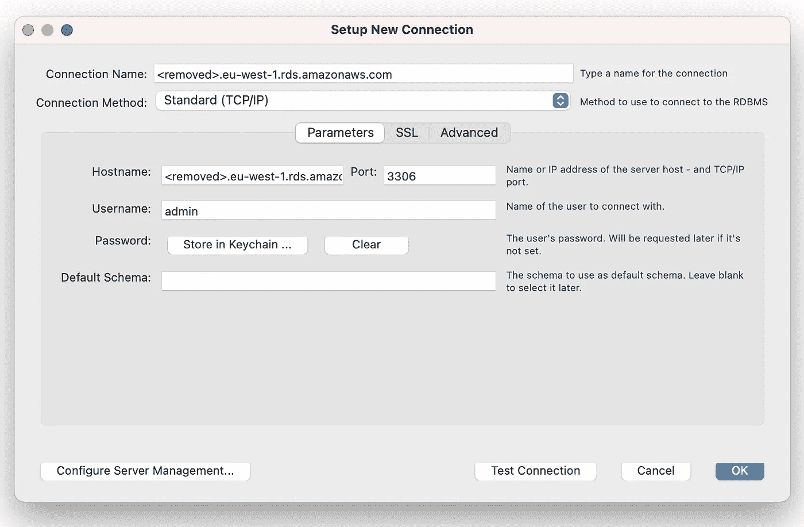
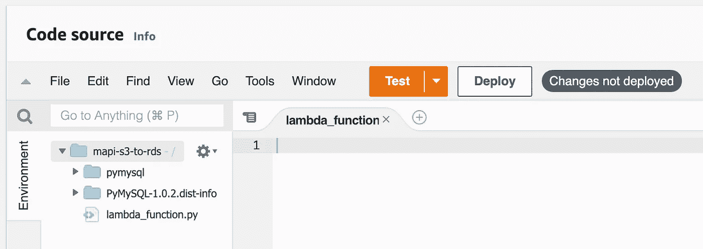
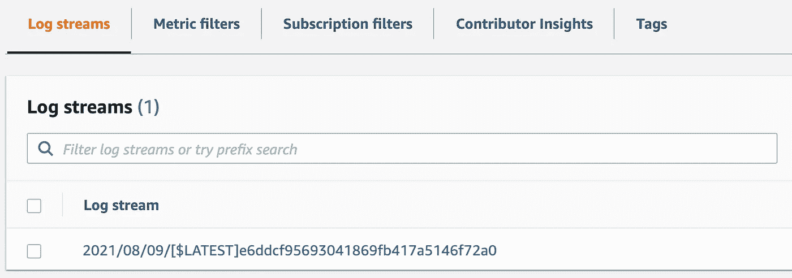
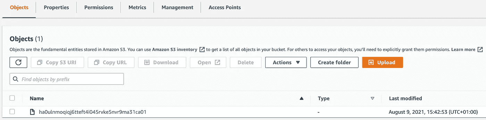
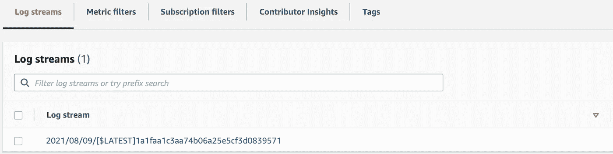
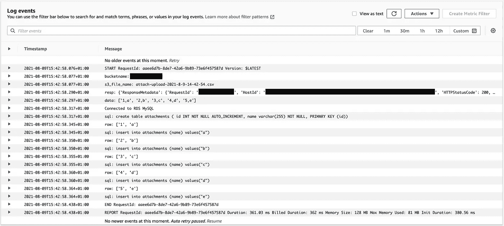
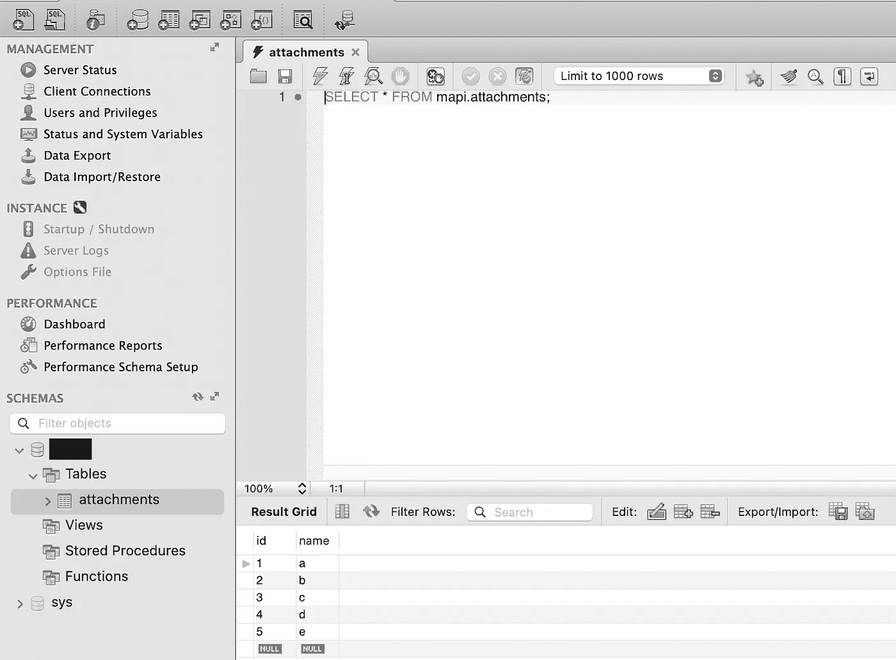

# 电子邮件附件摄取

> 原文：<https://towardsdatascience.com/email-attachment-ingestion-fc4994c42819?source=collection_archive---------17----------------------->

## AWS 中的电子邮件附件自动化工作流


[活动发起人](https://unsplash.com/@campaign_creators?utm_source=medium&utm_medium=referral)在 [Unsplash](https://unsplash.com?utm_source=medium&utm_medium=referral) 上的照片

我一直在和另一位媒体作家[本·奥尔尼](https://medium.com/u/2efb976b82b3?source=post_page-----fc4994c42819--------------------------------)谈论电子邮件附件自动化。处理电子邮件附件并将数据存储在数据库中的操作。我想看看我是否能让它在亚马逊 AWS 上工作。

我在 Medium 上发现了一篇非常棒的文章，描述了如何将电子邮件附件放入亚马逊 S3 网站。这是一篇写得非常好的文章，非常清楚地描述了这个过程。我认为只有几个部分可以更详细地介绍，比如亚马逊 IAM 中的角色，可能还有更多关于安全性的内容。

[](/extract-email-attachment-using-aws-624614a2429b) [## 使用 AWS 提取电子邮件附件

### 创造了使用 AWS 执行 ETL 操作的可能性

towardsdatascience.com](/extract-email-attachment-using-aws-624614a2429b) 

上面这篇文章详细解释了推理和过程。由于显而易见的原因，我不打算再谈论它了。我将提供一个快速总结和一些改进，然后描述下一部分。

在亚马逊 S3[中存储原始附件](https://aws.amazon.com/s3)很棒，但这只是其中的一半。下一部分是如何在亚马逊 RDS 中处理和存储这些附件。这部分有点棘手，尤其是如果你想以一种安全的方式来做这件事。我设法让它工作，我将按照我认为最有意义的顺序告诉你每一步。我将在前进到下一部分之前，包括有用的验证，以确认每个“**构建块**”的工作。

这是我典型的分阶段设计解决方案的方式。这是一个相当复杂的端到端工作流程，因此确保每个步骤都能够独立工作非常重要，否则您会在结束时发现它不起作用，然后故障排除会变得更加复杂。

## 步骤 1:亚马逊 AWS IAM 角色

我喜欢在开始时创建服务角色。你在哪个阶段这样做并不重要，但我个人喜欢在需要的时候准备好。

登录 [AWS IAM](https://console.aws.amazon.com/iam) ，从菜单中选择“[角色](https://console.aws.amazon.com/iamv2/home#/roles)，然后选择“**创建角色**”。

附加以下内置策略:

*   CloudWatchFullAccess
*   AmazonRDSFullAccess
*   AmazonRDSDataFullAccess
*   亚马逊 3 完全访问
*   AWSLambdaVPCAccessExecutionRole
*   awslambdabasiceexecutionrole

这是一个非常宽松的角色，允许 Lambda 访问 CloudWatch、RDS、VPC 和 S3。它可以被多个项目使用。如果您在生产环境中部署这个解决方案，您将希望创建一个更具限制性的策略，只允许 Lambda 访问需要的内容。

点击“**下一步:标签**，然后点击“**下一步:回顾**”。

对于“**角色名**”，调用它的**RoleForLambdaToAWSServices**，然后“**创建角色**”。

## **步骤 2:创建我们的 S3 存储桶**

正如我上面提到的，我们需要两个 S3 水桶。一个用于传入的原始电子邮件和附件，另一个用于将附件移动到 Lambda 获取的 RDS 中。

你可以给这些桶起任何你喜欢的名字，但是我建议这样:

*   my bucket-附件
*   my bucket-已处理

“ **mybucket** ”应该是对你的描述。S3 存储桶需要是全球唯一的。

请登录 [AWS S3](https://console.aws.amazon.com/s3) 并立即创建您的两个桶。

## 第三步:创建我们的专用邮件服务器

为此，我们将使用 [AWS 工作邮件](https://console.aws.amazon.com/workmail)。这样做有很好的成本效益原因，如果你想知道背后的原因，请参考[原文](/extract-email-attachment-using-aws-624614a2429b)。

点击**创建组织**。

在**组织设置**下，您可以选择合适的选项。我选择了“**免费测试域**”(这个可以以后改)。对于“**别名**”，为您的组织/项目命名。例如“ **myorg** ”，然后点击“**创建组织**”。

创建完成后，打开你的新组织邮件服务器，点击“**用户**”。您将看到一个默认的“**管理员**”帐户，您无法删除该帐户。您需要添加一个新用户。

也许是这样的:

*   用户名:代理
*   名字:MyOrg
*   姓氏:代理人
*   显示名称:MyOrg 代理

这将创建一个新的电子邮件地址，“**agent@myorg.awsapps.com**”。这将是您发送带有处理附件的电子邮件的电子邮件地址。出于本教程的目的，它将接受来自任何人的带有任何附件的电子邮件。这带来了安全风险。一旦你做到了这一点，我建议添加过滤功能，只允许“T2”白名单中的“T3”被允许的发件人，也许还可以过滤一些附件的内容。这真的很重要，所以以后不要忽视它。

有几种方法可以做到这一点。在工作邮件服务器上过滤，通过登录“[](https://mapi.awsapps.com/mail)**”【agent@myorg.awsapps.com】账户过滤(用你的组织名称替换“ **myorg** ”)，或者在我们不久将讨论的 Lambda 函数中过滤。我会说 Lambda 函数将是我的首选方法，因为它给了我们最多的控制，但也许你会想做一个组合过滤。**

**亚马逊工作邮件每个用户每月 4.00 美元，包括每个用户 50 GB 的邮箱存储。您可以开始为多达 25 个用户提供 30 天的免费试用。**

## ****第四步:亚马逊简单电子邮件服务(SES)****

**我们现在有了由 [AWS WorkMail](https://console.aws.amazon.com/workmail) 提供的邮件服务器。通过部署 [AWS 工作邮件](https://console.aws.amazon.com/workmail)， [AWS SES](https://console.aws.amazon.com/ses) 将自动配置为处理域的传入邮件。**

**我们想在这里做一些有趣的事情，那就是添加一个电子邮件接收“规则集”来发送接收到的电子邮件的副本，并将其存储在我们的 [S3 桶](https://console.aws.amazon.com/s3)中。正如我之前提到的，可能类似于“ **mybucket-attachments** ”。如果您还没有这样做，请登录 [AWS S3](https://console.aws.amazon.com/s3) 并使用默认选项创建您的两个空桶。**

**点击 [AWS SES](https://console.aws.amazon.com/ses) 中**邮件接收**下的**规则集**。**

**点击**查看活动规则集**按钮。**

**在位置 1 应该有一个现有的规则，这就是处理 [AWS 工作邮件](https://console.aws.amazon.com/workmail)的传入电子邮件。我们想通过点击“**创建规则**来创建一个新的规则。**

**收件人应该是您的“**代理人**”电子邮件……例如“**agent@myorg.awsapps.com**”。点击**添加收件人**，然后**下一步**。**

****添加动作**应为“ **S3** ”:**

*   **S3 铲斗:**我的铲斗-附件**(或者你管它叫什么)**

**点击**下一步**。**

**您希望为您的规则命名，例如“myorg-email-to-s3-bucket ”。其他一切保持默认。**

**点击“**下一步**，然后“**创建规则**”。**

**如果一切按计划进行，你应该有两条规则。一个用于处理来自 [AWS 工作邮件](https://console.aws.amazon.com/workmail)的入站电子邮件，在位置 2 新创建的规则用于处理将原始电子邮件复制到 S3 存储桶。**

## **第五步:确认它工作到这一点！**

**给你的新邮箱地址“**agent@myorg.awsapps.com**”发送一封带有文本文件附件的邮件(这也适用于二进制附件，但用简单的 CSV 或文本文件更容易演示)。目前，邮件内容和附件内容并不重要。只是一些小而轻的东西来测试这个。**

**如果您登录 webmail，“**https://myorg.awsapps.com/mail**”并确认您在“**代理人**”邮箱中收到了该邮件。假设你也称你的用户为**代理**。**

## **步骤 6:使用 Lambda 向 S3 发送工作邮件**

**第一步是打开 [AWS Lambda](https://console.aws.amazon.com/lambda) 控制台，点击**创建功能**。通过 Scratch 选择**Author**，给你的函数起一个名字(比如 **email-to-s3-bucket** )，选择 **Python 3.8** 运行时。这是撰写本文时可用的最高 Python 版本。**

**展开“**更改默认执行角色**，选择“**使用现有角色**”，选择我们在开始时创建的角色。我把我的命名为“**RoleForLambdaToAWSServices**”。**

**点击**创建功能**。**

**在“**代码源**下，编辑“ **lambda_function.py** ”文件，替换为下面的代码。**

**我在两个地方修改了原始作者代码。我们没有将处理后的电子邮件保存在“ **mybucket-attachments** ”中，而是保存在我们的第二个 S3 存储桶“ **mybucket-processed** ”中。请确保将下面的“ **mybucket-processed** ”替换为您的目标 S3 铲斗。这一部分很重要，因为这将触发事件，以便稍后将 CSV 的内容摄入 RDS。**

```
s3.upload_file('/tmp/attach.csv', '**mybucket-processed**', 'attach-upload-' + timestamp + '.csv')
```

**我还加入了一个发件人白名单。这很重要，因为你不想处理来自每个人的邮件。**

```
# sender whitelist
if fromAddress not in ['[sender@domain.com](mailto:sender@domain.com)']:
    raise PermissionError(f'{fromAddress} not in whitelist!')
```

**只需将“**sender@domain.com**”替换为允许的发件人电子邮件地址列表。你可以删去这三行，但这是不可取的。事实上，在生产环境中，我也会对附件进行一些检查，以确认它们看起来是合法的。**

**Sandeep Madamanchi[的原始代码](https://medium.com/u/880221be771b?source=post_page-----fc4994c42819--------------------------------)**

**当你完成后，确保你的**部署**。**

## **步骤 7:配置 AWS S3 来使用我们新的 Lambda 函数**

**打开 [AWS S3](https://console.aws.amazon.com/s3) 控制台，点击“**铲斗**，打开我们的“ **mybucket-attachments** ”铲斗。**

**点击“**属性**，向下滚动到“**事件通知**，点击“**创建事件通知**”。**

*   **事件名称:"**创建对象**"**
*   **事件类型:"**放**"，"**贴**"**
*   **Lambda 函数:"**电子邮件转 s3 桶**"**

**点击**保存修改****

## **第八步:我们来测试一下！**

**从 Lambda 函数中的白名单地址发送一封电子邮件，附件为“**agent@myorg.awsapps.com**”。我推荐像基本 CSV 这样的小东西，只是为了验证它的工作。给它一个测试对象和身体，让这个变得有趣。**

1.  **如果你登录，“[**https://myorg.awsapps.com/mai**l](https://myorg.awsapps.com/mail)”你应该会看到你的邮件。**
2.  **打开 [AWS CloudWatch](https://console.aws.amazon.com/cloudwatch) ，然后打开**日志**，然后打开**日志组**。您应该看到 Lambda 函数的日志文件，“email-to-s3-bucket ”。打开它，确认你看到了你的电子邮件被接收和处理的日志。**
3.  **打开你的 AWS S3 桶。您应该在“ **mybucket-attachments** 中看到原始电子邮件，在“ **mybucket-processed** 中看到电子邮件附件。**

**如果这三项看起来都没问题，那么到目前为止你做得很好。我的已经工作了，我在我的“**my bucket-processed**”S3 桶中看到“**attach-upload-2021–8–23–1–59 . CSV**”。如果我打开附件，我可以看到我用电子邮件发送的 CSV 附件的内容。**

**我还尝试从一个不在白名单上的地址发送附件，我可以在 CloudWatch 日志中看到它被拒绝，因为发件人地址不在白名单上。我还确认了被拒绝的电子邮件没有保存在 S3 的任何一个桶中。**

## **步骤 9:准备 RDS 数据库安全组/访问列表**

**虽然您可以在创建 RDS 数据库实例时创建安全组，但我建议您提前创建。**

**打开 [AWS VPC](https://console.aws.amazon.com/vpc) 控制台，点击“**您的 VPCs** ”。请记下“ **IPv4 CIDR** ”。在我的例子中是“ **172.31.0.0/16** ”。**

**打开 [AWS EC2](https://console.aws.amazon.com/ec2) 控制台，点击**网络&安全**下的**安全组**。点击**创建安全组**。**

****基本详情:**
*安全组名称:acl-rds-mysql-in
*描述:acl-rds-mysql-in**

****入站规则("添加规则 1"):** *类型:MySQL/Aurora
*来源:MySQL
*目的地:MyIP**

****入站规则("添加规则 2"):** *类型:MySQL/Aurora
*来源:MySQL
*目的地:自定义
* **172.31.0.0/16 ←** 添加您的 VPC 子网**

**点击**创建安全组****

## **步骤 10:部署 RDS MySQL 实例**

**打开 [AWS RDS](https://console.aws.amazon.com/rds) 控制台，点击**创建数据库**。部署数据库时有许多配置选项，所以如果我没有提到什么，请假设您将配置选项保留为默认选项。**

****关闭数据库创建方法:** *标准创建**

****引擎选项:**
*引擎类型:MySQL

**模板**
*自由层**

****设置:**
*数据库集群标识符:附件
*主用户名:管理员
*检查:自动生成密码**

****DB 实例类:**
* db.t2.micro**

****连接:**
*虚拟私有云(VPC):默认 VPC
*公共访问:是(MySQL 工作台所需)
* VPC 安全组:选择现有的
—现有的 VPC 安全组:acl-rds-mysql-in(我们在步骤 9 中创建的)
—删除“默认”
*可用性区域:无首选项**

****数据库认证:**
*选择:密码认证**

****附加配置:**
*初始数据库名称:附件
*取消选中:启用自动备份
*取消选中:启用增强监控
*取消选中:启用删除保护**

**点击**创建数据库****

**创建数据库需要几分钟时间。如果您如上所述选择了“**自动生成密码**”，创建后会弹出一个对话框，提示“**查看连接详情**”。你需要注意这一点。如果您愿意，也可以在创建表单中设置自己的密码。**

## **步骤 11:下载并安装 MySQL Workbench**

**下载并安装 [MySQL 工作台](https://dev.mysql.com/downloads/workbench)。这是一个免费的 MySQL 桌面客户端，可以让你连接到你的数据库。安装后，您需要创建一个新的连接，并从上面的“**查看连接详细信息**”中输入详细信息。**

****

**作者图片**

## ****步骤 12:为 Lambda 准备依赖关系****

**我们将使用 Python 库" **pymysql** "从 Lambda 访问我们的 RDS 实例。“ **pymysql** ”不附带 Lambda，需要手动上传。**

**我用的是 Mac 电脑，但对于其他操作系统来说，这个过程是相似的。**

```
~ % mkdir lambda_tmp
~ % cd lambda_tmp 
lambda_tmp % pip install -t . pymysql
lambda_tmp % zip -r lambda.zip .
```

**我们将把 lambda.zip 上传到我们的 lambda 函数中。完成此操作后，您可以删除此本地临时目录。**

## **步骤 13:为 RDS 摄取创建 AWS Lambda 函数**

**下一步是打开 [AWS Lambda](https://console.aws.amazon.com/lambda) 控制台，点击**创建功能**。选择“ **Author by Scratch** ，给你的函数起一个名字(例如“ **s3-bucket-to-rds** ”)，选择“ **Python 3.8** 运行时。这是撰写本文时可用的最高 Python 版本。**

**展开“**更改默认执行角色**”，选择“**使用现有角色**”，选择我们开始创建的角色。我把我的命名为“**RoleForLambdaToAWSServices**”。**

**展开“**高级设置**，在“**网络**下选择您默认的 VPC。我们这样做的原因是，出于安全原因，我们的 RDS MySQL 安全组只允许来自 VPC 内部的连接。如果我们不这样做，Lambda 函数将无法访问我们的 RDS 实例。在**子网**下，选择所有与 VPC 相关的子网。对于“**安全组**，选择默认的 VPC 安全组。它应该允许任何东西进出 Lambda。**

**点击**创建功能**。**

**在“**代码源**”部分，点击“**从**上传”并上传上面创建的“ **lambda.zip** ”。然后在项目根目录下创建一个名为“ **lambda_function.py** 的新文件。我们稍后会添加一些内容，但它应该是这样的。**

****

**作者图片**

**点击顶部的“ **+添加触发器**，选择“ **S3** ”。**

*   **存储桶: **mybucket-processed** (这是 S3 存储桶，附件在被接收和处理后被移动到该存储桶)**
*   **事件类型:**所有对象创建事件****
*   **后缀:**。csv** (每个附件文件类型添加一个触发器)**

**现在它要做的是，每当一个新对象被添加到我们的“**my bucket-processed**”bucket 时，它将调用这个 Lambda 函数。我们现在要做的是添加一些代码，将附件的内容接收到 RDS MySQL 中。**

**打开我们创建的“ **lambda_function.py** ”，添加下面的代码。请确保在第 6 行更新可用区域。我用的是" **eu-west-1** "但是你可能用的是别的。第 22–25 行是您的 RDS MySQL 数据库凭证。你需要在这里添加你自己的。**

**6 号线其实真的很重要。你可能没见过 boto3 客户端是这样写的。之所以用这种扩展的形式来写，是因为我已经用 VPC(“专用网络”)保护了 Lambda、RDS 和 S3 之间的连接。默认情况下，所有这些通信将通过互联网，这是不确定的。事实上，你在网上找到的所有指南，包括这篇文章，都是以“快速而肮脏”的方式完成的。您将您的解决方案暴露于外部互联网的风险很大。通过虚拟专用网络建立所有连接有点复杂，但值得一试。**

**当你把你的 Lambda 函数添加到 VPC 时，你会注意到你的 Lambda 函数不再能够访问 S3。您需要在 VPC 中添加一个 S3 端点。使用“ **boto3** 时，S3 网址默认为*虚拟*。因为它需要互联网接入来解析到区域特定的 URL。这会导致 Lambda 函数挂起，直到超时。**

**解决这个问题的方法是在 VPC 创建一个 S3 端点。打开 [AWS VPC](https://console.aws.amazon.com/vpc) 控制台。打开“**虚拟私有云**下的“**端点**”。单击“创建端点”。您需要添加 S3 网关，如下所示。**

****

**作者图片**

## **第十四步:都做好了！**

**这一切都应该工作，但让我们给这个测试和验证的方式。**

****准备****

*   **清空你的两个 [S3 桶](https://console.aws.amazon.com/s3)。**
*   **清空您的两个 [CloudWatch 日志组](https://console.aws.amazon.com/cloudwatch)中的日志。**
*   **为自己创建一个 CSV 文件(我将自己的文件命名为“ **input.csv** ”)**

****

**作者图片**

****测试****

**发邮件给你的“**代理人**”[工作邮箱](https://console.aws.amazon.com/workmail)地址，附上“ **input.csv** ”即可。除非你想，否则不需要添加主题或正文。**

**以“**代理人**”的身份登录您的[工作邮件](https://console.aws.amazon.com/workmail)网络邮件门户，并确认您看到了该邮件。**

**打开 [CloudWatch](https://console.aws.amazon.com/cloudwatch) 日志组，打开 [S3](https://console.aws.amazon.com/s3) 中与接收邮件相关的日志组并保存。**

****

**作者图片**

**我的已经到了，目前处理的还不错。**

**前往 [S3](https://console.aws.amazon.com/s3) 并打开您的**附件** 铲斗。您配置的接收电子邮件的桶。如果一切按计划进行，您应该会在桶中看到原始电子邮件。**

****

**作者图片**

**现在，Lambda 函数会将附件复制到您的* *已处理的** 桶中。如果您打开* *processed** bucket，它实际上应该是空的，因为 RDS lambda 函数会在附件被处理后将其删除。在这一点上，您可以做的一个测试是查看桶，确保那里没有未处理的附件。如果你这么做了，那么 Lambda 函数中有东西坏了。**

**如果您有任何与 S3 和 Lambda 集成相关的问题，最好看看 Lambda 函数是否与您的存储桶相关联。你这样做的方法是打开你的 S3 桶，转到“**属性**，向下滚动到“**事件通知**，你应该看到那里的事件和相关的 Lambda 函数。如果你没有看到一个 Lambda 函数与你的两个 S3 桶相关联，那么你在某个地方犯了一个错误。**

**打开 [CloudWatch](https://console.aws.amazon.com/cloudwatch) 日志组，打开将附件从 [S3](https://console.aws.amazon.com/s3) 存储到 [RDS](https://console.aws.amazon.com/rds) 的相关日志组。**

****

**作者图片**

**太好了，这说明第二个 Lambda 函数已经被触发了。让我们看看日志的内容。**

****

**作者图片**

**这看起来都处理得很好，但是让我们在 MySQL Workbench 中确认一下。**

****

**作者图片**

## **太神奇了！**

**这显示了接收带有附件的电子邮件并将内容存储在数据库中的完整的端到端自动化工作流。很酷的东西。**

**感谢本·奥尔尼和我一起集思广益。他有一些很棒的文章，建议你去看看。**

**他最近的一部真的很有趣…**

**[](https://medium.com/geekculture/exploring-the-use-of-ai-and-machine-learning-for-mortgage-recommendations-95a22ea07d13) [## 探索人工智能和机器学习在抵押贷款推荐中的应用。

### 抵押技术和 API:

medium.com](https://medium.com/geekculture/exploring-the-use-of-ai-and-machine-learning-for-mortgage-recommendations-95a22ea07d13) 

# 迈克尔·惠特尔

*   ***如果你喜欢这个，请*** [***跟我上媒***](https://whittle.medium.com/)
*   ***有兴趣合作吗？让我们连线上***[***LinkedIn***](https://www.linkedin.com/in/miwhittle/)**