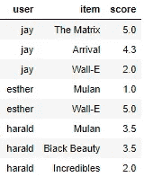

# 尴尬浅薄的自动编码器(容易)的建议

> 原文：<https://towardsdatascience.com/embarrassingly-shallow-autoencoders-ease-for-recommendations-f91117f02851?source=collection_archive---------27----------------------->

## 不带褶边的建议

安妮·斯普拉特在 [Unsplash](https://unsplash.com?utm_source=medium&utm_medium=referral) 上的照片

**没有荷叶边的推荐**

## 帖子摘要

1.  了解一个新的( *ish* )最先进的推荐引擎 EASE
2.  一步一步地查看总共 5 行代码
3.  理解其工作原理背后的直觉
4.  发现使用它的一些附带好处(速度、多样性等)
5.  查看我的 PyTorch [repo](https://github.com/franckjay/TorchEASE) 中的完整实现

**背景**

我总是喜欢学习既简单又有效的推荐系统。我经常听到关于复杂引擎的故事，这些引擎有如此多的移动部件，和/或训练起来非常昂贵，然后在生产环境中出现故障。我经常在 PapersWithCode.com 排行榜上看到的两位作者是[斯特芬·伦德尔](https://paperswithcode.com/sota/collaborative-filtering-on-movielens-1m)(谷歌)和[哈拉尔德·斯特克](https://paperswithcode.com/sota/collaborative-filtering-on-million-song)(网飞)。他们研究的惊人之处是什么？

1.  易于理解的简单模型
2.  实施很快
3.  只需要用户+项目交互作为特征
4.  两人都有 SOTA 的表演

当我看到一个新的深度学习架构时，我经常会为跳上复杂性的潮流而感到内疚。存在于你感兴趣的任何领域的“前沿”可能是有趣和令人兴奋的，增加了一层又一层的复杂性。然而，这些真的能产生最好的结果吗？

如果你读过我的[基于图表的推荐](/build-a-react-flask-app-that-suggests-novel-novels-with-a-python-graph-9491e714bbdf)文章，你可能已经注意到我引用了 [Dacrema 等人](https://arxiv.org/abs/1907.06902)的一篇伟大论文。(2019).在许多领域/数据集中，最好的算法可能是简单的方法:

1.  矩阵分解
2.  基于流行度
3.  项目或用户相似性

让我们拥抱奥卡姆剃刀，坚持使用那些能产生伟大结果的算法，而不去理会其他所有的废话。这就是轻松发挥作用的地方。它本质上是一个项目-项目相似性模型，但是规定我们强制一个项目不能与其自身相似。这使得模型更加一般化，并且可以产生既有趣又多样的结果。

**例子**

我是在浏览[PapersWithCode.com](http://PapersWithCode.com)的时候发现安逸的。在百万首歌曲数据库上，这是迄今为止最好的算法，在许多其他数据集上也是前 5 名。[实现](https://github.com/Darel13712/ease_rec)是用 Numpy 编写的，虽然它运行得很好，但我想用 PyTorch 加快一点速度。因此，我在尝试了解它是如何工作的同时，对它进行了重构，亲爱的读者，你可以在这个旅程中跟随我。

在我们尝试在真实数据集上运行它之前，让我们制作一个虚拟示例来看看这一切是如何工作的。我们可以制作几个用户+项目(评级可选)对，并将它们存储在一个数据帧中。对于每个用户和项目，我们将使用整数令牌来标识它。这将是我们的 ***X*** 矩阵。

现在，我们可以将它存储为一个稠密的 PyTorch 张量，但在实际应用中可能会非常稀疏。相反，我们将把它保持为一个稀疏张量，直到我们需要它:

从这里，我们需要构建我们的 ***B*** 矩阵，这是我们的项目到项目权重矩阵，它将是我们预测的来源:

`P(user, item) = X[user]*B[item]`

**步骤**

[案例文件](https://arxiv.org/pdf/1905.03375.pdf)解释了形成此封闭形式解决方案所需的所有步骤，但以下是基本步骤:

1.  构建 Gram 矩阵:G = X.t() * X
2.  沿着 G 的对角线添加一个正则化值(*λ*)
3.  P = G.inverse()
4.  b =-P/对角线(P)
5.  将 B 的对角线设为 0

我个人认为，当试图理解这些步骤在做什么时，更容易看到这些步骤:

*第一步*

*第二步*

*第三步*

*步骤 4、5*

这是我们的重量矩阵！现在，我们只需将包含给定用户所有交互的任何向量乘以***【B】，*** ，输出将是预测的评分列表。

这些预测应该有一些直观的意义。高分被分配给用户已经交互过的项目。第 4 项没有被交互，具有下一个最大的分数。应该推荐！我们可以通过将我们的整个 X 矩阵乘以 B ( *sparse.to_dense()@B* )来获得整个预测集，从而推荐一组用户。

**直觉**

我认为矩阵乘法的步骤是这样的:

1.  作为用户，您已经与一些项目进行了交互
2.  对于这些项目中的每一个，在 ***B*** 的列中存储有许多类似的项目
3.  每个返回的项目推荐都基于它与您已经交互过的其他项目的相似程度
4.  可视化这些矩阵乘法的最佳方式可能是使用[http://matrixmultiplication.xyz/](http://matrixmultiplication.xyz/)。

由[迈克尔·马莱](https://unsplash.com/@michael_marais?utm_source=medium&utm_medium=referral)在 [Unsplash](https://unsplash.com?utm_source=medium&utm_medium=referral) 上拍摄的照片

这里我用的术语*相似*是广义的:*黑客帝国*和*瓦力*在体裁、语气等方面可能不太相似。，但是有可能这两个项目通常都被相似的用户观看，这是加权的同现。如果你喜欢 *Wall-E，*Wall-E*watchers 观看的其他项目可能也与你相关。可能吧。*

现在，我们可以检查我们的预测分数，为每个用户选择 TopK 项，然后返回这些项的名称。简单！我们甚至一次都不用梯度下降或链式法则。

除了获得 SOTA 结果有多简单之外，我们使用 EASE 这样的方法还有什么其他原因呢？这篇论文的作者提出了这样的理由:

1.  要调整的单个超参数(*λ*)，这似乎对多样性或性能有微小的影响
2.  大多数学术数据集的训练只需几分钟，而不是几小时/几天
3.  推荐更多不常见的独特物品

对我来说，我个人喜欢被推荐一些我会喜欢的稀有和有趣的东西，而不是我可能已经知道的流行的东西。发现奇妙事物的新奇和快乐是一种独特的满足感。

对于那些可能会问“为什么这是一个自动编码器？这里哪来的密层？”所以这才是浅 AE！不需要密集层来压缩用户向量。相反，我们为输出层存储 ***B*** 的权重。

那这个*为什么会尴尬*？我认为这里唯一的尴尬是这样一个事实:如此简单的一组变换仍然如此强大，足以成为 SOTA，而复杂的神经网络和集成却落后了。

**评级**

EASE 还可以处理明确的用户反馈(例如，五星评级)来进行预测。我还没有完全测试那部分代码，但是理论上应该可以！还有更多的工作要做。

**指标**

通常对于这些类型的系统，我喜欢使用 HitRate@K 作为我选择的度量标准。很简单理解(p*redicted[《1984》《攻面》《近卫！卫兵！”]与 actual[《1984》]一炮而红*。此外，它非常适合大多数业务用例。

作为测试用例，我抓取了 GoodReads 数据集，过滤了英文书籍，并在 500 万本书的评分上训练了 EASE ( *lambda = 250.0* )。然后，我对 10 万用户进行了 20 次预测，并对结果进行了比较:20 次预测的命中率为 9.1%！不算太坏。如果我只是预测 GoodReads 数据上最受欢迎的书籍，我只会得到 6%，所以这是一个明显的改善和一些个性化。整个管道运行不到一分钟！

**结论**

我鼓励你们都来看看我的回购[这里](https://github.com/franckjay/TorchEASE)，以及最初的 Numpy 版本[这里](https://github.com/Darel13712/ease_rec)。论文[本身就值得一读，因为它短小精悍。Tuan](https://arxiv.org/pdf/1905.03375v1.pdf) 也刚刚发表了一篇关于其他简单推荐系统的文章，你可能想看看。